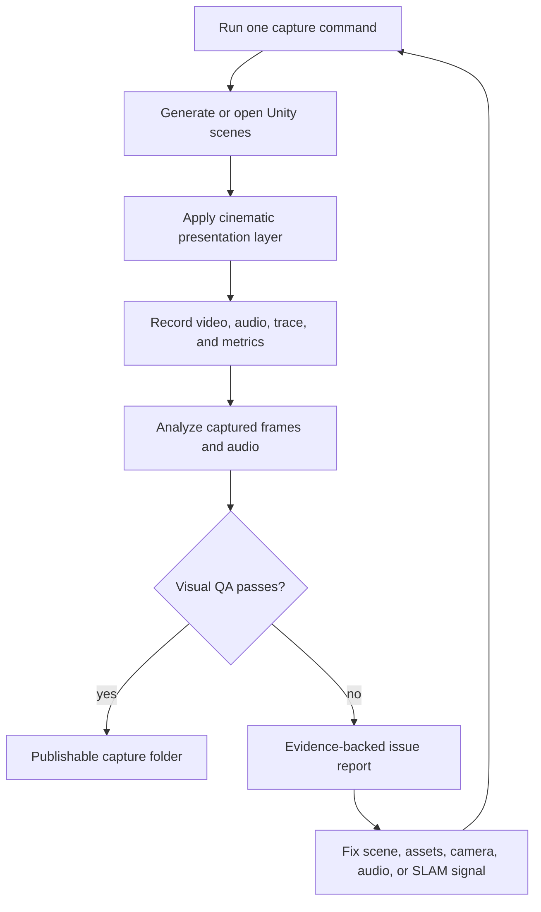

# Unity Cinematic Capture and Visual QA

## Summary

Define a one-command Unity capture workflow that produces paper/demo-quality videos with audio, metrics artifacts, and visual QA evidence grouped by `robot_policy_scenario`. The main outcome is usable demo video; the required side effect is that captured frames expose simulation, rendering, camera, SLAM, and robot-visibility failures so the scene can be fixed iteratively.

---

## Problem Frame

The current Unity validation path can prove that MuJoCo state changes and that Python metrics can be generated, but it does not prove that the resulting scene is visually credible. A scene can pass data-level checks while the visible result still fails the real goal: the real G1 robot may not appear, SLAM/path evidence may be absent, materials may render purple, lighting may be flat, or the camera may frame the scene badly.

Paper/demo output has a higher bar than technical validation. The video must make the robot, scenario, motion, and environment legible without the user manually pressing Play, hand-positioning cameras, or inspecting every scene by eye. The same recorded output should become debugging evidence: if something is wrong, the command should leave behind enough frames, video, and status detail for the agent to identify the failure and rerun after a fix.

---

## Actors

- A1. Demo author: Wants paper/demo-quality videos without manual Unity setup for each scene.
- A2. Agent/operator: Runs the command, reviews captured evidence, and iterates on broken scenes until they are visually credible.
- A3. Unity capture pipeline: Generates scenes, applies presentation assets, records media, and writes capture artifacts.
- A4. Benchmark pipeline: Produces traces, metrics, reports, and technical pass/fail data that remain separate from visual QA status.

---

## Key Flows

- F1. Headless cinematic capture
  - **Trigger:** A demo author or agent runs the capture command from WSL.
  - **Actors:** A1, A2, A3, A4
  - **Steps:** The command opens Unity without manual Play clicks, prepares the configured scenes, applies the cinematic presentation layer, records video and audio, collects trace and metrics artifacts, and writes all outputs into scenario-named folders.
  - **Outcome:** Each selected scene has a capture folder containing video, audio evidence, trace/metrics output, sampled visual evidence, and pass/fail status.
  - **Covered by:** R1, R2, R3, R4, R5, R14

- F2. Visual QA and iterative repair
  - **Trigger:** A recorded scene has a visual, audio, robot, SLAM, camera, or rendering failure.
  - **Actors:** A2, A3
  - **Steps:** The command analyzes captured frames and audio evidence, reports the failure with enough context to act on it, the agent fixes the scene or presentation layer, and the capture command is rerun.
  - **Outcome:** A scene is not treated as complete until both technical artifacts and visual QA pass, or a specific blocker is documented.
  - **Covered by:** R6, R7, R8, R9, R10, R11, R12, R13, R14

- F3. Unity-only scene enrichment
  - **Trigger:** A scene needs to look better than the raw MuJoCo import.
  - **Actors:** A1, A2, A3, A4
  - **Steps:** Visual meshes, props, materials, lighting, camera framing, and audio cues are added on the Unity presentation side while MuJoCo simulation geometry and benchmark metrics remain protected.
  - **Outcome:** The scene becomes visually richer without silently changing robot contacts, trajectories, or benchmark scoring.
  - **Covered by:** R10, R15

---

## Requirements

**Capture outputs**

- R1. The capture workflow must run from one WSL command without requiring the user to press Play or manually record scenes in Unity.
- R2. The workflow must write each scene's outputs into a stable folder named from the scene's robot, policy, and scenario identity.
- R3. Each capture folder must include the recorded video and the recorded audio evidence for that scene.
- R4. Each capture folder must include the associated trace and metrics artifacts so demo media remains tied to benchmark output.
- R5. Each capture folder must include sampled visual evidence, such as representative frames or thumbnails, so failures can be inspected without reopening the full video.

**Paper/demo visual quality**

- R6. Generated scenes must use readable lighting, shadows, materials, and camera framing suitable for paper/demo review, not only technical simulation.
- R7. A scene that claims to show the real G1 robot must visibly show the real G1 mesh; a placeholder, invisible robot, or wrong robot should fail visual QA.
- R8. A scene that claims SLAM, trajectory, path, or goal behavior must expose a visible and changing signal for that behavior; absent or static SLAM/path evidence should fail visual QA.
- R9. The camera must keep the robot and relevant scenario context visible for the capture duration; blank frames, severe clipping, persistent occlusion, or framing that hides the robot should fail visual QA.
- R10. Unity presentation assets should make scenes visually credible with floors, walls, props, lighting, materials, and contextual meshes instead of relying on raw imported boxes as the final demo look.

**Audio**

- R11. Robot walking scenes must include footstep or locomotion audio that is timed closely enough to visible motion for demo use, and the capture workflow must record audio evidence alongside the video.

**Visual QA and debugging side effect**

- R12. The workflow must analyze captured frames and audio evidence for obvious failures before declaring a capture successful.
- R13. Visual QA failures must identify the affected scene identity, the failure category, and the evidence needed for an agent or human to understand what went wrong.
- R14. Technical validation and visual validation must be reported separately: passing metrics or movement proof alone is not enough to mark a paper/demo capture as successful.

**Unity-only asset guide**

- R15. The project must include a guide for adding Unity-only meshes, materials, lights, cameras, props, and audio assets that improve video quality without damaging MuJoCo simulation behavior or benchmark metrics.

---

## Acceptance Examples

- AE1. **Covers R1, R2, R3, R4, R5.** Given a configured Unity project and selected scenes, when the capture command runs from WSL, it produces one folder per `robot_policy_scenario` containing video, audio evidence, sampled frames, trace output, and metrics output.
- AE2. **Covers R7, R12, R13, R14.** Given a real G1 scene where MuJoCo state changes but the camera does not show the real G1 mesh, when the capture workflow completes, the technical status may pass but visual QA fails with evidence frames.
- AE3. **Covers R8, R12, R13, R14.** Given a scene that is expected to show SLAM or trajectory behavior, when the recorded frames show no path, goal, map, trajectory, or changing navigation signal, the capture is reported as visually failed even if the robot moves.
- AE4. **Covers R9, R12, R13.** Given a scene where the camera points at empty space for most of the capture, when frame analysis runs, the capture fails camera/framing QA and records representative frames.
- AE5. **Covers R10, R15.** Given a scene that needs visual context, when a Unity-only prop mesh is added for presentation, it must not silently change MuJoCo contacts, trajectories, or benchmark metric values.
- AE6. **Covers R11, R12, R13.** Given a walking robot scene, when recorded audio is missing or footstep cues are not present, the capture report marks audio QA as failed or incomplete.

---

## Success Criteria

- A user can run one command and receive paper/demo-oriented capture folders without opening Unity or pressing Play.
- A reviewer can open a capture folder and understand which robot, policy, and scenario it represents, what media was recorded, and whether metrics and visual QA passed.
- The real G1 robot is visible in scenes that claim to use the real G1, and SLAM/path/goal evidence is visible in scenes that claim navigation behavior.
- The command produces enough frame/audio evidence for an agent to diagnose and fix common visual failures without relying on the user to describe them.
- Unity-only visual enrichment can be added by following a guide without changing MuJoCo physics or benchmark metrics by accident.

---

## Scope Boundaries

- Do not treat a metrics pass or movement proof as sufficient proof that a paper/demo video works.
- Do not require manual per-scene Unity recording as part of the normal workflow.
- Do not make full USD visual parity a blocker for the first capture pipeline.
- Do not replace the existing Python metrics pipeline or make Unity the source of benchmark scoring truth.
- Do not allow Unity presentation props to affect MuJoCo contacts or metrics unless a future requirement explicitly makes them physical simulation entities.
- Do not require hand-authored cinematic timelines for every scene in the first pass.
- Do not attempt subjective beauty scoring in the first pass beyond obvious visual, camera, material, robot-visibility, SLAM-signal, and audio checks.

---

## Key Decisions

- Paper/demo video is the primary scope: The command should optimize for clear, credible output suitable for presentation.
- Visual debugging is a required side effect: Captured frames and audio must make broken scenes diagnosable by the agent.
- Visual QA is separate from technical validation: A scene can be technically valid and still fail as a demo capture.
- Unity presentation stays separate from MuJoCo physics by default: Richer meshes, materials, props, lighting, cameras, and audio should improve rendering without changing simulation behavior.
- Scene folders are named by robot, policy, and scenario identity: This makes captures navigable and comparable across runs.

---

## Dependencies / Assumptions

- The working branch for this project is `paper-sub`.
- The existing Unity validation runner, scene manifest, and trace ingest are the foundation for this feature.
- Unity can be launched from WSL against the Windows project without the Editor already being open.
- Unity Recorder and a Unity camera-control package are acceptable dependencies if planning confirms compatible versions for the current Unity project.
- Frame analysis can start with sampled frames and pragmatic failure detectors; it does not need to understand every possible visual defect in the first pass.
- Footstep audio can be procedural or asset-based in the first pass as long as it is timed well enough for demo review.
- Scenario metadata is expected to provide or derive robot, policy, and scenario identity for folder naming.

---

## Context & References

- Existing Unity runbook: `docs/run-mujoco-unity.md`
- Existing Unity telemetry plan: `docs/plans/2026-05-13-002-feat-unity-scene-telemetry-plan.md`
- Current scene manifest source: `tools/unity/templates/Assets/AsimovBM/MuJoCo/SceneManifest.json`
- Current Unity runner: `src/asimovbm/local_runner/unity_runner.py`
- Current Unity ingest: `src/asimovbm/local_runner/unity_ingest.py`
- Unity Recorder docs: `https://docs.unity.cn/Packages/com.unity.recorder%405.0/manual/index.html`
- Unity Cinemachine docs: `https://docs.unity.cn/Packages/com.unity.cinemachine%403.0/manual/index.html`

---

## Outstanding Questions

### Deferred to Planning

- [Affects R1, R3][Needs research] Which recorder package version and output settings are most reliable for the current Unity version and Windows batchmode workflow?
- [Affects R2][Technical] What is the exact source of truth for robot, policy, and scenario naming when a Unity scene maps to an existing benchmark episode?
- [Affects R8][Technical] What visible SLAM/path/goal signal should each navigation scene expose so frame analysis can verify it?
- [Affects R11][Technical] Should footstep timing be derived from real G1 motion data, MuJoCo contacts, animation phase, or a simpler first-pass gait timer?
- [Affects R12, R13][Needs research] Which first-pass frame-analysis checks are reliable enough to automate immediately, and which should stay as sampled evidence for human/agent review?
- [Affects R15][Technical] Which Unity asset import and presentation rules should be encoded in the guide versus enforced automatically by scene generation?
