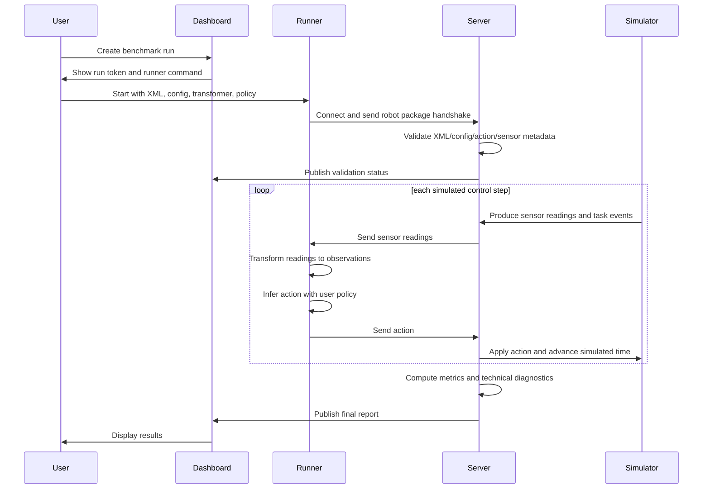

# feat: Define Benchmark Client Architecture

## Summary

Build the MVP around a hosted benchmark dashboard plus a local Python runner. The server owns MuJoCo simulation, validation, sensor generation, task execution, metrics, and final reporting; the local runner owns user ML dependencies, sensor-reading transformation, policy inference, and action transmission.

---

## Problem Frame

Paper HRI needs a demoable black-box benchmark that proves external researchers or companies can evaluate proprietary robot policies without disclosing implementation details. The existing requirements document establishes the benchmark thesis and social-navigation MVP; this plan defines the client/server architecture needed to make that thesis usable in practice.

---

## Requirements

- R1. Preserve policy IP by keeping user transformation and policy code outside the benchmark server, while still allowing the server to evaluate behavior through a remote protocol.
- R2. Accept a participant-provided robot package at connection time: MuJoCo XML plus sensor, quality/frequency, action mapping, and robot metadata configuration.
- R3. Server-to-runner data must be raw named sensor readings plus structured task events, not precomputed policy observations.
- R4. The local runner must orchestrate user-defined Python dataflow: sensor readings to observations, observations to policy actions.
- R5. The protocol must be step-synchronous and simulated-time based, carrying forward the origin requirement that control frequency is measured in simulated time.
- R6. The MVP must support one social-navigation task with multiple difficulty levels, enough to exercise navigation and social interaction.
- R7. The hosted dashboard must support the MVP demo loop: create run, display connection instructions/status, show validation errors, and visualize final metrics/results.
- R8. Technical failures, invalid packages, invalid actions, timeouts, and policy/runner disconnects must be reported separately from behavioral failures.

---

## Scope Boundaries

- Server-side execution of arbitrary user Python/ML code is out of scope for MVP.
- General server scalability for many simultaneous benchmark runs is out of scope for MVP.
- Arbitrary custom MuJoCo sensor/plugin execution is out of scope for MVP.
- Multiple benchmark tasks beyond the one social-navigation task are out of scope for MVP.
- A full anti-cheating system is out of scope; hidden scenarios are useful, but participants necessarily receive runtime sensor readings.
- Raw visual gesture recognition is out of scope; the server can expose structured task events for the MVP social interaction.

### Deferred to Follow-Up Work

- Drag-and-drop Python upload in the dashboard: defer unless the architecture later includes safe participant-side packaging rather than server-side execution.
- Multi-language runners: defer until the Python runner and protocol prove the benchmark concept.
- High-throughput multi-tenant scheduling: defer until after the MVP demonstrates value.

---

## Context & Research

### Relevant Code and Patterns

- `AGENTS_SHARED.md` frames this repository as Paper HRI executable work with a benchmark MVP target by 2026-05-15.
- `docs/brainstorms/2026-04-29-black-box-robotic-policy-benchmark-requirements.md` defines the black-box benchmark, social-navigation flagship scenario, metric categories, protocol expectations, and failure-reporting separation.
- `README.md` currently describes a simple newline-delimited JSON TCP client, but the referenced `asimovbm` package files are not present in the repository. Treat it as an early stub/spec, not as an established implementation pattern.

### Institutional Learnings

- No `docs/solutions/` learnings exist in this repository yet.

### External References

- No external research was used for this plan. The plan is grounded in the local brainstorm document and current MVP decisions.

---

## Key Technical Decisions

- Hosted dashboard plus local runner: keeps the human-facing workflow simple while preserving the local execution boundary for proprietary policies and user-managed ML dependencies.
- Connection-time robot package handshake: the runner sends XML/config during connection so the dashboard does not need to own participant files before a run starts.
- Raw sensor readings as the protocol output: researchers can define their own observation extraction, which is central to the benchmark's extensibility goal.
- Step-synchronous simulated-time loop: each action corresponds to a simulation control step, with wall-clock latency tracked as technical telemetry rather than changing simulated control frequency.
- Protocol-first architecture: the dashboard and runner are MVP surfaces, but the stable contract is the session protocol between server and runner.
- Python runner first: the MVP serves the most likely HRI/RL researcher workflow while allowing users to install their own ML libraries locally.

---

## Open Questions

### Resolved During Planning

- Should user Python execute locally or on the server? Local runner execution is chosen to protect IP and avoid server-side dependency/sandboxing complexity.
- Should XML/config be uploaded through the dashboard or sent by the runner? The runner sends them during connection.
- Is one task with difficulty tiers enough for MVP? Yes; it proves the full benchmark loop while keeping scenario breadth realistic.

### Deferred to Implementation

- Exact wire format: choose the concrete JSON, binary, WebSocket, or streaming representation after considering the first simulator/runner integration.
- Exact sensor payload representation: settle camera, lidar, proprioception, and event payload details while implementing the package validator and simulator adapter.
- Exact timeout and retry constants: start with conservative defaults, then tune against the tester and local network behavior.
- Exact dashboard framework: choose based on the existing server stack once that code exists or is selected.

---

## Output Structure

    asimovbm/
      protocol/
      runner/
      server/
      dashboard/
      scenarios/
      metrics/
    examples/
      policies/
      robot_packages/
    tests/
      protocol/
      runner/
      server/
      dashboard/

This layout is directional. If the implementation starts from a different server framework or package layout, preserve the boundaries even if paths change.

---

## High-Level Technical Design

> *This illustrates the intended approach and is directional guidance for review, not implementation specification. The implementing agent should treat it as context, not code to reproduce.*

---

## Implementation Units

- U1. **Protocol Contract and Session Lifecycle**

**Goal:** Define the benchmark-runner session states and message categories before implementation fragments the contract.

**Requirements:** R1, R2, R3, R5, R8

**Dependencies:** None

**Files:**
- Create: `asimovbm/protocol/`
- Create: `tests/protocol/`
- Modify: `README.md`

**Approach:**
- Model the lifecycle as run creation, runner connection, robot package handshake, validation result, control loop, episode completion, technical failure, and final report availability.
- Include message categories for handshake, validation errors, sensor readings, task events, actions, acknowledgements, telemetry, and terminal states.
- Keep the contract language-neutral enough that a future non-Python runner can implement it, while documenting Python runner behavior as the MVP reference.

**Patterns to follow:**
- Preserve the spirit of the existing `README.md` client loop, but expand it from ad hoc sensor/action JSON into an explicit session protocol.

**Test scenarios:**
- Happy path: a runner connects, sends a valid robot package handshake, receives accepted status, exchanges one sensor/action step, and reaches a completed episode state.
- Error path: a runner sends malformed package metadata and receives structured validation failure without entering the control loop.
- Error path: a runner disconnects during an episode and the server records a technical failure rather than a behavioral failure.
- Edge case: a sensor stream arrives at a lower declared rate than the control loop and the protocol still identifies which readings are fresh versus carried forward.

**Verification:**
- The protocol docs and tests make it clear which side owns each state transition and how failures are classified.

- U2. **Robot Package Validation**

**Goal:** Validate participant-provided MuJoCo XML and robot configuration before any benchmark episode runs.

**Requirements:** R2, R3, R6, R8

**Dependencies:** U1

**Files:**
- Create: `asimovbm/server/`
- Create: `tests/server/`
- Create: `examples/robot_packages/`

**Approach:**
- Treat XML and config as untrusted inputs.
- Validate that declared sensors, sensor frequencies, sensor quality/noise settings, action mappings, forward/sensor-facing direction, and required metadata are internally consistent.
- Return actionable validation errors to both runner and dashboard.
- Keep arbitrary custom sensor plugins out of MVP while allowing named typed streams declared in config.

**Patterns to follow:**
- Use the origin document's morphology-agnostic robot package concept and named typed stream contract.

**Test scenarios:**
- Happy path: a minimal valid package with required social-navigation metadata is accepted.
- Error path: malformed XML is rejected before simulator creation.
- Error path: config references a sensor or joint/action mapping absent from the XML and returns a targeted validation error.
- Edge case: a package declares an unsupported sensor type and is rejected with a non-crashing validation response.

**Verification:**
- Invalid participant packages cannot start a run, and valid packages provide all metadata needed by the MVP task and protocol.

- U3. **Local Python Runner Runtime**

**Goal:** Build the participant-side process that owns user dependencies, receives sensor readings, invokes user Python classes, and returns actions.

**Requirements:** R1, R3, R4, R5, R8

**Dependencies:** U1

**Files:**
- Create: `asimovbm/runner/`
- Create: `tests/runner/`
- Create: `examples/policies/`
- Modify: `README.md`

**Approach:**
- Provide a CLI that accepts server connection information, run token, XML path, config path, sensor-to-observation class, and policy class.
- Load user classes from local Python modules so participants can manage their own ML libraries and private dependencies.
- Orchestrate each control step as: receive sensor readings, call transformer, call policy, validate action shape locally enough to catch obvious errors, send action.
- Keep the runner thin: it should not compute benchmark metrics or know hidden scenario internals.

**Patterns to follow:**
- The existing README's `module:ClassName` policy reference is a useful MVP convention to preserve and expand.

**Test scenarios:**
- Happy path: a runner loads a transformer and policy, receives a sample sensor payload, returns a valid action, and sends it through the protocol client.
- Error path: transformer raises an exception and the runner reports a technical failure with enough context for the dashboard.
- Error path: policy returns an invalid action shape and the runner/server classify the episode as technical or invalid-action failure, not behavioral failure.
- Edge case: user policy depends on an installed third-party library and the runner does not attempt to vendor or manage that dependency.

**Verification:**
- A sample participant can run a local policy without exposing source code or dependencies to the server.

- U4. **MuJoCo Social-Navigation Tester**

**Goal:** Implement the smallest benchmark task that proves navigation plus social interaction across difficulty tiers.

**Requirements:** R3, R5, R6, R8

**Dependencies:** U1, U2

**Files:**
- Create: `asimovbm/scenarios/`
- Create: `tests/server/`
- Create: `tests/protocol/`

**Approach:**
- Implement one social-navigation scenario with tiers such as empty room, static bystanders, and moving bystanders.
- Emit raw sensor readings and structured task events, including the social signal needed for the robot to identify the target task.
- Advance simulation in simulated time according to declared control frequency, independent of wall-clock runner latency.
- Record per-step telemetry needed for metric computation and technical diagnostics.

**Patterns to follow:**
- Carry forward the origin scenario: target human gives a sign, robot acknowledges by orienting/moving toward the target, approaches, and stops in an acceptable zone.

**Test scenarios:**
- Happy path: a simple deterministic policy completes the easiest tier and produces a valid episode trace.
- Integration: server sends a structured social task event and later records acknowledgement/approach telemetry.
- Error path: runner timeout during a control step triggers retry/technical failure handling according to the protocol.
- Edge case: moving bystander tier produces sensor updates without exposing hidden scoring thresholds to the runner.

**Verification:**
- The tester can run at least one complete episode through the same protocol used by the local runner.

- U5. **Metrics and Technical Report Pipeline**

**Goal:** Convert completed episode traces into MVP behavioral metrics and reliability diagnostics.

**Requirements:** R6, R8

**Dependencies:** U4

**Files:**
- Create: `asimovbm/metrics/`
- Create: `tests/server/`
- Create: `tests/dashboard/`

**Approach:**
- Compute the origin document's MVP metric families where feasible for the single task: dexterity, safety, social awareness, impression proxies, and technical reliability.
- Keep technical failures separate from behavioral metrics.
- Produce aggregate and per-tier results so difficulty progression is visible.
- Surface insufficient-confidence states when too few valid episodes complete.

**Patterns to follow:**
- Use the metric categories and failure separation defined in the origin document.

**Test scenarios:**
- Happy path: valid episodes across tiers produce aggregate and per-tier report data.
- Error path: timeout and invalid-action episodes appear in technical diagnostics without lowering behavioral scores for completed episodes.
- Edge case: too few valid episodes marks the report as insufficient confidence.
- Integration: episode traces from U4 feed the report pipeline without dashboard-specific assumptions.

**Verification:**
- The final report explains both robot behavior and whether the run itself was technically valid.

- U6. **Hosted Dashboard MVP**

**Goal:** Provide the demo-facing UI for run creation, connection guidance, live status, validation errors, and final results.

**Requirements:** R7, R8

**Dependencies:** U1, U2, U5

**Files:**
- Create: `asimovbm/dashboard/`
- Create: `tests/dashboard/`
- Modify: `README.md`

**Approach:**
- Let a user create a benchmark run and receive the run token/connection command for the local runner.
- Show runner connection state, package validation status, episode progress, technical failures, and final report.
- Keep Python code execution out of the dashboard.
- Avoid making the dashboard responsible for XML/config upload in MVP; those are submitted by the runner during handshake.

**Patterns to follow:**
- Keep the dashboard aligned with the benchmark core rather than making it a separate product surface.

**Test scenarios:**
- Happy path: creating a run displays connection instructions and transitions through connected, running, completed, and report-ready states.
- Error path: validation errors from U2 are visible in the dashboard without starting the benchmark.
- Error path: runner disconnect is shown as a technical failure.
- Integration: final report data from U5 renders in a way that distinguishes behavioral scores from technical reliability.

**Verification:**
- A demo user can understand what to run locally, see whether the benchmark is progressing, and inspect the final result without reading server logs.

- U7. **Documentation and Example Archetype**

**Goal:** Make the MVP approachable for researchers and companies by documenting the participant package and user-code archetype.

**Requirements:** R1, R2, R3, R4, R7

**Dependencies:** U1, U3, U6

**Files:**
- Modify: `README.md`
- Create: `examples/policies/`
- Create: `examples/robot_packages/`

**Approach:**
- Document the end-to-end flow: create dashboard run, start local runner, send robot package, receive sensor readings, transform observations, infer actions, view results.
- Provide a minimal robot package example and a minimal transformer/policy example.
- Explain that participant ML dependencies are installed locally in the runner environment.
- Clarify that the server receives XML/config/actions/telemetry but not user policy source or model weights.

**Patterns to follow:**
- Keep README examples executable and aligned with the actual runner CLI once implemented.

**Test scenarios:**
- Happy path: documented commands and examples match the implemented runner interface.
- Error path: docs explain what users should do when package validation fails.
- Edge case: docs explain how custom ML dependencies are handled locally without server installation.

**Verification:**
- A new participant can follow the README to run the sample policy through the dashboard/server loop.

---

## System-Wide Impact

- **Interaction graph:** Hosted dashboard, server session manager, simulator/scenario runner, local runner, participant transformer, participant policy, metrics/report pipeline.
- **Error propagation:** Validation errors go to runner and dashboard; runtime runner/policy errors become technical failures; completed behavioral traces feed metrics.
- **State lifecycle risks:** Runs must not enter the control loop until package validation passes; episode traces must preserve enough telemetry for both metrics and failure diagnostics.
- **API surface parity:** The protocol must be documented independently from the Python runner so future runners can reuse the same contract.
- **Integration coverage:** End-to-end tests should cover at least one sample package and sample policy through the complete server-runner-dashboard loop.
- **Unchanged invariants:** Server remains the authority for simulation, hidden scenario state, metric computation, and final reporting.

---

## Risks & Dependencies

| Risk | Mitigation |
|------|------------|
| Dashboard scope grows into server-side code execution | Keep runner-local execution as a key technical decision and document Python upload as out of scope. |
| Protocol becomes too ad hoc for future participants | Define lifecycle and message categories before extending the README stub. |
| Sensor payloads become too heavy for simple JSON transport | Start with clear message boundaries; defer binary optimization until image/lidar payloads are exercised. |
| One task looks too small for a benchmark | Frame it as an MVP tester with difficulty tiers and full metric/report loop, not as final benchmark breadth. |
| User package validation blocks progress because MuJoCo details are underdeveloped | Begin with the minimum metadata needed by the single social-navigation task and expand only when required. |

---

## Documentation / Operational Notes

- Update `README.md` from a simple client stub into an architecture and quickstart document.
- Document the trust boundary clearly: the server runs participant XML/config in MuJoCo after validation, but user Python policy code runs locally.
- Document that users install their own ML dependencies in the runner environment.
- Document technical failure categories separately from behavioral metric categories.

---

## Sources & References

- **Origin document:** `docs/brainstorms/2026-04-29-black-box-robotic-policy-benchmark-requirements.md`
- **Project guidance:** `AGENTS_SHARED.md`
- **Current client stub:** `README.md`
