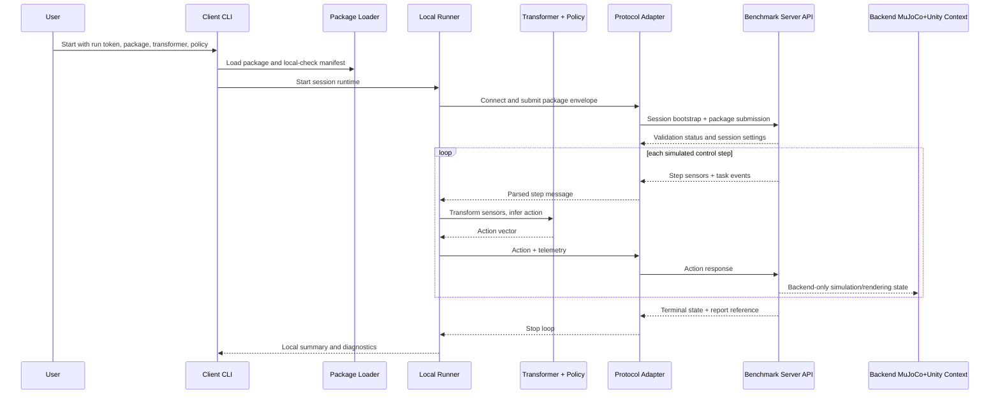

# feat: Implement Benchmark Client Architecture

## Summary

Implement the client side of the black-box benchmark around a precise server-facing API contract, a local Python runner, robot-package submission, policy execution, and technical diagnostics. The server owns simulation, validation authority, scenario execution, metrics, reports, and visualization; this plan defines what the client needs from that server API and how the client should be structured to use it.

---

## Problem Frame

Paper HRI needs a participant-facing client that can run private robot policy code locally while a benchmark server runs the authoritative evaluation. The client must preserve participant IP, speak a step-synchronous protocol, submit robot package data, receive raw named sensor streams plus structured task events, and return actions with enough telemetry for the backend to separate technical failures from behavioral failures.

The backend context matters for client design. The benchmark should not rely on MuJoCo's visual output as the demo-quality rendering layer; the backend is expected to combine MuJoCo-like physics/simulation with a richer Unity-like graphics surface. The client does not render or display that graphics layer. It only needs to provide package metadata and protocol behavior that let the backend run the evaluation and, separately, produce high-quality visuals.

---

## Requirements

- R1. Preserve participant policy IP by running transformer code, policy code, model weights, and ML dependencies locally in the client process.
- R2. Define the client-facing server API contract for session creation/connection, robot package submission, validation status, step-synchronous sensor/action exchange, telemetry, retry/failure signaling, and terminal report references.
- R3. Support backend-to-client observations as raw named typed sensor streams plus structured task events, not precomputed policy observations.
- R4. Support client-to-backend action messages using the origin joint-target action contract and declared robot action mapping.
- R5. Support participant robot package submission with physics/simulation metadata, sensor declarations, action mapping, robot metadata, and optional visual asset references needed by the backend's MuJoCo+Unity pipeline.
- R6. Keep the client headless: no dashboard, renderer, live visualization, replay viewer, or Unity integration runs inside the client.
- R7. Preserve step-synchronous simulated-time semantics: wall-clock policy latency is telemetry, not a change to simulated control frequency.
- R8. Classify and report client-side technical failures, invalid actions, timeouts, dependency/import errors, policy exceptions, and disconnects separately from robot behavioral outcomes.
- R9. Provide a backend fake/stub so client implementation and tests can proceed before the real backend is complete, while keeping the fake aligned with the documented server API contract.
- R10. Provide documentation and examples that let a participant run the sample client locally, understand the server API contract, and later connect to the real backend.

---

## Scope Boundaries

- Backend implementation is out of scope. This includes API server code, package validation authority, MuJoCo simulation, Unity rendering, scenario orchestration, metrics, reports, persistence, hosted dashboard, deployment, and multi-run scheduling.
- Client visualization is out of scope. The client does not show the benchmark, render Unity scenes, display MuJoCo output, or present result dashboards.
- Server-side execution of arbitrary participant Python/ML code is out of scope.
- Multi-language clients are out of scope for MVP.
- Arbitrary custom sensor/plugin execution is out of scope for MVP.
- Multiple benchmark tasks beyond the social-navigation MVP are out of scope for client implementation.
- Full anti-cheating is out of scope. The client necessarily receives runtime observations, while hidden scenario state and scoring thresholds remain backend-owned.

### Deferred to Follow-Up Work

- Backend implementation plan: owned separately, covering the actual server API, validation authority, MuJoCo+Unity orchestration, scenario tiers, metrics, reporting, dashboard, persistence, and deployment.
- Graphics/rendering plan: owned separately, covering Unity scene state, asset import, camera behavior, live view, replay, and demo polish.
- Real backend hardening: once the backend exists, add compatibility tests against the deployed or local server implementation.
- Non-Python clients: defer until the Python runner validates the protocol.
- Binary transport optimization: defer until representative camera/lidar payload sizes are known.

---

## Context & Research

### Relevant Code and Patterns

- `AGENTS_SHARED.md` frames this repository as Paper HRI executable work with a benchmark MVP target by 2026-05-15.
- `docs/brainstorms/2026-04-29-black-box-robotic-policy-benchmark-requirements.md` defines the black-box benchmark, social-navigation flagship scenario, metric categories, protocol expectations, and failure-reporting separation.
- `src/` exists, but no current Python package structure or README establishes a durable implementation pattern yet.

### Institutional Learnings

- No `docs/solutions/` learnings exist in this repository yet.

### External References

- No external research was used for this targeted plan revision. MuJoCo+Unity is carried as backend context from the user request, not as a client implementation dependency.

---

## Server API Context

The client should be designed against a documented server API contract, even though this plan does not implement the server. The contract should define these client-visible surfaces:

- **Session bootstrap:** client connects with a run token or session identifier, protocol version, client capabilities, and participant metadata needed for diagnostics.
- **Robot package submission:** client sends or references robot package contents, including simulation model metadata, sensor stream declarations, action mapping, robot metadata, and optional visual asset references for backend rendering.
- **Validation response:** server accepts or rejects the package with structured errors. The client may do fast local checks, but server validation is authoritative.
- **Control stream:** server sends simulated-step messages containing step id, simulated timestamp, control dt, named sensor readings, sensor freshness metadata, and structured task events.
- **Action response:** client sends action vectors, action metadata, processing latency, optional local warnings, and invalid-action diagnostics.
- **Failure signaling:** client reports setup failures, transformer/policy exceptions, timeout/retry outcomes, disconnects, redacted error summaries, and telemetry.
- **Terminal state:** server sends completed, failed, invalid, or report-ready terminal messages with report references. The client does not compute final scores.

For MVP planning, the transport can remain open. The implementation should make message schemas explicit before committing to WebSocket, gRPC, JSON-over-HTTP, newline-delimited JSON, or another transport.

---

## Key Technical Decisions

- Single client plan: architecture and implementation details live together in this document so `ce-work` can execute one coherent client stream.
- Server API as a client-owned contract artifact: the client team defines the API it needs and ships a fake/stub for tests, while backend implementation remains separate.
- Backend remains authoritative: validation, simulation, hidden scenario state, metrics, final reports, and MuJoCo+Unity visuals are backend-owned.
- Local runner remains the policy execution boundary: participant transformation code, policy code, weights, and dependencies stay local.
- Headless client first: the client should run in terminal/automation contexts and never require a renderer or dashboard.
- Protocol-first implementation: schemas, lifecycle states, and failure categories should be clear before the runner grows around them.
- Python client first: the MVP serves the likely HRI/RL researcher workflow while leaving future non-Python clients possible.

---

## Open Questions

### Resolved During Planning

- Should this be one plan or two? One plan. The separate client implementation plan is removed and merged here.
- Should the client implement backend/server work? No. It defines and consumes the server API contract but does not build server code.
- Should the client show benchmark graphics? No. MuJoCo+Unity is backend context only; the client remains headless.
- Should the client depend on Unity? No. The client may submit visual asset references or metadata in the robot package, but Unity integration belongs to backend/rendering work.
- Should client checks replace server validation? No. Client checks are for fast local feedback; server validation is authoritative.

### Deferred to Implementation

- Exact Python packaging/build tooling: choose when implementation begins based on the repo's preferred setup.
- Exact transport: decide once the backend owner can align on realistic service constraints.
- Exact sensor payload encoding: coordinate with backend when camera/lidar payload sizes and rates are known.
- Exact timeout/retry constants: start from server API expectations and tune with fake-backend and real-backend tests.
- Exact robot visual asset format: coordinate with backend MuJoCo+Unity package ingestion.

---

## Output Structure

    src/asimovbm_client/
      __init__.py
      cli.py
      protocol/
      runner/
      robot_package/
      telemetry/
      testing/
    docs/
      protocol/
      client/
    examples/
      policies/
      robot_packages/
    tests/
      client/
      protocol/
      runner/
      robot_package/

This layout is directional. The implementer may adjust filenames to match the final Python toolchain, but the client/server/rendering responsibility split should remain intact.

---

## High-Level Technical Design

> *This illustrates the intended approach and is directional guidance for review, not implementation specification. The implementing agent should treat it as context, not code to reproduce.*

---

## Implementation Units

- U1. **Server API Contract and Protocol Models**

**Goal:** Define the client-facing server API contract and typed protocol models the rest of the client uses.

**Requirements:** R2, R3, R4, R7, R8, R9

**Dependencies:** Backend owner alignment on the minimum v0 lifecycle.

**Files:**
- Create: `src/asimovbm_client/protocol/`
- Create: `src/asimovbm_client/testing/`
- Create: `tests/protocol/`
- Create: `docs/protocol/`

**Approach:**
- Model session bootstrap, package submission, validation response, control-step observation, action response, telemetry, failure, and terminal-state messages.
- Keep the models transport-neutral so WebSocket/gRPC/JSON transport can be selected later without changing runner behavior.
- Document server-owned fields and client-owned fields explicitly.
- Provide a fake backend/server API implementation for tests that follows the same message lifecycle.
- Include protocol versioning and capability negotiation so backend and client can fail clearly when incompatible.

**Execution note:** Start with protocol model tests and fake-backend lifecycle tests before implementing runner behavior.

**Patterns to follow:**
- Preserve the origin document's step-synchronous simulated-time policy loop and named typed stream contract.

**Test scenarios:**
- Happy path: fake server accepts session bootstrap, accepts package envelope, sends one step, receives one action, and sends completed terminal state.
- Error path: fake server returns package validation failure and the client-side protocol state never enters the control loop.
- Error path: fake server sends an unsupported protocol version and the client reports a compatibility failure.
- Error path: client sends invalid-action telemetry and fake server records it as technical/invalid-action data, not behavioral score data.
- Edge case: sensor freshness metadata is preserved when one stream is carried forward from a previous step.

**Verification:**
- Protocol docs, models, and fake server describe the same lifecycle and can drive client tests without real backend code.

- U2. **Client Package Skeleton and CLI Surface**

**Goal:** Establish the Python client package, test layout, and participant-facing CLI entry point.

**Requirements:** R1, R2, R6, R10

**Dependencies:** U1

**Files:**
- Create: `src/asimovbm_client/__init__.py`
- Create: `src/asimovbm_client/cli.py`
- Create: `tests/client/`
- Create: `README.md`

**Approach:**
- Add a minimal package skeleton for client code under `src/asimovbm_client/`.
- Add CLI arguments for server URL or transport target, run token/session id, robot package path, transformer reference, policy reference, and local diagnostics mode.
- Keep the CLI headless and non-visual. It should emit local progress/diagnostics only, not show benchmark graphics or reports.
- Delegate package loading, protocol behavior, runner execution, and telemetry to dedicated modules.

**Patterns to follow:**
- Follow a standard Python `src/` package layout unless implementation discovers an existing project toolchain that dictates otherwise.

**Test scenarios:**
- Happy path: importing `asimovbm_client` succeeds.
- Happy path: CLI help displays connection, package, transformer, and policy options without backend connectivity.
- Error path: missing required run/package/policy arguments exits with a clear local setup error.
- Edge case: CLI accepts a fake-backend target for local development.

**Verification:**
- The client package imports cleanly and the CLI exposes the minimum participant workflow without any rendering dependency.

- U3. **Robot Package Loader and Submission Envelope**

**Goal:** Load participant robot package files and serialize the package envelope expected by the server API.

**Requirements:** R2, R5, R6, R9, R10

**Dependencies:** U1, U2

**Files:**
- Create: `src/asimovbm_client/robot_package/`
- Create: `tests/robot_package/`
- Create: `examples/robot_packages/`
- Create: `docs/client/robot-packages.md`

**Approach:**
- Load package config, simulation model references/assets, named sensor stream declarations, sensor quality/frequency declarations, action mapping, robot metadata, and optional visual asset references.
- Keep visual asset references as backend context only: the client packages or references them, but does not render or validate Unity compatibility.
- Perform local structural checks for missing files, malformed config, duplicate sensor names, missing action mappings, and obvious schema errors.
- Mark backend-only validation requirements clearly so local checks do not imply simulator acceptance.
- Serialize the package envelope into the protocol models from U1.

**Patterns to follow:**
- Use the origin document's morphology-agnostic package concept and named typed stream contract.

**Test scenarios:**
- Happy path: minimal valid example package serializes into a protocol-ready package submission.
- Happy path: package with separate physics model reference and visual asset reference preserves both fields in the envelope.
- Error path: missing package config fails with a targeted local error before network connection.
- Error path: duplicate sensor stream names fail local structural validation.
- Edge case: package omits visual asset references and remains valid for headless policy execution.

**Verification:**
- Example robot packages can be loaded locally and submitted to the fake server without the client claiming authoritative simulation validation.

- U4. **Participant Code Loading Interface**

**Goal:** Load participant transformer and policy classes from local Python references while preserving the IP boundary.

**Requirements:** R1, R3, R4, R8, R10

**Dependencies:** U2

**Files:**
- Create: `src/asimovbm_client/runner/`
- Create: `tests/runner/`
- Create: `examples/policies/`
- Create: `docs/client/policy-interface.md`

**Approach:**
- Support module/class references for a sensor-to-observation transformer and policy.
- Instantiate user classes locally without uploading source, inspecting model weights, or managing participant ML dependencies.
- Define minimal interface expectations: transformer consumes raw sensor/task-event step data; policy consumes transformed observations and returns an action vector compatible with the declared package mapping.
- Produce clear setup diagnostics for import errors, constructor failures, missing callables, and dependency failures.

**Patterns to follow:**
- Keep participant code and dependencies local, matching the origin black-box benchmark thesis.

**Test scenarios:**
- Happy path: sample transformer and policy load and can be invoked with a sample step message.
- Error path: missing module reference produces a local setup diagnostic.
- Error path: class lacks the expected callable interface and fails before connecting to the control loop.
- Error path: constructor failure is reported without uploading local source details.
- Edge case: policy imports a third-party dependency already installed in the participant environment and the client does not vendor or manage it.

**Verification:**
- Participant policy code executes locally through a documented interface and remains outside backend payloads.

- U5. **Step-Synchronous Runner Loop**

**Goal:** Connect server API messages, package submission, user-code execution, action validation, and telemetry into the client runtime loop.

**Requirements:** R1, R2, R3, R4, R7, R8, R9

**Dependencies:** U1, U3, U4

**Files:**
- Modify: `src/asimovbm_client/cli.py`
- Modify: `src/asimovbm_client/runner/`
- Create: `src/asimovbm_client/telemetry/`
- Create: `tests/runner/`
- Create: `tests/client/`

**Approach:**
- Start a session, submit the package envelope, wait for authoritative server validation, then enter the control loop.
- For each simulated step, pass raw named sensor streams and structured task events to the transformer, pass observations to the policy, validate action shape/type/range enough to catch obvious local errors, and send the action response.
- Track simulated step id, simulated timestamp, server control dt, client processing time, retry state, and local warnings.
- Treat wall-clock latency as telemetry. The client must not advance simulated time or infer scenario state locally.
- Stop cleanly on server terminal states and return a local diagnostic summary with any report reference supplied by the server.

**Execution note:** Start with fake-server integration tests before wiring the CLI end to end.

**Patterns to follow:**
- Preserve failure separation and simulated-time semantics from the origin requirements.

**Test scenarios:**
- Happy path: CLI runs sample package and sample policy through the fake server to completion.
- Happy path: runner processes named sensor streams plus a structured `come_here` task event and returns an action.
- Error path: server validation failure stops before user policy execution.
- Error path: transformer exception emits structured technical-failure telemetry.
- Error path: invalid action shape emits invalid-action telemetry and stops or continues according to server contract.
- Edge case: one transient timeout is retried according to fake-server settings and recorded as recovered telemetry.
- Integration: action payload sent by the runner matches the protocol model consumed by the fake server.

**Verification:**
- A complete local client run works against the fake server without real backend services or rendering.

- U6. **Diagnostics, Telemetry, and Redaction**

**Goal:** Make client failures understandable and backend-compatible without leaking participant IP or secrets.

**Requirements:** R1, R7, R8, R10

**Dependencies:** U5

**Files:**
- Modify: `src/asimovbm_client/telemetry/`
- Create: `tests/client/`
- Modify: `README.md`
- Create: `docs/client/diagnostics.md`

**Approach:**
- Structure diagnostics for setup errors, package local-check failures, server validation failures, transformer/policy exceptions, invalid actions, timeout/retry events, and disconnects.
- Redact local absolute paths, source snippets, environment secrets, model identifiers, and suspicious token-like values by default.
- Send backend-compatible technical telemetry while keeping local CLI messages useful for participants.
- Keep final score/report interpretation out of the client.

**Patterns to follow:**
- Use the origin document's technical reliability diagnostics as the conceptual target while leaving final report generation backend-owned.

**Test scenarios:**
- Happy path: successful run emits non-sensitive latency, retry, and step-count telemetry.
- Error path: policy exception message is summarized without source code.
- Error path: secret-like environment value in an exception is redacted.
- Error path: disconnect cause is represented as a technical failure diagnostic.
- Edge case: local absolute paths are shortened or redacted in outbound telemetry.

**Verification:**
- Client diagnostics help participants fix local issues while preserving privacy and backend failure classification.

- U7. **Documentation and Examples**

**Goal:** Provide a usable client quickstart, server API contract docs, and sample participant assets.

**Requirements:** R1, R2, R3, R4, R5, R6, R10

**Dependencies:** U1, U3, U4, U5, U6

**Files:**
- Modify: `README.md`
- Modify: `docs/protocol/`
- Modify: `docs/client/`
- Modify: `examples/policies/`
- Modify: `examples/robot_packages/`

**Approach:**
- Document client installation/setup once package tooling is chosen.
- Document the server API contract from the client's perspective, including message lifecycle, ownership, failure categories, and expected backend authority.
- Document running the sample policy against the fake server and, later, real backend connection details.
- Explain robot package structure, user-code loading, local dependency ownership, diagnostics, and headless operation.
- Mention MuJoCo+Unity only as backend context: the client may submit visual references, but does not render or display anything.

**Patterns to follow:**
- Keep examples aligned with implemented CLI behavior and protocol docs.

**Test scenarios:**
- Happy path: README quickstart command matches the implemented CLI and sample files.
- Happy path: protocol docs describe every message used by fake-server integration tests.
- Error path: docs include validation-failure and policy-exception troubleshooting paths.
- Edge case: docs explain that missing visual assets do not prevent headless client execution unless the server rejects the package.

**Verification:**
- A new participant can run the sample client flow locally against the fake server and understand what the real server must expose.

---

## System-Wide Impact

- **Interaction graph:** CLI, package loader, protocol adapter, fake/real server API, local runner, participant transformer, participant policy, telemetry reporter.
- **Error propagation:** Local setup and policy errors become client diagnostics and technical telemetry; server validation and terminal states are surfaced as local diagnostics but remain server-authored.
- **State lifecycle risks:** The runner must not execute user policy before server validation accepts the package; terminal states must stop the loop exactly once; retries must not double-submit or double-advance simulated steps.
- **API surface parity:** Protocol docs, typed models, fake server, runner, CLI, and examples must describe the same lifecycle and message shapes.
- **Integration coverage:** Fake-server integration tests are required until real backend services are available.
- **Unchanged invariants:** The client does not implement backend validation, simulation, hidden scenario state, MuJoCo+Unity rendering, metrics, reports, dashboards, or run validity decisions.

---

## Risks & Dependencies

| Risk | Mitigation |
|------|------------|
| Server API contract changes after client work begins | Keep protocol models explicit, version the contract, and use the fake server as executable documentation. |
| Client accidentally grows backend responsibilities | Keep validation authority, scenario state, metrics, reports, and rendering out of implementation units and docs. |
| MuJoCo+Unity context causes client UI/rendering scope creep | State repeatedly that the client is headless and only submits package metadata/assets needed by the backend. |
| Participant diagnostics leak private code or secrets | Redact aggressively by default and test redaction paths. |
| Heavy sensor payloads make the first transport inadequate | Hide transport behind the protocol adapter and defer binary optimization until representative payloads exist. |
| Dynamic user-code loading creates confusing setup failures | Provide explicit diagnostics for import, constructor, callable-interface, dependency, and runtime failures. |
| Backend is unavailable during client implementation | Build against the fake server and align periodically with the backend owner. |

---

## Documentation / Operational Notes

- Create `README.md` because the repository currently has no README.
- Document the trust boundary clearly: user Python policy code runs locally; server owns validation, simulation, scoring, rendering, and reporting.
- Document the server API contract from the client's perspective before real backend integration.
- Document that users install their own ML dependencies in the runner environment.
- Document technical failure categories separately from behavioral metric categories.
- Document that MuJoCo+Unity is backend context only; the client remains headless.

---

## Sources & References

- **Origin document:** `docs/brainstorms/2026-04-29-black-box-robotic-policy-benchmark-requirements.md`
- **Project guidance:** `AGENTS_SHARED.md`
