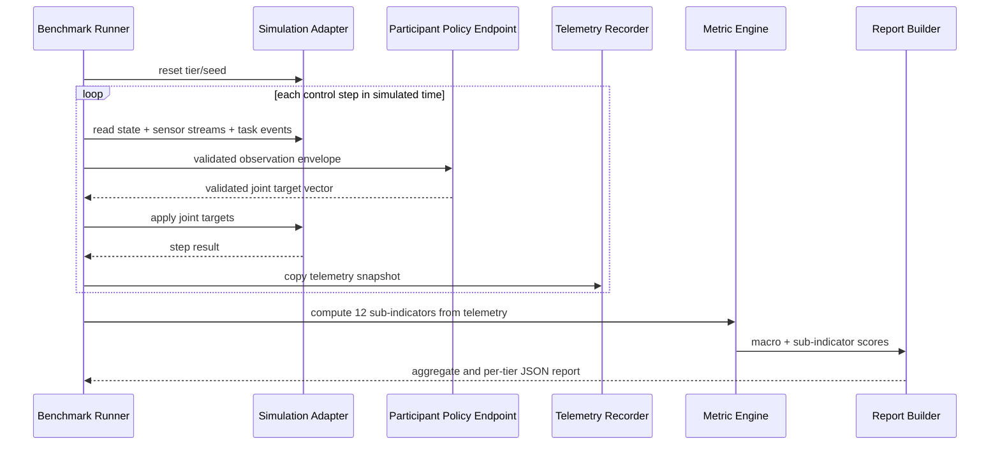

# feat: Build black-box benchmark core

## Overview

Build the benchmark-side core for Paper HRI: a Python package that validates robot submissions, calls participant-hosted black-box policy endpoints, records simulation telemetry, computes the v0 social-navigation metrics, and emits a four-axis behavioral report.

This plan intentionally does not build the MuJoCo scenario itself or the demo policy. A teammate owns the simulation environment and policy behavior; this repo should provide the benchmark contract, runner boundary, metrics, and reporting layer needed to integrate with that work.

## Problem Frame

The project needs a convincing May 15 demo and benchmark specification for a MuJoCo-based, morphology-aware, IP-preserving HRI policy benchmark. The origin requirements define the product shape: remote step-synchronous policy calls, joint-target actions, named typed sensor streams, a social-navigation flagship scenario, and a report built around Perceived Dexterity, Perceived Safety, Perceived Social Awareness, and Impression (see origin: `docs/brainstorms/2026-04-29-black-box-robotic-policy-benchmark-requirements.md`).

Because the repo is currently greenfield, the plan creates the initial package structure, test harness, and docs/spec artifacts alongside the implementation.

## Requirements Trace

- R1. Evaluate participant policies as remote black boxes without requiring code, weights, or internal architecture disclosure.
- R2. Support different robot bodies through declared robot metadata, sensor streams, joint mappings, and capability tags.
- R3. Use the four macro indicators from Miro as the report structure.
- R4. Keep the web UI/client out of the core path.
- R5-R6. Run step-synchronously in simulated time, not real time.
- R7. Accept v0 joint target vectors through declared joint/action mapping.
- R8-R10. Use named typed observation streams, minimal proprioception/stereo/lidar support, and structured task events for fake gesture understanding.
- R11-R13. Retry one transient endpoint failure, classify repeated failures as technical, and treat endpoint/package/action data as untrusted.
- R14-R18. Support the social-navigation scenario tiers, morphology-neutral acknowledgement, two-zone stop/safety rules, and N-valid-episodes-with-max-attempts run policy.
- R19-R25. Produce aggregate and per-tier behavioral reports, exactly 12 v0 sub-indicators, and technical reliability diagnostics.

## Scope Boundaries

- The plan does not implement raw camera gesture recognition.
- The plan does not implement arbitrary sensor plugins; it supports typed declared streams.
- The plan does not implement raw torque or low-level actuator command mode.
- The plan does not implement human/observer ratings for Impression.
- The plan does not implement a web UI or participant client.
- The plan does not implement the MuJoCo environment owned by the teammate.

### Deferred to Separate Tasks

- Web UI/client stretch demo: create after the core runner, metrics, and report contract are stable.
- Full MuJoCo adapter: integrate once the teammate's simulation API is available.
- Anti-cheating hardening: expand after v0 hidden scenario handling and package validation exist.

## Context & Research

### Relevant Code and Patterns

- No application code exists yet. Current tracked files are `AGENTS_SHARED.md`, `LICENSE`, and the origin requirements document.
- `AGENTS_SHARED.md` requires project-grounded changes, precise separation between benchmark specs, metric formulas, implementation artifacts, and generated outputs.
- Local `AGENTS.md` points to Notion and Miro as canonical project context.

### Institutional Learnings

- No `docs/solutions/` directory exists, so there are no prior institutional solution notes to apply.

### External References

- MuJoCo's Python docs expose `mujoco.MjModel`, `mujoco.MjData`, and `mujoco.mj_step`, and explicitly show policy evaluation/control happening before stepping physics. They also warn that MuJoCo data fields mutate in place, so telemetry logging should copy values before later steps mutate them.
- MuJoCo's XML reference documents MJCF sensors and user/plugin sensors. This supports a typed sensor manifest now while avoiding custom plugin execution in v0.
- HTTPX official docs describe fine-grained connect/read/write/pool timeouts and timeout exceptions. Use this pattern for policy endpoint calls.
- Pydantic official docs position models as schemas for endpoint-like contracts and support validation of untrusted data. Use validation models for submission manifests, observations, actions, reports, and reliability diagnostics.

## Key Technical Decisions

- **Python package first:** Use a Python package because MuJoCo has first-class Python bindings and the Notion draft already points toward a Python high-level interface.
- **Validation-first contracts:** Use schema models for robot manifests, observations, policy actions, telemetry, metrics, and reports so untrusted participant data is parsed and rejected before reaching runner logic.
- **JSON-compatible protocol envelope:** Define a JSON-compatible observation/action envelope for v0, with typed sensor stream metadata and payload references or encoded payloads. Keep the envelope stable even if large camera/depth payload transport is optimized later.
- **Joint target normalization:** Represent v0 actions as normalized joint target vectors mapped to declared joint ranges. Reject wrong length, unknown joint IDs, NaN/inf, and out-of-range values rather than clipping silently.
- **Strict technical failure policy:** Retry one transient timeout/protocol failure. If the retry fails, mark the episode as technical failure and exclude it from behavioral metrics while including it in reliability diagnostics.
- **Configurable thresholds with v0 defaults:** Store cone angle, stop band, personal-space distance, near-human zone, valid episode count, and max attempts in scenario/run config with demo defaults.
- **Telemetry before metrics:** Make metrics pure computations over recorded telemetry. This keeps metric tests independent from MuJoCo and makes reports reproducible.
- **Metadata/assets-only robot package validation:** Treat robot packages as declarative metadata plus model/assets for v0. Do not execute participant-supplied Python or arbitrary hooks in the benchmark process.
- **HTTP/JSON before heavier RPC:** Prefer a plain HTTP JSON-compatible protocol for v0 because it is easier for outside participants to implement and demo. gRPC, bidirectional streaming, or blob-store-backed sensor transport can be revisited if payload size or throughput becomes the limiting factor.

## Open Questions

### Resolved During Planning

- **Project stack:** Use Python with package metadata in `pyproject.toml`, because the benchmark depends on MuJoCo and scientific metric computation.
- **Timeout default:** Use a configurable response timeout with a generous demo default. Planning recommendation: 10 seconds per step for demo, with a documented ability to raise it for heavy policies.
- **Run policy default:** Use 3 valid episodes per tier and 5 max attempts per tier as the demo default from the origin requirements.
- **Morphology-task fit:** Score v0 morphology-task fit through a simple declared-capability rubric, not learned human preference or uncanny-valley prediction.

### Deferred to Implementation

- Exact field names may evolve while implementing schemas, but the concepts in this plan should remain stable.
- The concrete MuJoCo adapter shape depends on the teammate's simulation API.
- Camera/depth payload transport may start simple and become reference/blob-based if payload size becomes painful.
- Metric normalization weights may be tuned after seeing sample telemetry from the demo simulation.
- Exact package asset-loading restrictions depend on the real MuJoCo integration, but implementation should preserve the v0 rule that participant packages are not executable code.

## Output Structure

This tree declares the expected initial shape. The implementing agent may adjust names if implementation reveals a cleaner layout, but the same responsibilities should remain covered.

```text
pyproject.toml
README.md
docs/
  specs/
    black_box_protocol.md
    social_navigation_metrics.md
  plans/
    2026-04-29-001-feat-black-box-benchmark-core-plan.md
src/
  asimovbm/
    __init__.py
    cli.py
    contracts/
      __init__.py
      actions.py
      observations.py
      reports.py
      robot_package.py
    runner/
      __init__.py
      episode_runner.py
      policy_client.py
      simulation_adapter.py
      telemetry.py
    metrics/
      __init__.py
      dexterity.py
      safety.py
      social_awareness.py
      impression.py
      aggregate.py
    scenarios/
      __init__.py
      social_navigation.py
    reports/
      __init__.py
      json_report.py
tests/
  contracts/
  runner/
  metrics/
  reports/
  scenarios/
```

## High-Level Technical Design

> *This illustrates the intended approach and is directional guidance for review, not implementation specification. The implementing agent should treat it as context, not code to reproduce.*



## Implementation Units

- [ ] **Unit 1: Scaffold Python package and developer baseline**

**Goal:** Create the package, test harness, and initial documentation locations so later work has a stable home.

**Requirements:** R1-R4, R25

**Dependencies:** None

**Files:**
- Create: `pyproject.toml`
- Create: `README.md`
- Create: `src/asimovbm/__init__.py`
- Create: `src/asimovbm/cli.py`
- Create: `docs/specs/black_box_protocol.md`
- Create: `docs/specs/social_navigation_metrics.md`
- Test: `tests/test_package_import.py`

**Approach:**
- Use a simple `src/` Python package layout.
- Add dependencies for schema validation, HTTP client behavior, numeric metric calculations, and testing.
- Keep `README.md` focused on local development and what the package owns, not the full paper narrative.
- Create spec docs as placeholders with links back to the requirements and this plan; fill them as later units define the details.

**Patterns to follow:**
- `AGENTS_SHARED.md` guidance: keep specs, formulas, implementation artifacts, and generated outputs distinct.

**Test scenarios:**
- Happy path: importing `asimovbm` succeeds from an installed editable package.
- Happy path: invoking the CLI help entry point succeeds without requiring MuJoCo or a remote endpoint.

**Verification:**
- The repo has a working package skeleton and a minimal test baseline.

- [ ] **Unit 2: Define robot package and protocol contracts**

**Goal:** Define validated contract models for robot packages, observation envelopes, typed sensor streams, task events, joint target actions, report payloads, and reliability diagnostics.

**Requirements:** R1-R13, R19-R25

**Dependencies:** Unit 1

**Files:**
- Create: `src/asimovbm/contracts/actions.py`
- Create: `src/asimovbm/contracts/observations.py`
- Create: `src/asimovbm/contracts/reports.py`
- Create: `src/asimovbm/contracts/robot_package.py`
- Create: `src/asimovbm/contracts/__init__.py`
- Modify: `docs/specs/black_box_protocol.md`
- Test: `tests/contracts/test_robot_package_contract.py`
- Test: `tests/contracts/test_policy_protocol_contract.py`

**Approach:**
- Model robot metadata, joints, actuator/joint mapping, declared forward/sensor-facing direction, capability tags, and typed sensor streams.
- Model observations with simulated timestamp, episode/tier/seed identifiers, robot state/proprioception, human state summaries, optional sensor payloads, and structured `come_here` task events.
- Model policy actions as normalized joint target vectors tied to declared joint IDs.
- Reject malformed or unsafe input early: wrong vector length, missing required streams, unknown sensor type, NaN/inf, out-of-range normalized targets, and unsupported capability declarations.
- Document the trust boundary: participant endpoints, robot packages, and policy actions are untrusted; auth headers and large/raw sensor payloads should not be logged by default.
- Validate package file references as relative paths under the package root and reject executable hooks or plugin declarations in v0.
- Keep model/assets validation separate from MuJoCo loading so package errors are reported before a simulation run starts.

**Patterns to follow:**
- Pydantic model validation for untrusted data, based on official Pydantic guidance.

**Test scenarios:**
- Happy path: a minimal robot package with proprioception, stereo camera, lidar, joint map, forward direction, and capability tags validates.
- Happy path: an observation envelope with a `come_here` task event and named sensor streams validates.
- Happy path: a joint target vector matching the declared joint order validates.
- Edge case: an extra hand camera stream with a supported typed sensor schema validates without hardcoded field names.
- Error path: missing required minimal sensor stream fails validation with an actionable error.
- Error path: action vector with wrong length fails validation.
- Error path: action vector containing NaN/inf or values outside the normalized range fails validation.
- Error path: unsupported arbitrary sensor plugin declaration fails validation for v0.
- Error path: package manifest containing absolute paths, parent-directory traversal, or executable hook declarations fails validation.

**Verification:**
- Contracts can produce JSON schema or equivalent documentation for the spec docs.
- Invalid participant inputs fail before runner execution.

- [ ] **Unit 3: Implement remote policy client and reliability classification**

**Goal:** Add the HTTP client that sends validated observations to participant endpoints, validates returned actions, retries one transient failure, and classifies technical failures separately from behavior.

**Requirements:** R1, R5-R13, R24-R25

**Dependencies:** Unit 2

**Files:**
- Create: `src/asimovbm/runner/policy_client.py`
- Create: `src/asimovbm/runner/__init__.py`
- Modify: `docs/specs/black_box_protocol.md`
- Test: `tests/runner/test_policy_client.py`

**Approach:**
- Use a client with explicit connect/read/write/pool timeout configuration.
- Include a bearer-token-style authentication hook in the request contract, configurable for local demo use.
- Send only the observation data defined by the contract. Do not expose hidden scenario internals beyond what the simulated robot can observe and the structured v0 task event.
- Validate the response action before returning it to the runner.
- Record latency, timeout type, invalid response type, retry outcome, and final technical status.
- Retry once for transient network timeout or invalid transport response. After the retry fails, return a technical failure result rather than a fallback action.
- Enforce a maximum request/response payload size in client configuration so large camera/depth payloads fail explicitly instead of exhausting memory.

**Patterns to follow:**
- HTTPX timeout categories from official docs.
- Validation-first handling from Unit 2.

**Test scenarios:**
- Happy path: valid observation request receives valid joint targets and records latency.
- Happy path: bearer token is attached when configured and omitted only in explicit local/demo mode.
- Error path: first timeout followed by valid retry returns success and records retry count.
- Error path: two timeouts return a technical failure, not a behavioral failure.
- Error path: invalid JSON response returns a technical failure after retry.
- Error path: valid JSON with invalid action vector returns a technical failure after retry.
- Error path: oversized response payload is rejected and reported as a technical failure.
- Integration: policy client redacts auth token and large sensor payloads from diagnostics/loggable structures.

**Verification:**
- Endpoint failures are observable in reliability diagnostics and never become silent fallback robot behavior.

- [ ] **Unit 4: Add simulation adapter boundary and episode runner**

**Goal:** Define the benchmark-side runner that controls episode lifecycle while depending on a small simulation adapter supplied by the MuJoCo environment.

**Requirements:** R5-R18, R24-R25

**Dependencies:** Units 2-3

**Files:**
- Create: `src/asimovbm/runner/simulation_adapter.py`
- Create: `src/asimovbm/runner/episode_runner.py`
- Create: `src/asimovbm/scenarios/social_navigation.py`
- Create: `src/asimovbm/scenarios/__init__.py`
- Test: `tests/runner/test_episode_runner.py`
- Test: `tests/scenarios/test_social_navigation_config.py`

**Approach:**
- Define the minimum adapter responsibilities: reset tier/seed, expose current observation, apply joint targets, advance one simulated control step, and return completion/failure status.
- Keep the adapter small so the teammate's MuJoCo environment can implement it without adopting this package's internals.
- Use scenario config for control frequency, valid episode count, max attempts, response timeout, acknowledgement cone, response window, stop band, personal-space threshold, and near-human threshold.
- Implement run policy: for each tier, keep attempting until N valid episodes complete or max attempts is reached. Technical failures consume attempts and affect reliability but are excluded from behavioral metrics.
- Preserve simulated time as the source of truth for task timing and control frequency.

**Patterns to follow:**
- MuJoCo docs showing control/policy evaluation before `mj_step`.
- Origin requirement that simulation is step-synchronous and non-real-time.

**Test scenarios:**
- Happy path: one tier with three valid episodes returns three completed episode records.
- Happy path: all three social-navigation tiers run and preserve tier labels in results.
- Edge case: technical failure on first attempt is retried at the episode level until N valid episodes complete.
- Error path: fewer than N valid episodes after max attempts marks the tier insufficient-confidence.
- Error path: simulation adapter reports scenario failure and the episode is classified as behavioral failure, not technical failure.
- Integration: policy client technical failure propagates to episode technical status without calling metric computation for that episode.

**Verification:**
- The runner can be tested with a fake simulation adapter before the real MuJoCo environment is available.

- [ ] **Unit 5: Record telemetry snapshots for metric computation**

**Goal:** Capture immutable per-step telemetry needed for the 12 sub-indicators without tying metric code to MuJoCo internals.

**Requirements:** R14-R25

**Dependencies:** Unit 4

**Files:**
- Create: `src/asimovbm/runner/telemetry.py`
- Modify: `src/asimovbm/runner/episode_runner.py`
- Test: `tests/runner/test_telemetry.py`

**Approach:**
- Store copied snapshots of simulated time, robot pose, forward/sensor-facing direction, target human pose, bystander poses, robot velocity, action validity metadata, task events, collision/fall flags, and completion status.
- Preserve enough tier/seed/run metadata to reproduce per-tier reports.
- Avoid storing full raw camera frames in default telemetry unless explicitly configured; keep references or summaries to prevent giant logs.
- Make telemetry serializable for fixtures and report debugging.

**Patterns to follow:**
- MuJoCo Python docs warning that data fields mutate in place; copy values before later steps.

**Test scenarios:**
- Happy path: telemetry recorder stores independent snapshots that do not change when source state mutates later.
- Happy path: an episode trace includes tier, seed, simulated timestamps, robot/human poses, and completion status.
- Edge case: an episode with no bystanders still records target-human data and empty bystander list.
- Error path: missing required pose data produces a clear telemetry validation error before metrics run.
- Integration: telemetry from a fake episode is accepted by all metric modules in later units.

**Verification:**
- Metric computation can use telemetry fixtures without importing MuJoCo.

- [ ] **Unit 6: Implement metric engines and aggregation**

**Goal:** Compute the 12 v0 sub-indicators and four macro indicators from telemetry, with aggregate and per-tier output.

**Requirements:** R3, R14-R25

**Dependencies:** Units 4-5

**Files:**
- Create: `src/asimovbm/metrics/dexterity.py`
- Create: `src/asimovbm/metrics/safety.py`
- Create: `src/asimovbm/metrics/social_awareness.py`
- Create: `src/asimovbm/metrics/impression.py`
- Create: `src/asimovbm/metrics/aggregate.py`
- Create: `src/asimovbm/metrics/__init__.py`
- Modify: `docs/specs/social_navigation_metrics.md`
- Test: `tests/metrics/test_dexterity_metrics.py`
- Test: `tests/metrics/test_safety_metrics.py`
- Test: `tests/metrics/test_social_awareness_metrics.py`
- Test: `tests/metrics/test_impression_metrics.py`
- Test: `tests/metrics/test_aggregate_metrics.py`

**Approach:**
- Perceived Dexterity: task success, completion time, path efficiency.
- Perceived Safety: minimum human distance, proxemic intrusion, speed near humans.
- Perceived Social Awareness: gesture response success, acknowledgement clarity, human-aware approach.
- Impression: motion smoothness, stability/controlledness, morphology-task fit.
- Normalize each sub-indicator to a documented 0-1 scale with raw values retained.
- Compute macro indicators as averages of the three sub-indicators unless a later calibration justifies different weights.
- Compute per-tier values first, then aggregate across tiers with equal tier weighting for v0.
- Keep metric functions pure and deterministic over telemetry and config.

**Patterns to follow:**
- Miro metric definitions for dexterity and safety.
- Origin requirement to use exactly three sub-indicators per macro indicator.

**Test scenarios:**
- Happy path: perfect synthetic episode scores high across task success, stop zone, path efficiency, and acknowledgement.
- Happy path: empty-room, static-bystander, and moving-bystander tiers produce separate metric blocks and an aggregate block.
- Edge case: no valid behavioral episodes in a tier yields insufficient-confidence instead of a misleading zero behavior score.
- Edge case: no bystanders computes target-human safety metrics and leaves bystander-specific penalties neutral where appropriate.
- Error path: telemetry with non-monotonic simulated time is rejected or marked invalid.
- Error path: missing capability tags for morphology-task fit produces a documented low-confidence or failing rubric result.
- Integration: all 12 sub-indicators are present exactly once in the report aggregate input.

**Verification:**
- Metrics are reproducible from fixture telemetry and documented in `docs/specs/social_navigation_metrics.md`.

- [ ] **Unit 7: Build report generation and CLI demo runner**

**Goal:** Produce a JSON report and minimal CLI entry point that can run against a fake adapter now and the MuJoCo adapter later.

**Requirements:** R1-R4, R18-R25

**Dependencies:** Units 2-6

**Files:**
- Create: `src/asimovbm/reports/json_report.py`
- Create: `src/asimovbm/reports/__init__.py`
- Modify: `src/asimovbm/cli.py`
- Modify: `docs/specs/black_box_protocol.md`
- Modify: `docs/specs/social_navigation_metrics.md`
- Test: `tests/reports/test_json_report.py`
- Test: `tests/test_cli.py`

**Approach:**
- Emit a report with run metadata, robot metadata summary, per-tier scores, aggregate macro scores, raw sub-indicator values, technical reliability diagnostics, and insufficient-confidence flags.
- Keep report output machine-readable first. Pretty rendering can be a later client/UI concern.
- Add a CLI command that can validate a robot package, validate a policy endpoint config, and run a fake-adapter demo fixture for the benchmark side.
- Document how the real MuJoCo adapter should plug into the runner when available.

**Patterns to follow:**
- Keep the web UI/client separate; the CLI is a benchmark-side utility, not the participant-facing product.

**Test scenarios:**
- Happy path: fixture run produces report JSON containing all four macro indicators and all 12 sub-indicators.
- Happy path: report contains per-tier breakdown and aggregate values.
- Happy path: technical failures appear in reliability diagnostics, not behavioral metric blocks.
- Edge case: insufficient valid episodes marks tier confidence clearly.
- Error path: CLI validation fails cleanly for invalid robot package path/config.
- Integration: fake-adapter CLI run exercises contracts, policy client fake, telemetry, metrics, and report generation end-to-end.

**Verification:**
- A teammate can run the benchmark-side fake demo and inspect a report before the real MuJoCo environment is wired in.

## System-Wide Impact

- **Interaction graph:** The core flow is contracts -> policy client -> episode runner -> telemetry -> metrics -> report. Keep this dependency direction one-way so metrics never depend on HTTP or MuJoCo.
- **Error propagation:** Validation errors and endpoint failures produce technical diagnostics; simulation task failures produce behavioral episode results; insufficient valid episodes produce confidence flags.
- **State lifecycle risks:** Telemetry must copy mutable simulator state before it changes. Episode attempts must not leak state across tiers or seeds.
- **API surface parity:** The same contract models should serve docs, tests, runner validation, and future client/UI integration.
- **Integration coverage:** Fake-adapter integration tests are required because unit tests alone will not prove the full run/report lifecycle.
- **Unchanged invariants:** v0 remains non-real-time, step-synchronous, joint-target-only, and gesture-event-based.

## Risks & Dependencies

| Risk | Likelihood | Impact | Mitigation |
|------|------------|--------|------------|
| Teammate MuJoCo adapter shape differs from this package's runner expectations | Medium | High | Keep the simulation adapter minimal and test with a fake adapter first; defer exact MuJoCo adapter details until their API is available. |
| Sensor payloads become too large for simple JSON transport | Medium | Medium | Keep the envelope stable but allow payload references/encoded payload strategy to evolve; avoid storing raw camera frames in default telemetry. |
| Joint target contract is awkward for wheeled/mobile robots | Medium | Medium | Allow equivalent targetable degrees of freedom in the robot package while keeping raw torque out of scope. |
| Metrics look authoritative before calibration | High | Medium | Retain raw values, document normalization formulas, and mark insufficient-confidence tiers clearly. |
| Endpoint auth or logging mistakes leak sensitive data or accept untrusted data | Medium | High | Include bearer-token auth expectations, validation-first input handling, package validation, and log redaction in v0. |
| Participant package attempts to smuggle executable behavior into the benchmark process | Low | High | Keep v0 packages declarative; reject executable hooks, absolute paths, and path traversal before simulation loading. |
| Large image/depth/lidar payloads exhaust memory or make diagnostics unreadable | Medium | Medium | Add payload-size limits, avoid raw payload logging, and allow payload references if simple JSON transport becomes too heavy. |
| Scope expands into client/UI before core is stable | Medium | Medium | Treat web/client as separate stretch task; core CLI and JSON report are enough for benchmark-side validation. |

## Alternative Approaches Considered

- **gRPC or streaming protocol first:** Better for large sensor payloads and typed service contracts, but heavier for participants and unnecessary for validating the benchmark concept. Use HTTP/JSON-compatible transport for v0.
- **Fallback action on endpoint failure:** Repeating the previous action or applying a safe hold would keep episodes moving, but it would mix infrastructure reliability with robot behavior. Strict technical failure classification preserves cleaner research interpretation.
- **Raw actuator commands:** More complete as a policy/control-stack evaluation, but harder to compare across morphologies and easier to make unsafe. Joint targets are the v0 compromise.
- **Web UI/client first:** Better demo polish, but it can hide whether the benchmark core is sound. Keep UI/client as stretch work after the runner and report exist.

## Phased Delivery

### Phase 1: Contract and scaffold
- Units 1-2. Establish package layout, specs, and validated contracts.

### Phase 2: Runner path
- Units 3-5. Add policy calls, episode lifecycle, fake adapter integration, and telemetry.

### Phase 3: Scoring and reporting
- Units 6-7. Compute metric profile and produce report/CLI demo.

### Phase 4: Real simulation integration
- Separate task after the teammate's MuJoCo simulation API is available.

## Documentation / Operational Notes

- `docs/specs/black_box_protocol.md` should become the participant-facing technical contract for observations, actions, endpoint behavior, authentication, timeouts, and technical failures.
- `docs/specs/social_navigation_metrics.md` should become the benchmark-side metric formula reference for the v0 paper/demo.
- README should explain what this repo owns and what is expected from the separate simulation environment.
- Do not log participant auth tokens or full sensor payloads by default.

## Sources & References

- **Origin document:** `docs/brainstorms/2026-04-29-black-box-robotic-policy-benchmark-requirements.md`
- **Shared project instructions:** `AGENTS_SHARED.md`
- **Miro metric synthesis:** `https://miro.com/app/board/uXjVGnAIe3Q=/`
- **Notion Paper HRI page:** `https://www.notion.so/34a3652adb22802bb2aadf02ea890108`
- **MuJoCo Python docs:** `https://mujoco.readthedocs.io/en/latest/python.html`
- **MuJoCo XML reference:** `https://mujoco.readthedocs.io/en/latest/XMLreference.html`
- **HTTPX timeouts:** `https://www.python-httpx.org/advanced/timeouts/`
- **Pydantic models:** `https://docs.pydantic.dev/latest/concepts/models/`
