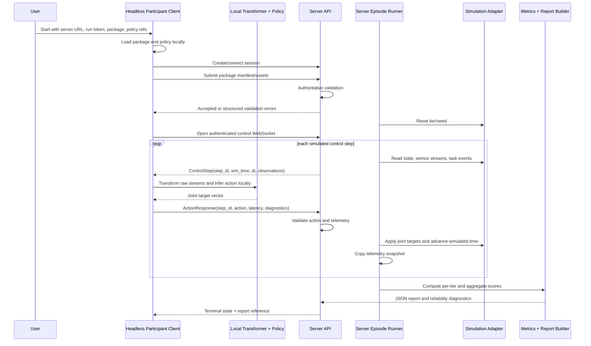

# feat: Build unified benchmark client/server architecture

## Overview

Build one compatible Paper HRI benchmark architecture that combines the
benchmark core plan with the participant client architecture plan.

The server/backend owns authoritative simulation, robot package validation,
scenario execution, telemetry, metric computation, report generation, and any
future rendering integration. The participant client owns local private policy
execution, local package loading checks, action production, and client-side
technical diagnostics. Both sides share one versioned protocol package so the
contract stays executable, documented, and testable from both directions.

This plan intentionally corrects the old integration mismatch. The old core
plan described the server calling participant-hosted policy endpoints. The
active client architecture instead has a participant client connect to a
server-facing API, run policy code locally, receive step-synchronous
observations, and send action responses. This combined plan treats the client
as the remote black-box policy interface while preserving the origin
requirement that participants do not disclose code, weights, or internal
architecture.

## Problem Frame

Paper HRI needs a credible benchmark MVP by 2026-05-15. The benchmark must
evaluate proprietary robot policies as black boxes, support morphology-aware
robot packages, run a social-navigation scenario in simulated time, and produce
a four-axis behavioral report (see origin:
`docs/brainstorms/2026-04-29-black-box-robotic-policy-benchmark-requirements.md`).

The immediate risk is contract drift. One teammate is building the participant
client from `docs/plans/2026-04-29-001-feat-benchmark-client-architecture-plan.md`,
while the old benchmark core plan still assumes a different endpoint topology.
The highest-leverage move is therefore a unified implementation plan that
defines the shared protocol first, then builds server and client against that
same contract.

## Compatibility Contract With the Existing Client Plan

This plan preserves the client architecture your colleague is building:

- The participant client remains headless and connects outward to the benchmark
  server.
- Policy code, model weights, transformers, and participant-only ML
  dependencies stay local to the client.
- The client receives step-synchronous observations, runs local inference, and
  sends action responses over the shared control channel.
- The client does not compute scores, validate runs authoritatively, render the
  benchmark, or own final reports.
- The client's internal module names may differ from this plan if the public
  message lifecycle, CLI workflow, and policy interface remain compatible with
  `asimovbm_protocol`.

This plan preserves the useful parts of the old core plan:

- Server-owned simulation, scenario execution, telemetry, metrics, and report
  generation remain the benchmark authority.
- Technical failures remain separate from behavioral failures.
- The social-navigation v0 scenario and the four-axis metric/report structure
  remain the MVP target.
- The stale assumption that the server calls participant-hosted policy HTTP
  endpoints is removed. The equivalent black-box boundary is now the
  client-connected control stream.

## Requirements Trace

- R1. Preserve participant IP: policy source, model weights, transformers, and
  ML dependencies run locally in the participant client and are never uploaded
  to the benchmark server.
- R2. Keep the server authoritative for simulation, package validation,
  scenario state, metric computation, final reports, and run validity.
- R3. Use one versioned shared protocol for session bootstrap, package
  submission, validation status, control-step observations, action responses,
  technical failures, terminal states, and report references.
- R4. Preserve step-synchronous simulated-time semantics: wall-clock client
  latency is telemetry and never advances simulated time by itself.
- R5. Use joint target vectors interpreted through the robot package's declared
  action mapping.
- R6. Expose observations as named typed sensor streams plus structured task
  events, including the v0 `come_here` event.
- R7. Treat robot packages, client messages, actions, uploaded assets, and
  diagnostics as untrusted input.
- R8. Classify technical failures separately from behavioral failures,
  including invalid actions, timeouts, disconnects, package validation errors,
  dependency/import failures, and policy exceptions.
- R9. Implement the social-navigation v0 scenario contract with three tiers,
  morphology-neutral acknowledgement, two-zone stop/safety rules, and N valid
  episodes with max attempts.
- R10. Produce aggregate and per-tier reports with the four macro indicators
  and exactly 12 v0 sub-indicators from the origin requirements.
- R11. Keep the participant client headless. No renderer, dashboard, replay
  viewer, Unity runtime, or score computation belongs in the client.
- R12. Provide fake/in-memory server and simulation adapters so server and
  client work can proceed before the real MuJoCo environment and deployment
  target are ready.
- R13. Use the easiest mature open-source stack that current official docs
  support: standard Python packaging, Pydantic v2 schemas, FastAPI/Uvicorn for
  ASGI HTTP/WebSocket surfaces, official MuJoCo Python bindings, pytest, and
  Ruff.

## Scope Boundaries

- This plan does not implement a web dashboard, hosted UI, replay viewer, or
  Unity rendering.
- This plan does not implement the full MuJoCo social-navigation world owned by
  the simulation teammate. It defines the server adapter boundary that their
  work plugs into.
- This plan does not execute arbitrary participant Python on the server.
- This plan does not implement multi-language clients for MVP.
- This plan does not implement arbitrary custom sensor plugins or executable
  robot package hooks.
- This plan does not implement raw torque or low-level actuator command mode.
- This plan does not add human-subject ratings for Impression.
- This plan does not solve full adversarial anti-cheating. Hidden scenario
  state and scoring thresholds remain server-owned, but runtime observations
  are necessarily sent to the client.

### Deferred to Separate Tasks

- Demo-quality rendering: separate graphics/rendering plan for Unity-like
  visuals or another rendering layer.
- Production deployment: separate task once the local MVP control loop and
  report path are stable.
- Real MuJoCo scenario integration: separate implementation pass after the
  teammate's simulation API is ready.
- Binary sensor transport optimization: defer until representative camera,
  depth, and lidar payload sizes are known.
- Long-term participant portal/dashboard: defer until the server/client
  protocol and report contract are stable.

## Context & Research

### Relevant Code and Patterns

- `AGENTS_SHARED.md` sets the target date at 2026-05-15 and asks agents to keep
  benchmark specifications, metric formulas, implementation artifacts, and
  generated outputs distinct.
- `docs/brainstorms/2026-04-29-black-box-robotic-policy-benchmark-requirements.md`
  defines the benchmark thesis, remote black-box contract, social-navigation
  tiers, technical failure separation, and report sub-indicators.
- `docs/plans/2026-04-29-001-feat-black-box-benchmark-core-plan.md` contains
  the original server-side metric, telemetry, scenario, and report work, but its
  policy endpoint boundary is stale relative to the client plan.
- `docs/plans/2026-04-29-001-feat-benchmark-client-architecture-plan.md`
  defines the participant client as a headless local policy runner that connects
  to a server API and leaves validation, simulation, metrics, reports, and
  rendering on the backend.
- `g1_slam/` is a local prototype area with Python `src/` packaging,
  `argparse` CLI patterns, MuJoCo runner code, and navigation/simulation
  primitives that may inform fake simulation adapters. It should not be treated
  as the final benchmark package layout.
- The Notion `Paper HRI` page confirms the 2026-05-15 deadline, the minimum
  goal of benchmark specs, and the target of a benchmark MVP.

### Institutional Learnings

- No `docs/solutions/` directory currently exists, so there are no prior
  institutional solution notes to apply.

### External References

- Python Packaging User Guide: `pyproject.toml` is the standard configuration
  surface for build metadata, optional dependencies, scripts, and tool config.
- uv official docs: uv manages Python projects defined by `pyproject.toml` and
  creates a lock file for reproducible project commands.
- Pydantic v2 docs: models support nested schema validation, serialization, and
  JSON Schema generation; Pydantic Settings supports environment-driven typed
  configuration.
- FastAPI official docs: FastAPI supports WebSocket endpoints, JSON messages,
  WebSocket dependencies, `UploadFile` file upload handling, and WebSocket
  testing through `TestClient`.
- websockets official docs: the Python client exposes keepalive, timeout,
  message-size, and queue-size controls for client-side WebSocket connections.
- Uvicorn official docs: Uvicorn is an ASGI server for Python that currently
  supports HTTP/1.1 and WebSockets and exposes WebSocket size/ping settings.
- MuJoCo official Python docs: the `mujoco` package is the official PyPI
  package for Python bindings and includes the MuJoCo library.
- OWASP WebSocket Security and Logging cheat sheets: use WSS in production,
  token-based authentication, origin allowlists when relevant, message size and
  rate limits, input validation, and log redaction for tokens/message contents.
- OWASP File Upload and Python `zipfile` docs: file/package uploads require
  allowlisted types, size limits, safe filenames, storage outside executable
  paths, and archive inspection before extraction.
- Ruff official docs: Ruff provides a fast Python linter and formatter, with
  safe fixes distinguished from unsafe fixes.

## Key Technical Decisions

| Decision | Choice | Why |
|---|---|---|
| Authoritative topology | Server-authoritative benchmark with a headless participant client | Aligns with the active client plan and preserves the black-box IP thesis without server-side execution of participant code. |
| Shared contract | Create `asimovbm_protocol` as the first implementation surface | Prevents server/client drift and lets docs, JSON schemas, fake adapters, and tests all use the same models. |
| Transport | REST for session/package/report surfaces; WebSocket for the step/action control stream | REST is simplest for one-shot resources, while WebSocket fits step-synchronous bidirectional exchange over one connection. FastAPI/Uvicorn support both in one ASGI app. |
| Web framework | FastAPI on Uvicorn for the server API | Mature open-source Python ASGI stack, direct Pydantic integration, built-in testing support, and first-class WebSocket examples in current docs. |
| Client WebSocket library | `websockets` for the real client transport, plus in-memory/fake transports for tests | It is a focused open-source Python WebSocket client with documented timeout, keepalive, max message size, and queue controls. |
| Schema validation | Pydantic v2 models for all protocol, package, telemetry, action, report, and diagnostic payloads | Provides typed validation for untrusted data and can emit JSON Schema for documentation. |
| Project management | One root `pyproject.toml`, managed with uv, with optional extras for `client`, `server`, `mujoco`, and `dev` | Keeps the repo simple while preventing participant-client installs from requiring heavy server/MuJoCo dependencies. |
| Package layout | Three top-level import packages: `asimovbm_protocol`, `asimovbm_server`, and `asimovbm_client` | Clear ownership boundaries without multiple repositories or nested project metadata. |
| CLI implementation | Use standard-library `argparse` initially | Matches the local `g1_slam` pattern and avoids adding CLI dependencies before the workflow is stable. |
| Robot package submission | Manifest-first package contract; MVP supports local directory packages and optional zip upload through FastAPI `UploadFile` | Easiest participant workflow while keeping server validation authoritative. Uploaded archives must be inspected before extraction. |
| Retry semantics | Retry the same control step once with the same `step_id` and incremented attempt number; do not advance simulation between attempts | Preserves the origin one-retry requirement in the client-connected model and avoids mixing infrastructure failures with behavior. |
| Large sensor payloads | JSON message envelope with inline small payloads and payload references for large camera/depth data | Keeps v0 simple while leaving room for binary/blob transport after payload sizes are measured. |
| Metrics | Pure deterministic functions over copied telemetry snapshots | Keeps metrics independent from FastAPI, WebSockets, and MuJoCo internals. |
| Security posture | Bearer run tokens, WSS in production, explicit max sizes/timeouts, origin checks when browser clients are introduced, and redacted diagnostics | Follows current OWASP WebSocket, logging, and upload guidance without building a full auth platform for MVP. |

## Open Questions

### Resolved During Planning

- **Should the benchmark server call participant-hosted endpoints?** No. The
  active integration path is a participant client connected to the benchmark
  server. The old endpoint wording is reinterpreted as the client's black-box
  action channel.
- **Should transport remain completely undecided?** No. For implementation
  clarity, MVP uses REST plus WebSocket through FastAPI/Uvicorn. The protocol
  models remain transport-aware but not transport-coupled so binary transport
  can be added later.
- **Should server and client use separate repos?** No. For the May MVP, one
  repo with shared protocol, server, and client packages is easier to keep
  consistent. Optional dependencies prevent unnecessary installs.
- **Should the client compute scores?** No. The client receives terminal state
  and report references only. Server owns scoring and final interpretation.
- **Should package validation live in the client?** Client checks are local
  convenience only. Server validation is authoritative.
- **How does retry work over WebSocket?** The server repeats the same
  unadvanced control step once. A late or duplicate action for an old attempt is
  technical telemetry, not behavioral robot state.
- **What are the demo run defaults?** Preserve the origin demo defaults: 3
  valid episodes per tier and up to 5 attempts per tier unless implementation
  reveals that the demo timeline requires smaller fixture defaults.

### Deferred to Implementation

- Exact protocol field names may evolve while implementing the shared Pydantic
  models, but the message lifecycle must remain stable.
- Exact social-navigation thresholds, normalization constants, and morphology
  rubric weights should be finalized from project metric context and sample
  telemetry, not guessed in this plan.
- Exact asset formats for the future MuJoCo+Unity rendering pipeline require
  coordination with the rendering/simulation owner.
- Exact binary/blob strategy for high-rate camera/depth payloads should wait
  until payload sizes are measured.
- Production deployment topology, TLS termination, persistence, and multi-run
  scheduling are intentionally outside this MVP plan.

## Output Structure

This tree declares the intended initial shape. The implementer may adjust file
names when implementation reveals a cleaner local pattern, but the same
responsibilities should remain covered.

```text
pyproject.toml
.python-version
uv.lock
README.md
docs/
  protocol/
    client_server_api.md
    message_lifecycle.md
    robot_package.md
  specs/
    social_navigation_metrics.md
  client/
    quickstart.md
    policy_interface.md
    diagnostics.md
  server/
    simulation_adapter.md
    operations.md
  examples/
    robot_packages/
    policies/
src/
  asimovbm_protocol/
    __init__.py
    actions.py
    diagnostics.py
    messages.py
    observations.py
    reports.py
    robot_package.py
    versioning.py
  asimovbm_server/
    __init__.py
    app.py
    cli.py
    config.py
    api/
      __init__.py
      package_routes.py
      report_routes.py
      session_routes.py
      websocket_routes.py
    packages/
      __init__.py
      validation.py
      storage.py
    runner/
      __init__.py
      episode_runner.py
      simulation_adapter.py
      telemetry.py
    scenarios/
      __init__.py
      social_navigation.py
    metrics/
      __init__.py
      aggregate.py
      dexterity.py
      impression.py
      safety.py
      social_awareness.py
    reports/
      __init__.py
      json_report.py
    testing/
      __init__.py
      fake_simulation.py
  asimovbm_client/
    __init__.py
    cli.py
    config.py
    policy_loader.py
    package_loader.py
    transport.py
    runner.py
    telemetry.py
    testing/
      __init__.py
      fake_server.py
tests/
  protocol/
  server/
  client/
  integration/
```

## High-Level Technical Design

> *This illustrates the intended approach and is directional guidance for
> review, not implementation specification. The implementing agent should treat
> it as context, not code to reproduce.*



## Implementation Units

- [ ] **Unit 1: Scaffold unified Python workspace**

**Goal:** Establish the root package metadata, dependency groups, CLI entry
points, and quality tools for protocol, server, and client work.

**Requirements:** R1, R2, R3, R11, R13

**Dependencies:** None

**Files:**
- Create: `pyproject.toml`
- Create: `.python-version`
- Create/Update: `uv.lock`
- Create: `README.md`
- Create: `src/asimovbm_protocol/__init__.py`
- Create: `src/asimovbm_server/__init__.py`
- Create: `src/asimovbm_client/__init__.py`
- Create: `tests/test_package_imports.py`

**Approach:**
- Use one root `pyproject.toml` with `src/` layout and Python packaging
  metadata.
- Keep base dependencies minimal. Put heavy or role-specific dependencies in
  extras such as `client`, `server`, `mujoco`, and `dev`.
- Use uv for environment and lockfile management because current uv docs
  support `pyproject.toml` project workflows and lock files.
- Use Ruff for lint/format configuration in `pyproject.toml`; keep static type
  checking optional until protocol models stabilize.
- Expose separate console scripts for the server and participant client.
- Use `argparse` for initial CLIs to match `g1_slam/src/g1_slam/__main__.py`
  and minimize dependencies.

**Patterns to follow:**
- `g1_slam/pyproject.toml` for simple `src/` packaging and pytest config.
- `g1_slam/src/g1_slam/__main__.py` for lightweight `argparse` CLI style.
- Python Packaging User Guide `pyproject.toml` guidance for project metadata,
  optional dependencies, and scripts.

**Test scenarios:**
- Happy path: importing `asimovbm_protocol`, `asimovbm_server`, and
  `asimovbm_client` succeeds from an editable install.
- Happy path: server and client CLI help commands initialize without importing
  MuJoCo or loading participant policy code.
- Error path: importing the client package does not require server-only
  dependencies such as MuJoCo.
- Error path: importing the protocol package has no FastAPI, WebSocket, or
  MuJoCo dependency.

**Verification:**
- The repo has one reproducible Python project baseline and the three package
  boundaries import independently.

- [ ] **Unit 2: Define shared protocol and schema contracts**

**Goal:** Create versioned Pydantic models for every server/client message and
for all shared robot package, observation, action, diagnostic, and report
payloads.

**Requirements:** R1, R3, R4, R5, R6, R7, R8, R10, R13

**Dependencies:** Unit 1

**Files:**
- Create: `src/asimovbm_protocol/versioning.py`
- Create: `src/asimovbm_protocol/messages.py`
- Create: `src/asimovbm_protocol/robot_package.py`
- Create: `src/asimovbm_protocol/observations.py`
- Create: `src/asimovbm_protocol/actions.py`
- Create: `src/asimovbm_protocol/diagnostics.py`
- Create: `src/asimovbm_protocol/reports.py`
- Modify: `src/asimovbm_protocol/__init__.py`
- Create: `docs/protocol/client_server_api.md`
- Create: `docs/protocol/message_lifecycle.md`
- Create: `docs/protocol/robot_package.md`
- Test: `tests/protocol/test_message_models.py`
- Test: `tests/protocol/test_robot_package_models.py`
- Test: `tests/protocol/test_json_schema_exports.py`

**Approach:**
- Model the lifecycle explicitly: session bootstrap, package submission,
  validation response, control step, action response, technical failure,
  terminal state, and report reference.
- Include protocol version, run/session id, step id, attempt number, simulated
  timestamp, control dt, and ownership metadata in the relevant messages.
- Represent observations as named typed streams, not hardcoded camera/lidar
  fields. Include stream metadata, freshness metadata, payload size metadata,
  and structured task events.
- Represent actions as normalized joint target vectors mapped to declared joint
  ids. Reject wrong length, unknown joint id, NaN/inf, and out-of-range values.
- Represent diagnostic categories as finite enums so both sides classify
  technical failures consistently.
- Generate or document JSON Schema from the Pydantic models so docs and tests
  use the same source of truth.

**Execution note:** Start with protocol model tests and JSON Schema snapshots
before server or client code depends on the models.

**Patterns to follow:**
- Origin requirements R5-R13 and R19-R25.
- Pydantic v2 nested models and schema generation.

**Test scenarios:**
- Happy path: a complete session bootstrap plus package validation lifecycle
  validates and serializes to JSON.
- Happy path: a control step containing proprioception, stereo camera payload
  references, lidar readings, sensor freshness, and a `come_here` event
  validates.
- Happy path: an action response with matching joint ids, normalized targets,
  latency, and local warnings validates.
- Happy path: JSON Schema export includes every public message type used by the
  docs.
- Edge case: a carried-forward sensor stream marks freshness without changing
  simulated timestamp semantics.
- Edge case: a robot package with no optional visual assets remains valid for
  headless execution.
- Error path: unsupported protocol version produces a compatibility failure.
- Error path: action vectors with NaN/inf, wrong length, duplicate joint ids, or
  out-of-range values fail validation.
- Error path: package manifests containing absolute paths, parent-directory
  traversal, executable hooks, plugin declarations, or unsupported stream types
  fail validation.

**Verification:**
- Server, client, docs, and tests can all import the same protocol models
  without depending on implementation modules.

- [ ] **Unit 3: Implement server API shell and session lifecycle**

**Goal:** Build the authoritative benchmark server API skeleton with REST
session/package/report surfaces and a WebSocket control endpoint that is wired
to shared protocol models.

**Requirements:** R2, R3, R4, R7, R8, R11, R12, R13

**Dependencies:** Units 1-2

**Files:**
- Create: `src/asimovbm_server/app.py`
- Create: `src/asimovbm_server/cli.py`
- Create: `src/asimovbm_server/config.py`
- Create: `src/asimovbm_server/api/__init__.py`
- Create: `src/asimovbm_server/api/session_routes.py`
- Create: `src/asimovbm_server/api/package_routes.py`
- Create: `src/asimovbm_server/api/report_routes.py`
- Create: `src/asimovbm_server/api/websocket_routes.py`
- Create: `tests/server/test_app_factory.py`
- Create: `tests/server/test_session_routes.py`
- Create: `tests/server/test_websocket_auth_and_limits.py`

**Approach:**
- Use FastAPI for the server API and Uvicorn for local serving.
- Use Pydantic Settings for server configuration such as token settings,
  payload size limits, upload limits, timeout defaults, and local storage paths.
- Define REST endpoints for session creation/connection, package upload/status,
  and report retrieval/reference.
- Define a WebSocket endpoint for the control loop. It should validate
  protocol version, run token, and session state before accepting control
  messages.
- Keep session state in an in-memory store for MVP and document that durable
  persistence is a separate production task.
- Configure explicit message-size and timeout limits. Keep production WSS/TLS
  termination as an operational requirement, not local development machinery.

**Patterns to follow:**
- FastAPI WebSocket and WebSocket dependency docs.
- FastAPI `UploadFile` docs for package upload surfaces.
- Uvicorn ASGI and WebSocket settings docs.
- OWASP WebSocket Security guidance for authentication, size limits, and
  validation.

**Test scenarios:**
- Happy path: server app factory returns an ASGI app with health/session/package
  and WebSocket routes registered.
- Happy path: creating a local session returns a session id, protocol version,
  and opaque run token or accepts a configured local token.
- Happy path: WebSocket connection with a valid token and protocol version is
  accepted.
- Error path: missing, malformed, or wrong run token rejects session/package and
  WebSocket access without logging the token.
- Error path: unsupported protocol version returns a structured compatibility
  failure.
- Error path: oversized WebSocket message or package upload is rejected as a
  technical failure, not as behavior.
- Integration: FastAPI `TestClient` can exercise the WebSocket handshake and a
  minimal terminal-state exchange without a real network server.

**Verification:**
- The server API can be run locally, tested without external services, and
  expresses the same lifecycle as `docs/protocol/client_server_api.md`.

- [ ] **Unit 4: Implement robot package loading, upload, and authoritative validation**

**Goal:** Provide client-side package loading for participant convenience and
server-side package validation for authoritative acceptance/rejection.

**Requirements:** R2, R3, R5, R6, R7, R11, R12, R13

**Dependencies:** Units 2-3

**Files:**
- Create: `src/asimovbm_client/package_loader.py`
- Create: `src/asimovbm_server/packages/__init__.py`
- Create: `src/asimovbm_server/packages/validation.py`
- Create: `src/asimovbm_server/packages/storage.py`
- Create: `docs/client/quickstart.md`
- Modify: `docs/protocol/robot_package.md`
- Create: `docs/examples/robot_packages/minimal/manifest.json`
- Test: `tests/client/test_package_loader.py`
- Test: `tests/server/test_package_validation.py`
- Test: `tests/server/test_package_upload_security.py`
- Test: `tests/integration/test_package_submission.py`

**Approach:**
- Support local directory packages for fastest local demo iteration.
- Support optional zip upload for participant/server separation, but inspect
  archives before extraction. Reject absolute paths, parent traversal, hidden
  path tricks, unsupported file extensions, oversized archives, oversized
  decompressed content, symlinks, and executable hook declarations.
- Store accepted uploads under generated server-owned run directories, never
  under user-controlled paths and never in executable package import paths.
- Validate package manifest structure with shared Pydantic models on both
  sides, but make server validation authoritative.
- Keep visual asset references as backend/rendering metadata only; the client
  never renders them and the server does not execute them.
- Keep MuJoCo model loading separate from package manifest validation so users
  receive clear package errors before scenario execution.

**Patterns to follow:**
- OWASP File Upload guidance for allowlists, size limits, filename safety, and
  storage outside executable paths.
- Python `zipfile` warning to inspect untrusted archives before extraction.
- Existing `g1_slam/assets/` only as sample MuJoCo asset context, not as final
  package format.

**Test scenarios:**
- Happy path: a minimal directory package with proprioception, stereo camera,
  lidar, joint mapping, forward/sensor direction, and capability tags loads
  locally and submits to the server.
- Happy path: a package with separate physics model and optional visual asset
  references preserves both fields in the package envelope.
- Happy path: client local validation catches duplicate sensor stream names
  before network submission.
- Error path: missing manifest fails locally with a setup diagnostic.
- Error path: server rejects package paths with absolute paths, `..`, leading
  dots where disallowed, symlinks, executable hook fields, or unsupported
  extensions.
- Error path: zip archive with decompressed size over the configured limit is
  rejected before extraction.
- Error path: client accepts a structurally plausible package that server later
  rejects for authoritative simulator/package reasons, and the client reports
  the server validation status without executing policy code.
- Integration: package submission route stores accepted assets under a
  generated run directory and returns structured validation status.

**Verification:**
- A participant can prepare a package locally, receive fast local feedback, and
  still rely on server validation as the single authority.

- [ ] **Unit 5: Implement participant client CLI and local policy interface**

**Goal:** Build the headless client runner that loads participant code locally,
connects to the server API, and never uploads policy internals.

**Requirements:** R1, R3, R4, R5, R6, R8, R11, R12

**Dependencies:** Units 1-4

**Files:**
- Create: `src/asimovbm_client/cli.py`
- Create: `src/asimovbm_client/config.py`
- Create: `src/asimovbm_client/policy_loader.py`
- Create: `src/asimovbm_client/runner.py`
- Create: `src/asimovbm_client/telemetry.py`
- Create: `docs/client/policy_interface.md`
- Create: `docs/client/diagnostics.md`
- Create: `docs/examples/policies/minimal_policy.py`
- Test: `tests/client/test_cli.py`
- Test: `tests/client/test_policy_loader.py`
- Test: `tests/client/test_runner_diagnostics.py`

**Approach:**
- Use `argparse` for options such as server URL, run token/session id, package
  path, transformer reference, policy reference, local diagnostics mode, and
  fake-server mode.
- Load participant transformer and policy classes by Python module reference
  using standard local import mechanisms.
- Define minimal local interfaces: transformer consumes raw named streams and
  task events; policy consumes transformed observations and returns joint target
  actions compatible with the package mapping.
- Report import errors, constructor errors, missing callables, dependency
  failures, policy exceptions, invalid actions, and disconnects as structured
  technical diagnostics.
- Redact local absolute paths, source snippets, environment secrets, tokens,
  model identifiers when configured, and suspicious token-like values from
  outbound telemetry by default.
- Keep final scores and report interpretation out of the client.

**Patterns to follow:**
- `g1_slam/src/g1_slam/__main__.py` for simple CLI style.
- Client architecture plan's headless participant workflow.
- OWASP Logging guidance for excluding access tokens, source code, sensitive
  paths, and other sensitive values from logs.

**Test scenarios:**
- Happy path: CLI help displays server, run token, package, transformer, policy,
  and fake-server options without connecting to a backend.
- Happy path: sample transformer and sample policy load locally and produce a
  valid action for a sample control step.
- Happy path: local diagnostics include latency, step count, retry count, and
  warnings but not policy source or model weights.
- Error path: missing module reference produces a setup diagnostic before
  opening the control WebSocket.
- Error path: class lacks the expected callable interface and fails before the
  control loop.
- Error path: constructor or dependency import failure is redacted and reported
  without uploading local source details.
- Error path: secret-like environment values and local absolute paths are
  redacted from outbound telemetry.
- Edge case: policy imports a third-party dependency already installed in the
  participant environment and the client does not vendor or manage it.

**Verification:**
- Participant policy code executes locally through a documented interface and
  never appears in package uploads or server telemetry.

- [ ] **Unit 6: Implement WebSocket control channel and retry semantics**

**Goal:** Connect the server episode runner and participant client through the
shared WebSocket control protocol, including timeout, retry, duplicate, and
disconnect behavior.

**Requirements:** R1, R3, R4, R5, R6, R7, R8, R11, R12, R13

**Dependencies:** Units 2-5

**Files:**
- Create: `src/asimovbm_client/transport.py`
- Modify: `src/asimovbm_client/runner.py`
- Modify: `src/asimovbm_server/api/websocket_routes.py`
- Create: `src/asimovbm_server/runner/episode_runner.py`
- Create: `src/asimovbm_server/testing/fake_simulation.py`
- Create: `src/asimovbm_client/testing/fake_server.py`
- Test: `tests/client/test_transport.py`
- Test: `tests/server/test_control_channel.py`
- Test: `tests/integration/test_control_loop_fake_server.py`
- Test: `tests/integration/test_control_loop_timeout_retry.py`

**Approach:**
- Use the `websockets` client library for real client connections and configure
  open timeout, ping interval, ping timeout, close timeout, max message size,
  and queue limits from client settings.
- Keep an in-memory/fake transport for fast tests and colleague-client
  alignment before real server deployment.
- Server sends one `ControlStep` per simulated control step and waits for a
  valid `ActionResponse`.
- On first timeout, invalid transport response, or recoverable disconnect before
  action acceptance, server resends the same step once with the same `step_id`,
  same simulated timestamp, and incremented attempt number.
- Server does not advance the simulation until a valid action for the current
  step is accepted.
- If retry fails, mark the episode as technical failure and exclude it from
  behavioral metrics while preserving reliability diagnostics.
- Late, duplicate, stale-step, or wrong-attempt actions are recorded as
  technical diagnostics and must not be applied to simulation state.
- Disable compression or document why it is enabled if secret-bearing messages
  ever share frames with attacker-controlled content.

**Execution note:** Implement the timeout/retry and duplicate-action tests
before wiring the real WebSocket client.

**Patterns to follow:**
- FastAPI WebSocket docs for server endpoint behavior.
- websockets client docs for timeout, keepalive, max message size, and queue
  settings.
- OWASP WebSocket Security guidance for message validation, size limits, DoS
  protection, and token handling.

**Test scenarios:**
- Happy path: server sends a control step, client returns a valid action, server
  validates it, applies it, and advances exactly one simulated step.
- Happy path: client records processing latency and sends it with the action
  response.
- Edge case: first timeout triggers one retry of the same `step_id` without
  advancing simulated time; a valid retry action completes the step.
- Edge case: client receives a duplicate step and does not run policy twice if
  it already has a valid action for that `step_id`.
- Error path: two timeouts mark the episode as technical failure.
- Error path: invalid JSON, unsupported message type, wrong protocol version,
  wrong step id, or invalid action vector produces technical failure handling.
- Error path: late action from attempt 1 after attempt 2 completes is ignored
  and recorded as stale/duplicate telemetry.
- Error path: connection closes mid-step and retry policy is applied exactly
  once.
- Integration: real client transport and FastAPI WebSocket route complete a
  one-step fake simulation run.

**Verification:**
- Both server and client agree on step ownership, retry semantics, and failure
  classification under normal, slow, invalid, and disconnected conditions.

- [ ] **Unit 7: Implement simulation adapter, episode policy, and server telemetry**

**Goal:** Build the server-side benchmark runner around a minimal simulation
adapter boundary and immutable telemetry snapshots.

**Requirements:** R2, R4, R5, R6, R8, R9, R12

**Dependencies:** Units 2, 3, 6

**Files:**
- Create: `src/asimovbm_server/runner/simulation_adapter.py`
- Modify: `src/asimovbm_server/runner/episode_runner.py`
- Create: `src/asimovbm_server/runner/telemetry.py`
- Create: `src/asimovbm_server/scenarios/__init__.py`
- Create: `src/asimovbm_server/scenarios/social_navigation.py`
- Create: `docs/server/simulation_adapter.md`
- Test: `tests/server/test_simulation_adapter_contract.py`
- Test: `tests/server/test_episode_runner.py`
- Test: `tests/server/test_telemetry.py`
- Test: `tests/server/test_social_navigation_config.py`

**Approach:**
- Define a small adapter protocol: reset tier/seed/package, expose current
  observation streams and task events, apply joint target action, advance one
  simulated control step, and return completion/failure status.
- Keep the adapter independent of FastAPI and WebSockets so fake and real
  simulation adapters can share the same runner tests.
- Preserve simulated time as the source of truth for control frequency and
  task timing.
- Implement run policy per tier: attempt episodes until N valid behavioral
  episodes complete or max attempts is reached. Technical failures consume
  attempts and reliability budget but not behavioral scores.
- Copy telemetry snapshots before simulator state mutates again. Avoid storing
  full raw image/depth payloads by default; store references, summaries, or
  configured excerpts.
- Keep `g1_slam` as optional inspiration for fake navigation and MuJoCo
  integration, not as a dependency direction from benchmark server to prototype.

**Patterns to follow:**
- MuJoCo Python docs for official bindings and stateful `MjModel`/`MjData`
  usage.
- Existing `g1_slam/src/g1_slam/mujoco_runner.py` pattern of isolating MuJoCo
  imports inside MuJoCo-specific code paths.
- Original core plan telemetry-before-metrics decision.

**Test scenarios:**
- Happy path: one tier with three valid fake episodes returns three completed
  episode records.
- Happy path: empty-room, static-bystander, and moving-bystander tiers preserve
  tier labels, seeds, and run metadata.
- Happy path: telemetry snapshots are independent copies and do not change when
  source simulator state mutates later.
- Edge case: technical failure on one attempt retries at the episode level
  until N valid episodes complete or max attempts is reached.
- Edge case: no bystanders still records target-human data and an empty
  bystander list.
- Error path: simulation adapter behavioral failure is classified as behavior,
  not technical failure.
- Error path: fewer than N valid behavioral episodes after max attempts marks
  the tier insufficient-confidence.
- Error path: missing required pose or timestamp data fails before metrics run.
- Integration: policy-channel technical failure propagates to episode technical
  status and skips metric computation for that episode.

**Verification:**
- The server runner can complete a fake social-navigation run before the real
  MuJoCo adapter exists.

- [ ] **Unit 8: Implement metric engines, aggregation, and report generation**

**Goal:** Compute the 12 v0 sub-indicators and four macro indicators from
server telemetry and emit the report payload consumed by clients and future UI.

**Requirements:** R2, R8, R9, R10, R12

**Dependencies:** Units 2 and 7

**Files:**
- Create: `src/asimovbm_server/metrics/__init__.py`
- Create: `src/asimovbm_server/metrics/dexterity.py`
- Create: `src/asimovbm_server/metrics/safety.py`
- Create: `src/asimovbm_server/metrics/social_awareness.py`
- Create: `src/asimovbm_server/metrics/impression.py`
- Create: `src/asimovbm_server/metrics/aggregate.py`
- Create: `src/asimovbm_server/reports/__init__.py`
- Create: `src/asimovbm_server/reports/json_report.py`
- Modify: `src/asimovbm_protocol/reports.py`
- Create: `docs/specs/social_navigation_metrics.md`
- Test: `tests/server/test_dexterity_metrics.py`
- Test: `tests/server/test_safety_metrics.py`
- Test: `tests/server/test_social_awareness_metrics.py`
- Test: `tests/server/test_impression_metrics.py`
- Test: `tests/server/test_aggregate_metrics.py`
- Test: `tests/server/test_json_report.py`

**Approach:**
- Compute metrics only from validated telemetry fixtures and scenario config.
- Perceived Dexterity: task success, completion time, path efficiency.
- Perceived Safety: minimum human distance, proxemic intrusion, speed near
  humans.
- Perceived Social Awareness: gesture response success, acknowledgement
  clarity, human-aware approach.
- Impression: motion smoothness, stability/controlledness,
  morphology-task fit.
- Normalize each sub-indicator to a documented 0-1 scale while retaining raw
  values and confidence flags.
- Compute per-tier values first, then aggregate across tiers with equal tier
  weighting for v0 unless later calibration provides a project-grounded reason
  to change.
- Include technical reliability diagnostics in the report but keep them
  separate from behavioral metric blocks.

**Execution note:** Implement metric tests from synthetic telemetry fixtures
before connecting report generation to the episode runner.

**Patterns to follow:**
- Origin requirements R19-R25 for exact macro and sub-indicator shape.
- `AGENTS_SHARED.md` requirement to distinguish metric formulas from
  implementation artifacts and generated outputs.

**Test scenarios:**
- Happy path: perfect synthetic episode scores high across task success,
  completion time, path efficiency, stop distance, and acknowledgement.
- Happy path: aggregate report contains all four macro indicators and exactly
  12 sub-indicators.
- Happy path: per-tier report blocks show empty-room, static-bystander, and
  moving-bystander results separately.
- Edge case: no valid behavioral episodes in a tier yields
  insufficient-confidence instead of a misleading zero behavior score.
- Edge case: no bystanders leaves bystander-specific penalties neutral where
  documented.
- Error path: non-monotonic simulated time is rejected or marked invalid before
  metric normalization.
- Error path: missing capability tags for morphology-task fit produces a
  documented low-confidence/failing rubric result.
- Integration: technical failures appear in reliability diagnostics and are not
  counted as behavioral failures.

**Verification:**
- Reports are reproducible from telemetry fixtures and documented in
  `docs/specs/social_navigation_metrics.md`.

- [ ] **Unit 9: Ship end-to-end fake demo, docs, and compatibility checks**

**Goal:** Provide a local fake benchmark run that exercises participant client,
server API, shared protocol, fake simulation, metrics, and report generation
before real MuJoCo integration.

**Requirements:** R1-R13

**Dependencies:** Units 1-8

**Files:**
- Modify: `README.md`
- Modify: `docs/client/quickstart.md`
- Modify: `docs/client/policy_interface.md`
- Modify: `docs/client/diagnostics.md`
- Create: `docs/server/operations.md`
- Modify: `docs/server/simulation_adapter.md`
- Modify: `docs/protocol/client_server_api.md`
- Modify: `docs/protocol/message_lifecycle.md`
- Modify: `docs/examples/robot_packages/minimal/manifest.json`
- Modify: `docs/examples/policies/minimal_policy.py`
- Test: `tests/integration/test_fake_benchmark_run.py`
- Test: `tests/integration/test_protocol_compatibility_server_client.py`
- Test: `tests/integration/test_cli_fake_run.py`

**Approach:**
- Document how to run the fake server/client loop locally using the package
  extras and sample assets.
- Provide one minimal robot package and one minimal deterministic policy that
  demonstrate the protocol without depending on the real simulation.
- Add compatibility tests that prove client messages and server messages are
  parsed by the same shared models.
- Add a fake end-to-end run that produces a report reference and JSON report.
- Document the integration contract for the simulation teammate: what the real
  MuJoCo adapter must provide and what it must not own.
- Document operational guardrails: no token logging, no raw sensor payload logs
  by default, message size limits, upload limits, and local-only fake settings.

**Patterns to follow:**
- Client architecture plan's fake backend requirement.
- FastAPI WebSocket testing docs for server tests.
- OWASP WebSocket and Logging guidance for operational guardrails.

**Test scenarios:**
- Happy path: participant client runs the minimal package and policy against
  the fake server to terminal report-ready state.
- Happy path: fake run exercises package validation, WebSocket control,
  retry-free action exchange, telemetry, metrics, and report generation.
- Happy path: README and docs example commands correspond to implemented CLI
  options and sample paths.
- Error path: fake run with an invalid action reports technical failure and no
  behavioral metric computation for that failed episode.
- Error path: fake run with package validation rejection stops before policy
  execution.
- Edge case: fake server can run in-process for tests and as a local process for
  manual demos without changing protocol messages.
- Integration: server and client compatibility tests fail if either side changes
  a public message shape without updating the shared protocol model.

**Verification:**
- A teammate can run the fake benchmark path, inspect a report, and use the same
  protocol docs to implement or adjust the real client/server integration.

## System-Wide Impact

- **Interaction graph:** protocol models -> server API/client runner -> control
  channel -> server episode runner -> telemetry -> metrics -> report reference.
  The client depends on protocol models and local policy interfaces, not on
  server internals.
- **Contract ownership:** `asimovbm_protocol` is the source of truth. Docs and
  fake adapters must be generated from or tested against it rather than
  retyping incompatible shapes.
- **Error propagation:** Client setup errors, policy exceptions, invalid
  actions, timeout retries, disconnects, upload failures, and protocol
  violations produce technical diagnostics. Simulation task failures produce
  behavioral episode outcomes. Insufficient valid episodes produce confidence
  flags.
- **State lifecycle risks:** The server must not advance simulated time until a
  valid action for the current step is accepted. Retry attempts must preserve
  step id and simulated timestamp. Late/duplicate actions must not mutate
  simulation state.
- **Security surfaces:** WebSocket messages, uploaded robot packages, returned
  actions, diagnostics, asset filenames, and package manifests are untrusted.
  Tokens and raw payloads must be redacted from logs by default.
- **Integration coverage:** Unit tests are not enough. Fake end-to-end tests
  must cover package submission, control exchange, timeout/retry, telemetry,
  metrics, and report generation.
- **Unchanged invariants:** v0 remains step-synchronous, simulated-time based,
  joint-target-only, gesture-event-based, headless on the client, and
  server-authoritative for validation/scoring/reporting.

## Risks & Dependencies

| Risk | Likelihood | Impact | Mitigation |
|---|---:|---:|---|
| Client work already in progress diverges from this unified package layout | Medium | High | Treat shared protocol messages and lifecycle as mandatory; allow file/module names to adapt if the colleague already has compatible client structure. |
| REST + WebSocket is more infrastructure than direct HTTP policy calls | Medium | Medium | FastAPI/Uvicorn supports both in one ASGI app, and the topology matches the active client plan. Keep fake transports for low-friction tests. |
| WebSocket retry semantics are ambiguous under late actions | Medium | High | Encode `step_id` and `attempt` in every control/action message and test late, duplicate, stale, and wrong-attempt actions explicitly. |
| Package uploads introduce path traversal or zip bomb risk | Medium | High | Inspect archives before extraction, enforce path and size limits, store files outside executable import paths, and test malicious package fixtures. |
| Sensor payloads exceed JSON/WebSocket comfort | Medium | Medium | Use payload references for large streams, enforce max message sizes, and defer binary/blob optimization until payload sizes are measured. |
| Server/client optional dependencies become confusing | Medium | Medium | Document extras clearly and keep `asimovbm_protocol` free of server/client implementation dependencies. |
| Metrics look authoritative before calibration | High | Medium | Retain raw values, document formulas, mark insufficient-confidence tiers, and defer calibration weights to project-grounded telemetry review. |
| Simulation teammate's adapter shape differs from this plan | Medium | High | Keep the adapter minimal, document it, and validate the real adapter against fake adapter tests. |
| Diagnostics leak participant IP or secrets | Medium | High | Redact tokens, source snippets, model identifiers, local paths, and full raw payloads by default; test redaction paths. |

## Alternative Approaches Considered

- **Server calls participant-hosted HTTP policy endpoint:** This matches the
  original requirements wording, but conflicts with the active client
  architecture being built by a teammate. It also pushes participants to host
  their own service rather than running a local client. Rejected for MVP.
- **gRPC first:** Strong typed streaming, but heavier participant setup than the
  current FastAPI/WebSocket stack and less aligned with the existing Python
  client plan. Defer until JSON/WebSocket becomes a proven bottleneck.
- **Single package namespace only (`asimovbm.client`, `asimovbm.server`):**
  Slightly tidier imports, but top-level `asimovbm_protocol`,
  `asimovbm_server`, and `asimovbm_client` make dependency boundaries and
  ownership clearer during parallel implementation.
- **Separate repositories for server and client:** Cleaner release boundaries
  eventually, but higher coordination cost before the shared contract is stable.
  One repo is safer for the May MVP.
- **Client-side metrics preview:** Useful for participant feedback, but risks
  confusing local diagnostics with authoritative scoring. Keep the client
  score-free.

## Phased Delivery

### Phase 1: Contract and skeleton

- Units 1-2. Establish project tooling and shared protocol models before either
  side builds behavior around incompatible assumptions.

### Phase 2: Server/client API surfaces

- Units 3-5. Build the server API shell, package validation path, and headless
  client loading/runtime surfaces.

### Phase 3: Control loop and simulation boundary

- Units 6-7. Implement WebSocket step/action exchange, retry semantics, fake
  simulation, episode policy, and telemetry.

### Phase 4: Metrics, reports, and fake demo

- Units 8-9. Implement scoring/report generation and prove the whole path with
  fake server/client integration before real MuJoCo work lands.

### Phase 5: Real simulation and rendering integration

- Separate tasks. Plug in the teammate's MuJoCo adapter and any future
  rendering/report presentation work after the protocol and fake run are stable.

## Documentation / Operational Notes

- `docs/protocol/client_server_api.md` should become the shared technical
  contract for the colleague building the client and anyone implementing the
  server.
- `docs/protocol/message_lifecycle.md` should document exact state transitions:
  bootstrap, package validation, control loop, retry, technical failure,
  terminal state, and report reference.
- `docs/server/simulation_adapter.md` should be the handoff document for the
  MuJoCo simulation owner.
- `docs/specs/social_navigation_metrics.md` should remain metric/formula
  focused, separate from implementation docs and generated report examples.
- README should clearly distinguish local fake demo, participant client usage,
  server usage, and future production deployment.
- Production deployments must use WSS/TLS termination and should not allow
  wildcard origins if browser clients are later introduced.
- Logs should include validation failures, auth failures, abnormal disconnects,
  retries, and technical failure categories, but not full message contents,
  access tokens, package source, local source snippets, or full raw sensor
  payloads.

## Success Metrics

- Server and client pass shared protocol compatibility tests.
- Fake end-to-end benchmark run produces a JSON report with all four macro
  indicators, all 12 sub-indicators, per-tier blocks, and reliability
  diagnostics.
- A package validation failure prevents policy execution and reports a
  structured diagnostic to the client.
- A timeout retry repeats the same simulated step once without advancing
  simulated time.
- A technical failure never appears as a behavioral metric failure.
- The participant client can be installed/run without MuJoCo or server-only
  dependencies.

## Sources & References

- **Origin requirements:** `docs/brainstorms/2026-04-29-black-box-robotic-policy-benchmark-requirements.md`
- **Old core plan:** `docs/plans/2026-04-29-001-feat-black-box-benchmark-core-plan.md`
- **Client architecture plan:** `docs/plans/2026-04-29-001-feat-benchmark-client-architecture-plan.md`
- **Shared project instructions:** `AGENTS_SHARED.md`
- **Notion Paper HRI page:** `https://www.notion.so/34a3652adb22802bb2aadf02ea890108`
- **Python Packaging User Guide - Writing your pyproject.toml:** `https://packaging.python.org/en/latest/guides/writing-pyproject-toml/`
- **uv project docs:** `https://docs.astral.sh/uv/guides/projects/`
- **Pydantic models:** `https://docs.pydantic.dev/latest/concepts/models/`
- **Pydantic settings:** `https://docs.pydantic.dev/latest/concepts/pydantic_settings/`
- **FastAPI WebSockets:** `https://fastapi.tiangolo.com/advanced/websockets/`
- **FastAPI Request Files:** `https://fastapi.tiangolo.com/tutorial/request-files/`
- **FastAPI Testing WebSockets:** `https://fastapi.tiangolo.com/advanced/testing-websockets/`
- **websockets asyncio client:** `https://websockets.readthedocs.io/en/stable/reference/asyncio/client.html`
- **Uvicorn:** `https://www.uvicorn.org/`
- **MuJoCo Python docs:** `https://mujoco.readthedocs.io/en/latest/python.html`
- **OWASP WebSocket Security Cheat Sheet:** `https://cheatsheetseries.owasp.org/cheatsheets/WebSocket_Security_Cheat_Sheet.html`
- **OWASP Logging Cheat Sheet:** `https://cheatsheetseries.owasp.org/cheatsheets/Logging_Cheat_Sheet.html`
- **OWASP File Upload Cheat Sheet:** `https://cheatsheetseries.owasp.org/cheatsheets/File_Upload_Cheat_Sheet.html`
- **Python zipfile docs:** `https://docs.python.org/3/library/zipfile.html`
- **Ruff formatter:** `https://docs.astral.sh/ruff/formatter/`
- **Ruff linter:** `https://docs.astral.sh/ruff/linter/`
