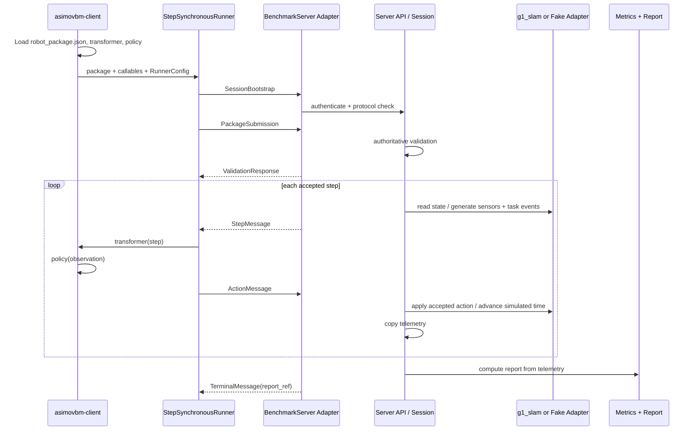

# feat: Build unified benchmark client/server architecture

## Overview

Build the server side around the client code currently merged from
`origin/feat/benchmark-client` and the real `g1_slam` navigation demo already
in the repo.

The benchmark remains server-authoritative for simulation, validation, episode
state, telemetry, metrics, and reports. The participant client remains
headless, runs policy code locally, and exchanges step/action messages with the
server. The immediate server work must not invent a second protocol. It must
honor the current client message lifecycle and then harden it into a shared
contract.

This plan replaces the stale old-core assumption that the server calls
participant-hosted HTTP policy endpoints. The black-box boundary is now the
client-connected message lifecycle.

## Problem Frame

Paper HRI needs a credible benchmark MVP by 2026-05-15. The benchmark must
evaluate proprietary robot policies as black boxes, support morphology-aware
robot packages, run a social-navigation scenario in simulated time, and produce
a four-axis behavioral report.

Two local realities now matter:

- The client branch already implements a message-based local runner under
  `src/asimovbm_client/`.
- `g1_slam/` is not only inspiration. It contains an executable pure-Python
  navigation demo, optional MuJoCo visualization, and tests. Server planning
  must treat it as the first real simulation smoke path.

The plan goal is therefore not greenfield scaffolding. It is contract
alignment: keep the client interface stable, add server pieces around it, and
bridge the benchmark runner to `g1_slam` before claiming a real demo.

## Current Client Contract

The current client implementation defines this v0 interface:

- Protocol module: `src/asimovbm_client/protocol/models.py`
- Protocol version: `asimovbm.client.v0`
- Message structs: `SessionBootstrap`, `ClientCapabilities`,
  `PackageSubmission`, `ValidationResponse`, `StepMessage`, `ActionMessage`,
  `FailureMessage`, and `TerminalMessage`
- Enums: `ValidationStatus`, `TerminalStatus`, and `FailureCategory`
- Serialization helper: `to_payload()`, backed by `dataclasses.asdict()`
- Fake server lifecycle:
  - `connect(SessionBootstrap)`
  - `submit_package(PackageSubmission) -> ValidationResponse`
  - `next_step() -> StepMessage | TerminalMessage`
  - `submit_action(ActionMessage)`
  - `record_failure(FailureMessage)`
- Runner entry point: `StepSynchronousRunner`
- CLI entry point: `asimovbm-client`
- CLI flags: `--server`, `--run-token`, `--participant-id`,
  `--robot-package`, `--transformer`, `--policy`, `--diagnostics`
- Current transport: `fake://local` only
- Package format: directory containing `robot_package.json`
- Participant code reference format: `module:attribute`

Compatibility rules:

- Server implementation must preserve this message lifecycle first.
- Server may add transport envelopes, auth, and validation adapters, but it
  must not rename the client-facing message concepts without a compatibility
  shim.
- Terminal control messages carry `TerminalMessage.report_ref`; full report
  payloads stay server-owned and are retrieved separately.
- Current CLI imports and constructs transformer/policy before server package
  validation. That is acceptable for MVP setup diagnostics. Policy inference
  must still not run before server validation accepts the package.

## G1 SLAM Demo Contract

`g1_slam/` provides the first real executable demo path:

- Pure-Python navigation:
  `g1_slam/src/g1_slam/simulation.py`
- CLI:
  `g1_slam/src/g1_slam/__main__.py`
- Default navigation config:
  `g1_slam/config/navigation.json`
- Pure-Python test coverage:
  `g1_slam/tests/test_navigation.py`
- Optional MuJoCo visualization:
  `g1_slam/src/g1_slam/mujoco_runner.py`
- Optional official G1/ONNX locomotion hooks:
  `g1_slam/src/g1_slam/locomotion.py`

MVP server work should use `g1_slam` in two explicit ways:

- Batch telemetry smoke: call pure-Python `g1_slam.run_navigation()` to prove
  the server can ingest real navigation output and produce report artifacts.
- Policy-in-loop smoke: extract a small stepper around the same pure-Python
  navigation pieces so the server can emit one real `StepMessage`, accept one
  client `ActionMessage`, apply it, advance simulated time, and record the
  effect.

Only the policy-in-loop smoke proves the real server/client/simulation handoff.
Optional MuJoCo paths remain integration targets once local dependencies and
assets are available.

## Requirements Trace

### Trust and Ownership

- R1. Participant policy source, model weights, transformers, and ML
  dependencies run locally in the client and are never uploaded to the server.
- R2. Server owns authoritative simulation, package validation, episode state,
  metrics, reports, and run validity.
- R3. Client setup/import failures, package validation failures, policy
  exceptions, invalid actions, timeouts, disconnects, and protocol mismatch are
  technical failures, not behavioral failures.
- R4. Robot packages, client messages, action vectors, diagnostics, and asset
  references are untrusted input.
- R5. Client remains headless and score-free.

### Protocol and Control Loop

- R6. Preserve the current client lifecycle and message names from
  `src/asimovbm_client/protocol/models.py`.
- R7. Preserve step-synchronous simulated-time semantics: client wall-clock
  latency is telemetry and never advances simulated time by itself.
- R8. Use joint-target action vectors interpreted through declared
  `action_mapping.joints`.
- R9. Expose observations as named `SensorReading` streams plus structured
  `TaskEvent` values, including the v0 `come_here` event.
- R10. MVP payloads are inline JSON-compatible data inside `SensorReading.data`;
  payload references/blob fetch are deferred.

### Scenario and Reporting

- R11. Use `g1_slam` as the first real simulation smoke path before claiming a
  benchmark demo beyond fake protocol tests.
- R12. Preserve the social-navigation v0 scenario contract as the full
  benchmark target, but keep three-tier MuJoCo/social behavior out of this
  branch until the `g1_slam` policy-in-loop smoke passes.
- R13. Produce report envelopes, technical diagnostics, and smoke-context
  trajectory/reliability output now; produce populated four-macro/12-submetric
  benchmark reports only after social-navigation telemetry and metric freeze.
- R14. Freeze metric formulas before implementing metric engines beyond schema
  and report scaffolding.

### Implementation Stack

- R15. Use the easiest mature open-source stack supported by current official
  docs and local code: stdlib dataclasses for current message structs,
  Pydantic v2 validation adapters at external boundaries, FastAPI/Uvicorn for
  ASGI HTTP/WebSocket surfaces, official MuJoCo Python bindings when MuJoCo is
  needed, pytest/unittest-compatible tests, and Ruff.

## Scope Boundaries

- This plan does not implement a web dashboard, replay viewer, hosted portal,
  or Unity rendering.
- This plan does not replace `g1_slam`; it wraps it as a smoke simulation
  adapter and then adds benchmark-specific server ownership around it.
- This plan does not execute arbitrary participant Python on the server.
- This plan does not implement multi-language clients.
- This plan does not implement executable robot package hooks or custom sensor
  plugins.
- This plan does not implement raw torque mode for generic participants.
- This plan does not add human-subject ratings for Impression.
- This plan does not claim calibrated public benchmark validity before metric
  formulas and thresholds are frozen.

### Deferred to Separate Tasks

- Zip/package upload: defer archive upload, extraction, storage hardening, and
  zip-bomb fixtures unless remote package transfer becomes mandatory before
  2026-05-15.
- Payload references/blob transport: defer until real camera/depth payload
  sizes are measured.
- WebSocket reconnect/resume: for MVP, mid-step disconnect is a technical
  failure. Add reconnect/resume only after basic transport is stable.
- Production deployment: defer TLS termination, durable persistence, run
  scheduling, participant identity, and retention automation.
- Full social-navigation MuJoCo tiers: build after the `g1_slam` smoke adapter
  proves the server/message boundary. Current branch may create adapter-neutral
  scenario placeholders, but not full three-tier behavior.

## Context & Research

### Relevant Code and Patterns

- `src/asimovbm_client/protocol/models.py` is the current client message
  contract. It uses frozen stdlib dataclasses and `StrEnum`.
- `src/asimovbm_client/protocol/fake.py` defines `FakeBenchmarkServer`, which
  already validates lifecycle order and records actions/failures.
- `src/asimovbm_client/runner/core.py` defines `BenchmarkServer`,
  `RunnerConfig`, `ClientRunResult`, and `StepSynchronousRunner`.
- `src/asimovbm_client/robot_package/loader.py` loads `robot_package.json`,
  validates required fields, checks duplicate sensor names, and rejects
  absolute or escaping asset paths.
- `src/asimovbm_client/cli.py` implements the current `asimovbm-client`
  workflow and only supports `fake://local` transport.
- `docs/protocol/client-server-api.md`, `docs/client/policy-interface.md`, and
  `docs/client/robot-packages.md` document the current client surface.
- `examples/policies/sample_policy.py` and
  `examples/robot_packages/minimal/robot_package.json` are current examples.
- `g1_slam/src/g1_slam/simulation.py` provides a pure-Python navigation loop
  that returns `SimulationResult`.
- `g1_slam/src/g1_slam/simulation.py` currently owns planning/control
  internally; policy-in-loop proof requires extracting a stepper boundary from
  its `Pose2D`, lidar, occupancy grid, planner, and controller pieces.
- `g1_slam/src/g1_slam/mujoco_runner.py` keeps MuJoCo imports inside optional
  paths and supports kinematic and official G1 visualization modes.
- `g1_slam/src/g1_slam/locomotion.py` defines official G1 joint order and ONNX
  policy locomotion for later low-level integration.
- `g1_slam/tests/test_navigation.py` proves config loading, lidar, planning,
  official G1 scene generation, and default goal reachability.

### Institutional Learnings

- No `docs/solutions/` directory exists yet.

### External References

- Python dataclasses docs: `dataclasses.asdict()` recursively converts
  dataclass instances to dictionaries, matching the current `to_payload()`
  approach.
- Pydantic v2 docs: `TypeAdapter` validates, serializes, and generates JSON
  Schema for types that do not expose `BaseModel` methods; Pydantic dataclasses
  are available when stronger runtime validation is needed.
- FastAPI WebSocket docs: WebSocket routes can receive/send messages, use
  dependencies for token validation, and raise WebSocket-specific exceptions.
- websockets 16.0 sync client docs: the threading client exposes blocking
  `send()`/`recv(timeout=...)`, keepalive, close timeout, queue, and max-size
  controls, which fits the current synchronous runner.
- OWASP WebSocket, File Upload, and Logging cheat sheets remain relevant for
  token handling, message limits, upload hardening, and diagnostic redaction.
- MuJoCo Python docs remain relevant for optional official MuJoCo adapter work.

## Key Technical Decisions

| Decision | Choice | Why |
|---|---|---|
| Client compatibility | Treat `src/asimovbm_client/protocol/models.py` as v0 source material | Client work exists and uses these messages. Server must converge on it, not replace it blindly. |
| Shared protocol ownership | Extract or alias current dataclasses into `asimovbm_protocol`, while preserving `asimovbm_client.protocol` imports | Gives server/client one source of truth without breaking colleague's current client imports. |
| Validation | Keep dataclass message structs for client compatibility; add Pydantic v2 `TypeAdapter` or Pydantic dataclass validation at server/API boundaries | Easiest path from current code while still giving JSON validation/schema generation for untrusted network input. |
| Transport | Preserve fake/in-process `BenchmarkServer` lifecycle first; add FastAPI/Uvicorn WebSocket adapter that carries the same messages | Current client is transport-neutral. WebSocket becomes an adapter, not a new protocol. |
| Client WebSocket adapter | Use `websockets.sync.client` for the first real client transport | Current runner is synchronous. websockets 16.0 documents a threading/sync client with `send()`, `recv(timeout=...)`, keepalive, and size limits, so no async runner refactor is needed for MVP. |
| Retry semantics | MVP retries transient `next_step`/server-step timeout once while the session remains connected; mid-step disconnect is technical failure | Matches current fake runner behavior and avoids inventing reconnect state too early. |
| Payload strategy | Inline JSON-compatible sensor data for v0 | Current `SensorReading.data` expects direct data. Blob fetch would be a second transport problem. |
| Package format | Use current `robot_package.json` directory package locally; remote MVP sends manifest metadata only unless asset transfer is explicitly enabled | Current `PackageSubmission` carries metadata, not bytes or package root. Client owns local file-existence/path checks; server owns manifest semantics and benchmark compatibility. |
| Policy load order | CLI may import/construct participant callables during setup; policy `__call__` must not execute before server validation succeeds | Matches current code and tests while preserving IP/safety boundary. |
| Report delivery | Terminal message sends `report_ref`; full report retrieved from authenticated server report surface | Matches current `TerminalMessage` and avoids sending full reports through control loop. |
| Real demo proof | Add both batch `g1_slam` smoke and policy-in-loop `g1_slam` smoke before claiming real handoff success | Batch telemetry proves ingestion; policy-in-loop proves black-box client action path against real simulation state. |
| Metrics | Freeze `docs/specs/social-navigation-metrics.md` with non-placeholder formulas before metric engine implementation | Prevents implementation code from inventing paper-level formulas. |

## Open Questions

### Resolved During Planning

- **Should the server call participant-hosted endpoints?** No. Client connects
  outward and runs policy locally.
- **Should WebSocket replace the current fake lifecycle?** No. WebSocket wraps
  the same lifecycle.
- **Should v0 keep payload references?** No. Inline JSON-compatible payloads
  for MVP; references deferred.
- **Should disconnect be retryable now?** No. Current client only proves
  transient timeout retry. Disconnect becomes technical failure for MVP.
- **Should zip upload stay in May MVP?** No, unless remote transfer becomes a
  hard demo requirement.
- **How does remote package validation work without upload?** Remote MVP
  validates manifest metadata and benchmark compatibility only. Client-local
  loader validates referenced files. Server-side directory validation is
  local-demo-only under configured fixture roots.
- **Can policy import happen before validation?** Yes for setup diagnostics;
  policy inference must wait until server validation succeeds.
- **Is the demo only fake?** No. `g1_slam` provides real pure-Python and
  optional MuJoCo demo paths. Real handoff proof requires policy-in-loop
  stepper smoke, not only batch `run_navigation()` ingestion.
- **How is first session token obtained?** Local dev server creates a session
  through a loopback-only dev endpoint or an admin/bootstrap token and returns
  the per-run token. All later session/package/WebSocket/report calls require
  the run token.

### Deferred to Implementation

- Exact shared-package extraction mechanics: implementer may either move
  models into `asimovbm_protocol` and re-export from `asimovbm_client.protocol`,
  or keep a compatibility alias while server code lands.
- Exact `g1_slam` observation mapping: define from batch smoke telemetry first,
  then from policy-in-loop stepper data before full benchmark work.
- Exact social-navigation thresholds, normalization constants, and morphology
  rubric weights: freeze in `docs/specs/social-navigation-metrics.md` before
  metric implementation.
- Production participant identity, hosted retention automation, and long-term
  artifact policy remain separate. MVP still documents local token and
  artifact lifecycle.

## Output Structure

Existing current-client paths are kept. New server/protocol paths are added
around them.

```text
pyproject.toml
README.md
docs/
  client/
    diagnostics.md
    policy-interface.md
    robot-packages.md
  protocol/
    client-server-api.md
    message-lifecycle.md
    robot-package.md
  server/
    g1-slam-adapter.md
    operations.md
    simulation-adapter.md
  specs/
    social-navigation-metrics.md
examples/
  policies/
    sample_policy.py
  robot_packages/
    minimal/
      robot_package.json
      robot.xml
g1_slam/
src/
  asimovbm_client/
    protocol/
      models.py
      fake.py
    robot_package/
      loader.py
    runner/
      core.py
      loading.py
    telemetry/
      diagnostics.py
  asimovbm_protocol/
    __init__.py
    adapters.py
    schema.py
  asimovbm_server/
    app.py
    cli.py
    config.py
    api/
      package_routes.py
      report_routes.py
      session_routes.py
      websocket_routes.py
    packages/
      validation.py
    runner/
      episode_runner.py
      telemetry.py
    simulation/
      base.py
      fake.py
      g1_slam_adapter.py
      g1_slam_stepper.py
    metrics/
    reports/
tests/
  client/
  protocol/
  robot_package/
  runner/
  server/
  integration/
```

## High-Level Technical Design

> *This illustrates intended approach and is directional guidance for review,
> not implementation specification. Implementer should treat it as context, not
> code to reproduce.*



## Implementation Units

- [x] **Unit 0: Align root tooling and import strategy**

**Goal:** Make planned server dependencies and `g1_slam` smoke imports
available from the root project without forcing heavy optional robotics
dependencies into every install.

**Requirements:** R11, R15

**Dependencies:** None

**Files:**
- Modify: `pyproject.toml`
- Create/Update: `uv.lock`
- Modify: `README.md`
- Test: `tests/test_package_imports.py`

**Approach:**
- Keep base dependencies minimal.
- Add optional extras for server, transport, validation, and dev tooling:
  FastAPI, Uvicorn, Pydantic, websockets, pytest, and Ruff.
- Add `asimovbm-server` console script.
- Make `g1_slam/src` importable for local smoke tests without installing
  `g1_slam` heavy dependencies as mandatory root deps.
- Document that `g1_slam` MuJoCo/ONNX paths are optional and dependency-gated.
- If `g1_slam` packaging is touched later, split its MuJoCo, NumPy, and
  ONNXRuntime dependencies into extras so pure-Python smoke remains light.

**Patterns to follow:**
- Current root `pyproject.toml`
- `g1_slam/pyproject.toml`
- `g1_slam/src/g1_slam/mujoco_runner.py` optional import pattern.

**Test scenarios:**
- Happy path: `asimovbm_client`, planned `asimovbm_server`, and
  `asimovbm_protocol` imports work from root test environment.
- Happy path: pure-Python `g1_slam` modules import in smoke tests without
  importing MuJoCo, NumPy, or ONNXRuntime.
- Error path: importing optional MuJoCo/ONNX paths without dependencies fails
  with clear setup diagnostic, not import-time crash in base server tests.

**Verification:**
- Implementer can run root tests against current client and `g1_slam` smoke
  modules without manual `PYTHONPATH` guesswork.

- [x] **Unit 1: Freeze current client protocol baseline**

**Goal:** Make the merged client message lifecycle the explicit shared
contract before adding server code.

**Requirements:** R1-R10, R15

**Dependencies:** Unit 0

**Files:**
- Modify: `src/asimovbm_client/protocol/models.py`
- Modify: `src/asimovbm_client/protocol/__init__.py`
- Create: `src/asimovbm_protocol/__init__.py`
- Create: `src/asimovbm_protocol/adapters.py`
- Create: `src/asimovbm_protocol/schema.py`
- Modify: `docs/protocol/client-server-api.md`
- Create: `docs/protocol/message-lifecycle.md`
- Create: `tests/protocol/golden_lifecycles.py`
- Test: `tests/protocol/test_message_models.py`
- Test: `tests/protocol/test_schema_exports.py`

**Approach:**
- Preserve current client imports from `asimovbm_client.protocol`.
- Either move dataclasses into `asimovbm_protocol` and re-export them from
  `asimovbm_client.protocol`, or add an alias layer that makes server imports
  use the same classes.
- Keep existing names: `SessionBootstrap`, `PackageSubmission`,
  `ValidationResponse`, `StepMessage`, `ActionMessage`, `FailureMessage`,
  `TerminalMessage`.
- Keep `PROTOCOL_VERSION = "asimovbm.client.v0"` unless client owner approves a
  version bump.
- Add schema/validation helpers around current dataclasses. Use Pydantic
  `TypeAdapter` where it fits; keep stdlib dataclass compatibility.
- Document message lifecycle and terminal/report semantics.
- Add checked-in golden lifecycle fixtures for successful fake run, validation
  rejection, transformer exception, policy exception, invalid action, timeout
  retry, and terminal report ref.

**Execution note:** Start with compatibility tests around current client
fixtures before moving any model imports.

**Patterns to follow:**
- `src/asimovbm_client/protocol/models.py`
- `src/asimovbm_client/protocol/fake.py`
- `docs/protocol/client-server-api.md`
- Pydantic v2 `TypeAdapter` docs for validation/schema generation.
- Python dataclasses docs for `asdict()`.

**Test scenarios:**
- Happy path: current fake server lifecycle serializes every public message
  through `to_payload()` without changing field names.
- Happy path: existing imports from `asimovbm_client.protocol` still work after
  shared protocol extraction/aliasing.
- Happy path: schema export includes all current public message structs and
  enums.
- Happy path: server transport tests can replay golden lifecycle fixtures
  without changing message order or terminal semantics.
- Error path: unsupported `protocol_version` still raises compatibility
  failure.
- Error path: invalid action length still becomes `invalid_action`.

**Verification:**
- Client tests that import `asimovbm_client.protocol` still pass.
- Server code has a stable shared import surface.

- [x] **Unit 2: Align robot package validation with current client format**

**Goal:** Use current `robot_package.json` directory packages as the MVP
package contract and add server-authoritative validation around it.

**Requirements:** R2, R4, R8, R10, R15

**Dependencies:** Units 0-1

**Files:**
- Modify: `src/asimovbm_client/robot_package/loader.py`
- Create: `src/asimovbm_server/packages/validation.py`
- Modify: `docs/client/robot-packages.md`
- Create: `docs/protocol/robot-package.md`
- Modify: `examples/robot_packages/minimal/robot_package.json`
- Test: `tests/robot_package/test_loader.py`
- Test: `tests/server/test_package_validation.py`

**Approach:**
- Keep current local package directory contract:
  `robot_package.json` plus relative assets.
- Split package modes:
  - local demo mode: server may validate files under configured fixture roots
  - remote mode: client sends `PackageSubmission` manifest metadata only; no
    participant-local path is interpreted as a server filesystem path
- Mirror client structural checks where server has actual package material.
  For remote metadata-only mode, validate manifest semantics and benchmark
  compatibility, not file existence.
- Keep local client checks convenience-only. Server validation remains
  authoritative.
- Keep zip upload out of MVP unless remote transfer becomes mandatory.
- Preserve current path safety behavior client-side: model/asset paths must be
  relative and stay inside package directory. Server-side path checks apply
  only to server-owned fixture roots or future uploaded package material.
- Keep executable hooks/plugins out of package schema.

**Patterns to follow:**
- `src/asimovbm_client/robot_package/loader.py`
- `examples/robot_packages/minimal/robot_package.json`
- OWASP File Upload guidance for future archive work.

**Test scenarios:**
- Happy path: current minimal package validates locally and as remote
  manifest metadata.
- Happy path: server-local fixture package validates files under configured
  fixture root.
- Happy path: package with optional `visual_assets` preserves backend metadata.
- Error path: missing `robot_package.json` fails as setup diagnostic.
- Error path: malformed JSON fails with package-local-check diagnostic.
- Error path: duplicate sensor names fail locally.
- Error path: remote `PackageSubmission` never causes server filesystem reads
  from client-provided paths.
- Error path: server-local fixture path with absolute model path, parent
  traversal, symlink escape, missing referenced asset, executable hook field,
  or empty `action_mapping.joints` fails server-side.
- Integration: server returns `ValidationResponse(REJECTED)` and runner does
  not call policy when package validation fails.

**Verification:**
- Current package loader behavior remains compatible with server validation.

- [x] **Unit 3: Build server API shell around current lifecycle**

**Goal:** Add a minimal server API that speaks the current message lifecycle
and owns auth, validation, session state, terminal report refs, and report
retrieval.

**Requirements:** R2-R7, R13, R15

**Dependencies:** Units 0-2

**Files:**
- Create: `src/asimovbm_server/app.py`
- Create: `src/asimovbm_server/cli.py`
- Create: `src/asimovbm_server/config.py`
- Create: `src/asimovbm_server/api/package_routes.py`
- Create: `src/asimovbm_server/api/session_routes.py`
- Create: `src/asimovbm_server/api/report_routes.py`
- Create: `src/asimovbm_server/api/websocket_routes.py`
- Create: `docs/server/operations.md`
- Test: `tests/server/test_app_factory.py`
- Test: `tests/server/test_package_routes.py`
- Test: `tests/server/test_session_routes.py`
- Test: `tests/server/test_report_routes.py`
- Test: `tests/server/test_websocket_auth_and_limits.py`

**Approach:**
- Use FastAPI/Uvicorn for HTTP and WebSocket surfaces.
- Keep in-memory session store for MVP.
- Create run sessions through either a loopback-only local-dev endpoint or a
  configured admin/bootstrap token. Session creation returns a server-generated
  per-run token.
- Use cryptographically random per-run tokens with at least 128 bits of
  entropy, process-memory storage for MVP, run-scoped authorization,
  constant-time comparison, and redacted diagnostics.
- Expire run tokens at terminal state after a short local report-retrieval
  grace window. Static configured run tokens are dev/fake-only.
- Require run token for package, WebSocket, and report endpoints after session
  creation.
- Use opaque high-entropy `report_ref` values. Do not expose filesystem paths.
- Add basic quotas: one active control stream per run token, bounded message
  size, bounded invalid-message count, bounded session count in memory.
- Add local artifact lifecycle rules: per-run artifact directory with
  restrictive permissions, configurable retention window, cleanup command, and
  report refs that never expose filesystem paths.
- Keep full report retrieval separate from `TerminalMessage`.

**Patterns to follow:**
- `src/asimovbm_client/protocol/fake.py` lifecycle order.
- FastAPI WebSocket docs for dependencies, message receive/send, and
  disconnect handling.
- OWASP WebSocket and Logging guidance.

**Test scenarios:**
- Happy path: app factory registers health/session/report/WebSocket routes.
- Happy path: local-dev/bootstrap session creation returns a run token.
- Happy path: valid run token opens package, report, and control surfaces.
- Happy path: terminal state includes `report_ref`; report route requires auth.
- Error path: missing/wrong/expired token rejects package, WebSocket, and
  report access without logging token.
- Error path: configured static run token is rejected outside documented
  local-dev/fake mode.
- Error path: second active WebSocket for same run token is rejected.
- Error path: oversized or malformed message is recorded as technical failure.
- Error path: too many invalid messages closes connection as technical failure.
- Error path: report refs never reveal filesystem paths.

**Verification:**
- Server can run locally and speak current lifecycle without real simulation.

- [x] **Unit 4: Add real transport adapter without changing runner semantics**

**Goal:** Implement a client transport object that satisfies current
`BenchmarkServer` protocol over the server WebSocket/API.

**Requirements:** R1-R10, R15

**Dependencies:** Units 0-3

**Files:**
- Create: `src/asimovbm_client/transport.py`
- Modify: `src/asimovbm_client/cli.py`
- Modify: `src/asimovbm_client/runner/core.py`
- Modify: `docs/client/diagnostics.md`
- Modify: `docs/protocol/client-server-api.md`
- Test: `tests/client/test_transport.py`
- Test: `tests/integration/test_client_server_transport.py`
- Test: `tests/integration/test_control_loop_timeout_retry.py`

**Approach:**
- Keep `StepSynchronousRunner` mostly unchanged.
- Implement synchronous transport using `websockets.sync.client` so current
  `StepSynchronousRunner` can stay synchronous.
- Implement transport that maps:
  - `connect()` to session/bootstrap API
  - `submit_package()` to package validation API
  - `next_step()` to next server control message
  - `submit_action()` to action response message
  - `record_failure()` to client failure telemetry
- Use current message names and dataclass payloads.
- Retry one transient timeout while connection remains active.
- Treat mid-step disconnect as technical failure for MVP. Do not implement
  reconnect/resume yet.
- Define transport error mapping:
  - auth/protocol mismatch -> `FailureCategory.COMPATIBILITY`
  - receive timeout -> `FailureCategory.TIMEOUT`
  - disconnect -> `FailureCategory.DISCONNECT`
  - malformed server message -> `FailureCategory.COMPATIBILITY`
  - stale/wrong step rejection -> `FailureCategory.INVALID_ACTION`
  - server validation rejection -> `FailureCategory.SERVER_VALIDATION`
- Validate action payloads server-side before simulation: strict JSON numbers,
  finite values, exact length from `action_mapping.joints`, configured
  per-joint bounds or explicit safe clipping policy, max payload size/depth,
  and stale `step_id` rejection.
- Keep compression disabled or explicitly documented if enabled later.

**Execution note:** Keep existing fake transport tests passing while adding real
transport tests.

**Patterns to follow:**
- `src/asimovbm_client/runner/core.py`
- `tests/runner/test_runner.py`
- FastAPI WebSocket tests.
- websockets sync client docs for blocking `send()`, `recv(timeout=...)`,
  keepalive, and max-size controls.

**Test scenarios:**
- Happy path: real transport completes one server-issued `StepMessage` and
  returns `ActionMessage`.
- Happy path: CLI rejects non-fake server only after real transport is
  configured.
- Edge case: one transient server timeout is retried once and recorded in
  telemetry.
- Error path: disconnect during a step returns `FailureCategory.DISCONNECT`.
- Error path: stale or wrong `step_id` action is ignored server-side and
  recorded as technical failure.
- Error path: policy exception sends `FailureMessage(POLICY_EXCEPTION)` and no
  action.
- Error path: NaN, infinity, string values, oversized action arrays,
  out-of-range values, and stale `step_id` are rejected before simulation.

**Verification:**
- Same runner works against `FakeBenchmarkServer` and real server transport.

- [x] **Unit 5: Wrap `g1_slam` as first real simulation smoke adapter**

**Goal:** Add a server simulation adapter that runs the real pure-Python
`g1_slam` navigation loop and emits benchmark-compatible telemetry fixtures.

**Requirements:** R2, R7, R9, R11, R12, R15

**Dependencies:** Units 0-4

**Files:**
- Create: `src/asimovbm_server/simulation/base.py`
- Create: `src/asimovbm_server/simulation/g1_slam_adapter.py`
- Create: `src/asimovbm_server/simulation/g1_slam_stepper.py`
- Create: `docs/server/g1-slam-adapter.md`
- Modify: `docs/server/simulation-adapter.md`
- Test: `tests/server/test_g1_slam_adapter.py`
- Test: `tests/server/test_g1_slam_stepper.py`
- Test: `tests/integration/test_g1_slam_smoke_run.py`

**Approach:**
- Implement two explicit `g1_slam` paths:
  - batch telemetry adapter: call `run_navigation()` and convert
    `SimulationResult` into reached goal, step count, trajectory, final pose,
    last path, and grid/map summaries
  - policy-in-loop stepper: extract a small step boundary from `g1_slam`
    pieces that can observe, accept one `ActionMessage`, apply it, advance
    simulated time, and record action effect
- Emit minimal `SensorReading` values compatible with current client models:
  proprioception/pose summary, lidar summary, and task events.
- Keep optional MuJoCo adapter behind a dependency check and separate tests
  that skip when assets/dependencies are absent.
- Do not pretend batch telemetry proves server/client/simulation handoff. Only
  the policy-in-loop stepper can satisfy that proof.
- Do not pretend either `g1_slam` path is the full three-tier
  social-navigation benchmark.

**Patterns to follow:**
- `g1_slam/src/g1_slam/simulation.py`
- `g1_slam/tests/test_navigation.py`
- `g1_slam/src/g1_slam/mujoco_runner.py` optional import pattern.

**Test scenarios:**
- Happy path: batch adapter runs default world and reaches or reports final
  navigation status with deterministic telemetry.
- Happy path: policy-in-loop stepper emits one `StepMessage`, receives one
  client `ActionMessage`, applies it, advances simulated time, and records
  action effect.
- Happy path: telemetry includes simulated step count, trajectory summary, and
  accepted action metadata.
- Edge case: no MuJoCo installed does not fail pure-Python adapter tests.
- Error path: invalid config path produces technical setup failure.
- Integration: server run can produce a `TerminalMessage(report_ref)` after
  batch and policy-in-loop `g1_slam` smoke episodes.

**Verification:**
- Real local demo path proves both telemetry ingestion and one client-in-loop
  simulation step before metrics/report claims.

- [x] **Unit 6: Implement benchmark episode runner on top of adapters**

**Goal:** Build server-owned episode lifecycle that can use fake and `g1_slam`
smoke adapters, while leaving full social-navigation tier behavior to the
later benchmark scenario task.

**Requirements:** R2, R3, R7, R11-R13

**Dependencies:** Units 0-5

**Files:**
- Create: `src/asimovbm_server/runner/episode_runner.py`
- Create: `src/asimovbm_server/runner/telemetry.py`
- Create: `src/asimovbm_server/simulation/fake.py`
- Test: `tests/server/test_episode_runner.py`
- Test: `tests/server/test_telemetry.py`

**Approach:**
- Keep runner independent of FastAPI and WebSockets.
- Server advances simulated time only after accepted action.
- Copy telemetry before adapter state mutates again.
- Technical failures consume attempts and reliability budget, but not
  behavioral metric scores.
- Implement adapter-neutral attempt accounting, terminal states, and technical
  failure handling.
- Keep `g1_slam` smoke status separate from full benchmark tier confidence.
- Document full N-valid-episodes-with-max-attempts social-navigation policy as
  a later scenario unit, not current implementation scope.

**Patterns to follow:**
- `src/asimovbm_client/protocol/fake.py` lifecycle enforcement.
- `g1_slam/src/g1_slam/simulation.py` result shape.
- Original requirements R14-R18.

**Test scenarios:**
- Happy path: fake adapter completes one or more smoke episodes with valid
  terminal states.
- Happy path: `g1_slam` adapter produces smoke telemetry without WebSocket.
- Edge case: technical failure retries episode until max attempts.
- Error path: missing pose/timestamp data fails before metrics.
- Error path: policy-channel technical failure consumes attempt and records
  reliability diagnostics without behavioral scoring.

**Verification:**
- Server runner can complete fake and `g1_slam` smoke runs without client code
  changes.

- [x] **Unit 7: Freeze metric spec before metric engine work**

**Goal:** Prevent implementation from inventing benchmark formulas during
coding.

**Requirements:** R13-R14

**Dependencies:** Unit 6

**Files:**
- Create: `docs/specs/social-navigation-metrics.md`
- Create: `src/asimovbm_server/metrics/__init__.py`
- Create: `src/asimovbm_server/reports/__init__.py`
- Create: `src/asimovbm_server/reports/json_report.py`
- Test: `tests/server/test_metric_spec_contract.py`

**Approach:**
- Document every v0 sub-indicator before full engine work:
  raw inputs, formula, thresholds, normalization, confidence behavior, and
  source rationale.
- Do not allow placeholder formulas to satisfy freeze. Placeholder or
  speculative formulas keep Unit 7 incomplete.
- Require each sub-indicator to cite canonical project/literature source
  material and record the human owner who approved the freeze.
- Keep calibration status separate from formula existence. A formula can be
  frozen while calibration remains prototype-only, but it cannot be blank.
- Mark normalized score output as prototype diagnostics until formulas and
  thresholds are project-approved.
- Keep schema/report scaffolding allowed before formula freeze; block
  behavioral scoring beyond fixtures until freeze completes.

**Patterns to follow:**
- Origin requirements R19-R25.
- `AGENTS_SHARED.md` metric separation requirement.
- Known metric topics in `AGENTS_SHARED.md`: Human-Robot Distance,
  Interaction Ratio, Task Success Rate, Path Efficiency, Proxemic Intrusion.

**Test scenarios:**
- Happy path: metric spec names exactly four macro indicators and 12
  sub-indicators.
- Happy path: each sub-indicator has raw inputs, final non-placeholder formula,
  thresholds, normalization, confidence behavior, source rationale, and owner
  approval.
- Error path: any placeholder formula marks metric freeze incomplete.
- Error path: report builder refuses calibrated-score mode when formula freeze
  flag is absent.

**Verification:**
- Unit 8 implementer has formulas to implement instead of product decisions to
  guess.

- [ ] **Unit 8: Implement metric engines from frozen spec**

**Goal:** Implement metric functions from the frozen spec without mixing in
report routing or demo documentation.

**Requirements:** R13-R14

**Dependencies:** Units 0-7

**Files:**
- Create: `src/asimovbm_server/metrics/dexterity.py`
- Create: `src/asimovbm_server/metrics/safety.py`
- Create: `src/asimovbm_server/metrics/social_awareness.py`
- Create: `src/asimovbm_server/metrics/impression.py`
- Create: `src/asimovbm_server/metrics/aggregate.py`
- Test: `tests/server/test_dexterity_metrics.py`
- Test: `tests/server/test_safety_metrics.py`
- Test: `tests/server/test_social_awareness_metrics.py`
- Test: `tests/server/test_impression_metrics.py`

**Approach:**
- Implement metrics only from frozen spec and validated telemetry.
- Keep technical reliability diagnostics separate from behavioral metric
  blocks.
- Include raw values and confidence flags.
- For fake and `g1_slam` smoke contexts, return `not_applicable` or
  `insufficient_evidence` for social sub-indicators that lack real
  social-navigation telemetry.
- Do not produce populated 12-subindicator benchmark scores from smoke-only
  data.

**Patterns to follow:**
- `docs/specs/social-navigation-metrics.md`
- Origin requirements R19-R25

**Test scenarios:**
- Happy path: each frozen formula computes expected raw and normalized values
  from synthetic telemetry.
- Happy path: aggregate handles four macro indicators and 12 sub-indicators
  when required telemetry exists.
- Happy path: smoke-context telemetry marks unavailable social indicators as
  `not_applicable` or `insufficient_evidence`.
- Edge case: no valid behavioral episodes yields insufficient-confidence, not
  zero score.
- Error path: uncalibrated metric mode labels scores as prototype diagnostics.

**Verification:**
- Metric engines cannot pass with placeholder formulas or smoke-only social
  evidence.

- [ ] **Unit 9: Complete JSON reports and report retrieval**

**Goal:** Turn metric/reliability outputs into authenticated report artifacts
referenced by `TerminalMessage.report_ref`.

**Requirements:** R2-R5, R13-R15

**Dependencies:** Units 0-8

**Files:**
- Modify: `src/asimovbm_server/reports/json_report.py`
- Modify: `src/asimovbm_server/api/report_routes.py`
- Test: `tests/server/test_json_report.py`
- Test: `tests/server/test_report_routes.py`

**Approach:**
- Produce report refs through terminal messages.
- Retrieve full reports through authenticated report route.
- Keep report refs opaque and independent from filesystem paths.
- Include report maturity level:
  - `fake_protocol`
  - `g1_slam_batch_smoke`
  - `g1_slam_policy_in_loop_smoke`
  - `full_social_navigation_benchmark`
- For fake and smoke reports, include reliability/trajectory diagnostics and
  mark unavailable social metrics as `not_applicable` or
  `insufficient_evidence`.

**Patterns to follow:**
- `TerminalMessage.report_ref` in `src/asimovbm_client/protocol/models.py`
- Unit 3 auth/report route rules.

**Test scenarios:**
- Happy path: terminal report ref retrieves full report with valid run token.
- Happy path: smoke report includes maturity level and does not overclaim full
  benchmark evidence.
- Error path: wrong/expired token cannot retrieve report.
- Error path: report ref never exposes filesystem path.

**Verification:**
- Reports are retrievable, authenticated, and honest about maturity.

- [ ] **Unit 10: Ship fake and `g1_slam` demos with docs**

**Goal:** Prove executable demos and document what each demo proves.

**Requirements:** R1-R15

**Dependencies:** Units 0-9

**Files:**
- Modify: `README.md`
- Modify: `docs/client/diagnostics.md`
- Modify: `docs/protocol/client-server-api.md`
- Modify: `docs/server/operations.md`
- Test: `tests/integration/test_fake_benchmark_run.py`
- Test: `tests/integration/test_g1_slam_batch_smoke.py`
- Test: `tests/integration/test_g1_slam_policy_in_loop_smoke.py`

**Approach:**
- Document three demo labels:
  - fake protocol demo: proves lifecycle and compatibility
  - `g1_slam` batch smoke: proves real navigation telemetry ingestion
  - `g1_slam` policy-in-loop smoke: proves server/client/simulation handoff
- Do not claim full benchmark validity until social-navigation tiers and metric
  calibration are complete.

**Patterns to follow:**
- `tests/runner/test_runner.py` for failure semantics.
- `g1_slam/tests/test_navigation.py` for real demo expectations.
- `docs/protocol/client-server-api.md` current lifecycle docs.

**Test scenarios:**
- Happy path: fake protocol demo reaches terminal state with report ref.
- Happy path: `g1_slam` batch smoke reaches terminal/report-ready state.
- Happy path: `g1_slam` policy-in-loop smoke emits one observation, accepts one
  client action, advances simulated time, and returns report ref.
- Error path: package validation rejection stops before policy inference.
- Error path: invalid action records technical failure and skips behavioral
  metrics for that episode.

**Verification:**
- Teammate can run current client against fake and server paths.
- Server can produce report refs from fake, `g1_slam` batch, and `g1_slam`
  policy-in-loop smoke paths.

## System-Wide Impact

- **Interaction graph:** current client protocol -> transport adapter -> server
  session -> simulation adapter -> telemetry -> metrics -> report ref.
- **Contract ownership:** current client messages are compatibility baseline;
  shared protocol extraction must preserve imports and field names.
- **Error propagation:** setup/import, package validation, policy exception,
  invalid action, timeout, disconnect, and protocol mismatch stay technical.
  Simulation task outcomes stay behavioral.
- **State lifecycle risks:** server must not advance simulated time until a
  valid action for current step is accepted. Mid-step disconnect is technical
  failure for MVP.
- **Security surfaces:** run tokens, report refs, WebSocket messages, package
  manifests, asset paths, action vectors, diagnostics, reports, and telemetry.
- **Demo taxonomy:** fake protocol demo proves message contract; `g1_slam`
  batch smoke proves real telemetry ingestion; `g1_slam` policy-in-loop smoke
  proves one live server/client/simulation step; full benchmark demo requires
  social-navigation tier + metric freeze.

## Risks & Dependencies

| Risk | Likelihood | Impact | Mitigation |
|---|---:|---:|---|
| Server plan drifts from current client messages | Medium | High | Freeze current dataclass lifecycle first and keep import compatibility tests. |
| Shared protocol extraction breaks colleague imports | Medium | High | Re-export from `asimovbm_client.protocol` and test old imports. |
| WebSocket adapter becomes second protocol | Medium | High | Implement transport behind current `BenchmarkServer` interface. |
| `g1_slam` action semantics do not match final joint-target benchmark | Medium | Medium | Split batch smoke from policy-in-loop smoke; keep full joint-target social-navigation adapter separate. |
| Metric formulas get invented in code | High | High | Add metric spec freeze gate before metric engines. |
| Package upload expands scope | Medium | Medium | Keep directory package MVP; defer zip upload. |
| Remote package validation overreads server filesystem | Medium | High | Remote MVP validates manifest metadata only; server-local file validation stays under configured fixture roots. |
| Payload references become hidden second API | Medium | Medium | Keep inline JSON-compatible payloads for v0. |
| Token/report leakage | Medium | High | Opaque refs, auth on report route, redacted diagnostics, and no credential logging. |
| Deadline pressure blurs fake vs real demo | High | Medium | Label fake protocol demo, `g1_slam` batch smoke, `g1_slam` policy-in-loop smoke, and full benchmark demo separately. |

## Alternative Approaches Considered

- **Keep separate `asimovbm_protocol` greenfield models:** rejected for now
  because merged client already has message dataclasses.
- **Make server import client internals forever:** rejected as long-term shape,
  but acceptable during extraction if imports are compatibility aliases.
- **Zip upload in MVP:** deferred because current client uses local directories
  and archive hardening is extra scope.
- **Payload references in MVP:** deferred because current `SensorReading.data`
  supports inline data and no fetch path exists.
- **Reconnect/resume in MVP:** deferred because current runner only proves
  transient timeout retry, not disconnected session recovery.
- **Batch `g1_slam` demo as sole real-demo proof:** rejected because it proves
  telemetry ingestion but not client policy-in-loop handoff.
- **Fake demo as sole success metric:** rejected because `g1_slam` real demo
  exists and should anchor the server smoke path.

## Phased Delivery

### Phase 0: Client-owner contract gate

- Review current `src/asimovbm_client/protocol/models.py`,
  `docs/protocol/client-server-api.md`, CLI flags, and package format with the
  client owner.
- Freeze allowed v0 deviations before server implementation starts.

### Phase 1: Shared contract and validation

- Units 0-2. Align tooling/imports, preserve current messages, add schema
  validation, and align package validation.

### Phase 2: Server shell and transport

- Units 3-4. Build server API and real transport adapter without changing
  runner semantics.

### Phase 3: Real simulation smoke

- Units 5-6. Add `g1_slam` batch + policy-in-loop adapters and server episode
  runner.

### Phase 4: Metrics and reports

- Units 7-10. Freeze formulas, implement metrics/report retrieval, and prove
  fake plus `g1_slam` batch/policy-in-loop smoke demos.

### Phase 5: Full benchmark scenario

- Separate task. Expand from `g1_slam` smoke to full social-navigation tiers,
  calibrated metrics, and optional MuJoCo/G1 locomotion integration.

## Documentation / Operational Notes

- `docs/protocol/client-server-api.md` must describe current message lifecycle,
  not an imagined future API.
- `docs/protocol/message-lifecycle.md` must document setup/import,
  validation-before-inference, timeout retry, disconnect-as-technical-failure,
  terminal state, and report ref.
- `docs/server/g1-slam-adapter.md` must state what `g1_slam` proves and what
  it does not prove.
- `docs/specs/social-navigation-metrics.md` must separate formulas from
  implementation code and generated reports.
- README must distinguish:
  - current fake client demo
  - server transport demo
  - `g1_slam` batch smoke demo
  - `g1_slam` policy-in-loop smoke demo
  - future full benchmark demo
- Logs must exclude access tokens, full message contents, source snippets,
  local paths when possible, package source, and full raw sensor payloads.

## Success Metrics

- Current client tests still pass after protocol extraction/aliasing.
- Server and client pass shared message compatibility tests.
- Real transport adapter works through current `StepSynchronousRunner`.
- Package validation rejection prevents policy inference.
- One transient timeout is retried once without advancing simulated time.
- Mid-step disconnect is reported as technical failure.
- Fake protocol demo produces `TerminalMessage(report_ref)`.
- `g1_slam` batch smoke produces server telemetry and report ref.
- `g1_slam` policy-in-loop smoke emits one real observation, accepts one
  client action, advances simulated time, records action effect, and returns
  report ref.
- Full report contains four macro indicators and 12 v0 sub-indicators only
  after metric spec freeze.
- Uncalibrated reports are labeled prototype diagnostics.

## Sources & References

- **Origin requirements:** `docs/brainstorms/2026-04-29-black-box-robotic-policy-benchmark-requirements.md`
- **Old core plan:** `docs/plans/2026-04-29-001-feat-black-box-benchmark-core-plan.md`
- **Client architecture plan:** `docs/plans/2026-04-29-001-feat-benchmark-client-architecture-plan.md`
- **Current client protocol:** `src/asimovbm_client/protocol/models.py`
- **Current fake server:** `src/asimovbm_client/protocol/fake.py`
- **Current runner:** `src/asimovbm_client/runner/core.py`
- **Current package loader:** `src/asimovbm_client/robot_package/loader.py`
- **G1 SLAM README:** `g1_slam/README.md`
- **G1 SLAM simulation:** `g1_slam/src/g1_slam/simulation.py`
- **G1 SLAM MuJoCo runner:** `g1_slam/src/g1_slam/mujoco_runner.py`
- **Shared project instructions:** `AGENTS_SHARED.md`
- **Python dataclasses:** `https://docs.python.org/3/library/dataclasses.html`
- **Pydantic dataclasses:** `https://pydantic.dev/docs/validation/2.9/concepts/dataclasses/`
- **Pydantic TypeAdapter:** `https://pydantic.dev/docs/validation/2.5/api/pydantic/type_adapter/`
- **FastAPI WebSockets:** `https://fastapi.tiangolo.com/advanced/websockets/`
- **websockets sync client:** `https://websockets.readthedocs.io/en/stable/reference/sync/client.html`
- **OWASP WebSocket Security Cheat Sheet:** `https://cheatsheetseries.owasp.org/cheatsheets/WebSocket_Security_Cheat_Sheet.html`
- **OWASP Logging Cheat Sheet:** `https://cheatsheetseries.owasp.org/cheatsheets/Logging_Cheat_Sheet.html`
- **OWASP File Upload Cheat Sheet:** `https://cheatsheetseries.owasp.org/cheatsheets/File_Upload_Cheat_Sheet.html`
- **MuJoCo Python docs:** `https://mujoco.readthedocs.io/en/latest/python.html`
