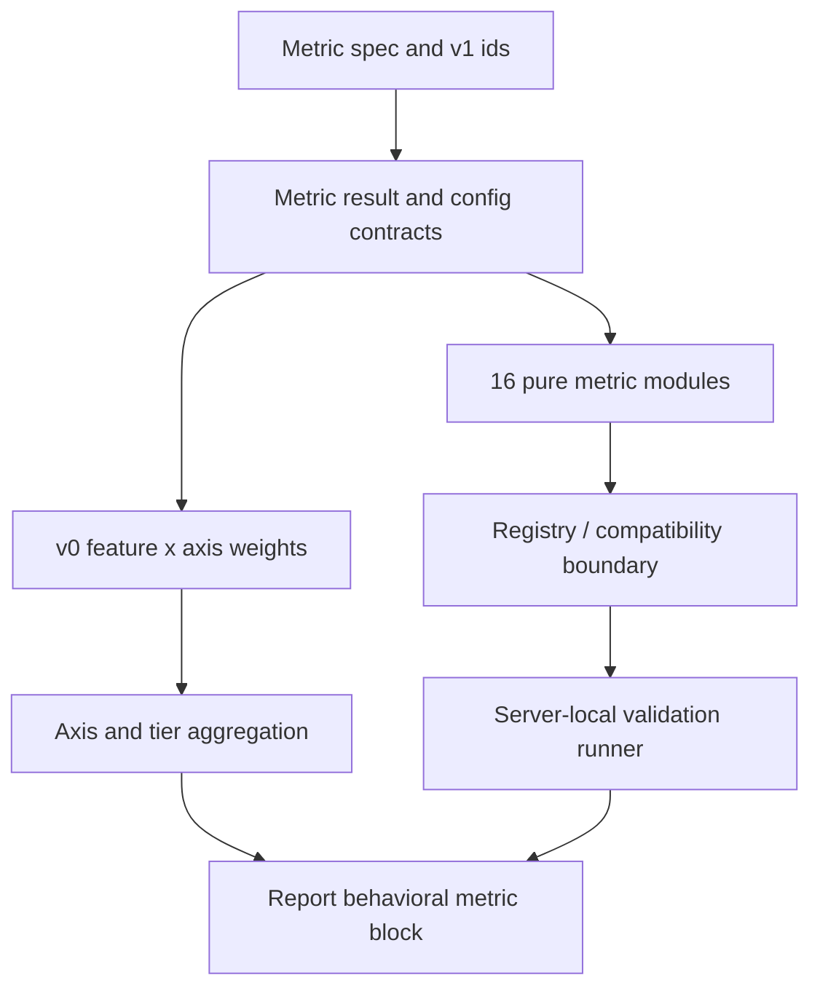
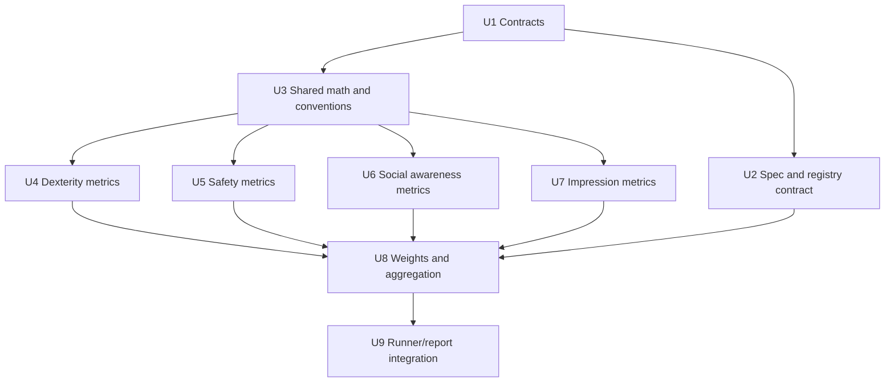

# feat: Implement the v1 social-navigation metric library

## Summary

Implement the v1 16-feature social-navigation metric library as flat, pure metric modules with shared result contracts, normalization conventions, v0 cross-axis weights, aggregation, and report/runner contract updates. The plan keeps full episode-log extraction, subjective validation collection, dashboard UI, and ML weight refitting as follow-up work so the active refactor can land a tested formula library without expanding beyond the approved spec.

---

## Problem Frame

The repository is mid-refactor: it now has server-local episodic validation, traces, a placeholder metric registry, and report scaffolding, but the implemented metric contract still reflects the older 12-feature placeholder plan. The current spec supersedes that shape with a 16-feature v1 library, one pure function per metric, and a `16 x 4` weight matrix where features can load onto multiple subjective axes.

The plan must preserve the benchmark thesis from the origin requirements: social-navigation behavior metrics are the main paper contribution, technical failures stay separate from behavioral scores, and the four Miro macro indicators remain the report structure.

---

## Requirements

- R1. Replace the placeholder 12-metric registry contract with the v1 16-feature set from `docs/specs/social-navigation-metrics.md` and the origin revision to R21-R24.
- R2. Implement each v1 feature as a pure metric module with explicit inputs, no simulator or file I/O, and a typed result carrying raw value, normalized score, confidence, and raw-input summary (origin R27).
- R3. Preserve the four report axes from the origin: Perceived Dexterity, Perceived Safety, Perceived Social Awareness, and Impression (origin R3, R19, R26).
- R4. Implement v0 fixed manual cross-axis weights with not-applicable feature omission and per-axis weight renormalization (origin R26).
- R5. Preserve the server-local episodic validation boundary: metric execution must consume completed server-owned traces or pre-extracted metric inputs, never client policy internals (origin R12, `final-rush-choices.md`).
- R6. Keep technical failures out of behavioral aggregation and expose them as reliability diagnostics beside metric outputs (origin R12, R25).
- R7. Update spec-contract and registry tests so they enforce the v1 spec names, ids, counts, confidence semantics, and pure-library layout.
- R8. Keep ML weight refitting, rater-pipeline implementation, full log extraction, dashboard UI, and multi-target scenarios outside this active implementation plan (origin R28-R30, spec Future Work).

---

## Scope Boundaries

- Do not implement the full log-extraction layer that pulls arrays from completed `EpisodeTrace` objects into every metric input. The spec explicitly calls that a later phase.
- Do not build the subjective rater UI, cohort-management workflow, instrument pilot, or validation-statistics pipeline.
- Do not train or refit ML weights in runtime code. v1 ships the manual weight prior documented in the spec.
- Do not change the client transport, WebSocket runner, or participant policy interface as part of metric formula work.
- Do not redesign the dashboard UI. Reports should expose metric blocks in a dashboard-ready shape, but rendering is separate.
- Do not expand benchmark breadth beyond the three social-navigation tiers.

### Deferred to Follow-Up Work

- Full `EpisodeTrace` extraction/preprocessing layer: separate plan after the library lands and the MuJoCo episode logs expose the required fields.
- Subjective validation pipeline: separate research/implementation plan covering rater rendering, validated subscales, cohort assignment, reliability statistics, and fitted weights.
- ML weight artifact loading beyond the v0 prior: separate follow-up once Cohort A data exists.
- Appendix mapping to SocNavBench, SEAN, Habitat SocialNav, NaviSTAR, and Francis 2023: paper/documentation follow-up, not a metric-library blocker.

---

## Context & Research

### Relevant Code and Patterns

- `src/asimovbm_server/metrics/models.py` currently defines placeholder metric result/status types and a `MetricFunction` protocol that computes from `EpisodeTrace`.
- `src/asimovbm_server/metrics/registry.py` currently exposes 12 old metric ids and returns `not_implemented` placeholders.
- `tests/server/test_metric_registry_interface.py` and `tests/server/test_metric_spec_contract.py` still assert the old 12-feature draft, so they should become v1 contract tests rather than blockers.
- `src/asimovbm_server/benchmarks/runner.py` already invokes the metric registry only for technically valid traces and records metric status counts per tier.
- `src/asimovbm_server/traces/models.py`, `src/asimovbm_server/episodes/models.py`, and `src/asimovbm_server/robots/base.py` provide the current trace, entity, cue, robot pose, velocity, action, and status data surfaces.
- `src/asimovbm_server/reports/json_report.py` already gates calibrated score output behind metric-freeze approval and keeps smoke contexts explicitly not applicable.
- `tests/server/test_validation_import_boundary.py` protects the local-validation metric path from importing `asimovbm_client`.
- `docs/specs/social-navigation-metrics.md` now contains the authoritative 16 features, formulas, thresholds, weight matrix, contribution disclaimers, validation plan, and flat file layout.
- `docs/plans/2026-05-07-002-feat-social-navigation-feature-computation-plan.md` is useful as historical context but is superseded by the v1 spec because it planned 12 features and older names.

### Institutional Learnings

- `docs/solutions/architecture-patterns/mujoco-server-g1-client-boundary-2026-05-06.md` reinforces that benchmark truth stays server-owned. Metric functions can use server-owned trace data or extracted inputs, but must not depend on participant-side state.
- `final-rush-choices.md` makes the server-local validation harness authoritative for metric validation and says metrics run only on technically valid episode traces.

### Project Context

- The pinned Notion `Paper HRI` page returned `NOT_FOUND` through the connector during planning. Workspace search surfaced older project pages, but no stronger canonical metric source than the local requirements/spec files.
- The Miro board confirmed the four macro axes and candidate metric families: dexterity, perceived safety, perceived social awareness, and impression. It also reinforces that the spider/radar output should describe human-observable behavior, not a single leaderboard score.

### External References

- No separate web research was used for this plan. The local spec and `docs/metrics_research/deep-research-report.md` already contain the literature grounding and are the source of truth for implementation.

---

## Key Technical Decisions

- **Implement the spec's flat metric layout.** The active library should follow the spec's one-file-per-metric layout rather than the older per-axis module grouping. This keeps formula modules easy to test, review, and cite back to the spec.
- **Separate pure metric formulas from trace extraction.** Metric functions should receive explicit formula inputs. Compatibility with `EpisodeTrace` belongs in a thin registry/pre-extraction boundary now and a richer extraction layer later.
- **Use the v1 ids as public contracts.** Ids should match the weight-matrix feature names exactly, including replacements such as `comfort_aware_path_efficiency`, `proxemic_intrusion_dose`, `speed_near_humans_p95`, and `behavioral_naturalness`.
- **Consolidate status and confidence semantics.** The current `MetricStatus` enum should evolve so `not_applicable`, `insufficient_evidence`, and invalid-input states are first-class, while successful metric results expose raw and normalized values.
- **Keep optional numerical dependencies deliberate.** SPARC-style metrics need FFT/numerical helpers. If NumPy becomes required for core metrics, move it out of the `g1-mujoco` extra or add an explicit metrics extra rather than relying on an incidental optional dependency.
- **Aggregate only normalized feature results.** The aggregator should consume normalized `[0, 1]` results and omit not-applicable features with per-axis weight renormalization, as specified.
- **Keep report output honest before full extraction lands.** The report can expose v1 ids, axis metadata, and aggregation output when supplied with metric results, while smoke or incomplete trace contexts remain not applicable rather than overclaiming calibrated behavior.

---

## Open Questions

### Resolved During Planning

- Should the plan update the older May 7 social-navigation plan in place? No. The current spec and origin revisions materially supersede it, so this plan creates a fresh v1 implementation artifact.
- Should ML weight training be part of this implementation? No. The spec says v1 ships fixed manual weights and refits later after Cohort A data exists.
- Should the metric library compute directly from live simulation state? No. Metrics are pure and use completed trace-derived or explicit formula inputs.

### Deferred to Implementation

- Exact internal helper names and dataclass field names: defer to implementation so they fit the surrounding refactor cleanly.
- Exact SPARC implementation backend: decide during implementation after checking whether core dependencies should include NumPy or whether a small stdlib-compatible path is feasible.
- Exact representation of precomputed comfort-aware optimal path assets: defer to the later scenario/log-extraction work unless synthetic metric fixtures need a minimal local value.
- Exact report JSON field names for future dashboard rendering: keep stable ids and semantics now, but avoid locking a full dashboard contract before the UI exists.

---

## Output Structure

```text
src/asimovbm_server/metrics/
|-- __init__.py
|-- acknowledgement_clarity.py
|-- aggregation.py
|-- behavioral_naturalness.py
|-- bystander_ack.py
|-- comfort_aware_path_efficiency.py
|-- completion_time.py
|-- conventions.py
|-- gesture_response_success.py
|-- heading_jerk.py
|-- hesitation.py
|-- human_aware_approach.py
|-- legibility.py
|-- min_human_robot_distance.py
|-- models.py
|-- proxemic_intrusion_dose.py
|-- registry.py
|-- sparc.py
|-- speed_near_humans_p95.py
|-- stability.py
|-- task_success_rate.py
`-- weights.py
```

The tree declares the intended shape from the spec. It is not a copy-paste constraint; implementation may adjust small support files if that better fits the refactor, but the metric modules should remain flat.

---

## High-Level Technical Design

> *This illustrates the intended approach and is directional guidance for review, not implementation specification. The implementing agent should treat it as context, not code to reproduce.*



The key split is that pure metric modules should not know about the runner. The registry can continue to protect current runner behavior while the later extraction layer becomes responsible for converting real traces into the narrow inputs each formula needs.

---

## Implementation Units



### U1. Metric Contracts and Confidence Semantics

**Goal:** Evolve the metric model layer from placeholder status values into the result/config contracts required by the v1 pure-function library.

**Requirements:** R1, R2, R5, R6, R7

**Dependencies:** None

**Files:**
- Modify: `src/asimovbm_server/metrics/models.py`
- Modify: `src/asimovbm_server/metrics/__init__.py`
- Test: `tests/server/test_metric_models.py`

**Approach:**
- Define stable result semantics around raw value, normalized value, confidence, reason/evidence notes, and raw-input summaries.
- Keep technically invalid traces distinct from metric-level not-applicable or insufficient-evidence outcomes.
- Preserve compatibility with existing runner summaries by making result states countable.
- Define shared ids for the four axes and 16 features in one place so registry, weights, tests, and reports cannot drift independently.

**Execution note:** Start with contract tests before changing the placeholder model semantics, because several current tests intentionally encode the old placeholder behavior.

**Patterns to follow:**
- `src/asimovbm_server/episodes/models.py` for small immutable dataclass contracts.
- `src/asimovbm_server/traces/models.py` for trace/result serialization expectations.

**Test scenarios:**
- Happy path: a successful metric result can carry raw value, normalized score, sufficient confidence, units/metadata, and raw-input summary.
- Edge case: a not-applicable result has no score, does not look like a zero, and is countable in tier summaries.
- Edge case: insufficient evidence can include a reason and does not count as scored.
- Error path: invalid raw or normalized values outside expected bounds are rejected or normalized through a single documented helper.
- Integration: existing benchmark summaries can count the new result states without importing client code.

**Verification:**
- Metric result tests prove all confidence/status states needed by the spec are representable and unambiguous.

### U2. V1 Spec Contract and Registry Surface

**Goal:** Make the registry, exported ids, and spec-contract tests reflect the 16-feature v1 spec instead of the older 12-feature placeholder contract.

**Requirements:** R1, R3, R5, R7

**Dependencies:** U1

**Files:**
- Modify: `src/asimovbm_server/metrics/registry.py`
- Modify: `tests/server/test_metric_registry_interface.py`
- Modify: `tests/server/test_metric_spec_contract.py`
- Test: `tests/server/test_metric_registry_interface.py`
- Test: `tests/server/test_metric_spec_contract.py`

**Approach:**
- Replace old ids such as `path_efficiency`, `proxemic_intrusion_time`, `robot_speed_near_humans`, and `morphology_task_fit` with the v1 ids from the spec.
- Update spec-contract parsing to expect the v1 feature names and the `4 + 3 + 4 + 5` macro counts.
- Keep `default_metric_registry()` usable by the current runner while individual formula modules land; incomplete extraction should produce honest not-applicable or insufficient-evidence states, not fake scores.
- Treat the runner-facing registry as a compatibility boundary until extraction lands: it may expose trace-adapter stubs or pre-extracted-input adapters, but it should not make formula modules parse full traces directly.
- Ensure the registry remains free of `asimovbm_client` imports.

**Execution note:** Treat this as characterization-first around the refactor boundary: update the contract tests to v1 expectations before replacing placeholder ids.

**Patterns to follow:**
- `tests/server/test_validation_import_boundary.py` for import-boundary protection.
- `tests/server/test_episode_pack_loader.py` for spec-like contract assertions over local data.

**Test scenarios:**
- Happy path: `default_metric_registry().metric_ids` exactly equals the 16 v1 ids in spec order.
- Happy path: spec contract test finds four macros and 16 sub-indicators with the expected v1 names.
- Edge case: registry and weights share the same feature-id set without extras or omissions.
- Integration: the episodic validation runner still invokes the registry only for technically valid traces.
- Error path: a technically invalid trace does not produce behavioral metric results.

**Verification:**
- Old 12-feature assertions are gone, and v1 id drift fails loudly in tests.

### U3. Shared Conventions, Normalization, and Numeric Helpers

**Goal:** Centralize threshold defaults, clipping, integration, angle, resampling, percentile, and SPARC-support helpers used by multiple feature modules.

**Requirements:** R2, R4, R7

**Dependencies:** U1

**Files:**
- Create: `src/asimovbm_server/metrics/conventions.py`
- Create or modify: `src/asimovbm_server/metrics/sparc.py`
- Modify as needed: `pyproject.toml`
- Test: `tests/server/test_metric_conventions.py`
- Test: `tests/server/test_sparc_metric.py`

**Approach:**
- Encode default constants from the spec in a single config surface that can be overridden by scenario config later.
- Provide higher-is-better and lower-is-better normalization helpers with clipping and missing-evidence behavior.
- Provide geometry and time-series helpers that remain simulator-agnostic.
- Implement SPARC support once and reuse it for translational smoothness and yaw-rate smoothness.
- Decide whether NumPy is a core dependency, a metrics extra, or an implementation detail isolated behind helpers.

**Patterns to follow:**
- `pyproject.toml` optional dependency organization.
- `src/asimovbm_server/episodes/static_obstacles.py` for small geometry helpers with focused tests.

**Test scenarios:**
- Happy path: higher-is-better and lower-is-better normalization hit 0, 1, and clipped bounds at the spec thresholds.
- Edge case: zero-duration or empty input sequences produce insufficient evidence rather than division errors.
- Edge case: variable `dt` integration computes the expected area for a simple hand-checkable trace.
- Edge case: angle wrapping handles crossings around `-pi` and `pi`.
- Happy path: percentile helper returns the p95 speed expected from a synthetic near-human speed distribution.
- Happy path: smooth synthetic motion receives a better SPARC normalized score than a deliberately jerky signal.
- Error path: non-uniform SPARC input is resampled when possible or marked insufficient with an explicit reason.

**Verification:**
- Shared helpers cover the math behaviors used by later metric units, reducing repeated ad hoc calculations.

### U4. Perceived Dexterity Feature Modules

**Goal:** Implement task success rate, completion time, comfort-aware path efficiency, and hesitation rate as pure metric modules.

**Requirements:** R1, R2, R3, R4, R5, R7

**Dependencies:** U1, U3

**Files:**
- Create: `src/asimovbm_server/metrics/task_success_rate.py`
- Create: `src/asimovbm_server/metrics/completion_time.py`
- Create: `src/asimovbm_server/metrics/comfort_aware_path_efficiency.py`
- Create: `src/asimovbm_server/metrics/hesitation.py`
- Test: `tests/server/test_dexterity_metrics.py`

**Approach:**
- Implement formulas from the v1 spec with explicit inputs and no direct runner access.
- Treat failed behavioral episodes as valid evidence for task success but not for completion-time or path-efficiency averages.
- Use the spec's approach-prefix, bystander-only comfort band, high-density guard, and fallback note for comfort-aware path efficiency.
- Implement hesitation with the yielding mask, inclusive goal-reached definition, and reversal displacement gate from the post-review spec.

**Patterns to follow:**
- `docs/specs/social-navigation-metrics.md` sections for Perceived Dexterity.
- `tests/server/test_static_obstacle_scenario.py` for concise synthetic scenario assertions.

**Test scenarios:**
- Covers origin R17. Happy path: a robot that acknowledges, reaches the target, and stops inside the configured distance band before timeout scores task success as 1.
- Happy path: successful episodes average completion time and normalize lower times as better.
- Edge case: zero successful episodes makes completion time not applicable, not zero.
- Edge case: missing comfort-respecting optimal length marks path efficiency insufficient.
- Edge case: a trajectory hugging bystanders for nearly the whole approach prefix triggers the high-density guard and scores path efficiency at the bad bound.
- Happy path: a socially correct detour outside bystander comfort bands can score better than a shorter route that intrudes.
- Edge case: post-success settling is not counted as hesitation.
- Edge case: stopping for a near-zone bystander in the forward cone is treated as yielding, not hesitation.
- Error path: a too-short episode duration produces insufficient evidence for hesitation.

**Verification:**
- All four dexterity features return spec-aligned raw and normalized results on synthetic inputs.

### U5. Perceived Safety Feature Modules

**Goal:** Implement minimum human-robot distance, proxemic intrusion dose, and speed near humans p95.

**Requirements:** R1, R2, R3, R4, R5, R7

**Dependencies:** U1, U3

**Files:**
- Create: `src/asimovbm_server/metrics/min_human_robot_distance.py`
- Create: `src/asimovbm_server/metrics/proxemic_intrusion_dose.py`
- Create: `src/asimovbm_server/metrics/speed_near_humans_p95.py`
- Test: `tests/server/test_safety_metrics.py`

**Approach:**
- Use robot and human pose/time streams as explicit inputs.
- Implement proxemic intrusion as depth-weighted dose rather than binary time in personal space.
- Compute speed near humans from the 95th percentile of near-zone speeds.
- Treat no near-human zone samples as not applicable for speed rather than a penalty.
- Preserve target-human-only fallback for proxemic dose when no bystanders are present, while distinguishing bystander-only evidence in summaries.

**Patterns to follow:**
- `docs/specs/social-navigation-metrics.md` sections for Perceived Safety.
- Miro `Calcolo di metriche` safety notes for the original metric family: distance, personal-space time, speed, and smoothness as perceived-safety signals.

**Test scenarios:**
- Happy path: a trajectory that stays outside personal space gets a high minimum-distance and zero-dose normalized score.
- Edge case: a sample at or below `d_hard` reaches the bad bound for minimum distance.
- Happy path: proxemic intrusion dose integrates depth and duration over uneven timesteps.
- Edge case: no bystanders computes dose against the target human and marks bystander-only intrusion not applicable in metadata.
- Happy path: one fast near-human pass affects p95 speed even when mean speed is low.
- Edge case: no near-human samples make speed-near-human not applicable.
- Error path: missing human pose stream invalidates or marks insufficient every safety feature that requires it.

**Verification:**
- Safety metrics distinguish absence of risk evidence from poor behavior and preserve the v1 dose/p95 replacements.

### U6. Perceived Social Awareness Feature Modules

**Goal:** Implement gesture response success, acknowledgement clarity, human-aware approach, and bystander acknowledgement.

**Requirements:** R1, R2, R3, R4, R5, R7

**Dependencies:** U1, U3

**Files:**
- Create: `src/asimovbm_server/metrics/gesture_response_success.py`
- Create: `src/asimovbm_server/metrics/acknowledgement_clarity.py`
- Create: `src/asimovbm_server/metrics/human_aware_approach.py`
- Create: `src/asimovbm_server/metrics/bystander_ack.py`
- Test: `tests/server/test_social_awareness_metrics.py`

**Approach:**
- Use structured `come_here` event inputs; do not attempt raw gesture recognition.
- Use declared forward or sensor-facing direction for acknowledgement clarity, respecting morphology-neutral behavior.
- Implement human-aware approach with progress, bystander clearance, and target-relative approach angle, including the spec's closest-approach fallback.
- Implement bystander acknowledgement from lateral deviation and slowdown, preserving the signed-distance failure case called out by the spec review.

**Patterns to follow:**
- `src/asimovbm_server/episodes/overlay.py` for structured cue emission and hidden target identity.
- `tests/server/test_episodic_validation_runner.py` for cue visibility and target identity behavior.

**Test scenarios:**
- Covers origin R10 / R14 / R16. Happy path: after a `come_here` event, motion toward the target within the response window succeeds.
- Error path: moving toward a non-target human before the target fails gesture response.
- Edge case: no `come_here` event makes gesture response not applicable.
- Happy path: facing the target cone before approach motion succeeds acknowledgement clarity.
- Edge case: missing morphology forward-axis metadata lowers confidence or makes acknowledgement insufficient without inventing a gesture.
- Happy path: front-side approach near the preferred angle scores better than frontal or rear approach.
- Edge case: empty-room tier omits bystander clearance from human-aware approach rather than penalizing it.
- Edge case: target-facing direction missing omits the angle term and records that omission.
- Required spec case: a bystander pass where the robot closes distance from first detection to closest pass produces `bystander_ack` below 0.5 even if it slows down.
- Edge case: no bystander enters the near-zone makes bystander acknowledgement not applicable.

**Verification:**
- Social-awareness metrics evaluate behavior after structured events and morphology-neutral kinematic signals, matching the benchmark scope.

### U7. Impression Feature Modules

**Goal:** Implement SPARC, heading jerk, stability, legibility, and behavioral naturalness.

**Requirements:** R1, R2, R3, R4, R5, R7

**Dependencies:** U1, U3

**Files:**
- Modify or create: `src/asimovbm_server/metrics/sparc.py`
- Create: `src/asimovbm_server/metrics/heading_jerk.py`
- Create: `src/asimovbm_server/metrics/stability.py`
- Create: `src/asimovbm_server/metrics/legibility.py`
- Create: `src/asimovbm_server/metrics/behavioral_naturalness.py`
- Test: `tests/server/test_impression_metrics.py`
- Test: `tests/server/test_sparc_metric.py`

**Approach:**
- Apply shared SPARC support to translational speed and yaw-rate signals.
- Compute stability from collision, invalid action, fall, and instability event counts, intentionally allowing collision evidence to also affect task success as specified.
- Implement legibility as the commit-time fractional-coverage proxy, not a full inverse-planning posterior.
- Implement behavioral naturalness as morphology-aware: legged sinusoid residual, wheeled lateral-velocity ratio, and not applicable for undeclared classes.
- Keep static appearance, audio, observer physiology, and panel-derived impression signals out of this runtime library.

**Patterns to follow:**
- `src/asimovbm_server/robots/base.py` for robot profile, embodiment kind, velocity, contact, and metadata surfaces.
- Miro `Calcolo di metriche - Impression` for the broader impression taxonomy, with the plan intentionally selecting only the runtime kinematic subset approved by the spec.

**Test scenarios:**
- Happy path: smooth translational motion scores better than a jerky signal under SPARC.
- Happy path: smooth yaw-rate scores better than abrupt swerves under heading jerk.
- Edge case: non-uniform or too-short signals produce insufficient evidence with reasons.
- Happy path: no instability events scores stability near 1.
- Edge case: three bad stability events reach the calibrated bad bound.
- Integration: a collision can lower stability and task success without being treated as a technical failure.
- Happy path: early target-directed commitment with high post-commit cone coverage scores high legibility.
- Edge case: necessary brief excursions after commit reduce but do not zero legibility.
- Edge case: no target goal makes legibility insufficient or not applicable.
- Happy path: regular legged joint signal with low sinusoid residual scores high naturalness.
- Happy path: wheeled body-frame motion with low lateral velocity ratio scores high naturalness.
- Edge case: undeclared morphology or missing calibration constant makes behavioral naturalness not applicable rather than failing the whole impression axis.

**Verification:**
- Impression metrics implement only observable runtime kinematic behavior and preserve the spec's morphology-aware boundary.

### U8. V0 Weight Matrix and Axis Aggregation

**Goal:** Implement v0 manual cross-axis weights and aggregation over normalized feature results.

**Requirements:** R3, R4, R6, R7

**Dependencies:** U1, U2, U4, U5, U6, U7

**Files:**
- Create: `src/asimovbm_server/metrics/weights.py`
- Create: `src/asimovbm_server/metrics/aggregation.py`
- Test: `tests/server/test_metric_weights.py`
- Test: `tests/server/test_metric_aggregation.py`

**Approach:**
- Encode the `16 x 4` v0 evidence-score matrix and per-axis column sums from the spec.
- Convert evidence scores to normalized weights per axis.
- Aggregate only scored normalized results, omitting not-applicable features and renormalizing remaining weights per axis.
- Keep insufficient or invalid feature results visible in axis confidence and evidence summaries.
- Provide tier-level and benchmark-level aggregation primitives without tying them to a dashboard schema.

**Patterns to follow:**
- `docs/specs/social-navigation-metrics.md` Weight Matrix v0 and Sign Rationale.
- `src/asimovbm_server/benchmarks/models.py` for final axis placeholders and tier summaries.

**Test scenarios:**
- Happy path: every feature id in the weight matrix exists in the registry and every registry id has a weight row.
- Happy path: per-axis weights sum to 1 after converting evidence scores.
- Happy path: an all-scored feature set produces four axis scores in `[0, 1]`.
- Edge case: not-applicable features are omitted and remaining weights are renormalized.
- Edge case: an axis with no scored features returns not applicable and includes evidence explaining why.
- Edge case: low-evidence sign-flip candidate cells are represented as normal positive v0 priors, not special runtime behavior.
- Error path: duplicate, missing, or unknown feature ids in weights fail contract tests.

**Verification:**
- Aggregation aligns with the spec's matrix and does not confuse missing evidence with low scores.

### U9. Runner, Report, and Contract Integration

**Goal:** Wire the v1 library into the current validation/report surfaces without pretending the later extraction layer is complete.

**Requirements:** R3, R5, R6, R7, R8

**Dependencies:** U1, U2, U8

**Files:**
- Modify: `src/asimovbm_server/benchmarks/models.py`
- Modify: `src/asimovbm_server/benchmarks/runner.py`
- Modify: `src/asimovbm_server/reports/json_report.py`
- Modify: `tests/server/test_episodic_validation_runner.py`
- Modify: `tests/server/test_metric_registry_interface.py`
- Modify: `tests/server/test_metric_spec_contract.py`
- Test: `tests/server/test_metric_report_contract.py`
- Test: `tests/server/test_json_report.py`

**Approach:**
- Preserve the current rule that metrics run only on technically valid traces.
- Let runner/report surfaces accept aggregated metric results when available, while allowing the current local-validation path to keep returning evidence-limited metric states until the extraction plan lands.
- Keep runner-level `final_axes` compatible with the four-axis shape while using real aggregation only when metric results are supplied.
- Ensure smoke/placeholder contexts continue to report behavioral metrics as not applicable.
- Add a report contract for v1 metric blocks that can include axes, feature breakdowns, confidence, contributing features, spec reference, and reliability diagnostics.
- Keep route authorization and report references unchanged.

**Patterns to follow:**
- `src/asimovbm_server/reports/json_report.py` for metric-freeze and smoke-not-applicable behavior.
- `tests/server/test_report_routes.py` for report authorization boundaries.
- `tests/server/test_metric_spec_contract.py` for calibrated-score gating.

**Test scenarios:**
- Happy path: supplied v1 metric results serialize into four axes and 16 feature breakdown entries.
- Happy path: axis score output includes model/weight metadata and confidence state.
- Edge case: smoke report remains `not_applicable_smoke_context` and contains no fake calibrated score.
- Edge case: metric-freeze gating still refuses calibrated score mode when approval is false.
- Integration: local-validation runner still records metric status counts per tier and final axis keys.
- Integration: technical failures remain in reliability diagnostics, not behavioral scores.
- Security boundary: report retrieval authorization tests remain unchanged.

**Verification:**
- The library can be consumed by current reporting surfaces without changing the participant/client boundary or overstating metric readiness.

---

## System-Wide Impact

- **Interaction graph:** `src/asimovbm_server/metrics/` becomes the formula and aggregation core; `src/asimovbm_server/benchmarks/runner.py` remains the server-local invocation point; `src/asimovbm_server/reports/json_report.py` remains the serialization boundary.
- **Error propagation:** metric-level insufficient evidence and not-applicable states should flow into aggregation confidence and report evidence, while technical invalidity still prevents metric execution.
- **State lifecycle risks:** partial metric availability is expected during the refactor. Registry/report behavior must avoid silently mixing old ids and new ids.
- **API surface parity:** local-validation result JSON and report JSON should both expose the same four axis ids and v1 feature ids when behavioral metrics are present.
- **Integration coverage:** unit tests prove formulas; integration/report tests prove that invalid traces, smoke contexts, and technical failures do not become behavioral scores.
- **Unchanged invariants:** client transport and participant policies remain outside metric truth; route auth and report refs remain unchanged; the benchmark still favors four-axis behavioral reporting over a single leaderboard score.

---

## Alternative Approaches Considered

- **Update the older 12-feature plan in place:** Rejected because the v1 spec changes feature count, ids, layout, and aggregation assumptions. A fresh plan is safer and clearer during the refactor.
- **Implement grouped per-axis modules:** Rejected because the spec's post-review implementation simplification intentionally chose a flat one-file-per-metric structure.
- **Implement trace extraction together with formulas:** Rejected for this plan because the spec assigns extraction to a later phase, and extraction depends on MuJoCo scenario log fields still owned by parallel scenario work.
- **Keep equal-weight-only aggregation:** Rejected because the v1 spec requires the manual `16 x 4` evidence-score matrix as the v0 prior, with cross-axis feature loadings.

---

## Success Metrics

- The registry exposes exactly 16 v1 feature ids and four axis ids.
- Each feature module has synthetic tests covering its core formula and at least one missing-evidence or not-applicable case.
- Aggregation tests prove the weight matrix, not-applicable omission, and per-axis renormalization.
- Report tests prove smoke contexts and technical failures do not produce fake behavioral scores.
- The local-validation runner continues to execute without importing client transport.

---

## Dependencies / Prerequisites

- The current active spec in `docs/specs/social-navigation-metrics.md` must remain the source of truth for formulas and ids.
- If SPARC uses NumPy, dependency placement must be decided before landing core metric modules.
- Full trace extraction depends on scenario/log work emitting fields listed in the spec's skipped telemetry section, including target facing direction, bystander pose stream, uniform yaw/heading telemetry, and periodic-joint declarations.

---

## Risk Analysis & Mitigation

| Risk | Likelihood | Impact | Mitigation |
|------|------------|--------|------------|
| Old 12-feature ids survive in tests or registry | High | High | Make v1 id parity a contract test in U2 and U8. |
| Formula modules drift from the spec | Medium | High | Keep one module per metric and test formula-specific edge cases called out in the spec review notes. |
| Missing evidence becomes a zero score | Medium | High | First-class not-applicable and insufficient-evidence states in U1, then aggregation omission tests in U8. |
| SPARC implementation becomes fragile or dependency-ambiguous | Medium | Medium | Isolate SPARC helpers in U3 and make dependency placement explicit. |
| Report output overclaims readiness before extraction exists | Medium | High | Preserve smoke/not-applicable behavior and gate calibrated report mode in U9. |
| Metric code accidentally depends on participant/client state | Low | High | Keep import-boundary tests and server-owned-truth guidance from `docs/solutions/`. |

---

## Phased Delivery

### Phase 1: Contract Reset

Land U1 and U2 so the refactor stops carrying old ids and placeholder semantics.

### Phase 2: Formula Library

Land U3 through U7, preferably in axis-sized commits so review can compare each formula group to the spec.

### Phase 3: Aggregation and Surfaces

Land U8 and U9 so the pure metric outputs can feed axis summaries and reports without claiming the later extraction layer is complete.

---

## Documentation / Operational Notes

- Update `final-rush-choices.md` only if implementation changes the canonical metric invocation boundary or launcher assumptions.
- Keep `docs/specs/social-navigation-metrics.md` formulas authoritative; implementation should not silently reinterpret thresholds or ids.
- Add brief doc notes only if dependency placement changes, especially if NumPy becomes a core or metrics-extra dependency.
- Do not remove the older May 7 plan; it remains useful historical context but this plan should be treated as the active v1 implementation artifact.

---

## Sources & References

- **Origin document:** `docs/brainstorms/2026-04-29-black-box-robotic-policy-benchmark-requirements.md`
- **Metric spec:** `docs/specs/social-navigation-metrics.md`
- **Research evidence set:** `docs/metrics_research/deep-research-report.md`
- **Final rush decisions:** `final-rush-choices.md`
- **Prior metric plan superseded by v1:** `docs/plans/2026-05-07-002-feat-social-navigation-feature-computation-plan.md`
- **Episodic validation plan:** `docs/plans/2026-05-07-005-feat-episodic-metrics-validation-loop-plan.md`
- **Server-owned truth pattern:** `docs/solutions/architecture-patterns/mujoco-server-g1-client-boundary-2026-05-06.md`
- **Current metric code:** `src/asimovbm_server/metrics/models.py`, `src/asimovbm_server/metrics/registry.py`
- **Current runner/report surfaces:** `src/asimovbm_server/benchmarks/runner.py`, `src/asimovbm_server/reports/json_report.py`
- **Miro board:** `https://miro.com/app/board/uXjVGnAIe3Q=/`
