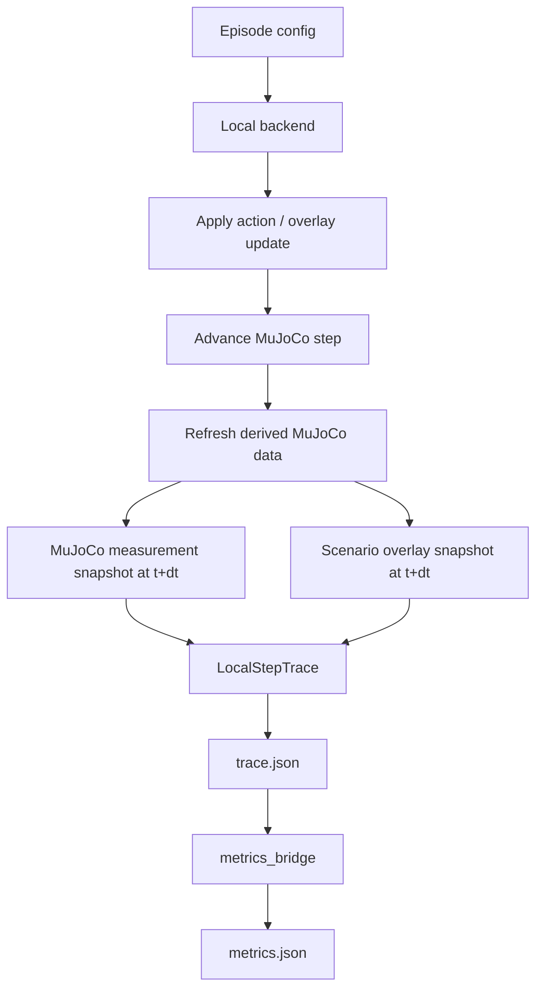

# feat: Add MuJoCo-Grounded Measurement Extraction

## Summary

Add a measurement extraction layer that reads simulation state from MuJoCo and
scenario overlays at a consistent post-step boundary, enriches the local
`trace.json` artifacts with metric-ready telemetry, and validates the extracted
values with deterministic sanity tests before the metrics bridge consumes them.

---

## Problem Frame

The local runner currently produces metric inputs from a portable 2D reference
loop. That is useful for smoke validation, but it is not enough for paper-grade
measurement extraction: pose, velocity, contacts, articulated state, dynamic
human state, and optional sensor streams must be gathered from the simulation
state in the correct frame, at the correct time, and with clear provenance.

---

## Assumptions

*This plan was authored without synchronous user confirmation. The items below
are agent inferences that fill gaps in the input and should be reviewed before
implementation proceeds.*

- Keep the six checked-in `g1_slam/config/episodes/*.json` episodes as the only
  active episode catalog for this implementation.
- Preserve the current pure-function metric library; this work changes trace
  extraction and metric input wiring, not metric formulas.
- Keep MuJoCo, ONNX, NumPy, official robot assets, and RoboJuDo as optional
  runtime dependencies. Default unit tests must prove extractor logic with
  deterministic fake model/data objects. Real minimal MuJoCo tests are optional
  in the default environment but required before claiming paper-grade MuJoCo
  measurement proof.
- Use scenario overlay state as the authoritative source for entities that are
  scripted outside articulated robot dynamics, while recording whether a field
  came from MuJoCo state, MuJoCo contacts/sensors, or deterministic overlay
  state.

---

## Requirements

- R1. Extract robot pose, velocity, action, articulated `qpos`/`qvel`, contacts,
  entity state, lidar/sensor data, social cues, and status into `trace.json`
  with explicit units, frames, and source metadata.
- R2. Read MuJoCo state at a consistent measurement boundary: after control is
  applied and the step has advanced, recompute derived fields needed for
  measurement before reading Cartesian positions, contacts, sensors, or geoms.
- R3. Use MuJoCo joint/body metadata rather than hard-coded array offsets when
  locating free-joint pose, free-joint velocity, body/world poses, geoms,
  contacts, actuators, and sensors.
- R4. Preserve the public-observation boundary: metric thresholds, hidden target
  identity, future cue schedules, and other evaluator-only labels must not
  appear in `public_observation`.
- R5. Feed human-aware metrics from enriched traces whenever deterministic NPC
  or human entity streams exist; keep metrics `not_applicable` only when the
  required stream is genuinely absent.
- R6. Validate measurements with sanity tests that catch stale `mjData` reads,
  wrong coordinate frames, inconsistent timestamps, incorrect role mapping, and
  trace/metric mismatches.
- R7. Record measurement-proof level separately from backend identity, using
  `unavailable` plus at least `reference`, `fake_model_data`, `minimal_mujoco`, and
  `asset_mujoco` so reviewers can distinguish smoke traces from MuJoCo-backed
  measurement evidence.
- R8. Build `public_observation` from an allowlisted public DTO instead of
  reusing enriched trace dictionaries, so evaluator-only provenance, hidden
  roles, metric thresholds, and future cue data cannot leak.

---

## Scope Boundaries

- Do not change metric formulas or aggregation weights.
- Do not replace the six canonical episode configs.
- Do not require official G1/Go2 assets, RoboJuDo, ONNX policy files, or a local
  MuJoCo install for the default unit test suite.
- Do not introduce raw image gesture recognition. Structured scenario events
  remain the source for social-cue metrics.
- Do not publish hidden/evaluator-only data into the policy-facing public
  observation object.
- Do not build full RoboJuDo or official Unitree asset trace execution in the
  P0 slice. That remains release-smoke/follow-up work after minimal MuJoCo
  measurement semantics are proven.
- Do not change dynamic-obstacle generation semantics. P0 may add read-only role
  mapping around existing deterministic NPC overlays, but should not rewrite NPC
  patrol logic or create new physical human bodies.

### Deferred to Follow-Up Work

- Full physical human body simulation: this plan supports MuJoCo body reads
  when present, but deterministic NPC overlays remain acceptable for the current
  episodes.
- Pilot-calibrated thresholds and subjective-rater refits: metric calibration
  remains outside this extraction pass.
- Full backend selection for official G1/Go2 MuJoCo or RoboJuDo traces: P0
  proves extraction semantics through fake fixtures, reference traces, overlay
  NPCs, and optional minimal MuJoCo scenes; asset-backed traces can be added
  after that.
- Cue/facing-heavy social-awareness metrics and qpos-derived naturalness:
  compute only when the six current episodes expose the required streams;
  otherwise leave them as explicit follow-up work instead of broadening this
  pass.

---

## Phased Delivery

### P0: Measurement Semantics And Local Evidence

- Extend trace schema and manifest metadata with source, frame, timestamp, and
  measurement-proof information.
- Add MuJoCo measurement helper functions behind optional imports, with
  deterministic fake model/data tests as the default proof path.
- Fix/reference-align the local trace timebase so robot state and overlay
  entities are sampled at one post-step timestamp.
- Map existing deterministic NPC overlays into human/bystander entity streams
  without changing patrol behavior or adding new physical bodies.
- Compute only the human-safety metrics unlocked by those streams:
  `min_human_robot_distance`, `proxemic_intrusion_dose`, and
  `speed_near_humans_p95`.
- Validate traces before metrics run, including public-observation leakage
  checks and measurement-proof metadata.

### P1: Asset-Backed MuJoCo Execution

- Add full trace execution for official G1/Go2 assets and RoboJuDo once P0
  measurement semantics are proven.
- Enable optional minimal-MuJoCo and asset-MuJoCo integration checks in
  environments with the required dependencies and assets.
- Compute cue/facing-heavy social and naturalness metrics only after the
  necessary streams are exposed by the six episodes.

---

## Context & Research

### Relevant Code and Patterns

- `src/asimovbm/local_runner/runner.py` already owns the sequential
  iteration/episode loop and writes one `trace.json` plus one `metrics.json` per
  episode iteration.
- `src/asimovbm/local_runner/backends.py` is the current backend boundary. It
  emits `LocalEpisodeTrace` objects, so MuJoCo-grounded extraction should live
  behind this same interface rather than inside metric functions.
- `src/asimovbm/local_runner/traces.py` already has the trace spine:
  time, pose, velocity, action, entities, collisions, social cues, `qpos`,
  `qvel`, status, and metadata.
- `src/asimovbm/local_runner/metrics_bridge.py` is the extraction-to-metric
  boundary. It currently computes core robot trajectory metrics and marks
  missing human/social fields as `not_applicable`.
- `g1_slam/src/g1_slam/mujoco_runner.py` creates `MjModel`/`MjData`, sets the
  free joint, updates dynamic mocap obstacles, steps or forwards the model, and
  contains helpers for free-joint pose addressing.
- `g1_slam/src/g1_slam/robojudo_backend.py` exposes a RoboJuDo pipeline with
  `env.model`, `env.data`, `base_pos`, `base_quat`, and dynamic obstacle
  updates. It should use the same measurement conventions where available.
- `g1_slam/src/g1_slam/dynamic_obstacles.py` names NPCs as `person_npc_N` and
  differentiates `mode="npc"` from cylinder obstacles. This mode must map into
  trace entities as human/bystander participants, not generic obstacles.

### Institutional Learnings

- `final-rush-choices.md` defines the local validation harness as the source of
  truth, requires metric computation only for technically valid traces, and
  lists the minimum trace sample: time, pose, velocity, action, entity state,
  collisions, social cues, public observations, distance to goal/target, and
  status.
- `docs/specs/social-navigation-metrics.md` keeps metric functions pure and
  assigns log extraction to a separate layer. This plan preserves that boundary.

### External References

- MuJoCo Simulation docs: `mj_step` calls `mj_forward` and then integrates; the
  plan therefore treats post-integration measurement as requiring an explicit
  derived-field refresh before reading Cartesian/contact/sensor fields.
  <https://mujoco.readthedocs.io/en/3.4.0/programming/simulation.html>
- MuJoCo API Types docs: `mjData` contains `qpos`, `qvel`, `ctrl`, `ncon`,
  `sensordata`, `xpos`, `xquat`, `geom_xpos`, `contact`, and related fields
  used by the measurement extractor.
  <https://mujoco.readthedocs.io/en/3.2.3/APIreference/APItypes.html>
- MuJoCo Overview/XML docs: free-joint position is global position plus global
  quaternion in `qpos`; free-joint velocity is linear velocity plus local-frame
  angular velocity in `qvel`.
  <https://mujoco.readthedocs.io/en/3.1.2/overview.html>

---

## Key Technical Decisions

- Add a dedicated measurement module, not ad hoc reads in the runner: this keeps
  MuJoCo frame/time semantics centralized and reviewable.
- Treat `qpos`/`qvel` as raw generalized state, and separately record derived
  world-frame pose/velocity fields used by metrics. Raw state is useful for
  replay/debugging, but metric formulas should consume semantically named,
  unit-annotated fields.
- After any `mj_step` call used for trace collection, refresh derived data
  before reading `xpos`, `xquat`, `geom_xpos`, contacts, or sensors. This
  avoids mixing next-step `qpos`/`qvel` with previous-stage derived values.
- Use one authoritative measurement timestamp per step. For a step that starts
  at `t` and advances by `dt`, both MuJoCo-derived state and deterministic
  overlay entities must be sampled at the same post-step timestamp (`t + dt` or
  `data.time` after integration), never robot at `t + dt` and entities at `t`.
- Resolve IDs through MuJoCo names and addresses (`mj_name2id`, joint
  `qpos`/`qvel` addresses, body IDs, geom IDs, sensor addresses). Hard-coded
  offsets are allowed only in tests that construct explicit fake models.
- Compute metric yaw/yaw-rate from world-frame orientation changes or an
  explicitly transformed angular velocity. Do not feed local-frame free-joint
  angular velocity directly into yaw-rate metrics without a documented
  conversion.
- Separate policy-facing observations from evaluator trace metadata. A trace may
  contain metric-only labels and provenance; `public_observation` must remain
  limited to observable state.
- Make role mapping explicit: NPC dynamic obstacles become human/bystander
  entities with pose, velocity, radius, facing direction, and source metadata;
  blue cylinders and static boxes remain obstacles.
- Maintain a per-episode role inventory that separates evaluator roles
  (`target`, `bystander`, `obstacle`) from public reveal state. Target identity
  can enter `public_observation` only after an explicit cue/reveal event.
- Attach per-metric evidence compatibility metadata: required source type,
  frame convention, radius/body proxy semantics, sample-rate bounds, and whether
  overlay-derived evidence is provisional or MuJoCo-backed.
- Validate numeric sense before metric sense: first prove the trace has aligned
  monotonic time, consistent finite-difference motion, valid quaternion/yaw
  conversion, coherent contact mapping, and expected entity distances; then
  assert metric status/value behavior.

---

## Open Questions

### Resolved During Planning

- Should metric extraction be implemented inside metric functions? No. The
  existing spec and code keep metric functions pure; trace extraction belongs in
  local runner glue.
- Should default tests require official robot assets or MuJoCo? No. Default
  tests use deterministic fake model/data objects. Minimal MuJoCo scenes are
  optional integration tests, and asset-backed checks are skipped when official
  assets are unavailable.
- Are moving NPCs humans for metric purposes? Yes, when `mode == "npc"` they
  should be represented as human/bystander entities in the trace. Moving blue
  cylinders remain obstacles.
- Should measurement source selection be explicit? Yes. Add a runner config
  field and CLI selector for `reference` versus `mujoco`, while keeping
  `reference` as the default until asset-backed MuJoCo traces are proven.

### Deferred to Implementation

- Exact final class/function names for extractor internals: these can follow
  the implementation shape once the module is opened.
- Exact optional-test markers and environment variables: choose during test
  implementation based on current pytest conventions.

---

## Core P0 Output Structure

```text
src/asimovbm/local_runner/
  mujoco_measurements.py       # new MuJoCo/overlay snapshot extraction helpers
  backends.py                  # reference trace timing/entity/proof wiring
  cli.py                       # measurement-backend selector for explicit runs
  traces.py                    # enriched trace dataclasses and provenance fields
  metrics_bridge.py            # metric input extraction from enriched traces

tests/local_runner/
  test_mujoco_measurements.py  # new unit tests for state extraction semantics
  test_trace_builder.py        # extended trace sanity assertions
  test_metric_extraction.py    # enriched human/entity metric bridge assertions
```

---

## High-Level Technical Design

> *This illustrates the intended approach and is directional guidance for
> review, not implementation specification. The implementing agent should treat
> it as context, not code to reproduce.*



Measurement snapshots should distinguish:

- raw generalized state: `qpos`, `qvel`, `ctrl`
- robot semantic state: world pose, yaw, world linear velocity, yaw rate,
  morphology, base/body IDs, frame conventions
- entity semantic state: id, type, role, pose, velocity, radius, facing,
  physical source, visibility/source metadata
- interaction state: contacts, collision participants, social cues, public
  observation, terminal status

The measurement timestamp is authoritative. If MuJoCo is active, use `data.time`
after the step/refresh. If the portable reference loop is active, use
`time_s + dt_s`. Deterministic overlay entities must be sampled at that same
timestamp.

---

## Implementation Units

### U1. Define Measurement Snapshot Schema

**Goal:** Extend the local trace model so each step can hold MuJoCo-grounded
measurements with clear units, frames, roles, and provenance.

**Requirements:** R1, R4

**Dependencies:** None

**Files:**
- Modify: `src/asimovbm/local_runner/traces.py`
- Modify: `src/asimovbm/local_runner/backends.py`
- Test: `tests/local_runner/test_artifact_manifest.py`
- Test: `tests/local_runner/test_trace_builder.py`

**Approach:**
- Add structured fields or metadata blocks for measurement source, frame
  conventions, robot semantic state, entity semantic state, contacts, and
  sensor provenance.
- Keep existing top-level fields backward-compatible where the metrics bridge
  already reads them.
- Keep all values JSON-serializable: convert MuJoCo/NumPy arrays to plain
  tuples/lists and scalar floats/ints before storing.

**Patterns to follow:**
- `LocalStepTrace.to_dict()` currently uses dataclass serialization.
- `LocalRunRecord.to_manifest_entry()` keeps artifact paths stable; do not move
  trace files.

**Test scenarios:**
- Happy path: a synthetic step with robot state, entities, contacts, `qpos`, and
  `qvel` serializes to JSON and can be read back with the same numeric values.
- Edge case: absent optional sensor fields serialize as empty collections rather
  than nulls that break existing metric extraction.
- Integration: `run_local_validation` still writes the same manifest record path
  format after the schema is enriched.

**Verification:**
- Existing local runner tests keep passing.
- Trace JSON contains explicit measurement provenance while preserving current
  `robot_pose`, `robot_velocity`, `action`, and `distance_to_goal` fields.

---

### U2. Implement MuJoCo Measurement Extraction Helpers (P0)

**Goal:** Centralize correct reads from `MjModel`/`MjData` into a reviewable
module that follows official MuJoCo state, free-joint, contact, and sensor
semantics.

**Requirements:** R1, R2, R3, R6, R7

**Dependencies:** U1

**Files:**
- Create: `src/asimovbm/local_runner/mujoco_measurements.py`
- Test: `tests/local_runner/test_mujoco_measurements.py`

**Approach:**
- Keep MuJoCo and NumPy imports lazy or injected. Importing `asimovbm` and
  `asimovbm.local_runner` must keep working in environments without optional
  simulation packages.
- Provide helpers for body/joint/sensor lookup by name and MuJoCo ID/address.
- Provide `refresh_measurement_data(mujoco, model, data)` as the post-step
  measurement boundary. This seam should call the official MuJoCo refresh
  function used by the implementation and is directly fakeable in tests.
- Read free-joint `qpos`/`qvel` using the joint address, converting orientation
  to yaw and documenting that linear velocity is global while angular velocity
  for a free joint is local-frame.
- Prefer MuJoCo `data.qpos`/`data.xquat` when an adapter exposes `model` and
  `data`. If a wrapper exposes only `base_pos`/`base_quat`, require an explicit
  quaternion convention flag before deriving yaw.
- Derive metric yaw-rate from successive world-frame orientations, or from an
  angular velocity that has been transformed into the world frame. Raw
  free-joint angular `qvel` must not be passed to metric yaw-rate fields as if
  it were a world-frame z rate.
- Read body/world pose from `xpos`/`xquat` only after the refresh boundary.
- Read contacts from `data.ncon` and `data.contact`, mapping geom IDs back to
  stable names and entity/robot roles.
- Read sensors from `data.sensordata` only when sensors are declared, using
  `model.sensor_adr`/sensor metadata to avoid slicing errors.
- Record `data.time` as the authoritative MuJoCo timestamp for MuJoCo-backed
  traces.
- Record `measurement_proof_level="fake_model_data"` for fake fixtures,
  `minimal_mujoco` for optional minimal MJCF integration tests, and
  `asset_mujoco` only for runs against official assets.

**Execution note:** Start with characterization tests around a fake model/data
fixture. Add optional minimal MuJoCo scenes behind `pytest.importorskip("mujoco")`
or an equivalent marker, because stale-state and frame mistakes are easy to
introduce silently.

**Patterns to follow:**
- Free-joint helper style in `g1_slam/src/g1_slam/mujoco_runner.py`.
- Optional import behavior in `tests/test_package_imports.py`.

**Test scenarios:**
- Happy path: a fake model/data fixture with named body, geom, joint, and sensor
  addresses extracts expected `qpos`, `qvel`, world pose, contact participants,
  and sensor values.
- Edge case: a model without a free joint falls back to named body pose and
  marks generalized-state fields as unavailable rather than crashing.
- Edge case: missing sensor declarations produce an empty sensor block with
  source metadata, not a mis-sized slice.
- Edge case: a fake data object updates `xpos`/`xquat`/contacts only when
  `refresh_measurement_data` is invoked, so tests fail if extraction reads
  derived fields before refresh.
- Edge case: a tilted-base fixture catches incorrect yaw-rate extraction from
  local-frame angular `qvel`.
- Edge case: MuJoCo `w,x,y,z` free-joint quaternions and any wrapper fallback
  convention both produce the expected yaw in explicit tests.
- Error path: an unknown required robot body name produces a clear technical
  failure reason.
- Integration: when MuJoCo is installed, a minimal MJCF with a free body is
  stepped, refreshed, and extracted; finite-difference pose changes agree with
  reported velocity within a small tolerance.
- Integration: a minimal contact scene produces at least one contact whose geom
  names are mapped into collision trace entries.

**Verification:**
- Tests fail if extraction reads derived Cartesian data before the refresh
  boundary.
- Tests fail if qpos quaternion ordering, free-joint address lookup, or contact
  geom mapping is wrong.
- Package import tests confirm no optional MuJoCo dependency is required for
  normal local-runner imports.

---

### U3. Define Measurement Backend Selection And Trace Contract (P0 Seam, P1 Asset Execution)

**Goal:** Make measurement source selection explicit and define the trace
contract that future MuJoCo execution must satisfy, while retaining the
portable reference path for dependency-light validation.

**Requirements:** R1, R2, R3, R6, R7

**Dependencies:** U1, U2

**Files:**
- Modify: `src/asimovbm/local_runner/backends.py`
- Modify: `src/asimovbm/local_runner/cli.py`
- Modify: `src/asimovbm/local_runner/runner.py`
- Test: `tests/local_runner/test_trace_builder.py`
- Test: `tests/local_runner/test_cli_modes.py`

**Approach:**
- Add `LocalRunConfig.measurement_backend` and a CLI selector such as
  `--measurement-backend reference|mujoco`. Default to `reference` until
  asset-backed trace execution is proven.
- Define the MuJoCo trace contract as a `LocalTraceBackend.run_episode()` or
  `iter_mujoco_steps()` path that yields one post-step measurement snapshot per
  recorded step and ultimately returns `LocalEpisodeTrace`.
- Keep proof/visualization paths separate from trace production. A visual run
  may help a reviewer inspect behavior, but it must not be the only path that
  advances the simulation for measurement.
- Use `model.opt.timestep`/`data.time` for MuJoCo traces, not the reference
  backend's hard-coded time step.
- Keep technical failures explicit when MuJoCo, official robot assets, RoboJuDo,
  or ONNX policy files are unavailable. Selecting `mujoco` without the required
  runtime must produce an explicit technical failure or skipped optional path,
  not a behavioral score from incomplete measurements.
- Preserve current default behavior until the MuJoCo trace path is proven:
  reference traces continue to work in environments without optional assets.
- Keep official G1/Go2 and RoboJuDo trace execution out of P0 unless all
  optional dependencies and assets are available locally. P0 defines the
  contract and metadata; P1 implements full asset execution.

**Patterns to follow:**
- `LocalRunConfig` and `LocalTraceBackend` already separate runner orchestration
  from backend implementation.
- `_maybe_run_real_viewer` currently records viewer proof metadata; the
  measurement backend should record measurement proof metadata separately.

**Test scenarios:**
- Happy path: a fake MuJoCo trace backend returns step traces with MuJoCo source
  metadata and runner artifacts are written unchanged.
- Error path: missing MuJoCo dependency yields a technical failure or explicit
  skipped optional path, not a behavioral score.
- Edge case: the CLI defaults to `reference`, accepts `mujoco`, and rejects
  unknown measurement selectors with a clear parser error.
- Edge case: `--iterations 2 --headless` runs the same selected episode twice
  and produces two independent trace files with monotonically increasing times
  within each iteration.
- Integration: visible mode can request a viewer without changing the trace
  measurement source or corrupting recorded timestamps.

**Verification:**
- The local runner can produce portable traces without MuJoCo and MuJoCo-grounded
  traces when optional dependencies are present.
- Manifest metadata distinguishes canonical backend selector, execution backend,
  viewer proof, and measurement proof.

---

### U4. Extract Scenario Entity And Social Streams Correctly (P0)

**Goal:** Convert deterministic episode overlays and MuJoCo bodies into
metric-ready entity streams with human/target/bystander roles, velocities,
radii, facing directions, and cue events.

**Requirements:** R1, R4, R5, R6

**Dependencies:** U1, U2, U3

**Files:**
- Modify: `src/asimovbm/local_runner/backends.py`
- Modify: `src/asimovbm/local_runner/mujoco_measurements.py`
- Modify: `src/asimovbm/local_runner/catalog.py`
- Create: `src/asimovbm/local_runner/public_observation.py`
- Test: `tests/local_runner/test_catalog.py`
- Test: `tests/local_runner/test_trace_builder.py`
- Test: `tests/local_runner/test_metric_extraction.py`

**Approach:**
- Add an explicit per-episode role inventory for all six checked-in episodes.
  The inventory should separate evaluator roles from what is currently revealed
  to a policy.
- Map `DynamicObstacle.mode == "npc"` to trace entities with `type="human"` and
  role `bystander` unless an episode explicitly marks a target.
- Preserve blue cylinders and static rectangles as obstacles.
- Compute entity velocity from deterministic script derivatives or aligned
  finite differences, and record which method was used.
- Include facing/yaw for entities with known patrol direction, using the same
  authoritative measurement timestamp as robot pose extraction.
- For existing overlays, read deterministic NPC state at `t + dt` in the
  reference path. For MuJoCo-backed entities, read passive body/geom state when
  present; do not introduce new body-generation semantics in P0.
- Represent social cues as structured trace events. If the current six episodes
  do not emit gesture/acknowledgement cues, keep those metrics
  `not_applicable` with an explicit reason rather than faking cues.
- Build `public_observation` from an allowlisted DTO that includes only
  information visible to a local policy at that step. Evaluator role labels,
  measurement provenance, metric thresholds, and future cue schedules remain in
  trace metadata only.

**Patterns to follow:**
- `make_default_dynamic_obstacles` already returns deterministic NPC scripts.
- `final-rush-choices.md` defines the observation boundary and minimum trace
  sample.

**Test scenarios:**
- Happy path: all six episode configs produce the expected target/bystander/
  obstacle role inventory.
- Happy path: NPC scripts appear in trace entities as humans/bystanders with
  pose, velocity, radius, yaw/facing, and source metadata.
- Edge case: blue cylinders remain obstacles and do not activate human-distance
  metrics.
- Edge case: a fast-moving NPC fixture detects whether entities were sampled at
  `t` while robot pose was sampled at `t + dt`; the implementation must align
  them.
- Edge case: no social cue stream keeps acknowledgement/gesture metrics
  `not_applicable` with an explanatory reason.
- Error path: mismatched entity/time stream lengths produce
  `insufficient_evidence` or a technical validation failure, not an incorrect
  numeric score.
- Integration: recursive public-observation tests reject hidden/evaluator labels,
  source/provenance metadata, metric thresholds, and unrevealed target identity
  while `trace.json` keeps metric-needed roles and sources.

**Verification:**
- Human-distance metrics can compute from NPC traces when humans exist.
- Observation-boundary tests prevent metric-only fields from leaking into the
  policy-facing observation object.

---

### U5. Wire P0 Safety Metrics From Enriched Traces

**Goal:** Update the metric bridge so it computes human-safety metrics supported
by the current trace evidence and reports honest status for unsupported inputs.

**Requirements:** R5, R6, R7

**Dependencies:** U1, U4

**Files:**
- Modify: `src/asimovbm/local_runner/metrics_bridge.py`
- Test: `tests/local_runner/test_metric_extraction.py`
- Test: `tests/metrics/test_safety_metrics.py`

**Approach:**
- Extract robot positions, speeds, human positions, human radii, entity roles,
  and measurement-proof metadata from enriched traces.
- Compute safety metrics when human streams exist:
  minimum human-robot distance, proxemic intrusion dose, and speed near humans.
- Compute social-awareness metrics only when target/cue/facing streams exist;
  otherwise keep explicit `not_applicable` statuses.
- Keep qpos/qvel-derived naturalness metrics out of P0 unless the metric input
  can be derived from world-frame pose/orientation streams with a tested frame
  conversion. Do not feed local-frame MuJoCo angular velocity directly into
  metric inputs.
- Preserve the current aggregation behavior that renormalizes over available
  computed metrics rather than treating missing evidence as zero.
- Add raw-input summaries that make it clear how many samples/entities/cues were
  used for each metric.
- Add per-metric evidence compatibility checks: required source type, frame
  convention, radius/body proxy semantics, sample-rate bounds, target/cue
  requirements, and whether overlay-derived evidence should be reported as
  provisional or MuJoCo-backed.

**Execution note:** Add synthetic enriched-trace tests first, then wire the
bridge to make those tests pass.

**Patterns to follow:**
- Metric functions under `src/asimovbm/metrics/` already accept narrow typed
  inputs and return `MetricValue`.
- Existing metric bridge tests assert status behavior for missing human fields.

**Test scenarios:**
- Happy path: a synthetic trace with one bystander produces computed
  `min_human_robot_distance`, `proxemic_intrusion_dose`, and
  `speed_near_humans_p95` values matching hand-calculated expectations.
- Edge case: an empty-room trace keeps human-dependent metrics
  `not_applicable`.
- Edge case: misaligned time/pose/entity streams yield
  `insufficient_evidence` rather than a numeric metric.
- Edge case: target/cue/facing-dependent metrics remain `not_applicable` with a
  specific missing-stream reason when the current episodes do not provide those
  fields.
- Integration: report aggregation includes newly computed metrics and continues
  to omit genuinely unavailable metrics.

**Verification:**
- Metric JSON changes from blanket `not_applicable` to computed values exactly
  when the required trace streams exist.
- Synthetic metric values are numerically explainable from trace samples.

---

### U6. Add Measurement Sanity Validation And Documentation (P0)

**Goal:** Add a lightweight validation layer and docs so reviewers can see why
trace measurements are trustworthy.

**Requirements:** R1, R2, R4, R6, R7, R8

**Dependencies:** U1, U2, U3, U4, U5

**Files:**
- Modify: `src/asimovbm/local_runner/runner.py`
- Modify: `src/asimovbm/README.md`
- Modify: `docs/run-g1-slam-episode.md`
- Test: `tests/local_runner/test_artifact_manifest.py`
- Test: `tests/local_runner/test_metric_extraction.py`
- Test: `tests/local_runner/test_trace_builder.py`

**Approach:**
- Validate each trace before metrics run: monotonic time, positive dt,
  consistent sample counts, finite pose/velocity values, valid role/source
  labels, and no hidden/evaluator fields in `public_observation`.
- Add a validation summary to trace metadata and/or manifest metadata.
- Add a measurement-proof summary to manifest/report output. It must distinguish
  `unavailable`, `reference`, `fake_model_data`, `minimal_mujoco`, and `asset_mujoco` evidence
  from visualization proof or canonical episode identity.
- Document the exact artifact locations for measurement-rich trace JSON and how
  to inspect qpos/qvel, robot state, entities, contacts, and metric input
  summaries.
- Document which tests prove measurement sanity and which optional tests require
  MuJoCo.

**Patterns to follow:**
- `runner.py` currently writes traces before metrics; validation should happen
  before `build_trace_metric_report`.
- `src/asimovbm/README.md` already documents runner usage and artifact paths.

**Test scenarios:**
- Happy path: valid traces receive a validation summary and metrics run.
- Error path: non-monotonic timestamps or non-finite pose values prevent metrics
  from producing behavioral scores.
- Error path: a hidden metric threshold injected into `public_observation` is
  rejected by validation.
- Error path: trace metadata that claims `asset_mujoco` without corresponding
  runtime proof is rejected or downgraded before reporting.
- Integration: manifest/report paths remain stable and include validation
  metadata.

**Verification:**
- A reviewer can open `trace.json`, see where each measurement came from, and
  compare metric raw-input summaries to trace samples.
- The default test suite proves extraction sanity without optional robot assets.

---

## System-Wide Impact

- **Interaction graph:** `LocalTraceBackend` emits enriched traces; `runner.py`
  validates and writes them; `metrics_bridge.py` computes metric inputs from
  trace streams; report generation remains unchanged.
- **Error propagation:** Missing dependencies or corrupt measurement streams
  should become technical failures or `insufficient_evidence`, depending on
  whether the episode ran at all. They must not silently become poor behavioral
  scores.
- **State lifecycle risks:** The main risk is stale MuJoCo derived data after a
  step. The measurement boundary and tests exist specifically to catch this.
- **Interface parity:** `trace.json`, `metrics.json`, `manifest.json`, and
  `report.json` paths remain stable. New fields should be additive.
- **Integration coverage:** Fake model/data fixtures prove extractor semantics
  in the default suite; synthetic enriched traces prove metric wiring; optional
  minimal MuJoCo scenes prove state/contact semantics; optional official-asset
  runs prove release smoke behavior.
- **Unchanged invariants:** The metric library remains pure. The six canonical
  episodes remain the active catalog. The public-observation boundary remains
  stricter than trace metadata.

---

## Risks & Dependencies

| Risk | Mitigation |
|------|------------|
| Reading stale Cartesian/contact/sensor data after `mj_step` | Centralize a post-step refresh boundary and add tests that fail when derived fields do not match advanced state. |
| Misinterpreting free-joint quaternion or angular velocity frames | Use MuJoCo joint addresses and document global position/quaternion plus local angular velocity semantics; validate yaw, tilted-base yaw-rate behavior, and finite differences in tests. |
| Optional MuJoCo/RoboJuDo/official assets missing locally | Keep deterministic fake model/data tests in the default suite; mark minimal MuJoCo and asset-backed tests optional with clear reasons. |
| Fake fixtures accidentally treated as paper-grade evidence | Record measurement-proof level separately from backend identity and gate any paper-grade MuJoCo claim on `minimal_mujoco` or `asset_mujoco` proof. |
| MuJoCo or NumPy imports breaking dependency-light installs | Keep optional package imports lazy or injected and cover package imports in tests. |
| Trace path computes with visual proof but no measurement proof | Keep trace production and visualization proof separate; require measurement-proof metadata before metrics are reported as computed. |
| Moving NPCs treated as obstacles, leaving human metrics unavailable | Explicit role mapping for `mode == "npc"` and metric bridge tests that require safety metrics to compute from NPC streams. |
| Robot and overlay entities sampled at different timestamps | Use one authoritative timestamp per sample and add a fast-moving NPC test that detects `t` versus `t + dt` mismatches. |
| Hidden evaluator data leaking into public observations | Add observation-boundary validation and tests that reject metric thresholds, hidden target labels, and future cues in `public_observation`. |
| New trace fields breaking JSON artifacts | Keep values plain JSON types and preserve existing manifest path contracts. |

---

## Documentation / Operational Notes

- Update `src/asimovbm/README.md` with a short "Inspecting measurement traces"
  section after implementation.
- Keep `docs/run-g1-slam-episode.md` focused on the local launcher and artifact
  inspection path.
- Mention in documentation that MuJoCo-backed measurements are optional unless
  the machine has the optional dependencies/assets installed; reference traces
  remain useful for quick local validation, while `minimal_mujoco` or
  `asset_mujoco` proof is required before making MuJoCo-backed measurement
  claims.
- Document the `--measurement-backend` selector after implementation and show
  where `measurement_proof_level`, validation summaries, and metric raw-input
  summaries appear in the generated artifacts.

---

## Sources & References

- Project scope and trace boundary: `final-rush-choices.md`
- Metric formulas and extraction boundary: `docs/specs/social-navigation-metrics.md`
- Active runner and artifacts: `src/asimovbm/local_runner/runner.py`
- Active trace schema: `src/asimovbm/local_runner/traces.py`
- Active metric bridge: `src/asimovbm/local_runner/metrics_bridge.py`
- MuJoCo runner code: `g1_slam/src/g1_slam/mujoco_runner.py`
- RoboJuDo MuJoCo integration code: `g1_slam/src/g1_slam/robojudo_backend.py`
- MuJoCo Simulation docs: <https://mujoco.readthedocs.io/en/3.4.0/programming/simulation.html>
- MuJoCo API Types docs: <https://mujoco.readthedocs.io/en/3.2.3/APIreference/APItypes.html>
- MuJoCo free-joint semantics: <https://mujoco.readthedocs.io/en/3.1.2/overview.html>
