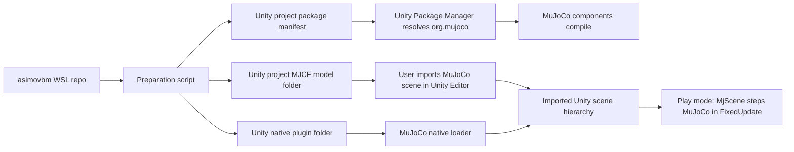

# feat: Add MuJoCo Unity Real-Time Integration

## Summary

Integrate the official MuJoCo Unity plug-in into the Windows Unity project, prepare a first importable MJCF scene from this repo, and document the few Unity Editor clicks the user must perform. The easy path is for Unity on Windows to own real-time MuJoCo stepping and rendering; WSL prepares files and verification, but does not drive Unity frame-by-frame.

---

## Problem Frame

The user is working from WSL on Ubuntu 24.04 and wants Unity running on the Windows PC to display a MuJoCo simulation in real time. This repo already owns `g1_slam` MuJoCo assets and Python runners, while the Unity project is currently a mostly stock Unity 6 URP project without the MuJoCo package.

---

## Assumptions

- The first successful integration should use the simplest importable scene, `g1_slam/assets/g1_kinematic.xml`, before attempting official Unitree G1 or Go2 meshes and policy locomotion.
- Paths under `asimovbm:` are relative to this repository root. Paths under `Unity project:` are relative to the user-provided Unity project root.
- The Unity Editor UI steps remain user-operated, but file preparation, package manifest edits, native binary placement, and validation helpers can be managed from WSL.
- Unity 6000.4.6f1 is acceptable for the first smoke pass, with compatibility confirmed during implementation by opening the project and checking compilation/import errors.

---

## Requirements

- R1. Unity on Windows must run the MuJoCo simulation in real time through the official MuJoCo Unity plug-in.
- R2. The MuJoCo Unity package and native Windows MuJoCo library must be version-aligned and pinned rather than pulled from an unbounded branch.
- R3. A WSL-side preparation workflow must place the initial MJCF scene and required native binary in the Unity project without disturbing unrelated Unity assets.
- R4. The plan must clearly separate automated/file-system work from Unity Editor clicks the user must perform.
- R5. Existing benchmark and `g1_slam` validation behavior must remain unchanged; this is a Unity visualization/simulation integration path, not a rewrite of metrics or local validation.
- R6. The resulting documentation must give a repeatable verification path and common troubleshooting checks.

---

## Scope Boundaries

- No WSL-to-Unity external process driver in the first pass. The official plug-in is designed around Unity stepping MuJoCo, which is the lowest-friction route.
- No full Unity UI, benchmark dashboard, or report visualization.
- No first-pass commitment to importing the official Unitree mesh-heavy G1/Go2 models; those can follow after the kinematic scene proves package, DLL, importer, and play-mode behavior.
- No changes to metric formulas, canonical local validation defaults, episode status semantics, or report aggregation.
- No broad cleanup of existing Unity render pipeline settings or tutorial assets.

### Deferred to Follow-Up Work

- External WSL or Python policy bridge: add only if Unity-owned stepping is insufficient for the desired workflow.
- Official Unitree asset import: copy meshes/includes and validate importer behavior after the kinematic smoke succeeds.
- Unity automation: add batchmode import/play-mode checks if manual Editor smoke becomes repetitive.

---

## Context & Research

### Relevant Code and Patterns

- `README.md` defines the active local validation path as `asimovbm-local`; this integration should not change that runner.
- `final-rush-choices.md` keeps the final-rush boundary local-first and overlay-friendly; Unity integration should be additive and visualization-oriented.
- `g1_slam/README.md` documents the existing MuJoCo runner and distinguishes the simplified kinematic scene from official Unitree assets.
- `g1_slam/assets/g1_kinematic.xml` is a self-contained first import target with no external mesh dependencies.
- `g1_slam/src/g1_slam/mujoco_runner.py` already generates navigation-oriented MJCF for official models when assets exist; this is the later path to mirror for richer Unity scenes.
- `Unity project: Packages/manifest.json` currently has no `org.mujoco` dependency.
- `Unity project: ProjectSettings/ProjectVersion.txt` reports Unity 6000.4.6f1.
- `Unity project` has existing dirty render-pipeline/tutorial asset changes, so implementation should avoid unrelated edits.

### Institutional Learnings

- No `docs/solutions/` entries exist in this repo.
- `final-rush-choices.md` is the closest durable project guidance and says the active benchmark path is local-first with MuJoCo-backed validation kept separate from metric computation.

### External References

- MuJoCo Unity plug-in docs: `https://mujoco.readthedocs.io/en/latest/unity.html`
- MuJoCo Unity package metadata: `https://raw.githubusercontent.com/google-deepmind/mujoco/main/unity/package.json`
- Unity Git dependency docs: `https://docs.unity.cn/Manual/upm-git.html`

Key findings:

- The official MuJoCo Unity plug-in lets Unity Editor/runtime use MuJoCo physics, while Unity still owns assets, game logic, and simulation time.
- Official docs recommend using a version-specific stable MuJoCo tag and matching native MuJoCo binary rather than assuming `main` is compatible with the latest release.
- Unity Package Manager supports Git dependencies with a package subfolder and revision, with the path query before the revision anchor.
- The plug-in imports MJCF from the Unity Editor asset menu and creates/binds MuJoCo components; at runtime `MjScene.FixedUpdate()` steps MuJoCo and synchronizes Unity transforms.
- The docs mention external process driving as possible, but not the plug-in's primary path; that is a follow-up integration, not the easy first route.

---

## Key Technical Decisions

- Unity owns real-time simulation for v1: this matches the official plug-in design and avoids network/IPC timing problems between WSL and Windows.
- Pin MuJoCo by a single resolved version across package and native DLL: package code and `mujoco.dll` must match to avoid loader or ABI errors.
- Use Unity Package Manager's Git subfolder syntax for the plug-in: the MuJoCo Unity package lives under the repository's `unity` folder, and the revision pin belongs after the subfolder query.
- Keep an embedded-package fallback available: if Unity on Windows cannot resolve Git dependencies because Windows Git is missing from PATH, the agent can copy the pinned MuJoCo `unity` package into `Unity project: Packages/org.mujoco/` from WSL instead of blocking on a manual Git install.
- Start with `g1_kinematic.xml`: it removes mesh/include handling from the first smoke and proves the package, native loader, importer, scene creation, and play-mode stepping.
- Keep generated/copied Unity artifacts under narrow target directories: implementation should only touch `Unity project: Packages/manifest.json`, `Unity project: Assets/AsimovBM/MuJoCo/`, and `Unity project: Assets/Plugins/x86_64/` unless the user approves broader scene or settings edits.
- Treat Unity Editor actions as documented handoff points: the agent prepares files and tells the user exactly what to click, then continues based on the observed result.

---

## Open Questions

### Resolved During Planning

- Who should own real-time stepping? Unity should own it for the first pass because the official plug-in is built around Unity simulation time and `MjScene.FixedUpdate()`.
- Which model should be imported first? The simplified kinematic scene should be first because it is self-contained and avoids mesh-path failures.

### Deferred to Implementation

- Exact MuJoCo version/tag: resolve at implementation time from official release/tag availability, then use one version consistently for both the Unity package and native binary.
- Unity 6 package compatibility: confirm by opening the project and checking compilation after package resolution.
- Whether the package automatically copies the native DLL in this Unity version: implementation should support manual placement under `Assets/Plugins/x86_64/` as the reliable fallback.
- Whether a richer official G1/Go2 import is needed before the user's demo goal is satisfied.

---

## Output Structure

Expected new or generated files:

```text
asimovbm:
  docs/run-mujoco-unity.md
  tools/unity/prepare_mujoco_unity_project.py
  tests/tools/test_prepare_mujoco_unity_project.py

Unity project:
  Packages/org.mujoco/                # fallback only, when embedded-package mode is used
  Assets/AsimovBM/MuJoCo/Models/g1_kinematic.xml
  Assets/AsimovBM/MuJoCo/README.md
  Assets/Plugins/x86_64/mujoco.dll
```

The Unity project files listed above are the intended narrow write set. The scene created by the importer is expected to be saved through the Unity Editor UI and may land at `Unity project: Assets/Scenes/AsimovMujoco.unity`.

---

## High-Level Technical Design

> *This illustrates the intended approach and is directional guidance for review, not implementation specification. The implementing agent should treat it as context, not code to reproduce.*



---

## Implementation Units

### U1. Add WSL-Side Unity Project Preparation

**Goal:** Provide a repeatable script that prepares the Unity project for MuJoCo without requiring manual file copying.

**Requirements:** R2, R3, R5

**Dependencies:** None

**Files:**
- Create: `tools/unity/prepare_mujoco_unity_project.py`
- Create: `tests/tools/test_prepare_mujoco_unity_project.py`
- Modify: `pyproject.toml` only if adding a project-local console entry point is worth the extra surface
- Modify: `Unity project: Packages/manifest.json`

**Approach:**
- Add a small Python preparation script that accepts the Unity project root as an argument.
- Parse and update `Packages/manifest.json` as JSON, adding an `org.mujoco` Git dependency that points at the MuJoCo repository's `unity` package subfolder and a pinned tag or full commit.
- Detect whether Windows-side Unity can reasonably resolve Git dependencies; if not, prepare an embedded local package under `Packages/org.mujoco/` from the same pinned MuJoCo revision.
- Preserve existing dependencies and formatting as much as practical; avoid editing `Packages/packages-lock.json` directly and let Unity resolve it.
- Implement dry-run or summary output so the user can see what would change before running against the real Unity project.
- Avoid touching existing Unity render pipeline, scene, tutorial, Library, Temp, or UserSettings files.

**Patterns to follow:**
- Use structured JSON parsing rather than string replacement for `Packages/manifest.json`.
- Keep local tooling under `tools/` and tests under `tests/`, consistent with this repo's pytest-based validation style.

**Test scenarios:**
- Happy path: given a temporary Unity-like project with `Packages/manifest.json`, running the preparation workflow adds the MuJoCo dependency and preserves existing Unity package entries.
- Happy path: when Git dependency mode is unavailable, embedded-package mode creates `Packages/org.mujoco/package.json` and records the pinned MuJoCo revision.
- Edge case: existing `org.mujoco` dependency with the same pinned version is left idempotent.
- Edge case: existing `org.mujoco` dependency with a different version is updated only when the script is invoked in update mode or after explicit confirmation.
- Error path: missing `Packages/manifest.json` fails with a clear message and no partial project directories created.
- Error path: malformed manifest JSON fails before modifying the file.

**Verification:**
- The script can run against a temp fixture in tests and against the real Unity project in dry-run mode.
- `Unity project: Packages/manifest.json` contains a deterministic MuJoCo package reference after the real run.

---

### U2. Align and Place the Native MuJoCo Windows Library

**Goal:** Ensure Unity can load the MuJoCo native runtime on Windows with the same version as the package code.

**Requirements:** R1, R2, R3, R6

**Dependencies:** U1

**Files:**
- Modify: `tools/unity/prepare_mujoco_unity_project.py`
- Modify: `tests/tools/test_prepare_mujoco_unity_project.py`
- Create or update: `Unity project: Assets/Plugins/x86_64/mujoco.dll`
- Create: `Unity project: Assets/AsimovBM/MuJoCo/README.md`

**Approach:**
- Extend the preparation workflow to accept either a local MuJoCo Windows archive/path or a resolved release download.
- Download only from official MuJoCo release assets or use a user-supplied local archive; record source URL, expected version, and checksum when available.
- Extract or copy the Windows `mujoco.dll` into Unity's native plugin path.
- Record the chosen MuJoCo version in the generated Unity-side README so future debugging can compare package and DLL versions.
- Keep the DLL as a generated/local binary unless the user explicitly wants it committed in the Unity project.

**Patterns to follow:**
- The official MuJoCo Unity docs require the native library in addition to package code.
- Unity native plugins conventionally load from `Assets/Plugins/x86_64/` on Windows.

**Test scenarios:**
- Happy path: a fixture archive containing a `mujoco.dll` is unpacked or copied to the expected Unity plugin path.
- Edge case: destination already contains the same DLL and the script reports no change.
- Error path: downloaded archive checksum or expected filename/version does not match the resolved release, and the script refuses to use it.
- Error path: archive lacks a Windows DLL and fails with an actionable message.
- Error path: requested package version and provided DLL version metadata conflict, and the script refuses to proceed unless explicitly overridden.

**Verification:**
- Unity opens without `DllNotFoundException` or native-loader errors after the DLL is placed.
- The generated README records where the DLL came from and what package tag was used.

---

### U3. Stage the First Importable MJCF Scene

**Goal:** Copy a self-contained MJCF scene into the Unity project for the first importer smoke test.

**Requirements:** R1, R3, R4, R5

**Dependencies:** U1

**Files:**
- Modify: `tools/unity/prepare_mujoco_unity_project.py`
- Modify: `tests/tools/test_prepare_mujoco_unity_project.py`
- Create or update: `Unity project: Assets/AsimovBM/MuJoCo/Models/g1_kinematic.xml`
- Modify: `Unity project: Assets/AsimovBM/MuJoCo/README.md`

**Approach:**
- Copy `g1_slam/assets/g1_kinematic.xml` into the Unity project as the initial import target.
- Do not copy official Unitree mesh-heavy scenes yet; the first smoke should isolate plugin setup from mesh/include issues.
- Include source-path and timestamp/version notes in the generated Unity-side README.
- Leave the original `g1_slam` asset unchanged.

**Patterns to follow:**
- `g1_slam/README.md` already presents the kinematic model as the default visualization model before official robot assets.
- `g1_slam/src/g1_slam/mujoco_runner.py` separates kinematic and official models; preserve that same staged complexity.

**Test scenarios:**
- Happy path: the kinematic XML is copied into the Unity project and the file contents match the repo source.
- Edge case: target directories do not exist and are created.
- Edge case: copied XML already exists and is refreshed idempotently.
- Error path: source MJCF is missing and the script fails before touching Unity files.

**Verification:**
- The Unity project contains the staged MJCF at the expected relative path.
- The source `g1_slam/assets/g1_kinematic.xml` is unchanged.

---

### U4. Document the Unity Editor Handoff and Real-Time Smoke

**Goal:** Give the user exact UI actions for the steps that require clicking in Unity, plus clear success criteria.

**Requirements:** R1, R4, R6

**Dependencies:** U1, U2, U3

**Files:**
- Create: `docs/run-mujoco-unity.md`
- Modify: `Unity project: Assets/AsimovBM/MuJoCo/README.md`

**Approach:**
- Document the automated preparation command at a high level without hardcoding local-only absolute paths in the plan.
- Document the Unity UI sequence:
  - Open the Unity project.
  - Wait for Package Manager resolution and C# compilation.
  - Enable Console Error Pause.
  - Use the MuJoCo import menu to import the staged kinematic XML.
  - Save the imported scene as an AsimovBM MuJoCo scene.
  - Press Play and confirm the scene runs in real time.
- Include "tell the agent what happened" checkpoints after package compilation, import, and play-mode smoke so the agent can continue integration without guessing.

**Patterns to follow:**
- `docs/run-g1-slam-episode.md` is short and task-oriented; keep this runbook similarly direct.
- The official MuJoCo docs place importer use in the Unity Editor Asset menu, so UI instructions should track that route.

**Test scenarios:**
- Test expectation: none -- this unit is documentation and manual Editor handoff, not runtime code.

**Verification:**
- A reader can distinguish agent-managed file steps from user-managed Unity clicks.
- The runbook defines what visible result and console state count as success.

---

### U5. Add Verification and Troubleshooting Checks

**Goal:** Make failures diagnosable when Unity package resolution, native loading, or MJCF import does not work on the first attempt.

**Requirements:** R2, R4, R6

**Dependencies:** U1, U2, U3, U4

**Files:**
- Modify: `docs/run-mujoco-unity.md`
- Modify: `tools/unity/prepare_mujoco_unity_project.py`
- Modify: `tests/tools/test_prepare_mujoco_unity_project.py`

**Approach:**
- Add preparation output that reports:
  - Unity project root detected.
  - MuJoCo package reference selected.
  - Git dependency mode or embedded-package mode selected.
  - DLL destination status.
  - MJCF destination status.
  - Files intentionally not touched.
- Add troubleshooting sections for common errors:
  - Package Manager cannot fetch Git dependency.
  - Windows Git is unavailable and embedded-package fallback should be used.
  - MuJoCo package compiles but native DLL is missing.
  - Importer does not appear in the Asset menu.
  - Import succeeds but play mode is static or console has MuJoCo errors.
  - Official G1/Go2 assets fail due to missing meshes/includes.

**Patterns to follow:**
- The repo's local validation docs emphasize clear launcher defaults and artifact locations; mirror that clarity for Unity preparation outputs.

**Test scenarios:**
- Happy path: dry-run summary lists intended manifest, DLL, and MJCF operations without modifying files.
- Edge case: script detects a Unity project with existing unrelated dirty files but only reports its own target write set.
- Error path: unsupported or unresolved MuJoCo version produces a clear troubleshooting hint instead of a stack trace.

**Verification:**
- After a failed Unity attempt, the runbook gives the next concrete check without requiring the user to search docs.
- Preparation output is specific enough for the agent to continue debugging from pasted console/errors.

---

## System-Wide Impact

- **Interaction graph:** WSL prep script writes package/model/native assets into the Unity project; Unity Package Manager resolves the package; the user invokes the importer; play mode creates and steps the MuJoCo scene.
- **Error propagation:** Script errors should fail before partial writes when possible; Unity package/import/runtime errors surface in the Unity Console and are handled through the runbook.
- **State lifecycle risks:** Unity may rewrite `Packages/packages-lock.json`, generated `.meta` files, and imported scene assets after the user opens/imports. Implementation should distinguish these Unity-generated changes from agent-authored edits.
- **API surface parity:** Existing `asimovbm-local` and `python -m g1_slam` paths remain unchanged.
- **Integration coverage:** Automated tests cover preparation logic; manual Unity smoke covers Package Manager resolution, native loading, MJCF import, and play-mode stepping.
- **Unchanged invariants:** Metric computation, canonical episode configs, local validation artifacts, and report generation are not part of this integration.

---

## Risks & Dependencies

| Risk | Mitigation |
|------|------------|
| MuJoCo package tag and native DLL version mismatch | Resolve one version and use it for both package Git revision and Windows DLL. |
| Unity 6000.4.6f1 exposes compile incompatibilities in the MuJoCo plug-in | Start with a package compile smoke before importing scenes; if needed, try the nearest stable MuJoCo tag or embed a patched package as follow-up. |
| Unity Package Manager cannot use Git on Windows | Fall back to an embedded `Packages/org.mujoco/` copy prepared from WSL using the same pinned MuJoCo revision. |
| Native binary is downloaded from the wrong source or corrupted | Use only official MuJoCo release assets or a user-supplied local archive, and verify checksum/expected version when available. |
| Unity cannot load `mujoco.dll` | Place the native DLL in `Assets/Plugins/x86_64/` and verify console errors before debugging MJCF content. |
| Official Unitree models fail due to mesh/include paths | Defer official assets until the self-contained kinematic XML succeeds. |
| Existing dirty Unity render-pipeline files get overwritten | Restrict writes to package manifest, MuJoCo asset folders, and native plugin folder. |
| User expects WSL physics to stream into Unity | Document that the first pass is Unity-owned real-time simulation and list WSL-driven streaming as follow-up. |

---

## Sources & References

- `README.md`
- `final-rush-choices.md`
- `g1_slam/README.md`
- `g1_slam/assets/g1_kinematic.xml`
- `g1_slam/src/g1_slam/mujoco_runner.py`
- `Unity project: Packages/manifest.json`
- `Unity project: ProjectSettings/ProjectVersion.txt`
- MuJoCo Unity plug-in docs: `https://mujoco.readthedocs.io/en/latest/unity.html`
- Unity Git dependency docs: `https://docs.unity.cn/Manual/upm-git.html`
