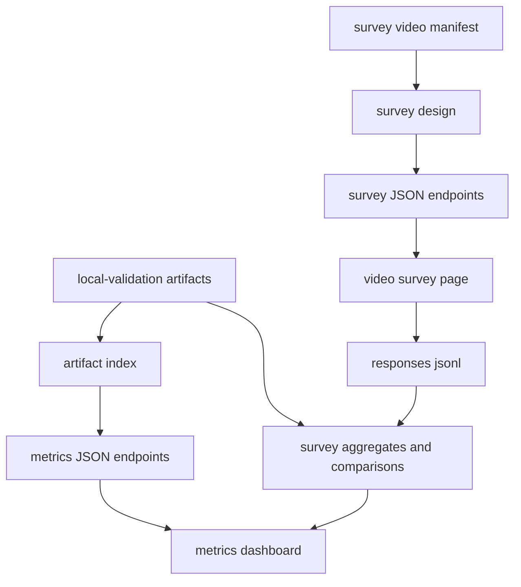
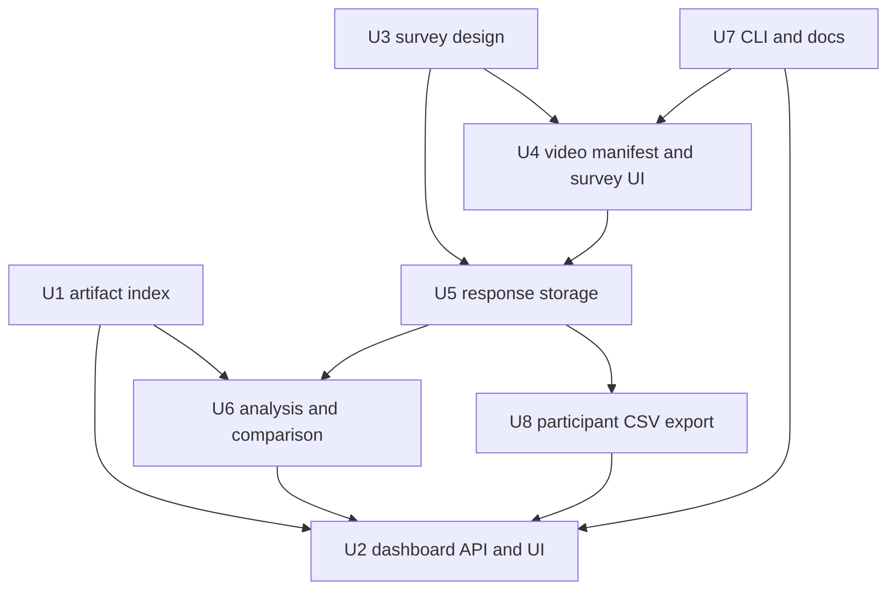

# feat: Add local metrics dashboard and survey video webserver

## Summary

Add a local webserver that turns existing `asimovbm-local` artifacts into a usable metrics dashboard and adds a survey page where raters watch episode videos, answer the four core Likert questions after each episode, save analysis-ready subjective scores, and export participant metadata to CSV. The survey design stays in one small, readable Python file so the study groups, question wording, participant fields, Likert mapping, optional Q5, and weighting presets are easy to audit before data collection.

---

## Problem Frame

The repository can already run canonical episodes, compute social-navigation metrics, and write JSON artifacts. The next paper-supporting step is making those artifacts inspectable and collecting human ratings against the same policy/viewpoint/episode combinations so objective testbench scores can be compared with survey distributions.

---

## Requirements

- R1. Provide a local webserver for the active `asimovbm` package; do not revive the archived participant client/server architecture.
- R2. The metrics page must read existing local validation artifacts and show run reliability, per-episode axis scores, feature breakdowns, and missing/insufficient-evidence states.
- R3. The survey page must support the four primary study cells: policy A + first-person, policy B + first-person, policy A + bystander, and policy B + bystander.
- R4. Each survey participant must see three episodes for their assigned cell and answer the four core questions after each episode:
  - Q1. The robot seemed competent and in control.
  - Q2. The robot's behavior felt safe around people or obstacles.
  - Q3. The robot seemed aware of its surroundings, including people or obstacles.
  - Q4. Overall, I had a positive impression of the robot.
- R5. Likert answers must be captured as raw 1-7 responses and mapped behind the scenes to `0..100` scores for each subjective axis.
- R6. Survey responses must be persisted as local artifacts with enough metadata to aggregate per video, per group, per axis, per policy, per viewpoint, per robot, and per episode order.
- R7. The survey analysis must compute per-video axis means, configurable global indicators, absolute error against testbench scores, distribution similarity, and rank-order correlation.
- R8. The design must leave room for a Go2 cohort when sample size supports it, without making Go2 part of the required first pass.
- R9. The optional Q5 global-validation item, "Overall, this robot behaved appropriately in the situation.", must be supported as a study-design toggle but excluded from the primary four-axis score by default.
- R10. The UX must be data-focused and practical: quick run selection, clear score comparison, video playback with one-question-set-at-a-time survey flow, progress visibility, and responsive layout.
- R11. The survey workflow must collect configured participant metadata, persist it locally, and produce an exportable CSV file with one row per participant/session.

---

## Scope Boundaries

- Public deployment, authentication, accounts, and multi-user hosting are out of scope. This is a local research webserver.
- The archived `src/asimovbm_server/`, `src/asimovbm_client/`, and WebSocket protocol are out of scope; they are historical reference only.
- Survey participant demographics and consent/IRB workflow are out of scope for this implementation plan unless added later as a separate study protocol.
- Direct personal identifiers are out of scope by default. Participant metadata should use anonymous participant/session ids and configurable coarse fields unless the study protocol explicitly enables additional fields.
- Training final paper weights from survey data is out of scope for the webserver itself. This plan supports data collection and comparison; model fitting can follow once data exists.
- Video generation is out of scope. This plan assumes recorded video files and a video manifest are available or can be produced by a separate capture workflow.
- Heavy dashboard frameworks are out of scope for the first pass. Use a local Python server plus static browser assets unless implementation discovers a strong reason to add a dependency.

### Deferred to Follow-Up Work

- Fitting calibrated global weights from Q5 or held-out survey data: follow-up analysis plan after pilot responses exist.
- Validated long-form survey scales for final paper submission: already described in `docs/specs/social-navigation-metrics.md`; this plan targets the simple v0 pilot survey.
- Public/recruitment hosting, consent screens, and PII handling: separate study-operations work.

---

## Context & Research

### Relevant Code and Patterns

- `src/asimovbm/local_runner/runner.py` writes the run directory, manifest, per-episode trace, per-episode metrics, and report artifacts that the dashboard should read.
- `src/asimovbm/local_runner/artifacts.py` already provides small JSON writing helpers; the survey store should mirror this local artifact style.
- `src/asimovbm/reports/json_report.py` defines the report shape, including `behavioral_metrics`, `axes`, `features`, `macro_indicators`, and `sub_indicators`.
- `src/asimovbm/metrics/aggregation.py` and `src/asimovbm/metrics/weights.py` define the current testbench axis aggregation and manual evidence weights.
- `src/asimovbm/local_runner/catalog.py` defines the six canonical episode ids and robot selectors, which the web UI should expose instead of inventing new episode names.
- `tests/local_runner/test_artifact_manifest.py`, `tests/local_runner/test_cli_modes.py`, and `tests/metrics/test_metric_aggregation.py` show the current pytest style: small fake inputs, pure functions, no server process required unless the unit really crosses the HTTP boundary.
- `archive/server_client_architecture/README.md` explicitly says the old FastAPI/WebSocket client-server path was abandoned for the active local-validation path.

### Institutional Learnings

- No `docs/solutions/` learnings are present in this worktree.
- Existing project direction favors dependency-light, local-first validation artifacts and pure Python tests.

### External References

- None used. Existing repository contracts are sufficient for this plan.

---

## Key Technical Decisions

- **Use a local static-plus-JSON server:** Add a small Python webserver under the active `src/asimovbm/` package that serves static HTML/CSS/JS and JSON endpoints over the standard library. This keeps install friction low and avoids reintroducing the archived server stack.
- **Keep survey design readable and explicit:** Put the study cells, question text, axis mapping, Likert conversion, optional Go2 cells, optional Q5, and weighting presets in `src/asimovbm/survey/survey_design.py`. Other modules may handle storage and analysis, but the study logic should be auditable in that one file.
- **Persist raw answers before derived scores:** Store raw Likert values, mapped `0..100` values, participant/session id, group cell, video id, episode order, policy id, viewpoint, robot id, and timestamps. Derived means and comparisons can be recomputed from append-only response artifacts.
- **Use JSONL as source of truth and CSV as export:** Store participant metadata in append-only local records, then generate a stable `participants.csv` export for spreadsheet and statistics tooling. The CSV should not be the only persisted copy because export columns may evolve during pilot setup.
- **Keep participant fields configurable and coarse:** Define participant metadata fields in the readable survey design module, with defaults such as participant/session id, assigned group, policy/viewpoint/robot cell, completion status, timestamps, and optional coarse survey fields like robotics familiarity or prior exposure. Avoid names, emails, or free-text identifiers by default.
- **Treat Q5 as validation, not a fifth axis:** Support Q5 as a toggle for validating whether the four-axis global indicator tracks "appropriateness", but do not include Q5 in the primary global score unless a later fitted model chooses to use it.
- **Model habituation as recorded order metadata and analysis weights:** Do not bake an unvalidated habituation correction into saved responses. Persist episode order and provide weighting presets so analysis can compare neutral, recency-weighted, and order-corrected views once enough data exists.
- **Use neutral weights as the default global indicator:** Start with equal axis weights for the pilot dashboard. Add explicit alternative presets, such as safety-sensitive and Q5-fitted-placeholder, so the team can compare "safety weighs more" hypotheses without hiding the choice.
- **Use a manifest to link videos to testbench scores:** Introduce a survey video manifest that maps each video to `policy_id`, `viewpoint`, `robot_id`, `episode_id`, local video path, and optional metric artifact paths. The survey UI should not infer this mapping from filenames.

---

## Open Questions

### Resolved During Planning

- Should Q5 be collected? Support it as an optional validation item, disabled from the primary four-axis score by default because the wording may be confusing for simple episodes.
- Should Go2 be required now? No. The survey design should support Go2 as an optional robot dimension, but the required first pass is the four policy/viewpoint cells over the current core videos.
- Should safety be heavier than impression in the default global score? Not yet. The plan makes weights configurable and starts neutral; safety-heavy weighting is an explicit analysis preset until pilot data justifies a primary weight choice.
- Should "habit" or repeated exposure change saved scores? No. Save raw responses and display order, then handle habituation as an analysis parameter or later fitted offset.
- Should participant info be stored only as CSV? No. Store append-only participant metadata as the auditable source, and produce CSV as an export artifact for downstream analysis.

### Deferred to Implementation

- Exact file paths for recorded videos: depends on the capture workflow output and should be set in the survey video manifest.
- Whether participants are assigned by explicit group links or automatic balancing: implement both if cheap; otherwise start with explicit `group` query links for controlled recruitment.
- Exact distribution-similarity statistic: start with an easily tested ECDF/KS-style distance over `0..100` scores and keep the function replaceable if the paper later needs a different statistic.
- Exact participant metadata field list: define conservative defaults in `survey_design.py`, then adjust once the study protocol decides whether to include demographics, robotics familiarity, or other coarse participant descriptors.

---

## Output Structure

```text
src/asimovbm/web/
  __init__.py
  server.py
  artifact_index.py
  static/
    index.html
    app.css
    metrics.js
    survey.js

src/asimovbm/survey/
  __init__.py
  survey_design.py
  storage.py
  analysis.py
  export.py
  video_manifest.py

tests/web/
  test_artifact_index.py
  test_web_server_routes.py

tests/survey/
  test_survey_design.py
  test_survey_storage.py
  test_survey_analysis.py
  test_survey_export.py
  test_video_manifest.py
```

The tree is directional. If implementation finds that static assets are easier to package in a different path, keep the same logical boundaries: webserver, survey design, survey storage, survey analysis, and tests.

---

## High-Level Technical Design

> *This illustrates the intended approach and is directional guidance for review, not implementation specification. The implementing agent should treat it as context, not code to reproduce.*



The planned server has two user-facing surfaces:

| Surface | Primary job | Data source |
|---|---|---|
| Metrics dashboard | Inspect objective testbench output and technical reliability | `artifacts/local-validation/<run-id>/manifest.json`, `report.json`, per-episode `metrics.json` |
| Survey page | Show videos, collect Likert responses, and save subjective scores | Survey design, video manifest, local video files, survey response artifacts |

---

## Implementation Units



### U1. Index Local Validation Artifacts

**Goal:** Create a read-only Python layer that discovers local validation runs and normalizes the existing manifest/report/metrics files for web consumption.

**Requirements:** R1, R2

**Dependencies:** None

**Files:**
- Create: `src/asimovbm/web/artifact_index.py`
- Test: `tests/web/test_artifact_index.py`

**Approach:**
- Read `artifacts/local-validation/<run-id>/manifest.json` and `report.json`.
- Expose run summaries sorted by creation time, selected episode ids, viewer mode, reliability totals, and report status.
- Resolve per-record `metrics_path` and `trace_path` relative to the run directory using the manifest records.
- Preserve missing-file and invalid-JSON states as structured errors so the dashboard can show "artifact incomplete" instead of crashing.

**Patterns to follow:**
- `src/asimovbm/local_runner/artifacts.py`
- `src/asimovbm/local_runner/runner.py`
- `tests/local_runner/test_artifact_manifest.py`

**Test scenarios:**
- Happy path: a temp artifact root with one manifest/report returns one run summary and one episode record.
- Happy path: per-episode metric files are loaded through manifest-relative paths.
- Edge case: empty artifact root returns an empty run list.
- Error path: a run directory missing `report.json` is listed with an incomplete status and does not break other runs.
- Error path: invalid JSON in a metrics file produces a structured load error for that episode only.

**Verification:**
- The dashboard API can list and inspect a run produced by `run_local_validation` without depending on simulator packages.

---

### U2. Build Metrics Dashboard Server and UI

**Goal:** Serve a local metrics dashboard with run selection, technical reliability, per-axis scores, and per-feature details.

**Requirements:** R1, R2, R10

**Dependencies:** U1

**Files:**
- Create: `src/asimovbm/web/server.py`
- Create: `src/asimovbm/web/static/index.html`
- Create: `src/asimovbm/web/static/app.css`
- Create: `src/asimovbm/web/static/metrics.js`
- Modify: `pyproject.toml`
- Test: `tests/web/test_web_server_routes.py`

**Approach:**
- Add an `asimovbm-web` console script that starts a local HTTP server pointed at an artifact root, survey root, and video root.
- Serve the dashboard at `/` and JSON endpoints under `/api/runs`.
- Keep the UI dense and research-oriented: run list, reliability strip, axis comparison table, feature details, and clear handling for `not_applicable` and `insufficient_evidence`.
- Use responsive static HTML/CSS/JS with no build step. Package static files with the Python package so editable installs and normal installs behave consistently.
- Add cross-links to survey aggregates when response data exists for the selected run or video manifest.

**Patterns to follow:**
- `src/asimovbm/reports/json_report.py` for report field names.
- `src/asimovbm/metrics/models.py` for axis and metric ids.
- Existing CLI style in `src/asimovbm/local_runner/cli.py`.

**Test scenarios:**
- Happy path: `GET /` returns the dashboard HTML.
- Happy path: `GET /api/runs` returns run summaries from a temp artifact root.
- Happy path: `GET /api/runs/<run_id>` returns report and manifest-derived records.
- Edge case: unknown run id returns a structured not-found JSON response.
- Error path: malformed route input does not expose local filesystem paths outside the configured artifact root.
- Integration: package-data lookup serves CSS and JS files in tests without a frontend build.

**Verification:**
- Starting `asimovbm-web` locally opens a dashboard that can browse at least one existing `artifacts/local-validation` run.

---

### U3. Define the Readable Survey Design Module

**Goal:** Capture the survey's scientific logic in one easy-to-read Python file.

**Requirements:** R3, R4, R5, R8, R9

**Dependencies:** None

**Files:**
- Create: `src/asimovbm/survey/__init__.py`
- Create: `src/asimovbm/survey/survey_design.py`
- Test: `tests/survey/test_survey_design.py`

**Approach:**
- Define the four required study cells as explicit data: `policy_a_fp`, `policy_b_fp`, `policy_a_bystander`, and `policy_b_bystander`.
- Represent Go2 as an optional robot dimension that can be enabled in the manifest or config without changing question logic.
- Define participant metadata fields in the same readable module. Defaults should be anonymous/coarse fields only, with stable column ids for export.
- Define the four core questions with stable ids, exact text, mapped axis ids, and `Likert 1..7 -> 0..100` conversion.
- Define Q5 as an optional global validation question with its own id and `primary_axis=None`, excluded from default axis means.
- Define global-weight presets in the same readable file: neutral/equal default, safety-sensitive exploratory preset, and a placeholder for later Q5-fitted weights.
- Define order/habituation parameters as analysis presets, not as saved-response transformations.

**Patterns to follow:**
- `src/asimovbm/metrics/weights.py` for explicit, auditable weight dictionaries.
- `src/asimovbm/metrics/models.py` for stable axis ids.

**Test scenarios:**
- Happy path: all four required study cells are present with policy and viewpoint metadata.
- Happy path: default participant metadata fields have stable ids, labels, types, and CSV column names.
- Happy path: each core question maps to exactly one of the four subjective axes.
- Happy path: Likert values 1, 4, and 7 map to 0, 50, and 100.
- Edge case: Likert values outside 1..7 are rejected.
- Edge case: Q5 is available when enabled but excluded from primary axis aggregation.
- Error path: weight presets referencing unknown axes fail validation.

**Verification:**
- A reviewer can open `src/asimovbm/survey/survey_design.py` and understand the study design without reading the server or UI code.

---

### U4. Add Video Manifest and Survey Playback UI

**Goal:** Show assigned episode videos in the browser, collect the post-video questions, and advance through the three-episode survey flow.

**Requirements:** R3, R4, R5, R8, R9, R10

**Dependencies:** U2, U3

**Files:**
- Create: `src/asimovbm/survey/video_manifest.py`
- Create: `src/asimovbm/web/static/survey.js`
- Modify: `src/asimovbm/web/static/index.html`
- Modify: `src/asimovbm/web/static/app.css`
- Test: `tests/survey/test_video_manifest.py`
- Test: `tests/web/test_web_server_routes.py`

**Approach:**
- Define a survey video manifest format that lists video id, local path, policy id, viewpoint, robot id, episode id, display title, and optional metric artifact linkage.
- Serve the survey page at `/survey` and video assets through a route constrained to the configured video root.
- Support explicit group assignment by query string for recruitment links. If implementation adds automatic balancing, keep it deterministic and artifact-backed so allocation is auditable.
- Present one video at a time, then reveal the Likert questions for that video. Store progress client-side only for convenience; the server-side response artifact remains the source of truth.
- Keep the survey UI simple: progress indicator, video player, four Likert controls, optional Q5 when enabled, and submit/next behavior.

**Patterns to follow:**
- `src/asimovbm/local_runner/catalog.py` for explicit canonical episode ids.
- U3 survey design constants for group and question ids.

**Test scenarios:**
- Happy path: a manifest with three videos for `policy_a_fp` returns exactly those videos in survey order.
- Happy path: `/survey?group=policy_b_bystander` initializes the expected group metadata.
- Edge case: missing optional Go2 entries does not affect required G1 cells.
- Error path: a manifest entry pointing outside the configured video root is rejected.
- Error path: an unknown group id returns a structured error rather than a blank survey.
- Integration: survey page can fetch design and manifest data from server endpoints.

**Verification:**
- A participant can complete a three-video survey flow for one of the four required groups in a local browser.

---

### U5. Persist Survey Responses as Local Artifacts

**Goal:** Save survey responses in an append-only, analysis-ready local format.

**Requirements:** R5, R6, R9, R11

**Dependencies:** U3, U4

**Files:**
- Create: `src/asimovbm/survey/storage.py`
- Modify: `src/asimovbm/web/server.py`
- Test: `tests/survey/test_survey_storage.py`
- Test: `tests/web/test_web_server_routes.py`

**Approach:**
- Write participant metadata records under `artifacts/survey/<study_id>/participants.jsonl`.
- Write response records under `artifacts/survey/<study_id>/responses.jsonl`.
- Include anonymous participant/session id, assigned group id, policy id, viewpoint, robot id, completion status, video count, started/completed timestamps, and configured participant metadata fields in participant records.
- Include anonymous participant/session id, group id, policy id, viewpoint, robot id, video id, episode id, episode order, question responses, raw Likert values, mapped `0..100` scores, optional Q5, and timestamp in response records.
- Validate incoming responses against `survey_design.py` and the active video manifest before writing.
- Make repeated submissions idempotent per participant/video when possible, or explicitly version duplicate submissions so analysis can exclude superseded rows.
- Keep records free of personal data by default.

**Patterns to follow:**
- `src/asimovbm/local_runner/artifacts.py` for simple local JSON writing.
- `tests/local_runner/test_artifact_manifest.py` for temp-directory artifact tests.

**Test scenarios:**
- Happy path: starting a survey writes or updates one participant metadata row with assigned group and anonymous session id.
- Happy path: a valid four-question response appends one JSONL row with raw and mapped scores.
- Happy path: optional Q5 is stored separately when enabled.
- Edge case: a partial response is rejected and no row is appended.
- Edge case: unknown question id or video id is rejected.
- Error path: invalid Likert value is rejected before persistence.
- Error path: participant metadata containing an unknown configured field is rejected or stored under a documented extension namespace.
- Integration: POSTing through the webserver creates a response artifact under the configured survey root.

**Verification:**
- Survey response artifacts can be inspected with standard JSONL tooling and recomputed without the browser.
- Participant metadata artifacts can be joined to response artifacts by participant/session id.

---

### U6. Aggregate Survey Scores and Compare with Testbench Metrics

**Goal:** Compute the subjective aggregates needed to compare human ratings with objective benchmark scores.

**Requirements:** R6, R7, R9

**Dependencies:** U1, U3, U5

**Files:**
- Create: `src/asimovbm/survey/analysis.py`
- Modify: `src/asimovbm/web/server.py`
- Modify: `src/asimovbm/web/static/metrics.js`
- Test: `tests/survey/test_survey_analysis.py`

**Approach:**
- Aggregate responses per video and axis using mapped `0..100` scores, while preserving sample count and missing-response diagnostics.
- Compute global indicators from configurable axis weights. The default is neutral/equal; exploratory presets are explicit and labeled in API/UI output.
- Compare survey and testbench values by matched `video_id` or by the manifest's metric linkage. Produce absolute error per axis, global-score error, rank-order correlation, and an ECDF/KS-style distribution distance over `0..100` values.
- Report Q5 separately as a validation target: correlation/error between Q5 appropriateness and the configured global indicator when Q5 exists.
- Surface episode-order and habituation views as selectable analysis presets, not destructive transformations of raw data.

**Patterns to follow:**
- `src/asimovbm/metrics/aggregation.py` for explicit axis aggregation.
- `src/asimovbm/metrics/weights.py` for named weight presets.
- `tests/metrics/test_metric_aggregation.py` for aggregation test shape.

**Test scenarios:**
- Happy path: two participants rating the same video produce per-axis means and counts.
- Happy path: global indicator changes when switching from equal weights to safety-sensitive weights.
- Happy path: rank-order correlation is positive when survey and testbench order videos the same way.
- Edge case: tied ranks are handled deterministically and documented in output.
- Edge case: a video with no survey responses is reported as missing subjective data rather than score zero.
- Error path: a survey response whose video is absent from the manifest is excluded with a diagnostic.
- Integration: dashboard endpoint returns objective and subjective comparison blocks for matched videos.

**Verification:**
- The metrics dashboard can show, for each video/policy/viewpoint, survey axis means next to objective axis scores and comparison diagnostics.

---

### U7. Add CLI, Documentation, and Example Study Files

**Goal:** Make the webserver and survey workflow discoverable for local research use.

**Requirements:** R1, R3, R8, R10

**Dependencies:** U2, U4, U5, U6

**Files:**
- Modify: `pyproject.toml`
- Modify: `README.md`
- Create: `docs/run-web-metrics-survey.md`
- Create: `examples/survey/video_manifest.example.json`
- Test: `tests/web/test_web_server_routes.py`

**Approach:**
- Add an `asimovbm-web` console entry point with flags for artifact root, survey root, video root, host, port, study id, and video manifest.
- Document the local workflow: run validation, record/prepare videos, create a video manifest, start the webserver, collect responses, inspect comparison results.
- Include an example video manifest with placeholder paths and the four required cells.
- Document that Go2 cells are optional and should be enabled only when matching videos and sample size exist.
- Document Q5 as an optional validation item, not a primary scoring axis.
- Document the participant CSV export path, default columns, and the privacy rule that direct identifiers are excluded unless the study protocol intentionally enables them.

**Patterns to follow:**
- `README.md` sections for `asimovbm-local`.
- Existing script declaration in `pyproject.toml`.

**Test scenarios:**
- Happy path: console parser accepts explicit roots, port, study id, and manifest path.
- Edge case: default roots match documented local artifact locations.
- Error path: startup fails clearly when the configured video manifest is missing or invalid.
- Integration: export endpoint or CLI action produces `participants.csv` from a temp survey root.

**Verification:**
- A teammate can follow the docs to start the dashboard and complete one local survey session without reading source code.

---

### U8. Export Participant Metadata CSV

**Goal:** Produce a stable CSV file with one row per participant/session for spreadsheet export and downstream statistical analysis.

**Requirements:** R6, R11

**Dependencies:** U3, U5

**Files:**
- Create: `src/asimovbm/survey/export.py`
- Modify: `src/asimovbm/web/server.py`
- Modify: `src/asimovbm/web/static/metrics.js`
- Test: `tests/survey/test_survey_export.py`
- Test: `tests/web/test_web_server_routes.py`

**Approach:**
- Generate `artifacts/survey/<study_id>/participants.csv` from `participants.jsonl` and response completion data.
- Use deterministic columns from `survey_design.py`, including participant/session id, group id, policy id, viewpoint, robot id, assigned video ids, completed video count, completion status, started timestamp, completed timestamp, and configured participant metadata fields.
- Include derived completion fields from responses, such as number of submitted episode questionnaires and whether optional Q5 was answered, while keeping per-question Likert answers in response exports or analysis output rather than widening the participant CSV by default.
- Expose CSV export through an API endpoint and, if cheap during implementation, through a CLI flag or command under `asimovbm-web`.
- Regenerate the CSV on demand from source JSONL records so changes to export columns are repeatable and testable.

**Patterns to follow:**
- `src/asimovbm/local_runner/artifacts.py` for local artifact writing.
- `src/asimovbm/survey/survey_design.py` from U3 for stable participant field definitions.

**Test scenarios:**
- Happy path: two participant records produce a CSV with a header row and one row per participant/session.
- Happy path: participant completion counts are derived from response records and written to the expected columns.
- Edge case: a participant with no completed videos is exported with zero completion count and incomplete status.
- Edge case: optional metadata fields absent from a participant record export as empty cells.
- Error path: duplicate participant/session ids are handled deterministically with the latest or explicitly active record according to the storage contract.
- Integration: webserver export endpoint returns CSV content and writes or refreshes `participants.csv` under the configured survey root.

**Verification:**
- `participants.csv` can be opened in spreadsheet tooling and joined to survey response analysis by participant/session id.

---

## System-Wide Impact

- **Interaction graph:** New webserver reads existing metric artifacts and survey artifacts; it should not change the local runner, metric formulas, or report generation paths.
- **Error propagation:** Artifact, manifest, video, and survey validation errors should be returned as structured API errors and rendered visibly in the UI.
- **State lifecycle risks:** Survey writes are append-only local artifacts. Avoid in-memory-only allocation or response state that would be lost on server restart.
- **API surface parity:** `asimovbm-local` remains the metric-producing CLI; `asimovbm-web` is a viewer/collector. The two commands should share artifact conventions but not call each other implicitly.
- **Integration coverage:** Route tests should cover webserver-to-artifact and webserver-to-survey-storage behavior because pure unit tests will not prove endpoint wiring.
- **Export lifecycle:** `participants.csv` is a derived export from participant and response JSONL records. Regeneration should be deterministic so stale CSV files can be refreshed safely.
- **Unchanged invariants:** Existing metric ids, axis ids, report schema version, and local validation artifact layout remain unchanged.

---

## Risks & Dependencies

| Risk | Mitigation |
|------|------------|
| Survey data becomes hard to audit because logic is split across UI and server code. | Keep study cells, questions, Likert mapping, Q5 toggle, and weight presets in `src/asimovbm/survey/survey_design.py`; make UI consume that design through JSON. |
| The dashboard accidentally implies calibrated scientific validity before pilot data. | Label weight preset and model source in comparison output; default to equal weights and show exploratory presets explicitly. |
| Video filenames drift from metric artifact ids. | Require a video manifest that maps video ids to policy, viewpoint, robot, episode, and metric artifact linkage. |
| Habituation/order effects bias the comparison. | Persist episode order and provide analysis presets; do not overwrite raw responses with a guessed correction. |
| Participant CSV leaks identifiable information. | Default participant fields are anonymous/coarse, direct identifiers are excluded, and any extra fields must be explicitly declared in `survey_design.py`. |
| CSV export gets stale after more responses are collected. | Treat CSV as derived output and regenerate on demand from JSONL source artifacts. |
| Local static assets are not included in package installs. | Add package-data configuration and a route test that verifies static assets are served from installed resources. |
| Browser survey submission can write malformed rows. | Validate every submission against survey design and manifest before appending JSONL. |

---

## Documentation / Operational Notes

- Update `README.md` with the `asimovbm-web` quick start after implementation.
- Add `docs/run-web-metrics-survey.md` with the full local workflow and study-design notes.
- Document `artifacts/survey/<study_id>/participants.csv` as the participant export and `participants.jsonl` as its source of truth.
- Keep example survey manifests under `examples/survey/` and avoid committing real response data unless intentionally anonymized.
- Do not commit recorded videos by default if they are large; document local paths or external storage references in the manifest.

---

## Sources & References

- **Origin document:** [docs/brainstorms/2026-04-29-black-box-robotic-policy-benchmark-requirements.md](../brainstorms/2026-04-29-black-box-robotic-policy-benchmark-requirements.md)
- **Metric spec:** [docs/specs/social-navigation-metrics.md](../specs/social-navigation-metrics.md)
- **Related plan:** [docs/plans/2026-05-07-003-research-perceptual-aggregation-set-plan.md](2026-05-07-003-research-perceptual-aggregation-set-plan.md)
- **Active runner:** `src/asimovbm/local_runner/runner.py`
- **Report contract:** `src/asimovbm/reports/json_report.py`
- **Metric aggregation:** `src/asimovbm/metrics/aggregation.py`
- **Metric weights:** `src/asimovbm/metrics/weights.py`
- **Archived server warning:** `archive/server_client_architecture/README.md`
