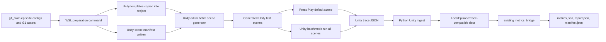

# feat: Add Unity Scene Telemetry and Out-of-Box Validation

## Summary

Make Unity a first-class validation front end without making it the metrics source of truth. The best option is for Unity to auto-generate/import the test scenes, run them in Play Mode or batchmode, write JSON traces compatible with the existing local runner, and let the Python benchmark pipeline compute `metrics.json`, `report.json`, and `manifest.json`.

This keeps Press Play easy for visual/debug work while keeping terminal runs reproducible and aligned with `asimovbm-local`.

---

## Problem Frame

The current Unity integration proves that the MuJoCo plug-in loads and can show a robot, but the scene still needs manual setup, visual repair, and a reliable answer to "is the robot actually moving?" The benchmark already has the right JSON artifact and metrics pipeline in Python; duplicating that logic in Unity would increase drift just when the test scenes need to become reliable.

---

## Assumptions

*This plan was authored without a blocking confirmation step. The items below are implementation bets that should be reviewed before execution proceeds.*

- The branch `paper-sub` is the canonical working branch for this repo.
- Unity project files should be generated from repo-managed templates and scripts instead of hand-edited directly in the plan.
- The first complete Unity validation path should prioritize the real G1 MJCF/motion assets already staged, then extend to richer USD visual parity after trace and movement proof are solid.
- Press Play can run one default configured scene and write a trace locally; terminal batchmode is the canonical path for running every scene and producing comparable reports.
- Python remains the only place where benchmark metrics and report aggregation are computed.

---

## Requirements

- R1. Every Unity scene used by the test suite must open and run out of the box after the WSL preparation command, without requiring manual MuJoCo import menu clicks.
- R2. Press Play in Unity must run a default validation scene, record whether robot motion actually occurred, write JSON trace data, and attempt the same Python metrics postprocess used by terminal runs.
- R3. A terminal command from WSL must run all configured Unity validation scenes in batchmode and collect artifacts without user interaction.
- R4. Unity trace JSON must map to the existing `LocalEpisodeTrace` / `LocalStepTrace` contract so the existing Python metric bridge computes `metrics.json`.
- R5. Run outputs must follow the existing local artifact shape: per-episode `trace.json`, per-episode `metrics.json`, run-level `report.json`, and `manifest.json`.
- R6. Technical Unity failures must be reported separately from behavioral failures, preserving the origin requirement that technical failures do not masquerade as bad robot behavior.
- R7. Visual setup must fix the current all-purple/no-shadow problem as part of scene generation or repair, not as a manual post-step.
- R8. Movement verification must prove robot or MuJoCo state change, not only that a diagnostic marker animates.
- R9. Existing `asimovbm-local` behavior and canonical six-episode validation path must remain unchanged unless explicitly extended.

**Origin actors:** none named in origin.
**Origin flows:** none named in origin.
**Origin acceptance examples:** none named in origin.

Relevant origin trace:

- Origin R4 maps to this plan's terminal-first core benchmark path.
- Origin R5-R6 map to preserving simulated-time traces and not using wall-clock Unity frame timing as metric truth.
- Origin R11-R13 map to separate technical failure handling.
- Origin R18-R19 and R25 map to valid episode counts, per-tier reporting, and reliability diagnostics.
- Origin R27 maps to keeping metric functions pure and feeding them through a trace-extraction layer.

---

## Scope Boundaries

- Do not rewrite metric formulas or duplicate benchmark scoring in C#.
- Do not replace `asimovbm-local` as the canonical Python/local validation launcher.
- Do not require the user to manually import MJCF files for each scene after preparation.
- Do not make full USD-to-Unity visual parity a blocker for JSON trace and metrics collection.
- Do not build a Unity dashboard, web UI, or participant-facing client in this pass.
- Do not solve black-box remote policy execution inside Unity; this plan is scene validation, telemetry, and artifact collection.

### Deferred to Follow-Up Work

- Full USD visual parity: material texture matching, rig polish, and side-by-side visual comparison against the original USD simulator.
- Real policy control in Unity: connect remote or Python policy endpoints after deterministic scene telemetry is working.
- Physical humans/obstacles in MuJoCo: keep overlay-first entities acceptable until imported bodies are available.
- CI-hosted Unity execution: useful later, but local Windows Unity batchmode is the first target.

---

## Context & Research

### Relevant Code and Patterns

- `src/asimovbm/local_runner/runner.py` already writes `trace.json`, `metrics.json`, `report.json`, and `manifest.json` for selected episodes.
- `src/asimovbm/local_runner/traces.py` defines the trace dataclasses Unity output should map into.
- `src/asimovbm/local_runner/metrics_bridge.py` computes metric results from traces and handles technical failures or insufficient evidence.
- `src/asimovbm/local_runner/cli.py` exposes `asimovbm-local` and should stay stable.
- `tests/local_runner/test_artifact_manifest.py` and `tests/local_runner/test_metric_extraction.py` show the expected artifact and trace contracts.
- `tools/unity/prepare_mujoco_unity_project.py` already stages the MuJoCo package, native DLL, G1 MJCF assets, and motion CSVs into the Unity project.
- `tests/tools/test_prepare_mujoco_unity_project.py` already exercises Unity preparation through temp-project fixtures.
- `docs/plans/2026-05-13-001-feat-mujoco-unity-integration-plan.md` completed the first smoke integration and should be treated as the foundation, not replaced.
- `final-rush-choices.md` says the local validation glue owns catalog loading, trace recording, metric invocation, artifact manifests, and final reporting.

### Institutional Learnings

- No `docs/solutions/` entries are present. `final-rush-choices.md` is the durable project guidance for episodic validation and metrics boundaries.

### External References

- MuJoCo Unity plug-in docs: `https://mujoco.readthedocs.io/en/latest/unity.html`
- Unity Test Framework command-line docs: `https://docs.unity.cn/Packages/com.unity.test-framework%401.3/manual/reference-command-line.html`

Key findings:

- The MuJoCo Unity plug-in is designed for Unity Editor/runtime to use MuJoCo physics while Unity owns assets, game logic, and simulation time.
- The plug-in imports MJCF scenes in the Editor and creates Unity components; at runtime `MjScene` steps MuJoCo in Unity fixed updates and synchronizes transforms.
- The docs explicitly warn that stable MuJoCo tags should match native binaries, and that `main` may not match the latest release binary.
- The importer has a programmatic editor API in the local package cache, so we can replace repeated UI import steps with repo-managed Editor automation.
- Unity's command-line test runner supports batchmode test execution with `-runTests`, `-testPlatform`, and `-testResults`.

---

## Key Technical Decisions

- Python remains the metrics source of truth: this avoids two scoring implementations and preserves the pure metric-library boundary from the origin requirements.
- Unity emits traces, not final benchmark scores: Unity is responsible for scene setup, MuJoCo state sampling, visual validation, and technical failure capture.
- Add a Unity-specific ingest path rather than changing metric formulas: Python should validate and normalize Unity trace JSON into existing trace dataclasses before invoking `metrics_bridge`.
- Generate scenes from a manifest: all test scenes should be declarative inputs that the preparation tool and Unity batch runner can regenerate.
- Make terminal batchmode canonical and Press Play convenient: terminal runs prove every scene and collect reports; Press Play runs the selected/default scene and writes the same trace format for quick debugging.
- Put Unity C# under repo-managed templates: WSL tooling can copy deterministic files into the Unity project, while the repo remains reviewable and testable.
- Verify real movement through MuJoCo state deltas: a scene passes movement validation only when sampled robot root pose, qpos, qvel, or target body transforms change as expected.

---

## Open Questions

### Resolved During Planning

- Should Unity compute metrics directly? No. It should write compatible trace JSON and let Python compute metrics and reports.
- Should the user keep importing scenes manually? No. The next pass should add editor/batch automation so generated scenes are ready after preparation.
- Should visual repair stay a manual menu step? No. It should become part of scene generation and repair automation.

### Deferred to Implementation

- Exact Unity settings asset shape: decide while implementing based on the least brittle way to store repo path, artifact path, and default scene selection.
- Exact Play Mode metric postprocess mechanism: prefer an Editor-only bridge that invokes the Python ingest command from the generated Unity settings; if Windows/WSL path handling is unreliable, Press Play must still write traces and explain the postprocess failure in the Unity log.
- How much of the original USD materials can be reconstructed automatically from available assets: inspect imported material/mesh metadata before promising full parity.

---

## Output Structure

Expected repo-managed files:

```text
tools/unity/
  prepare_mujoco_unity_project.py
  run_unity_validation.py
  templates/
    Assets/AsimovBM/Editor/
    Assets/AsimovBM/Scripts/
    Assets/AsimovBM/Tests/EditMode/
    Assets/AsimovBM/Tests/PlayMode/

src/asimovbm/local_runner/
  unity_ingest.py
  unity_runner.py

tests/tools/
  test_prepare_mujoco_unity_project.py
  test_run_unity_validation.py

tests/local_runner/
  test_unity_ingest.py

docs/
  run-mujoco-unity.md
```

Expected generated Unity-project layout after preparation:

```text
Assets/AsimovBM/
  Editor/
  Scripts/
  Tests/EditMode/
  Tests/PlayMode/
  MuJoCo/
    Models/
    Motions/
    SceneManifest.json
  GeneratedScenes/
  RuntimeSettings/
```

Expected artifact layout:

```text
artifacts/unity-validation/<run-id>/
  manifest.json
  report.json
  <scene-or-episode-id>/iteration-XXX/trace.json
  <scene-or-episode-id>/iteration-XXX/metrics.json
  unity-test-results.xml
  unity-editor.log
```

---

## High-Level Technical Design

> *This illustrates the intended approach and is directional guidance for review, not implementation specification. The implementing agent should treat it as context, not code to reproduce.*



Runtime responsibilities:

- Unity scene runner: select scene config, reset MuJoCo state, apply reference motion or scene action, sample qpos/qvel/root pose/entities/status each fixed step, and write raw trace JSON.
- Unity movement verifier: compare sampled state over time and mark technical failure if the model is static when movement is expected.
- Python ingest: validate Unity trace fields, normalize coordinate conventions, instantiate the local trace model, call the existing metric bridge, and write canonical artifacts.
- Terminal wrapper: prepare Unity if needed, run Unity batchmode scenes/tests, invoke Python ingest, and print artifact paths.

---

## Implementation Units

### U1. Define Unity Scene Manifest and Trace Contract

**Goal:** Create a declarative contract for which Unity scenes exist, what model/motion they use, and how their output maps into the Python trace schema.

**Requirements:** R1, R4, R5, R8

**Dependencies:** None

**Files:**
- Create: `tools/unity/templates/Assets/AsimovBM/MuJoCo/SceneManifest.json`
- Create: `src/asimovbm/local_runner/unity_ingest.py`
- Create: `tests/local_runner/test_unity_ingest.py`
- Modify: `docs/run-mujoco-unity.md`
- Modify: `final-rush-choices.md`

**Approach:**
- Define a small scene manifest that names each generated Unity validation scene, source MJCF, optional motion clip, expected movement mode, and canonical episode metadata.
- Add a Python ingest layer that accepts Unity-emitted JSON and produces the same artifact shape as the local runner.
- Treat Unity-specific diagnostics as metadata, while keeping core trace fields aligned with `LocalStepTrace`.
- Preserve existing local runner status semantics and technical validity handling.

**Patterns to follow:**
- `src/asimovbm/local_runner/traces.py`
- `src/asimovbm/local_runner/metrics_bridge.py`
- `tests/local_runner/test_artifact_manifest.py`

**Test scenarios:**
- Happy path: a sample Unity trace with moving root pose is ingested and produces `trace.json` plus `metrics.json`.
- Happy path: a sample Unity trace with qpos/qvel but no humans computes available motion metrics and marks unavailable human metrics honestly.
- Error path: malformed Unity trace JSON is rejected before metrics computation.
- Error path: a technical Unity failure produces insufficient-evidence metrics rather than behavioral penalties.

**Verification:**
- Python tests prove Unity trace ingest can feed the existing metric bridge without changing metric formulas.

---

### U2. Move Unity C# Into Repo-Managed Templates

**Goal:** Make Unity scripts, tests, and editor automation reviewable in this repo and reproducibly copied into the Unity project.

**Requirements:** R1, R3, R7, R9

**Dependencies:** U1

**Files:**
- Modify: `tools/unity/prepare_mujoco_unity_project.py`
- Modify: `tests/tools/test_prepare_mujoco_unity_project.py`
- Create: `tools/unity/templates/Assets/AsimovBM/Editor/AsimovBM.Editor.asmdef`
- Create: `tools/unity/templates/Assets/AsimovBM/Editor/AsimovMujocoSceneAutomation.cs`
- Create: `tools/unity/templates/Assets/AsimovBM/Scripts/AsimovBM.MujocoRuntime.asmdef`
- Create: `tools/unity/templates/Assets/AsimovBM/Scripts/AsimovUnityTraceRecorder.cs`
- Create: `tools/unity/templates/Assets/AsimovBM/Scripts/AsimovG1MotionPlayer.cs`

**Approach:**
- Replace one-off Unity project script edits with template copying from `tools/unity/templates/`.
- Keep the existing G1 motion player behavior but add trace recorder and movement proof components.
- Ensure the preparation script can run idempotently and report which Unity template files changed.

**Patterns to follow:**
- Existing `tools/unity/prepare_mujoco_unity_project.py` staging functions.
- Existing Unity scripts currently staged under `Assets/AsimovBM/`.

**Test scenarios:**
- Happy path: preparation copies all template files into a temporary Unity-like project.
- Edge case: rerunning preparation with unchanged templates is idempotent.
- Error path: missing template directory fails with a clear preparation error.

**Verification:**
- `pytest tests/tools/test_prepare_mujoco_unity_project.py` covers template staging and existing MuJoCo asset staging.

---

### U3. Generate and Repair Unity Test Scenes Automatically

**Goal:** Ensure the test scenes are generated, imported, lit, material-repaired, and saved without manual Editor menu steps.

**Requirements:** R1, R7, R8

**Dependencies:** U1, U2

**Files:**
- Create: `tools/unity/templates/Assets/AsimovBM/Editor/AsimovMujocoSceneGenerator.cs`
- Create: `tools/unity/templates/Assets/AsimovBM/Editor/AsimovMujocoVisualRepair.cs`
- Modify: `tools/unity/prepare_mujoco_unity_project.py`
- Modify: `docs/run-mujoco-unity.md`

**Approach:**
- Use the MuJoCo importer API from an Editor script to import MJCF assets and save generated scenes under `Assets/AsimovBM/GeneratedScenes/`.
- Attach runtime trace, movement proof, camera, lighting, and material repair components during generation.
- Configure materials with valid URP shaders and neutral robot/floor colors so models are distinguishable.
- Keep a manual menu item as a recovery tool, but make preparation and batchmode generation the normal path.

**Patterns to follow:**
- `tools/unity/templates/Assets/AsimovBM/Editor/AsimovMujocoSceneAutomation.cs`
- MuJoCo package importer behavior from the local package cache.

**Test scenarios:**
- Integration: batch scene generation imports the quick kinematic model and real G1 model when assets exist.
- Integration: generated scenes include one MuJoCo scene, one trace recorder, one movement verifier, lights, and a camera.
- Edge case: missing real G1 assets marks the real-G1 scene unavailable without breaking the kinematic smoke scene.
- Error path: importer exception is captured as a technical scene-generation failure with an artifact log.

**Verification:**
- Unity EditMode tests can load the generated scenes and assert required components are present.

---

### U4. Add Unity Runtime Trace Recording, Movement Proof, and Press Play Postprocess

**Goal:** Make Press Play answer whether movement is actually happening and produce reusable trace and metrics artifacts whenever the local Python bridge is available.

**Requirements:** R2, R4, R6, R8

**Dependencies:** U1, U2, U3

**Files:**
- Create: `tools/unity/templates/Assets/AsimovBM/Scripts/AsimovUnityTraceRecorder.cs`
- Create: `tools/unity/templates/Assets/AsimovBM/Scripts/AsimovUnityMovementVerifier.cs`
- Modify: `tools/unity/templates/Assets/AsimovBM/Scripts/AsimovG1MotionPlayer.cs`
- Create: `tools/unity/templates/Assets/AsimovBM/Tests/PlayMode/AsimovUnitySceneTelemetryTests.cs`

**Approach:**
- Subscribe to MuJoCo post-step events and sample simulated time, robot pose, qpos, qvel, action source, collision/contact summary, scene status, and diagnostics.
- Compute a movement proof from state deltas over the run window and mark static-when-moving-expected as a technical failure.
- Write one raw Unity trace per scene run and include enough metadata for Python ingest to normalize it.
- For Press Play, write artifacts to a predictable project-local output directory, invoke the Python ingest bridge from Editor context, and log both trace and metric/report paths.
- If the Python bridge cannot run from Unity, preserve the trace artifact and surface the postprocess error as a technical diagnostic rather than silently succeeding.

**Patterns to follow:**
- Existing `AsimovG1MotionPlayer` post-update hook.
- MuJoCo package runtime tests using PlayMode test coroutines.

**Test scenarios:**
- Happy path: real G1 scene with motion CSV produces qpos/root deltas and a passing movement proof.
- Happy path: Press Play writes raw trace output and metrics output through the Python ingest bridge.
- Happy path: kinematic/static scene can pass only when its manifest says static motion is expected.
- Error path: a scene expected to move but producing no MuJoCo state delta is marked `technical_valid: false`.
- Error path: Python postprocess failure is logged and recorded without deleting the raw trace.
- Integration: PlayMode test writes a non-empty trace file for every generated scene.

**Verification:**
- Unity PlayMode tests fail if robot movement is expected but only the diagnostic marker moves.

---

### U5. Add WSL Terminal Runner for Unity Validation

**Goal:** Provide one WSL command that runs Unity batchmode, collects raw Unity traces, computes metrics, and writes benchmark artifacts.

**Requirements:** R3, R5, R6, R9

**Dependencies:** U1, U3, U4

**Files:**
- Create: `tools/unity/run_unity_validation.py`
- Create: `tests/tools/test_run_unity_validation.py`
- Create: `src/asimovbm/local_runner/unity_runner.py`
- Modify: `pyproject.toml`
- Modify: `README.md`
- Modify: `src/asimovbm/README.md`

**Approach:**
- Add a WSL-friendly wrapper that locates or accepts the Unity executable, converts WSL/Windows paths where needed, and runs Unity in batchmode.
- Run generated-scene validation through an Editor execute method or Unity Test Framework, then invoke Python ingest for every raw trace.
- Add a console entry point only if it keeps the command simpler than calling the script directly.
- Capture Unity logs and test result XML into the run artifact directory.

**Patterns to follow:**
- `src/asimovbm/local_runner/runner.py`
- `src/asimovbm/local_runner/artifacts.py`
- Existing CLI parser style in `src/asimovbm/local_runner/cli.py`

**Test scenarios:**
- Happy path: wrapper dry-run constructs the expected Unity batchmode invocation and ingest step.
- Happy path: sample raw traces are converted into the same manifest/report layout as local validation.
- Edge case: Unity executable not found produces an actionable error before any partial artifacts are written.
- Error path: Unity batchmode exits non-zero and the manifest records a technical failure/log path.

**Verification:**
- Python tests cover command construction, path conversion, dry-run behavior, and sample-trace report writing.

---

### U6. Add Unity EditMode and PlayMode Tests for Every Scene

**Goal:** Make "every scene in the tests works out of the box" an automated gate instead of a manual claim.

**Requirements:** R1, R2, R7, R8

**Dependencies:** U3, U4, U5

**Files:**
- Create: `tools/unity/templates/Assets/AsimovBM/Tests/EditMode/AsimovGeneratedSceneEditModeTests.cs`
- Create: `tools/unity/templates/Assets/AsimovBM/Tests/PlayMode/AsimovGeneratedScenePlayModeTests.cs`
- Create: `tools/unity/templates/Assets/AsimovBM/Tests/AsimovBM.Tests.asmdef`
- Modify: `tools/unity/run_unity_validation.py`
- Modify: `docs/run-mujoco-unity.md`

**Approach:**
- EditMode tests verify generated scene assets exist, load, have no missing scripts, include required MuJoCo/runtime components, and have repaired materials/lights.
- PlayMode tests run each generated scene for a bounded simulated interval and assert trace output, movement proof, and no Unity error logs.
- The terminal wrapper runs these tests before Python metrics ingest so broken scenes fail early.

**Patterns to follow:**
- MuJoCo package `Tests/Runtime/MjScenePlayTests.cs` pattern.
- Unity Test Framework command-line execution.

**Test scenarios:**
- Happy path: all manifest scenes load in EditMode and run in PlayMode.
- Error path: missing script or missing trace recorder fails the scene test.
- Error path: purple-material fallback or missing lighting fails the visual-readiness test.
- Error path: robot expected to move but static fails the PlayMode test.

**Verification:**
- `unity-test-results.xml` is present in each Unity validation run artifact directory.

---

### U7. Document the Press Play and Terminal Workflows

**Goal:** Give the user the smallest possible set of actions: run preparation, open Unity, press Play; or run one terminal command.

**Requirements:** R1, R2, R3, R5, R7

**Dependencies:** U1-U6

**Files:**
- Modify: `docs/run-mujoco-unity.md`
- Modify: `README.md`
- Modify: `src/asimovbm/README.md`
- Modify: `final-rush-choices.md`

**Approach:**
- Document the two supported flows: Press Play for the default scene with trace/metrics postprocess, and terminal command for all scenes plus reports.
- List only strictly necessary UI actions.
- Include troubleshooting for package compilation, native DLL load, static robot proof failure, material repair, and WSL/Windows path conversion.
- Update `final-rush-choices.md` so future agents know Unity validation is an additive artifact producer, not a metrics rewrite.

**Patterns to follow:**
- Existing `README.md` local validation section.
- Existing `docs/run-mujoco-unity.md` setup style.

**Test scenarios:**
- Documentation smoke: commands named in docs have matching CLI/script entry points.
- Documentation smoke: described artifact paths match generated paths from tests.

**Verification:**
- A new agent can follow docs without needing hidden context from this chat.

---

## System-Wide Impact

- **Interaction graph:** Unity scene generation and runtime recording feed Python ingest, which feeds the existing metric bridge and report builder.
- **Error propagation:** Unity importer/runtime/test failures become technical failures with logs; Python ingest refuses malformed traces; metrics run only for technically valid traces.
- **State lifecycle risks:** Batchmode runs must clean or isolate generated traces by run id so stale Press Play artifacts do not contaminate terminal reports.
- **API surface parity:** `asimovbm-local` remains unchanged; Unity validation gets a parallel command or wrapper that writes compatible artifact layouts.
- **Integration coverage:** Python unit tests prove trace ingest; Unity EditMode tests prove scene readiness; Unity PlayMode tests prove runtime stepping and movement.
- **Unchanged invariants:** Metric formulas, local episode catalog semantics, report aggregation, and technical-vs-behavioral failure separation remain intact.

---

## Risks & Dependencies

| Risk | Mitigation |
|------|------------|
| Unity cannot reliably run Python postprocess from Press Play because of WSL/Windows path differences. | Make terminal batchmode the canonical full-report path; Press Play still writes raw trace and logs postprocess failures clearly. |
| Generated Unity scenes drift from repo templates after manual edits. | Regenerate from manifest/templates and make tests validate generated scene contents. |
| Imported G1 visuals remain purple or poorly lit. | Move material/light repair into generation and add EditMode assertions for shader/material readiness. |
| Motion player changes qpos but visual hierarchy does not visibly update. | Movement verifier samples both MuJoCo state and Unity transforms; tests fail if only internal state changes. |
| Unity package API changes in future MuJoCo tags. | Keep MuJoCo version pinned and stage C# templates against the pinned package version. |
| Unity traces lack inputs needed for human-aware metrics. | Mark unavailable metrics `not_applicable` until overlay humans/entities are added; do not fake metric evidence. |

---

## Test Strategy

- Run Python unit tests for trace ingest, terminal wrapper dry-runs, artifact writing, and preparation template staging.
- Run Unity EditMode tests in batchmode to prove all generated scenes load and have required components/materials/lights.
- Run Unity PlayMode tests in batchmode to prove every scene can step, write trace JSON, and pass movement expectations.
- Run an end-to-end local smoke that writes `artifacts/unity-validation/<run-id>/manifest.json`, `report.json`, raw Unity logs, traces, and metrics.
- Keep a small fixture Unity trace in Python tests so metric ingest remains testable even when Unity is not available.

---

## Rollout Plan

1. Build trace contract and Python ingest first, with sample JSON fixtures.
2. Move existing Unity scripts into repo templates and make preparation copy them.
3. Add scene manifest and Editor scene generation for kinematic and real G1 scenes.
4. Add runtime trace recorder and movement proof.
5. Add WSL terminal wrapper and artifact collection.
6. Add Unity EditMode/PlayMode tests for all manifest scenes.
7. Update docs and `final-rush-choices.md`.

---

## Sources & References

- Origin requirements: `docs/brainstorms/2026-04-29-black-box-robotic-policy-benchmark-requirements.md`
- Prior Unity integration plan: `docs/plans/2026-05-13-001-feat-mujoco-unity-integration-plan.md`
- Final-rush benchmark decisions: `final-rush-choices.md`
- Active local runner docs: `README.md`, `src/asimovbm/README.md`
- MuJoCo Unity plug-in docs: `https://mujoco.readthedocs.io/en/latest/unity.html`
- Unity Test Framework command-line docs: `https://docs.unity.cn/Packages/com.unity.test-framework%401.3/manual/reference-command-line.html`
