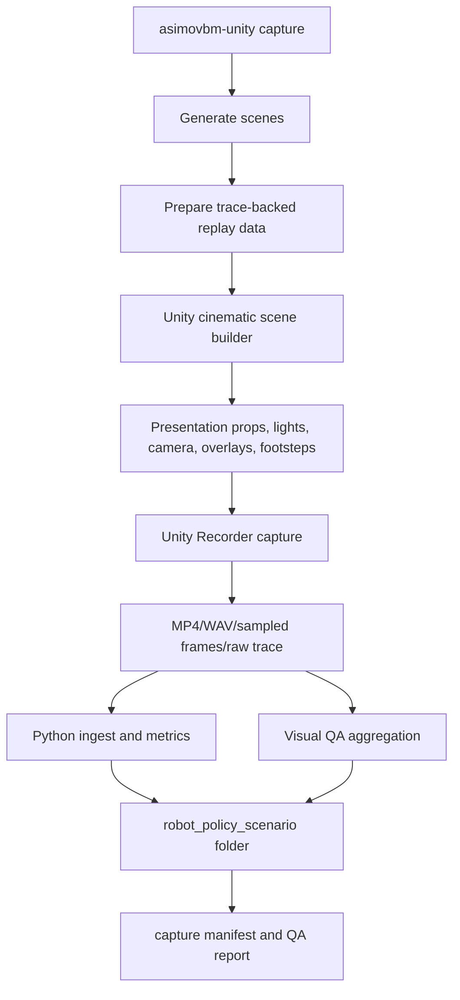
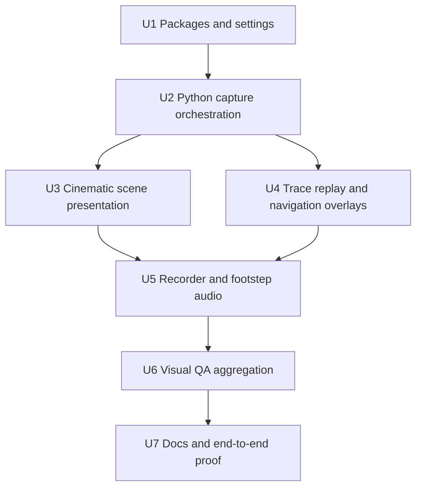

# feat: Add Unity Cinematic Capture and Visual QA

## Summary

Extend the existing Unity validation path into a capture pipeline: prepare scenes, apply a Unity-only presentation layer, record video/audio, collect traces and metrics, and run visual QA from sampled rendered frames. The plan keeps Python metrics as the benchmark source of truth while making Unity responsible for paper/demo media, camera/lighting polish, visible SLAM/path overlays, footstep audio, and visual failure evidence.

---

## Problem Frame

The current Unity integration proves that MuJoCo can run and emit trace data, but it cannot prove that the video is usable. A scene can be technically valid while the real G1 mesh is invisible, the navigation/path signal is missing, materials are broken, the camera is pointed at the wrong thing, or audio is absent.

---

## Requirements

- R1. The capture workflow must run from one WSL command without requiring the user to press Play or manually record scenes in Unity.
- R2. The workflow must write each scene's outputs into a stable folder named from the scene's robot, policy, and scenario identity.
- R3. Each capture folder must include the recorded video and the recorded audio evidence for that scene.
- R4. Each capture folder must include the associated trace and metrics artifacts so demo media remains tied to benchmark output.
- R5. Each capture folder must include sampled visual evidence, such as representative frames or thumbnails, so failures can be inspected without reopening the full video.
- R6. Generated scenes must use readable lighting, shadows, materials, and camera framing suitable for paper/demo review, not only technical simulation.
- R7. A scene that claims to show the real G1 robot must visibly show the real G1 mesh; a placeholder, invisible robot, or wrong robot should fail visual QA.
- R8. A scene that claims SLAM, trajectory, path, or goal behavior must expose a visible and changing signal for that behavior; absent or static SLAM/path evidence should fail visual QA.
- R9. The camera must keep the robot and relevant scenario context visible for the capture duration; blank frames, severe clipping, persistent occlusion, or framing that hides the robot should fail visual QA.
- R10. Unity presentation assets should make scenes visually credible with floors, walls, props, lighting, materials, and contextual meshes instead of relying on raw imported boxes as the final demo look.
- R11. Robot walking scenes must include footstep or locomotion audio that is timed closely enough to visible motion for demo use, and the capture workflow must record audio evidence alongside the video.
- R12. The workflow must analyze captured frames and audio evidence for obvious failures before declaring a capture successful.
- R13. Visual QA failures must identify the affected scene identity, the failure category, and the evidence needed for an agent or human to understand what went wrong.
- R14. Technical validation and visual validation must be reported separately: passing metrics or movement proof alone is not enough to mark a paper/demo capture as successful.
- R15. The project must include a guide for adding Unity-only meshes, materials, lights, cameras, props, and audio assets that improve video quality without damaging MuJoCo simulation behavior or benchmark metrics.

**Origin actors:** A1 Demo author, A2 Agent/operator, A3 Unity capture pipeline, A4 Benchmark pipeline.

**Origin flows:** F1 Headless cinematic capture, F2 Visual QA and iterative repair, F3 Unity-only scene enrichment.

**Origin acceptance examples:** AE1 capture folder outputs, AE2 missing real G1 visual failure, AE3 missing SLAM/path visual failure, AE4 bad camera/framing failure, AE5 render-only prop isolation, AE6 missing audio failure.

---

## Scope Boundaries

- Do not treat a metrics pass or movement proof as sufficient proof that a paper/demo video works.
- Do not require manual per-scene Unity recording as part of the normal workflow.
- Do not make full USD visual parity a blocker for the first capture pipeline.
- Do not replace the existing Python metrics pipeline or make Unity the source of benchmark scoring truth.
- Do not allow Unity presentation props to affect MuJoCo contacts or metrics unless a future requirement explicitly makes them physical simulation entities.
- Do not require hand-authored cinematic timelines for every scene in the first pass.
- Do not attempt subjective beauty scoring in the first pass beyond obvious visual, camera, material, robot-visibility, SLAM-signal, and audio checks.

### Deferred to Follow-Up Work

- Full USD material and lighting parity with the original simulator.
- A live Unity-native SLAM/controller implementation. First pass uses trace-backed replay and overlays so the video has visible navigation evidence without porting the full Python loop into C#.
- Human-rated aesthetic scoring or learned video-quality analysis.
- Final media muxing with external encoders when Unity Recorder cannot reliably include audio in the movie file; v1 may keep MP4 and WAV as separate artifacts.

---

## Context & Research

### Relevant Code and Patterns

- `src/asimovbm/local_runner/unity_runner.py` already finds the Windows Unity executable, builds batchmode Unity commands, copies Unity output logs, discovers raw Unity traces, and ingests them.
- `src/asimovbm/local_runner/unity_ingest.py` already normalizes Unity raw traces into `LocalEpisodeTrace`, writes per-scene trace/metrics files, and writes a Unity validation manifest/report.
- `tools/unity/prepare_mujoco_unity_project.py` already updates the Unity project, stages templates under `Assets/AsimovBM`, writes runtime settings, stages real G1 assets, and converts MimicKit motions to CSV.
- `tools/unity/templates/Assets/AsimovBM/Editor/AsimovMujocoSceneGenerator.cs` already imports manifest scenes programmatically and configures runtime recorder/motion-player components.
- `tools/unity/templates/Assets/AsimovBM/Editor/AsimovMujocoVisualRepair.cs` already repairs lit shaders, lights, ambient settings, and a review camera.
- `tools/unity/templates/Assets/AsimovBM/Scripts/AsimovUnityTraceRecorder.cs` already writes raw Unity trace JSON and can call Python postprocess.
- `src/asimovbm/local_runner/runner.py`, `catalog.py`, and `backends.py` already define the canonical six `g1_slam` episodes, robot selectors, backend IDs, traces, dynamic/static entities, and metrics artifact shape.
- `g1_slam/src/g1_slam/config.py` and `g1_slam/src/g1_slam/robojudo_backend.py` show existing visualization settings and optional trajectory markers.
- `docs/g1-slam-episode-configurations.md` documents that presentation visuals should not change the SLAM world or collision planning.

### Institutional Learnings

- No `docs/solutions/` entries are present in this repo. The durable local guidance is currently in `final-rush-choices.md`, `docs/run-mujoco-unity.md`, and the prior Unity plans.
- The active project branch is `paper-sub`; treat it as the main working branch for this effort.

### External References

- MuJoCo Unity plug-in docs: `https://mujoco.readthedocs.io/en/latest/unity.html`
- Unity Test Framework command-line docs: `https://docs.unity.cn/Packages/com.unity.test-framework%401.3/manual/reference-command-line.html`
- Unity Recorder package docs: `https://docs.unity.cn/Packages/com.unity.recorder%405.0/manual/index.html`
- Unity Movie Recorder docs: `https://docs.unity.cn/Packages/com.unity.recorder%404.0/manual/RecorderMovie.html`
- Unity Cinemachine package/manual docs: `https://docs.unity.cn/Manual/com.unity.cinemachine.html`
- Cinemachine Camera component docs: `https://docs.unity.cn/Packages/com.unity.cinemachine%403.1/manual/CinemachineCamera.html`

Key findings:

- Unity Recorder captures during Play Mode in the Unity Editor; it is not a standalone player/build feature.
- Recorder provides movie output and audio output paths. Movie Recorder supports H.264 MP4 and can include audio when its encoder/settings allow it; Audio Recorder can produce WAV evidence.
- Recorder can use camera/Game View sources, which fits a scripted capture camera.
- Cinemachine 3 is Unity's camera-composition package. It is appropriate for camera follow/orbit/framing when package resolution is clean, but the plan needs a scripted Camera fallback because capture should not be blocked by a camera package issue.

---

## Key Technical Decisions

- Extend `asimovbm-unity` instead of creating a parallel tool: the existing WSL-to-Windows Unity launcher, log copying, trace discovery, and ingest path are the correct foundation.
- Use a trace-backed cinematic replay path for v1 SLAM/path visibility: the video can show the real G1 mesh, robot trail, goal, static/dynamic entities, and navigation/path evidence from Python trace data without porting the Python SLAM loop into Unity C#.
- Keep live Unity simulation validation as a separate proof: existing PlayMode movement/trace tests still matter, but capture success requires visual QA in addition to technical validity.
- Analyze sampled rendered frames, not only the final video file: this avoids MP4 decoding dependencies and gives immediate evidence frames for user/agent inspection.
- Treat Unity presentation assets as render-only by default: decorative props, richer meshes, lights, materials, camera rigs, and audio improve the video without silently changing MuJoCo contacts or Python metrics.
- Use Unity Recorder for media capture, with graceful fallback behavior: prefer MP4 plus audio where Recorder supports it, but keep WAV audio evidence and sampled frames as first-class artifacts.
- Name capture folders from robot, policy/backend, and scenario identity: derive these from scene manifest and canonical episode/catalog metadata so output names remain stable and meaningful.

---

## Open Questions

### Resolved During Planning

- Recorder package strategy: use Unity Recorder as an Editor/batchmode dependency because official docs confirm it records Play Mode media in the Editor; pin the compatible package during implementation after Unity resolves it.
- Camera strategy: use Cinemachine when available, but keep a scripted camera fallback in the repo-managed templates.
- SLAM/path signal strategy: use trace-backed overlays for v1 rather than a live Unity-native SLAM port.
- Frame analysis strategy: sample rendered frames during capture and analyze those artifacts directly.
- Footstep timing strategy: start with deterministic motion/step-distance-based cue timing tied to visible locomotion; defer contact-perfect audio to later.

### Deferred to Implementation

- Exact Recorder package version and assembly reference names: confirm against the Unity package cache once Package Manager resolves the dependency.
- Exact capture duration and frame sample cadence per scene: tune while running the first real capture so videos are neither too short nor unnecessarily slow.
- Exact visual QA thresholds for contrast, robot frame coverage, magenta/error pixels, and overlay visibility: start conservative, then adjust from captured evidence.
- Whether Unity Recorder can include audio in MP4 reliably on this workstation: if not, keep WAV as the authoritative audio artifact and document the limitation.

---

## Output Structure

```text
src/asimovbm/local_runner/
  unity_capture.py
  unity_visual_qa.py

tools/unity/
  run_unity_capture.py
  templates/Assets/AsimovBM/
    Editor/
      AsimovCaptureBatchRunner.cs
      AsimovCinematicSceneBuilder.cs
      AsimovRecorderDriver.cs
    Scripts/
      AsimovTraceReplayController.cs
      AsimovNavigationOverlay.cs
      AsimovFootstepAudio.cs
      AsimovVisualQaProbe.cs
    Tests/EditMode/
      AsimovCaptureSceneEditModeTests.cs
    Tests/PlayMode/
      AsimovCapturePlayModeTests.cs

tests/local_runner/
  test_unity_capture.py
  test_unity_visual_qa.py

docs/
  run-mujoco-unity.md
  unity-presentation-assets.md
```

This tree is directional. The implementer may combine or split Unity template files if Unity assembly constraints make a smaller layout cleaner.

---

## High-Level Technical Design

> *This illustrates the intended approach and is directional guidance for review, not implementation specification. The implementing agent should treat it as context, not code to reproduce.*



The core split is intentional:

- Python owns episode identity, trace/metrics artifacts, output naming, and run-level manifests.
- Unity owns camera, presentation, media capture, and first-pass rendered-frame evidence.
- Visual QA bridges both: Unity can report scene/render visibility facts while Python aggregates them into a capture report that sits beside metrics.

---

## Implementation Units



### U1. Unity Capture Dependencies and Settings

**Goal:** Make the Unity project preparation step install and configure the packages/settings needed for cinematic capture without breaking the existing MuJoCo validation path.

**Requirements:** R1, R3, R6, R11, R14; supports F1.

**Dependencies:** None.

**Files:**
- Modify: `tools/unity/prepare_mujoco_unity_project.py`
- Modify: `tools/unity/templates/Assets/AsimovBM/Scripts/AsimovUnityRuntimeSettings.cs`
- Modify: `tools/unity/templates/Assets/AsimovBM/Editor/AsimovBM.Editor.asmdef`
- Modify: `tools/unity/templates/Assets/AsimovBM/Scripts/AsimovBM.MujocoRuntime.asmdef`
- Test: `tests/tools/test_prepare_mujoco_unity_project.py`

**Approach:**
- Extend the preparation workflow to add Unity Recorder and Cinemachine package dependencies when missing.
- Keep Recorder and Cinemachine isolated to capture/editor code. Runtime scene scripts should still compile if Cinemachine is unavailable by using the scripted camera fallback.
- Extend generated runtime settings with capture output root, default resolution/FPS/duration, frame sample cadence, and whether media capture should fail hard or degrade to screenshots/QA frames.
- Keep package updates idempotent and preserve existing Unity package manifest entries.

**Patterns to follow:**
- Existing MuJoCo package dependency update logic in `tools/unity/prepare_mujoco_unity_project.py`.
- Existing runtime settings write path in `write_unity_runtime_settings`.
- Existing test fixture style in `tests/tools/test_prepare_mujoco_unity_project.py`.

**Test scenarios:**
- Happy path: preparing a temp Unity project adds Recorder/Cinemachine dependencies while preserving existing dependencies.
- Happy path: rerunning preparation with matching dependencies is idempotent.
- Edge case: preparation can disable/skip capture dependency staging for environments that only need validation.
- Error path: malformed package manifest still fails before copying template files.
- Integration: staged runtime settings contain capture defaults and existing validation settings.

**Verification:**
- Unity project preparation leaves existing validation scenes runnable and makes capture-specific packages/settings available to generated scenes.

---

### U2. Python Capture Orchestration and Artifact Model

**Goal:** Add a WSL-friendly capture command that drives Unity, prepares inputs, discovers outputs, and writes stable `robot_policy_scenario` capture folders.

**Requirements:** R1, R2, R3, R4, R5, R13, R14; covers F1 and AE1.

**Dependencies:** U1.

**Files:**
- Create: `src/asimovbm/local_runner/unity_capture.py`
- Modify: `src/asimovbm/local_runner/unity_runner.py`
- Modify: `src/asimovbm/local_runner/unity_ingest.py`
- Modify: `pyproject.toml`
- Create: `tools/unity/run_unity_capture.py`
- Test: `tests/local_runner/test_unity_capture.py`
- Test: `tests/tools/test_run_unity_validation.py`

**Approach:**
- Extend the existing `asimovbm-unity` CLI with a capture mode rather than adding an unrelated command family.
- Build capture runs around a run ID and selected scene/episode IDs.
- Derive output folder names from robot selector, policy/backend identity, and scenario/episode ID. Use canonical episode metadata when the Unity scene maps to a known local episode.
- Allow capture to consume an existing local trace or generate a short local/reference trace before Unity capture when trace-backed replay is requested.
- Copy Unity media outputs, QA frames, raw traces, normalized traces, metrics, logs, and capture reports into the capture run directory.
- Keep the existing validation `run` mode unchanged.

**Patterns to follow:**
- `UnityRunConfig`, `build_unity_commands`, and `_copy_unity_outputs` in `src/asimovbm/local_runner/unity_runner.py`.
- `UnityIngestConfig` and manifest construction in `src/asimovbm/local_runner/unity_ingest.py`.
- `LocalRunConfig` artifact naming patterns in `src/asimovbm/local_runner/runner.py`.

**Test scenarios:**
- Happy path: a dry-run capture config builds generate/capture commands and includes expected Unity execute methods.
- Happy path: existing fake Unity capture outputs are copied into a `robot_policy_scenario` folder with media, frames, trace, metrics, and manifest entries.
- Edge case: folder naming remains stable when policy path is missing and backend ID must be used.
- Edge case: selecting a subset of scenes only creates capture records for selected identities.
- Error path: Unity capture completes but no media or frames are found, producing a capture error rather than a false success.
- Error path: technical trace ingestion failure is preserved separately from visual QA failure.
- Integration: capture mode can ingest raw Unity traces through the existing Unity ingest path without changing validation mode behavior.

**Verification:**
- A capture run produces a run-level manifest and per-scene folders that are understandable without opening Unity.

---

### U3. Cinematic Scene Presentation Layer

**Goal:** Generate scenes that look credible for paper/demo output using Unity-only presentation assets, while preserving MuJoCo physics and Python metrics.

**Requirements:** R6, R9, R10, R15; covers F3, AE4, AE5.

**Dependencies:** U1, U2.

**Files:**
- Modify: `tools/unity/templates/Assets/AsimovBM/MuJoCo/SceneManifest.json`
- Modify: `tools/unity/templates/Assets/AsimovBM/Scripts/AsimovUnitySceneManifest.cs`
- Modify: `tools/unity/templates/Assets/AsimovBM/Editor/AsimovMujocoSceneGenerator.cs`
- Modify: `tools/unity/templates/Assets/AsimovBM/Editor/AsimovMujocoVisualRepair.cs`
- Create: `tools/unity/templates/Assets/AsimovBM/Editor/AsimovCinematicSceneBuilder.cs`
- Test: `tools/unity/templates/Assets/AsimovBM/Tests/EditMode/AsimovCaptureSceneEditModeTests.cs`
- Test: `tests/tools/test_prepare_mujoco_unity_project.py`

**Approach:**
- Extend scene manifest entries with presentation metadata: scenario category, desired camera mode, environment preset, whether a real robot mesh is required, and whether navigation overlays are required.
- Add a cinematic builder that creates render-only environment objects: floor plane, wall/background bands, simple props, goal marker, route markers, material palette, lights, and optional visual-only proxy meshes.
- Put presentation objects on a dedicated layer or parent object and disable colliders/rigidbodies by default.
- Keep imported MuJoCo/MJCF objects intact. If a visual object needs to become physical, that should be a deliberate future change to simulation geometry, not a side effect of this unit.
- Improve camera defaults for each scene: target, distance, FOV, clipping, shadows, and fallback scripted follow/orbit framing.

**Patterns to follow:**
- `AsimovMujocoVisualRepair.ConfigureOpenScene` for current material/light repair.
- `scene_visuals.py` for the project convention that recording visuals should not change planning/collision behavior.
- Existing edit-mode tests that assert generated scenes load, renderable materials exist, and required runtime components are present.

**Test scenarios:**
- Happy path: generated scenes contain the presentation root, camera, lights, floor/context props, and renderable materials.
- Covers AE5. Happy path: presentation props are render-only by default and have no colliders/rigidbodies that would affect Unity physics or MuJoCo contacts.
- Covers AE4. Error path: missing capture camera or bad camera target fails edit-mode visual-readiness checks.
- Error path: any material using Unity's internal error shader fails visual-readiness checks.
- Integration: existing validation scene generation still writes scenes and EditorBuildSettings entries.

**Verification:**
- Generated scenes are visibly richer than the raw import and remain isolated from simulation contacts.

---

### U4. Trace Replay and Visible Navigation/SLAM Evidence

**Goal:** Make captured videos show the real robot, motion, goal, trajectory/path evidence, and scenario entities even when live Unity is not running the full Python SLAM loop.

**Requirements:** R4, R7, R8, R12, R13, R14; covers F1, F2, AE2, AE3.

**Dependencies:** U2, U3.

**Files:**
- Create: `tools/unity/templates/Assets/AsimovBM/Scripts/AsimovTraceReplayController.cs`
- Create: `tools/unity/templates/Assets/AsimovBM/Scripts/AsimovNavigationOverlay.cs`
- Create: `tools/unity/templates/Assets/AsimovBM/Scripts/AsimovVisualQaProbe.cs`
- Modify: `tools/unity/templates/Assets/AsimovBM/Scripts/AsimovG1MotionPlayer.cs`
- Modify: `tools/unity/templates/Assets/AsimovBM/Editor/AsimovMujocoSceneGenerator.cs`
- Modify: `src/asimovbm/local_runner/unity_capture.py`
- Test: `tools/unity/templates/Assets/AsimovBM/Tests/EditMode/AsimovCaptureSceneEditModeTests.cs`
- Test: `tools/unity/templates/Assets/AsimovBM/Tests/PlayMode/AsimovCapturePlayModeTests.cs`
- Test: `tests/local_runner/test_unity_capture.py`

**Approach:**
- Convert local/reference trace data into Unity-readable replay input for capture scenes.
- Drive the visible robot root from trace poses for cinematic replay while preserving joint motion from available G1 motion clips when appropriate.
- Add visible navigation overlays: start marker, goal marker, robot trail, path/trajectory line, static obstacles, dynamic obstacle positions, and optional lidar/scan hints when trace data contains them.
- Mark scenes that require real G1 visibility. Visual QA should fail if the required robot renderers are absent, disabled, too small in the frame, or not visible to the capture camera.
- Keep this replay path honest in metadata: it is a cinematic trace replay/visualization, not proof that Unity is running the Python SLAM loop internally.

**Patterns to follow:**
- `LocalStepTrace` fields in `src/asimovbm/local_runner/traces.py`.
- Static/dynamic entity payloads from `src/asimovbm/local_runner/backends.py`.
- Existing `AsimovG1MotionPlayer` model/qpos guard behavior.
- Existing movement proof metadata in `AsimovUnityTraceRecorder`.

**Test scenarios:**
- Covers AE2. Happy path: a scene requiring real G1 has visible robot renderers and passes robot-visibility QA.
- Covers AE2. Error path: a scene requiring real G1 but containing only a placeholder/static marker fails visual QA.
- Covers AE3. Happy path: replay trace creates visible goal and trajectory/path evidence that changes over captured samples.
- Covers AE3. Error path: a navigation scene with no visible overlay/path signal fails visual QA even if motion proof passes.
- Edge case: a trace with no dynamic entities still creates start/goal/trail overlays.
- Integration: trace replay does not change the normalized Python metrics generated from the original trace.

**Verification:**
- A video frame sequence can show what the robot is, where it is going, and whether navigation evidence is present.

---

### U5. Unity Recorder Capture and Footstep Audio

**Goal:** Record paper/demo media from Unity in batchmode, including video, audio evidence, sampled frames, and capture status.

**Requirements:** R1, R3, R5, R9, R11, R13; covers F1, F2, AE1, AE4, AE6.

**Dependencies:** U3, U4.

**Files:**
- Create: `tools/unity/templates/Assets/AsimovBM/Editor/AsimovCaptureBatchRunner.cs`
- Create: `tools/unity/templates/Assets/AsimovBM/Editor/AsimovRecorderDriver.cs`
- Create: `tools/unity/templates/Assets/AsimovBM/Scripts/AsimovFootstepAudio.cs`
- Modify: `tools/unity/templates/Assets/AsimovBM/Scripts/AsimovUnityRuntimeSettings.cs`
- Modify: `tools/unity/templates/Assets/AsimovBM/Editor/AsimovBM.Editor.asmdef`
- Test: `tools/unity/templates/Assets/AsimovBM/Tests/EditMode/AsimovCaptureSceneEditModeTests.cs`
- Test: `tools/unity/templates/Assets/AsimovBM/Tests/PlayMode/AsimovCapturePlayModeTests.cs`
- Test: `tests/local_runner/test_unity_capture.py`

**Approach:**
- Add an Editor batch runner that opens each capture scene, configures the capture camera, starts Play Mode recording, waits for capture completion, writes capture status, and exits with a meaningful code.
- Use Unity Recorder for MP4/movie output and audio/WAV evidence when available.
- Save sampled rendered frames during the capture from the capture camera, not by decoding the final video.
- Add a deterministic footstep audio source for walking scenes. First pass should tie cue timing to visible locomotion or trace-distance progression rather than requiring perfect contact detection.
- If Recorder cannot include audio in the movie file, do not fail the whole pipeline when WAV evidence exists and the report marks media composition clearly.
- Keep the existing PlayMode validation tests separate from the capture runner so validation remains fast.

**Patterns to follow:**
- `AsimovBatchRunner.GenerateScenes` for batchmode exception handling and Unity exit behavior.
- Existing Unity PlayMode test override pattern in `AsimovGeneratedScenePlayModeTests`.
- Official Recorder docs for Editor/Play Mode recording constraints.

**Test scenarios:**
- Covers AE1. Happy path: capture batch runner writes expected media/status paths for a fake or short scene.
- Covers AE6. Happy path: walking scene emits footstep cue events and records audio evidence.
- Covers AE6. Error path: missing audio evidence marks audio QA failed/incomplete.
- Covers AE4. Error path: capture status reports camera/framing failure when sampled frames show no robot coverage.
- Edge case: Recorder package unavailable produces a clear capture dependency failure, not a silent pass.
- Integration: capture runner coexists with existing scene generation and PlayMode trace validation.

**Verification:**
- A batch capture produces at least one playable video artifact, audio evidence, sampled frames, and capture status for each selected scene.

---

### U6. Visual QA Aggregation and Capture Reports

**Goal:** Turn Unity-produced media/status/frame evidence into a Python-side visual QA report and final capture manifest that distinguishes technical, metric, and visual failures.

**Requirements:** R5, R7, R8, R9, R11, R12, R13, R14; covers F2 and AE2-AE6.

**Dependencies:** U2, U4, U5.

**Files:**
- Create: `src/asimovbm/local_runner/unity_visual_qa.py`
- Modify: `src/asimovbm/local_runner/unity_capture.py`
- Modify: `src/asimovbm/local_runner/unity_ingest.py`
- Test: `tests/local_runner/test_unity_visual_qa.py`
- Test: `tests/local_runner/test_unity_capture.py`

**Approach:**
- Define a visual QA report that records scene identity, pass/fail status, categories, evidence paths, sampled-frame summaries, media presence, audio status, robot visibility status, overlay visibility status, camera/framing status, and material/render status.
- Aggregate Unity-side QA facts and Python-side artifact checks into the capture manifest.
- Keep visual QA separate from `technical_valid` and metric output. A capture can have technical metrics but fail visual QA, and the manifest should make that obvious.
- Use conservative first-pass checks:
  - media files exist and are non-empty;
  - sampled frames exist;
  - Unity reports robot/renderers and required overlays visible in camera;
  - no internal error shader or purple/material failure indicators;
  - frame luminance/contrast is not blank or near-monochrome;
  - required audio evidence exists for walking scenes.
- Preserve evidence frame paths so a human or agent can inspect failures directly.

**Patterns to follow:**
- Manifest/report construction style in `unity_ingest.py`.
- Artifact helper functions in `src/asimovbm/local_runner/artifacts.py`.
- Existing metric handling where technical failures produce explicit insufficient-evidence results rather than bogus scores.

**Test scenarios:**
- Covers AE2. Happy path: a report with hidden/missing real G1 marks visual QA failed while preserving technical metrics.
- Covers AE3. Happy path: missing path/goal overlay in a navigation scene marks visual QA failed.
- Covers AE4. Happy path: blank or low-contrast sampled frames mark visual QA failed.
- Covers AE6. Happy path: missing WAV/audio evidence for a walking scene marks audio QA failed.
- Edge case: incomplete Unity status JSON still yields an actionable visual QA error category.
- Integration: capture manifest includes technical status, metric paths, media paths, frame evidence, and visual QA status separately.

**Verification:**
- Capture reports explain what failed visually and point at the evidence needed to debug it.

---

### U7. Documentation, Asset Guide, and End-to-End Proof

**Goal:** Document the capture workflow and Unity-only asset rules, then validate the complete path on the Windows Unity project.

**Requirements:** R1-R15; covers F1-F3 and AE1-AE6.

**Dependencies:** U1-U6.

**Files:**
- Modify: `docs/run-mujoco-unity.md`
- Create: `docs/unity-presentation-assets.md`
- Modify: `README.md`
- Modify: `src/asimovbm/README.md`
- Test: `tests/tools/test_run_unity_validation.py`
- Test: `tests/local_runner/test_unity_capture.py`

**Approach:**
- Update the Unity runbook with the capture command, expected output layout, media artifacts, visual QA report, common failure categories, and how to rerun after fixes.
- Add a dedicated Unity presentation asset guide:
  - where Unity-only assets live;
  - how to add meshes/materials/prefabs;
  - how to keep props render-only;
  - how to verify no colliders/rigidbodies or MJCF edits were introduced accidentally;
  - when a visual object must instead become a MuJoCo simulation object;
  - how to add footstep/audio assets safely.
- Include guidance for diagnosing current observed failures: real G1 not visible, SLAM/path not visible, purple materials, no shadows, missing audio, bad framing.
- Run and record one end-to-end capture proof after implementation, with the artifact path and remaining limitations noted in the final execution summary.

**Patterns to follow:**
- Existing concise runbook style in `docs/run-mujoco-unity.md`.
- Existing README sections for local and Unity validation.

**Test scenarios:**
- Documentation smoke: runbook references the actual capture CLI and artifact layout used by tests.
- Documentation smoke: asset guide states render-only defaults and explicitly warns against modifying MuJoCo contacts/metrics through Unity-only props.
- Integration: a dry-run capture or fixture-backed capture produces documentation-consistent output names.

**Verification:**
- A new implementer can add a visual mesh safely and run capture without asking how Unity-only presentation relates to MuJoCo simulation.

---

## System-Wide Impact

- **Interaction graph:** Python capture orchestration launches Unity, Unity writes media/QA/raw traces, Python ingests traces and aggregates visual QA into capture manifests.
- **Error propagation:** Unity batch failures should fail the capture run. Visual failures should fail visual QA but remain distinct from metric/technical failures.
- **State lifecycle risks:** Stale Unity temp traces/media can cause false positives; capture mode must clear or scope previous outputs by run ID before ingesting.
- **API surface parity:** Existing `asimovbm-local` and `asimovbm-unity run` behavior must remain stable.
- **Integration coverage:** Fixture-backed Python tests cover artifact contracts; Unity EditMode/PlayMode tests cover generated scene components; one manual/agent-executed end-to-end run validates real Unity media output.
- **Unchanged invariants:** Python metrics remain computed from trace artifacts. Unity-only presentation props do not become simulation geometry by default.

---

## Risks & Dependencies

| Risk | Mitigation |
|------|------------|
| Unity Recorder package or assembly names differ from docs/package cache. | Keep Recorder isolated in editor capture code, verify package resolution during implementation, and fail capture dependency checks clearly. |
| Recorder audio is not embedded reliably in MP4. | Treat WAV/audio evidence as first-class and do not require MP4 audio embedding for v1 success if WAV exists. |
| Visual QA thresholds are too strict or too weak. | Start with conservative, obvious checks and always save evidence frames for human/agent review. |
| Trace replay is mistaken for live Unity SLAM. | Label replay/cinematic mode in manifests and docs; keep live Unity validation proof separate. |
| Presentation assets accidentally affect simulation. | Put presentation objects under a dedicated root/layer, disable colliders by default, and test for render-only constraints. |
| Real G1 mesh import remains broken even though capture infrastructure works. | Visual QA should fail with evidence frames; fixing the import/material path remains part of iterative execution under this plan. |
| Batchmode media capture behaves differently from Editor Play. | Keep capture logs, sampled frames, and status JSON; make dry-run and fallback screenshot modes easy to inspect. |

---

## Alternative Approaches Considered

- Port the Python SLAM loop into Unity C#: Rejected for v1 because it is high effort and risks diverging from the Python benchmark. Trace-backed replay gives visible navigation evidence faster while preserving metrics truth.
- Decode final MP4 for visual QA: Deferred because it adds another media dependency and can hide failures behind encoding issues. Capturing sampled rendered frames directly is simpler and more debuggable.
- Use external screen recording tools: Rejected because they are harder to automate from WSL, weaker for artifact naming, and poor at producing structured QA evidence.
- Full USD visual parity before capture: Deferred because the current urgent problem is proving and debugging visible Unity output. Parity can build on the capture/QA loop.

---

## Success Metrics

- A single capture run creates per-scene folders named by robot, policy/backend, and scenario identity.
- Each successful capture folder contains video, audio evidence, sampled frames, trace, metrics, and visual QA report artifacts.
- A scene with missing real G1 visibility fails visual QA even if movement proof or metrics exist.
- A navigation scene with missing path/goal/SLAM evidence fails visual QA.
- Unity-only presentation props can be added without changing normalized trace/metrics output.

---

## Phased Delivery

- Phase 1: Package/settings and Python capture orchestration with fixture-backed tests.
- Phase 2: Unity presentation, trace replay overlays, and capture runner.
- Phase 3: Visual QA aggregation and documentation.
- Phase 4: Real Unity end-to-end capture run, evidence review, and iterative fixes for visible G1/SLAM/camera/material/audio failures.

---

## Documentation / Operational Notes

- Update docs to state that capture mode is for paper/demo output and visual QA, while validation mode remains the technical trace/metrics proof.
- Document that Recorder is an Editor/Play Mode workflow and requires the Unity project not to be open in another Editor instance during batchmode capture.
- Document the expected artifact layout and which files should be inspected when a capture fails.
- Document Unity-only asset rules in a way that a future contributor can follow without damaging MuJoCo simulation behavior.

---

## Sources & References

- **Origin document:** [docs/brainstorms/2026-05-13-unity-cinematic-capture-visual-qa-requirements.md](../brainstorms/2026-05-13-unity-cinematic-capture-visual-qa-requirements.md)
- Prior Unity integration plan: [docs/plans/2026-05-13-001-feat-mujoco-unity-integration-plan.md](2026-05-13-001-feat-mujoco-unity-integration-plan.md)
- Prior Unity telemetry plan: [docs/plans/2026-05-13-002-feat-unity-scene-telemetry-plan.md](2026-05-13-002-feat-unity-scene-telemetry-plan.md)
- Unity runbook: [docs/run-mujoco-unity.md](../run-mujoco-unity.md)
- Scene manifest template: [tools/unity/templates/Assets/AsimovBM/MuJoCo/SceneManifest.json](../../tools/unity/templates/Assets/AsimovBM/MuJoCo/SceneManifest.json)
- Unity runner: [src/asimovbm/local_runner/unity_runner.py](../../src/asimovbm/local_runner/unity_runner.py)
- Unity ingest: [src/asimovbm/local_runner/unity_ingest.py](../../src/asimovbm/local_runner/unity_ingest.py)
- Unity preparation tool: [tools/unity/prepare_mujoco_unity_project.py](../../tools/unity/prepare_mujoco_unity_project.py)
- Unity Recorder docs: `https://docs.unity.cn/Packages/com.unity.recorder%405.0/manual/index.html`
- Unity Movie Recorder docs: `https://docs.unity.cn/Packages/com.unity.recorder%404.0/manual/RecorderMovie.html`
- Unity Cinemachine docs: `https://docs.unity.cn/Manual/com.unity.cinemachine.html`
- Cinemachine Camera docs: `https://docs.unity.cn/Packages/com.unity.cinemachine%403.1/manual/CinemachineCamera.html`
