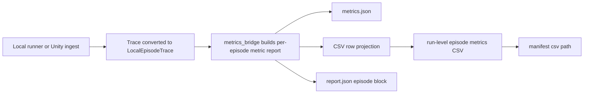

# feat: Export Per-Episode Metric CSVs

## Summary

Add a run-level CSV export alongside the existing JSON artifacts. Each run gets one incrementally named CSV file, updated as episode metrics are produced, with one row per episode iteration and stable columns for the four macro axis scores plus the current 16 social-navigation submetric scores.

---

## Problem Frame

The benchmark already writes per-episode `metrics.json` files and a run-level `report.json`, but comparing runs still requires opening nested JSON. The CSV export should make every episode/run easy to inspect in a spreadsheet without changing the metric formulas, aggregation weights, or JSON artifact contract.

---

## Assumptions

*This plan was authored without a blocking confirmation step. The items below are implementation bets that should be reviewed before execution proceeds.*

- "Main four metrics" means the current macro axis scores: `perceived_dexterity`, `perceived_safety`, `perceived_social_awareness`, and `impression`.
- "Submetrics" means the current metric registry order in `SOCIAL_NAVIGATION_METRIC_IDS`, which is 16 features in the active v1 spec rather than the older 12-feature draft.
- CSV score columns should contain normalized `[0, 1]` scores so macro and submetric values are comparable; raw values, status, confidence, reasons, and omitted-feature details remain available in `metrics.json` and `report.json`.
- Each run keeps its CSV under that run's artifact directory as `episode-metrics-<NNN>.csv`, while `<NNN>` is allocated by scanning existing matching CSV files under the artifact root and incrementing from the largest number found.

---

## Requirements

- R1. Each completed episode iteration in a validation run must produce one CSV row containing run identity, episode identity, iteration, technical status, terminal status, the four macro axis score values, and all current submetric score values.
- R2. The CSV column set and ordering must be stable across local and Unity runs, using the metric package's axis and feature constants rather than duplicating handwritten lists.
- R3. The CSV export must not alter existing metric computation, aggregation weights, per-episode `metrics.json`, run-level `report.json`, or `manifest.json` semantics except to add a CSV artifact pointer.
- R4. A run must use one CSV file that is updated as episode metrics are produced, so a partially completed sequential run still leaves rows for episodes already processed.
- R5. CSV filenames must be monotonic within an artifact root by finding the largest existing matching number and allocating the next one, avoiding accidental overwrite when runs are repeated.
- R6. The local runner and Unity ingest path must write equivalent CSV rows from the same metric report shape.
- R7. Missing, not-applicable, or insufficient-evidence scores must not be represented as `0`; the CSV should distinguish absence from a true zero score.

Relevant origin trace:

- Origin R3 requires the four Miro macro indicators to structure reporting.
- Origin R19 requires aggregate results and per-breakdown visibility, which this plan supports at episode granularity.
- Origin R21-R24 and the 2026-05-07 revision define the current feature set feeding those macro indicators.
- Origin R26 requires a feature-by-axis weight matrix with cross-effects; the CSV exports the resulting axis scores without redefining the matrix.
- Origin R27 keeps metric functions pure and simulator-agnostic; the CSV export is a reporting projection after metrics are computed.

---

## Scope Boundaries

- Do not change metric formulas, normalization constants, or aggregation weights.
- Do not replace `metrics.json` or `report.json`; the CSV is an additional convenience artifact.
- Do not add spreadsheet dependencies such as pandas; Python's standard `csv` module is sufficient.
- Do not add run-level averaging, leaderboard ranking, or subjective-rater columns in this pass.
- Do not collapse missing or not-applicable metrics into numeric zero.
- Do not build a UI or dashboard for reading the CSV.

### Deferred to Follow-Up Work

- Optional raw-value CSV columns: useful later if spreadsheet users need both normalized scores and raw units, but it would widen the first export and complicate the "value per metric" ask.
- Cross-run summary CSV: the current request asks for one file per run, not a continuously appended master export.
- CSV import/analysis tooling: downstream plotting or statistics scripts can build on the artifact after the export contract is stable.

---

## Context & Research

### Relevant Code and Patterns

- `src/asimovbm/local_runner/runner.py` writes local per-episode `metrics.json`, then builds `report.json` and `manifest.json`.
- `src/asimovbm/local_runner/unity_ingest.py` mirrors the local artifact shape for Unity raw traces and already builds metric reports through the same bridge.
- `src/asimovbm/local_runner/artifacts.py` centralizes run-directory creation, JSON writes, and run-relative paths.
- `src/asimovbm/local_runner/metrics_bridge.py` produces the per-episode metric report shape containing `behavioral_metrics.axes` and `behavioral_metrics.features`.
- `src/asimovbm/reports/json_report.py` already projects `AxisScore` and `MetricValue` objects into stable report dictionaries.
- `src/asimovbm/metrics/models.py` defines `SOCIAL_NAVIGATION_AXIS_IDS` and `SOCIAL_NAVIGATION_METRIC_IDS`; tests assert there are four axes and 16 current features.
- `tests/local_runner/test_artifact_manifest.py` and `tests/local_runner/test_unity_ingest.py` are the main fixtures for artifact contract coverage.
- `tests/metrics/test_metric_report_contract.py` verifies that behavioral metric blocks expose all axis and feature entries.
- `final-rush-choices.md` confirms Python remains the owner of metric invocation, artifact manifests, and final reporting.

### Institutional Learnings

- No `docs/solutions/` directory is present. `final-rush-choices.md` is the relevant durable guidance for this area.

### External References

- Not used. The feature is a local artifact/reporting extension using Python standard-library CSV support and existing repository patterns.

---

## Key Technical Decisions

- Build the CSV as a report projection, not a metric computation path: the row builder should consume the same metric report dictionaries already written to `metrics.json`.
- Derive metric columns from constants: axis columns come from `SOCIAL_NAVIGATION_AXIS_IDS`; submetric columns come from `SOCIAL_NAVIGATION_METRIC_IDS`, preserving the active 16-feature contract.
- Export normalized score values only in the first CSV contract: this gives one comparable numeric value per macro/submetric while keeping raw units and status metadata in JSON.
- Represent unavailable scores as empty CSV cells: empty cells preserve the distinction between "not available" and a true score of `0.0`.
- Allocate one incrementing CSV path per run: scan the artifact root for `episode-metrics-<NNN>.csv`, allocate the next sequence, write that path into the manifest, and reuse it for all rows in the run.
- Keep local and Unity parity: both paths should call the same CSV projection/writer so Unity does not drift from `asimovbm-local`.

---

## Open Questions

### Resolved During Planning

- Should the export include 12 or 16 submetrics? Use 16 because the 2026-05-07 requirements revision and current code supersede the old 12-feature plan.
- Should CSV export recalculate aggregation? No. It should read scores from existing metric reports generated by `metrics_bridge` and `json_report`.
- Should missing metric values become zero? No. Empty cells are safer because zero is a valid normalized score.

### Deferred to Implementation

- Exact string formatting for floats: pick a consistent non-lossy representation while implementing tests; do not round in a way that changes score meaning.

---

## High-Level Technical Design

> *This illustrates the intended approach and is directional guidance for review, not implementation specification. The implementing agent should treat it as context, not code to reproduce.*

The CSV writer should sit after metric report construction. It should not call individual metric functions, recalculate axis scores, or infer status from raw traces.

---

## Implementation Units

### U1. Add a CSV Row Projection for Metric Reports

**Goal:** Create the shared reporting helper that converts one episode metric report into stable CSV headers and row values.

**Requirements:** R1, R2, R3, R7

**Dependencies:** None

**Files:**
- Create: `src/asimovbm/reports/csv_report.py`
- Modify: `src/asimovbm/reports/__init__.py`
- Test: `tests/reports/test_csv_report.py`

**Approach:**
- Define the CSV header from fixed metadata columns, then `SOCIAL_NAVIGATION_AXIS_IDS`, then `SOCIAL_NAVIGATION_METRIC_IDS`.
- Read axis scores from `behavioral_metrics.axes` and feature scores from `behavioral_metrics.features`.
- Use `run_id`, `episode_id`, `iteration`, `tier_id`, `technical_valid`, and `terminal_status` from runner context and the metric report.
- Output empty strings for unavailable scores instead of numeric defaults.

**Patterns to follow:**
- `src/asimovbm/reports/json_report.py` for report-projection responsibilities.
- `tests/metrics/test_metric_report_contract.py` for axis/feature ordering expectations.

**Test scenarios:**
- Happy path: a metric report with all computed axis and feature scores produces one row with metadata columns followed by four axis score cells and 16 feature score cells in constant order.
- Edge case: a score of `0.0` is serialized as a real value, while `None` or absent scores serialize as empty cells.
- Edge case: missing optional episode title or tier metadata does not prevent row creation.
- Error path: malformed behavioral metric blocks fail clearly rather than silently emitting shifted or incomplete columns.

**Verification:**
- The helper can build headers and rows without importing local runner modules.
- Tests prove the CSV projection remains aligned with the metric constants.

---

### U2. Add Monotonic CSV Artifact Allocation

**Goal:** Provide a reusable artifact helper that allocates one incrementing CSV filename for a run without overwriting existing exports.

**Requirements:** R4, R5

**Dependencies:** None

**Files:**
- Modify: `src/asimovbm/local_runner/artifacts.py`
- Test: `tests/local_runner/test_csv_artifacts.py`

**Approach:**
- Add an artifact helper that scans the configured artifact root for `episode-metrics-<NNN>.csv`, extracts numeric suffixes, and returns the next run CSV path.
- Keep the final CSV inside the current `artifact_root/<run-id>/` directory so all artifacts for one run stay colocated.
- Return both absolute and run-relative path forms where needed so manifests can record portable paths.

**Patterns to follow:**
- `prepare_run_dir` and `relative_to_run` in `src/asimovbm/local_runner/artifacts.py`.
- Existing run artifact layout in `artifacts/local-validation/<run-id>/` and `artifacts/unity-validation/<run-id>/`.

**Test scenarios:**
- Happy path: an empty artifact root allocates the first numbered CSV path for a new run.
- Edge case: existing CSV files with lower and higher numbers cause allocation to choose highest-plus-one.
- Edge case: unrelated files or nonmatching names are ignored.
- Edge case: allocation creates or targets the run directory without disturbing existing `manifest.json`, `report.json`, or per-episode folders.

**Verification:**
- The helper is deterministic in tests and does not overwrite existing matching CSV files.

---

### U3. Integrate CSV Export into the Local Runner

**Goal:** Make `asimovbm-local` write and update the run CSV as each local episode iteration finishes.

**Requirements:** R1, R3, R4, R5, R7

**Dependencies:** U1, U2

**Files:**
- Modify: `src/asimovbm/local_runner/runner.py`
- Modify: `src/asimovbm/local_runner/cli.py`
- Modify: `tests/local_runner/test_artifact_manifest.py`
- Test: `tests/local_runner/test_metric_csv_export.py`

**Approach:**
- Allocate the CSV path once after the run directory is prepared.
- After each episode's metric report is written, append exactly one row to the run CSV so partial runs retain already-computed episode lines.
- Add `metrics_csv_path` to the manifest using a run-relative path.
- Print the CSV path from the CLI next to manifest and report paths.

**Patterns to follow:**
- The sequential record loop in `run_local_validation`.
- Manifest record conventions in `LocalRunRecord.to_manifest_entry`.
- CLI output style in `src/asimovbm/local_runner/cli.py`.

**Test scenarios:**
- Happy path: a one-episode local run writes a CSV with one data row and a manifest `metrics_csv_path`.
- Happy path: a multi-iteration or multi-episode local run writes one CSV file with one row per episode iteration.
- Edge case: a technical failure trace still writes a row with technical status and empty unavailable score cells.
- Integration: existing `trace.json`, `metrics.json`, `report.json`, and `manifest.json` tests continue to pass with the extra CSV artifact.

**Verification:**
- Local runs produce exactly one CSV file per run and no existing JSON artifact contract regresses.

---

### U4. Integrate CSV Export into Unity Ingest

**Goal:** Ensure Unity validation runs produce the same per-run CSV artifact from ingested Unity traces.

**Requirements:** R1, R2, R3, R4, R5, R6, R7

**Dependencies:** U1, U2

**Files:**
- Modify: `src/asimovbm/local_runner/unity_ingest.py`
- Modify: `src/asimovbm/local_runner/unity_runner.py`
- Modify: `tests/local_runner/test_unity_ingest.py`
- Modify: `tests/tools/test_run_unity_validation.py`

**Approach:**
- Use the same CSV projection and artifact allocation as the local runner.
- Write one row per ingested Unity trace after the metric report is written.
- Add the CSV path to the Unity manifest and surface it through the Unity CLI/runner result where existing report paths are printed.

**Patterns to follow:**
- `ingest_unity_trace_files` mirrors the local runner's artifact shape and should remain the only Unity-side metrics ingest path.
- `tests/local_runner/test_unity_ingest.py` already verifies metrics and report artifacts from a sample Unity trace.

**Test scenarios:**
- Happy path: ingesting one Unity trace writes a CSV row equivalent to the local runner row shape.
- Happy path: ingesting multiple Unity traces creates one CSV file with multiple rows, not one CSV per trace.
- Edge case: a technical failure Unity trace writes a row and keeps unavailable metric score cells empty.
- Integration: `run_unity_validation` with existing raw traces exposes the CSV artifact without requiring real Unity execution in tests.

**Verification:**
- Local and Unity CSV headers are identical.
- Unity CSV output does not bypass Python metric computation.

---

### U5. Document the CSV Artifact Contract

**Goal:** Make the new artifact discoverable for operators and future agents without changing the metric spec itself.

**Requirements:** R2, R3, R5, R7

**Dependencies:** U3, U4

**Files:**
- Modify: `src/asimovbm/README.md`
- Modify: `final-rush-choices.md`

**Approach:**
- Document where the CSV appears for local and Unity runs.
- Document that score columns are normalized `[0, 1]` values and empty cells mean unavailable/not applicable rather than zero.
- Document that JSON remains authoritative for status, confidence, reasons, raw values, and detailed aggregation metadata.

**Patterns to follow:**
- Existing artifact descriptions in `src/asimovbm/README.md`.
- Final-rush ownership boundaries in `final-rush-choices.md`.

**Test scenarios:**
- Test expectation: none -- documentation-only unit.

**Verification:**
- A reader can find the CSV path from CLI output or manifest and understand how to interpret empty score cells.

---

## System-Wide Impact

- **Interaction graph:** The change touches only reporting/export surfaces after metric computation; traces, pure metric functions, aggregation weights, and scenario execution remain unchanged.
- **Error propagation:** Malformed metric report shapes should fail in the CSV projection tests and surface as export errors during local/Unity runs rather than producing shifted columns.
- **State lifecycle risks:** Incremental CSV updates introduce partial-run artifacts; this is intentional, but tests should ensure headers are written once and rows are not duplicated during normal sequential runs.
- **API surface parity:** `asimovbm-local`, `asimovbm-unity run`, and `asimovbm-unity ingest` should all expose the CSV path consistently.
- **Integration coverage:** Unit tests for the projection are not enough; local runner and Unity ingest tests must prove full artifact creation and manifest wiring.
- **Unchanged invariants:** `metrics.json` and `report.json` remain the authoritative structured outputs for metric status, confidence, and diagnostic metadata.

---

## Risks & Dependencies

| Risk | Mitigation |
|------|------------|
| Spreadsheet users mistake empty cells for zero. | Document empty-cell semantics and preserve JSON pointers for detailed status. |
| CSV columns drift from metric definitions. | Generate headers from `SOCIAL_NAVIGATION_AXIS_IDS` and `SOCIAL_NAVIGATION_METRIC_IDS`; cover with tests. |
| Incrementing filename allocation overwrites or skips unexpectedly. | Isolate allocation helper and test empty roots, existing numbered files, and nonmatching files. |
| Local and Unity exports diverge. | Share the same CSV projection/writer and assert header parity in tests. |
| A rerun with a reused `run_id` creates confusing artifact state. | Allocate a fresh monotonic CSV filename and record the exact path in the manifest. |

---

## Documentation / Operational Notes

- `asimovbm-local` and `asimovbm-unity` CLI output should include the CSV path so users do not need to inspect the manifest first.
- The manifest should record the CSV path relative to the run directory, matching existing `report_path` and record path conventions.
- `final-rush-choices.md` should note that the CSV is an export/reporting convenience and not a new aggregation source of truth.

---

## Sources & References

- **Origin document:** [docs/brainstorms/2026-04-29-black-box-robotic-policy-benchmark-requirements.md](docs/brainstorms/2026-04-29-black-box-robotic-policy-benchmark-requirements.md)
- Metric spec: [docs/specs/social-navigation-metrics.md](docs/specs/social-navigation-metrics.md)
- Final-rush guidance: [final-rush-choices.md](final-rush-choices.md)
- Local runner: [src/asimovbm/local_runner/runner.py](src/asimovbm/local_runner/runner.py)
- Unity ingest: [src/asimovbm/local_runner/unity_ingest.py](src/asimovbm/local_runner/unity_ingest.py)
- Metric bridge: [src/asimovbm/local_runner/metrics_bridge.py](src/asimovbm/local_runner/metrics_bridge.py)
- JSON report projection: [src/asimovbm/reports/json_report.py](src/asimovbm/reports/json_report.py)
- Metric models: [src/asimovbm/metrics/models.py](src/asimovbm/metrics/models.py)
