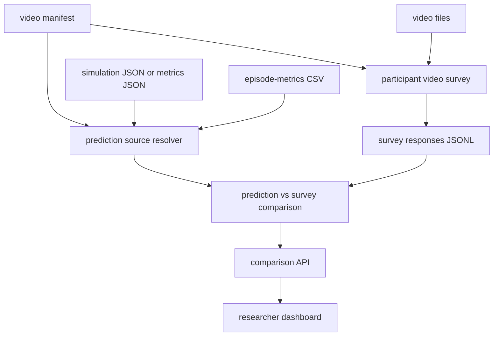
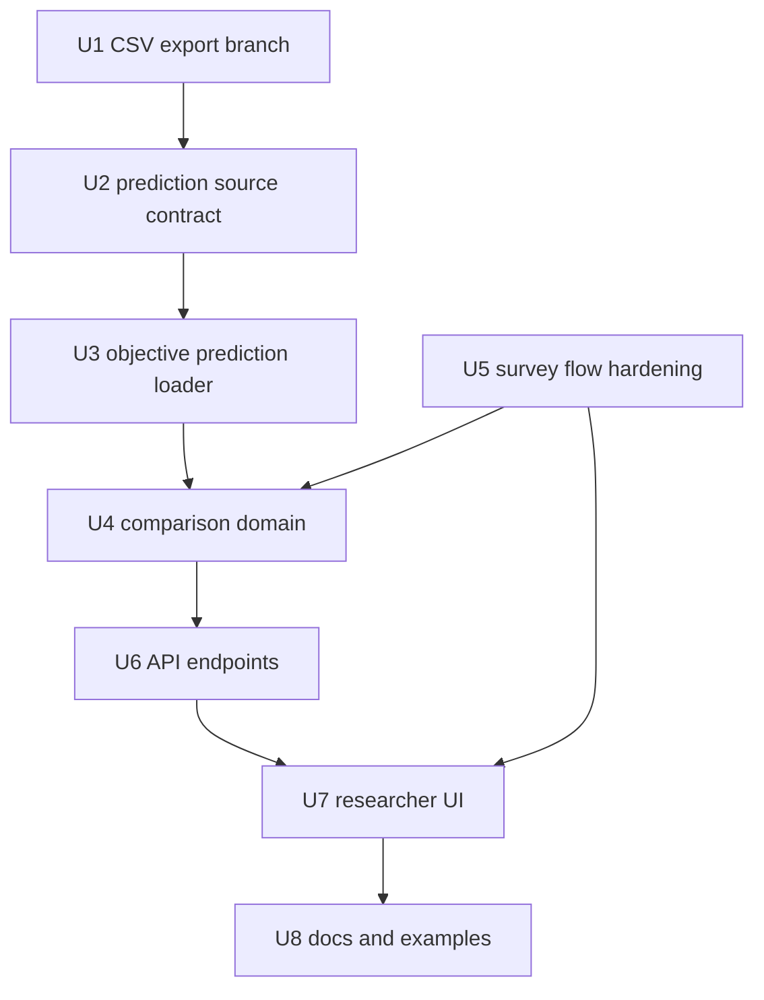

# feat: Compare predicted metrics with survey outcomes

## Summary

Extend the local webserver so each survey video can be linked to a simulation JSON or metrics artifact, derive the benchmark prediction for that episode, collect human Likert outcomes as the observed result, and show both sides in a researcher-facing comparison UI. The implementation should first bring in the episode metrics CSV export from `feat/run-metrics-csv-export@06ebccc`, then build a separate prediction/comparison layer that the webserver can serve without duplicating metric formulas.

---

## Problem Frame

The current webserver can inspect local metric artifacts and collect survey responses, but it does not yet connect a video to the simulation data that produced the objective prediction for that episode. For paper validation, each video needs two comparable values: the benchmark prediction derived from simulation JSON/metrics, and the actual human outcome aggregated from survey ratings.

---

## Assumptions

*This plan was authored without synchronous user confirmation. The items below are agent inferences that should be reviewed before implementation proceeds.*

- The CSV export commit to integrate is `06ebccc feat(local-runner): export episode metrics CSV` on branch `feat/run-metrics-csv-export`.
- "Prediction" means the benchmark-derived per-axis score for the video's episode, normalized to the survey scale `0..100` for comparison.
- "Real outcome" means aggregated survey responses for the same `video_id`, using the current four Likert questions and optional Q5 only as a validation item.
- Participant-facing survey pages must not show prediction values before or during rating, because that would bias responses.
- The first implementation should support current artifact shapes first: per-episode `metrics.json`, run-level `episode-metrics-NNN.csv`, and simulation/trace JSON that existing metric bridge code can already interpret or can be adapted with a small schema-specific adapter.

---

## Requirements

- R1. Integrate the episode metrics CSV export from `feat/run-metrics-csv-export@06ebccc` into the current `paper-sub` code without regressing the existing local runner, Unity ingest, webserver, or survey tests.
- R2. Extend the survey video manifest so every video can declare a prediction source: per-episode `metrics.json`, run-level `episode-metrics-NNN.csv`, or a simulation JSON file that can be converted into the same metric report shape.
- R3. Keep prediction loading separate from HTTP handlers and UI code. The prediction layer must expose pure, testable functions that resolve video-to-prediction mappings and convert objective scores to `0..100`.
- R4. Preserve the survey collection flow: show videos, record raw Likert `1..7`, persist mapped `0..100` answers, and keep participant metadata export working.
- R5. Add researcher-facing comparison APIs that return, per video and per policy/viewpoint/episode, predicted axis scores, survey axis means, global scores, absolute errors, rank correlation, and distribution similarity.
- R6. Add a nice but practical local UI that separates participant rating from researcher analysis, with clear video playback, prediction-vs-survey tables, and policy comparison views.
- R7. Support the two-input workflow explicitly: video plus simulation JSON/metrics as prediction input; survey response artifacts as observed outcome input.
- R8. Keep all score-scale conversions visible and deterministic so reviewers can audit whether an error is due to prediction, survey aggregation, or scaling.
- R9. Maintain dependency-light local operation: no database, no public auth, no frontend build step, and no heavy dashboard framework in this pass.

Relevant origin trace:

- Origin R3 requires the four macro indicators as the behavioral report structure.
- Origin R19 requires aggregate results and per-breakdown visibility.
- Origin R26 defines the feature-to-axis weight matrix that produces the benchmark prediction.
- Origin R28-R29 require a subjective validation pipeline and predicted-vs-rated agreement.

---

## Scope Boundaries

- Do not change metric formulas, normalization constants, aggregation weights, or survey question wording in this plan.
- Do not fit new weights from survey data yet. The UI may expose existing weight presets, but fitted calibration is follow-up analysis.
- Do not make the local webserver a public study hosting platform. Authentication, deployment, consent, and PII workflows remain out of scope.
- Do not show prediction values to participants while they are rating videos.
- Do not require videos to be generated by this feature. It consumes a video manifest and existing video files.
- Do not collapse missing prediction or survey values to zero. Missing values must remain visibly unavailable.

### Deferred to Follow-Up Work

- Regression or elastic-net fitting of the global indicator once enough survey responses exist.
- Cross-study participant management, consent, recruitment links, and hosted deployment.
- Rich charting libraries if the static UI becomes too limited after the first pilot.
- Long-form final paper survey scales beyond the current four-question pilot flow.

---

## Context & Research

### Relevant Code and Patterns

- `src/asimovbm/web/server.py` is the local HTTP boundary. It should remain mostly routing and response formatting, not metric logic.
- `src/asimovbm/web/artifact_index.py` already reads local validation manifests, reports, and per-episode `metrics.json` files.
- `src/asimovbm/web/static/index.html`, `src/asimovbm/web/static/metrics.js`, `src/asimovbm/web/static/survey.js`, and `src/asimovbm/web/static/app.css` are static no-build UI assets.
- `src/asimovbm/survey/video_manifest.py` maps survey videos to policy, viewpoint, robot, episode, and optional metadata.
- `src/asimovbm/survey/storage.py` is the append-only source of truth for participant and response JSONL artifacts.
- `src/asimovbm/survey/analysis.py` already aggregates survey scores and has comparison helpers, but it currently needs objective scores passed in externally.
- `src/asimovbm/survey/export.py` handles participant CSV export; do not overload it with objective metric CSV concerns.
- `feat/run-metrics-csv-export@06ebccc` adds `src/asimovbm/reports/csv_report.py`, `allocate_episode_metrics_csv_path`, `metrics_csv_path` in manifests, and tests for per-run `episode-metrics-NNN.csv`.
- `docs/plans/2026-05-13-001-feat-web-metrics-survey-plan.md` established the local webserver and survey boundaries.
- `docs/plans/2026-05-13-004-feat-run-metrics-csv-export-plan.md` established the run CSV contract and its "do not recalculate metrics" boundary.

### Institutional Learnings

- No `docs/solutions/` directory is present.
- `final-rush-choices.md` keeps the active path local-first and artifact-driven.

### External References

- Not used. Existing local artifacts, survey modules, and CSV-export branch provide enough grounding.

---

## Key Technical Decisions

| Decision | Rationale |
|---|---|
| Build one prediction/comparison layer between artifacts and HTTP | Keeps the webserver as presentation glue and avoids duplicating metric formulas in JavaScript or route handlers. |
| Normalize objective scores to `0..100` at the comparison boundary | Survey responses already use `0..100`; keeping raw objective scores in artifacts while serving comparison values on a shared scale makes errors interpretable. |
| Treat `metrics.json` and CSV as equivalent prediction inputs | `metrics.json` is precise per episode; CSV is convenient for batch/cross-run lookup. Supporting both handles current and planned workflows. |
| Use video manifest prediction metadata instead of filename inference | Videos are policy/viewpoint artifacts. Explicit mapping avoids brittle naming conventions and lets videos arrive with arbitrary filenames. |
| Keep participant and researcher UI modes separate | Participants rate without seeing predictions; researchers inspect predictions, survey aggregates, and errors after data exists. |
| Reuse existing survey comparison helpers where possible | `aggregate_video_scores` and `compare_with_testbench` already contain useful statistical primitives; the missing piece is objective score loading. |

---

## Open Questions

### Resolved During Planning

- Should prediction be recomputed in the browser? No. Prediction is a server-side artifact/domain concern; the UI only renders API payloads.
- Should survey and prediction values be stored in one combined file? No. Keep raw survey JSONL, objective artifacts, and derived comparison payloads separate so comparisons can be recomputed.
- Should the CSV export replace `metrics.json`? No. The CSV is an additional batch-readable projection, not the canonical metric artifact.

### Deferred to Implementation

- Exact simulation JSON schema variants: implementation should support current schemas first and report unsupported schemas clearly.
- Whether video manifests should allow one prediction source per video or inherit defaults from a run-level block: decide while updating the example manifest, but keep per-video override support.
- Final chart vocabulary: start with tables and compact bars; only add more visual encoding if it remains readable in static assets.

---

## Output Structure

```text
src/asimovbm/reports/
  csv_report.py

src/asimovbm/survey/
  prediction.py
  comparison.py

src/asimovbm/web/
  prediction_index.py
  server.py
  static/
    index.html
    app.css
    metrics.js
    survey.js
    comparison.js

tests/reports/
  test_csv_report.py

tests/survey/
  test_prediction.py
  test_comparison.py

tests/web/
  test_prediction_routes.py
```

This tree is directional. The implementing agent may keep prediction code under `src/asimovbm/web/` instead of `src/asimovbm/survey/` if tests show the responsibility is more artifact-index than survey-domain, but the separation from HTTP handlers should remain.

---

## High-Level Technical Design

> *This illustrates the intended approach and is directional guidance for review, not implementation specification. The implementing agent should treat it as context, not code to reproduce.*



The video manifest becomes the join table: `video_id` links the participant video, policy metadata, prediction source, and survey responses. The comparison layer should never infer policy or episode identity from file paths when manifest fields are available.

Prediction source modes:

| Mode | Manifest points to | Server behavior |
|---|---|---|
| `metrics_json` | Per-episode `metrics.json` | Read `behavioral_metrics.axes` and convert axis scores from `0..1` to `0..100`. |
| `episode_metrics_csv` | Run-level `episode-metrics-NNN.csv` plus row keys | Select matching `episode_id` and `iteration`, then convert axis cells from `0..1` to `0..100`. |
| `simulation_json` | Raw or normalized simulation trace JSON | Use schema-specific adapter to build or locate a metric report, then project axes through the same prediction model. |

---

## Implementation Units



### U1. Integrate Episode Metrics CSV Export

**Goal:** Bring the existing CSV export commit into the current branch so local and Unity metric artifacts can expose a run-level CSV prediction input.

**Requirements:** R1, R3, R7, R9

**Dependencies:** None

**Files:**
- Create: `src/asimovbm/reports/csv_report.py`
- Modify: `src/asimovbm/reports/__init__.py`
- Modify: `src/asimovbm/local_runner/artifacts.py`
- Modify: `src/asimovbm/local_runner/runner.py`
- Modify: `src/asimovbm/local_runner/cli.py`
- Modify: `src/asimovbm/local_runner/unity_ingest.py`
- Test: `tests/reports/test_csv_report.py`
- Test: `tests/local_runner/test_metric_csv_export.py`
- Test: `tests/local_runner/test_unity_ingest.py`

**Approach:**
- Start from `feat/run-metrics-csv-export@06ebccc`, but reconcile it against current `paper-sub` because `paper-sub` now has Unity ingest, webserver, survey, and Ruff fixes that were not all present when the CSV branch was created.
- Preserve the CSV branch's contract: one `episode-metrics-NNN.csv` per run, stable metadata columns, four axis columns, all current feature columns, empty cells for unavailable scores.
- Extend Unity ingest parity if the branch only handled the local runner path.
- Ensure manifests include `metrics_csv_path` where applicable so the webserver can discover CSV artifacts without scanning every file.

**Patterns to follow:**
- `docs/plans/2026-05-13-004-feat-run-metrics-csv-export-plan.md`
- `src/asimovbm/local_runner/runner.py`
- `src/asimovbm/local_runner/unity_ingest.py`
- `src/asimovbm/reports/json_report.py`

**Test scenarios:**
- Happy path: a local run writes `episode-metrics-001.csv` with one row per episode iteration and manifest `metrics_csv_path`.
- Happy path: Unity ingest writes or preserves equivalent CSV rows for ingested traces.
- Edge case: unavailable metric scores serialize as empty cells, while true `0.0` scores serialize as numeric zero.
- Integration: existing webserver and survey tests still pass after the reports package exports CSV helpers.

**Verification:**
- Current local, Unity ingest, survey, and web tests pass with the CSV export present.

---

### U2. Extend the Video Manifest Prediction Contract

**Goal:** Make the video manifest explicitly describe how each video maps to its prediction source.

**Requirements:** R2, R7, R8

**Dependencies:** U1

**Files:**
- Modify: `src/asimovbm/survey/video_manifest.py`
- Modify: `examples/survey/video_manifest.example.json`
- Test: `tests/survey/test_video_manifest.py`

**Approach:**
- Add a structured optional `prediction_source` field to each video entry while keeping the existing `metrics` metadata field backwards compatible.
- Support at least `kind`, `path`, and row-selection metadata such as `run_id`, `episode_id`, `iteration`, and `policy_id`.
- Validate prediction source paths with the same safe-child approach used for video paths and artifact paths.
- Keep manifest validation focused on shape and path safety; do not load metric files during manifest parsing.

**Patterns to follow:**
- `_safe_child` in `src/asimovbm/survey/video_manifest.py`
- Existing `SurveyVideo` parsing and `videos_for_group`
- `src/asimovbm/web/artifact_index.py` path safety

**Test scenarios:**
- Happy path: a video entry with a `metrics_json` prediction source parses and serializes with that source intact.
- Happy path: a video entry with `episode_metrics_csv` plus row keys parses and remains associated with the correct `video_id`.
- Edge case: existing manifests without `prediction_source` still load.
- Error path: prediction paths that escape the configured artifact root are rejected.
- Error path: unknown prediction source kinds are rejected with a clear message.

**Verification:**
- The manifest can act as the join table for video, policy, viewpoint, robot, episode, and prediction source.

---

### U3. Add Objective Prediction Loading

**Goal:** Resolve objective benchmark predictions for videos from metric JSON, episode metrics CSV, or supported simulation JSON.

**Requirements:** R2, R3, R7, R8

**Dependencies:** U1, U2

**Files:**
- Create: `src/asimovbm/survey/prediction.py`
- Modify: `src/asimovbm/web/artifact_index.py`
- Test: `tests/survey/test_prediction.py`
- Test: `tests/web/test_artifact_index.py`

**Approach:**
- Implement pure loaders that accept a `SurveyVideo` and configured artifact root, then return a prediction payload with `video_id`, policy metadata, axis scores on `0..100`, optional feature scores, source path, and diagnostics.
- For `metrics_json`, read `behavioral_metrics.axes` and multiply non-null `score` values by `100`.
- For `episode_metrics_csv`, select the row using explicit row keys from the manifest; read axis columns and multiply by `100`.
- For `simulation_json`, inspect schema and route only known shapes through an adapter. If the schema is not supported, return a diagnostic rather than crashing the whole comparison.
- Keep missing scores as `None` and preserve source diagnostics so the UI can say "prediction missing" rather than rendering zero.

**Patterns to follow:**
- `src/asimovbm/survey/analysis.py` for `0..100` survey score handling.
- `src/asimovbm/web/artifact_index.py` for structured incomplete-artifact errors.
- `src/asimovbm/reports/csv_report.py` for CSV column order and empty-cell semantics.

**Test scenarios:**
- Happy path: a `metrics_json` source with four axis scores returns matching `0..100` prediction values.
- Happy path: a CSV source with multiple rows selects the matching `episode_id` and `iteration`.
- Edge case: objective score `0.0` becomes `0.0`, not missing.
- Edge case: missing axis values remain `None` and generate a diagnostic.
- Error path: malformed CSV or JSON produces a per-video prediction error without blocking other videos.
- Error path: unsupported simulation JSON schema returns an unsupported-schema diagnostic.

**Verification:**
- Prediction loading is testable without starting the webserver or rendering the UI.

---

### U4. Build Prediction-vs-Survey Comparison Domain

**Goal:** Combine objective predictions and survey aggregates into a single comparison payload for researcher analysis.

**Requirements:** R3, R5, R7, R8

**Dependencies:** U3

**Files:**
- Create: `src/asimovbm/survey/comparison.py`
- Modify: `src/asimovbm/survey/analysis.py`
- Test: `tests/survey/test_comparison.py`
- Modify: `tests/survey/test_survey_analysis.py`

**Approach:**
- Reuse `aggregate_video_scores` for survey outcomes.
- Add a comparison function that accepts videos, predictions, and survey aggregates, then emits per-video and grouped summaries.
- Group by `policy_id`, `viewpoint`, `robot_id`, and `episode_id` so the UI can answer policy A vs B, first-person vs bystander, and per-episode questions.
- Compute per-axis absolute error, global prediction, global survey outcome, global absolute error, rank-order correlation, and distribution distance.
- Keep weight preset selection explicit in the payload so screenshots and CSV exports are interpretable.

**Patterns to follow:**
- Existing `compare_with_testbench`, `rank_correlation`, and `ks_distance` in `src/asimovbm/survey/analysis.py`
- Existing survey weight presets in `src/asimovbm/survey/survey_design.py`

**Test scenarios:**
- Happy path: one video with prediction and survey aggregate returns per-axis errors and a global absolute error.
- Happy path: two policies over the same episode produce grouped policy summaries.
- Edge case: video has prediction but no survey responses, returning `missing_survey`.
- Edge case: video has survey responses but no supported prediction, returning `missing_prediction`.
- Edge case: partial axis overlap compares only shared axes and reports missing axes.
- Integration: rank correlation is computed only when enough paired videos exist.

**Verification:**
- Comparison payloads are deterministic and contain enough metadata for both tables and visual summaries.

---

### U5. Harden the Participant Video Survey Flow

**Goal:** Improve the participant-facing flow so videos are actually shown, responses are recorded per video, and predictions remain hidden.

**Requirements:** R4, R6, R7

**Dependencies:** U2

**Files:**
- Modify: `src/asimovbm/web/static/survey.js`
- Modify: `src/asimovbm/web/static/index.html`
- Modify: `src/asimovbm/web/static/app.css`
- Modify: `src/asimovbm/web/server.py`
- Test: `tests/web/test_web_server_routes.py`

**Approach:**
- Render an actual `<video>` player for the current assigned video using `/videos/<path>`.
- Keep the participant flow one video at a time: video, four Likert questions, submit, then next video.
- Add explicit saved/error states and prevent advancing on failed POST.
- Preserve participant CSV export, but place it in researcher/admin controls rather than participant completion copy.
- Do not render prediction values in the participant section.

**Patterns to follow:**
- Current `submitSurveyResponse` flow in `src/asimovbm/web/static/survey.js`
- Existing `/videos/` route in `src/asimovbm/web/server.py`

**Test scenarios:**
- Happy path: `/api/survey/videos` returns video paths that the UI can resolve through `/videos/`.
- Happy path: participant start and response POSTs still write JSONL records with `video_id`, `policy_id`, `viewpoint`, and `episode_order`.
- Edge case: missing video file returns 404 without breaking design or manifest endpoints.
- Error path: invalid answer POST returns 400 and the UI does not advance.

**Verification:**
- A participant can complete three assigned videos without seeing prediction data.

---

### U6. Add Researcher Comparison APIs

**Goal:** Expose prediction and comparison data through HTTP endpoints for the dashboard.

**Requirements:** R5, R6, R7, R8, R9

**Dependencies:** U3, U4, U5

**Files:**
- Modify: `src/asimovbm/web/server.py`
- Create: `src/asimovbm/web/prediction_index.py`
- Test: `tests/web/test_prediction_routes.py`
- Modify: `tests/web/test_web_server_routes.py`

**Approach:**
- Add a `GET /api/survey/predictions` endpoint that returns prediction payloads for manifest videos.
- Add or extend `GET /api/survey/analysis` to include comparison payloads when predictions are available.
- Support a `weight_preset` query parameter using existing survey weight presets.
- Return diagnostics for unsupported prediction sources, missing survey responses, and missing video mappings.
- Keep endpoints read-only and local.

**Patterns to follow:**
- `WebApp.handle_request` routing and pure `handle_request` tests in `tests/web/test_web_server_routes.py`
- `aggregate_video_scores` endpoint shape already returned by `/api/survey/analysis`

**Test scenarios:**
- Happy path: prediction endpoint returns one prediction per manifest video with axis scores on `0..100`.
- Happy path: comparison endpoint returns prediction, survey, and error fields after responses are posted.
- Edge case: no video manifest returns empty prediction/comparison lists.
- Error path: unsupported prediction source appears in diagnostics while endpoint still returns 200 for other videos.
- Error path: invalid weight preset returns 400.

**Verification:**
- The API can serve all data needed by the researcher dashboard without the browser recomputing metrics.

---

### U7. Build the Researcher Comparison UI

**Goal:** Add a nice, practical dashboard surface for comparing predicted metrics with human survey outcomes.

**Requirements:** R5, R6, R7, R8, R9

**Dependencies:** U4, U6

**Files:**
- Modify: `src/asimovbm/web/static/index.html`
- Modify: `src/asimovbm/web/static/app.css`
- Modify: `src/asimovbm/web/static/metrics.js`
- Create: `src/asimovbm/web/static/comparison.js`
- Test: `tests/web/test_web_server_routes.py`

**Approach:**
- Split the static UI into clear modes: run metrics, participant survey, and researcher comparison.
- Show comparison as dense operator UI rather than marketing: policy/viewpoint filters, video rows, axis bars, predicted vs survey columns, absolute error, and global score.
- Add group summaries so policy A vs B can be scanned by episode and viewpoint.
- Use restrained colors and stable layout dimensions so score bars and tables do not jump as data loads.
- Keep static no-build JavaScript and CSS; avoid introducing frontend dependencies.

**Visual thesis:** quiet research workstation, compact tables, restrained teal/steel palette already present, with score bars and status chips as the main visual anchors.

**Content plan:** top navigation for modes; comparison controls; summary strip for global agreement; per-video comparison table; grouped policy/viewpoint breakdown; diagnostics panel.

**Interaction plan:** mode tabs switch without page reload; filters update the table in place; row expansion reveals feature-level details and source diagnostics.

**Patterns to follow:**
- Existing static assets in `src/asimovbm/web/static/`
- Current dashboard card/table styling in `app.css`, but prefer denser tables over nested cards for comparison data.

**Test scenarios:**
- Route/static test: new `comparison.js` is served with the correct content type.
- API contract test: HTML references only packaged static assets.
- Manual visual verification: desktop and narrow viewport show no overlapping text, no hidden controls, and clear separation between participant and researcher surfaces.

**Verification:**
- A researcher can open the webserver, select the comparison mode, and see where predictions agree or disagree with survey outcomes.

---

### U8. Update Documentation and Example Data

**Goal:** Document the two-input workflow and provide example manifests that link videos to predictions.

**Requirements:** R2, R7, R8, R9

**Dependencies:** U1, U2, U6, U7

**Files:**
- Modify: `docs/run-web-metrics-survey.md`
- Modify: `README.md`
- Modify: `examples/survey/video_manifest.example.json`
- Create: `examples/survey/video_manifest.with_predictions.example.json`

**Approach:**
- Explain the two inputs: video files plus simulation JSON/metrics artifacts for predictions, and survey JSONL responses for observed outcomes.
- Show examples for `metrics_json` and `episode_metrics_csv` prediction source modes.
- Document that prediction values are hidden from participants and visible only in researcher comparison mode.
- Note score scaling: objective `0..1` artifacts become `0..100` comparison values; survey Likert `1..7` also maps to `0..100`.

**Patterns to follow:**
- Existing `docs/run-web-metrics-survey.md`
- Existing `examples/survey/video_manifest.example.json`

**Test scenarios:**
- Test expectation: none for prose docs. Example manifests should be covered by `tests/survey/test_video_manifest.py`.

**Verification:**
- A teammate can prepare a video folder plus manifest, start the server, collect responses, and inspect prediction-vs-survey comparison without reading implementation code.

---

## System-Wide Impact

- **Artifact contract:** Existing `manifest.json`, `metrics.json`, `report.json`, and `participants.csv` stay valid. New manifest `metrics_csv_path` and video `prediction_source` fields are additive.
- **Score lifecycle:** Objective scores remain canonical in metric artifacts; survey scores remain canonical in JSONL responses; comparison payloads are derived and recomputable.
- **Error propagation:** Missing videos, missing predictions, unsupported schemas, and incomplete survey data should produce diagnostics, not route crashes.
- **API surface parity:** CLI/local runner, Unity ingest, web APIs, and docs all need the same CSV and prediction-source language.
- **UI separation:** Participant survey flow and researcher comparison mode must remain distinct to prevent rating bias.
- **Integration coverage:** End-to-end coverage should prove a manifest video with a prediction source plus a posted response can produce a comparison payload.

---

## Risks & Dependencies

| Risk | Mitigation |
|---|---|
| CSV branch conflicts with current `paper-sub` runner and Unity ingest changes | Integrate it as the first unit, run local runner, Unity ingest, web, and survey tests immediately after reconciliation. |
| Simulation JSON arrives in more than one schema | Use explicit `prediction_source.kind` and schema diagnostics; support current schemas first and fail clearly for unknown kinds. |
| Objective and survey scales are mixed accidentally | Convert at the prediction/comparison boundary and include source scale metadata in payloads. |
| Participants are biased by predictions | Keep prediction APIs/UI out of participant flow and do not include prediction fields in `/api/survey/videos` unless explicitly needed for admin mode. |
| Static UI becomes cluttered | Use mode tabs and dense tables; keep raw diagnostics collapsible. |
| Missing predictions create misleading comparisons | Render missing predictions as unavailable and exclude them from rank/distribution statistics. |

---

## Documentation / Operational Notes

- Update `docs/run-web-metrics-survey.md` with the two-input workflow and startup examples.
- Keep `examples/survey/video_manifest.example.json` minimal, and add a second prediction-linked example for researchers.
- Mention that generated comparison payloads are derived from artifacts and should be regenerated after changing weight presets or adding responses.

---

## Sources & References

- **Origin document:** `docs/brainstorms/2026-04-29-black-box-robotic-policy-benchmark-requirements.md`
- Related plan: `docs/plans/2026-05-13-001-feat-web-metrics-survey-plan.md`
- Related plan: `docs/plans/2026-05-13-004-feat-run-metrics-csv-export-plan.md`
- CSV export commit: `feat/run-metrics-csv-export@06ebccc`
- Current webserver: `src/asimovbm/web/server.py`
- Current artifact reader: `src/asimovbm/web/artifact_index.py`
- Current survey analysis: `src/asimovbm/survey/analysis.py`
- Current video manifest: `src/asimovbm/survey/video_manifest.py`
