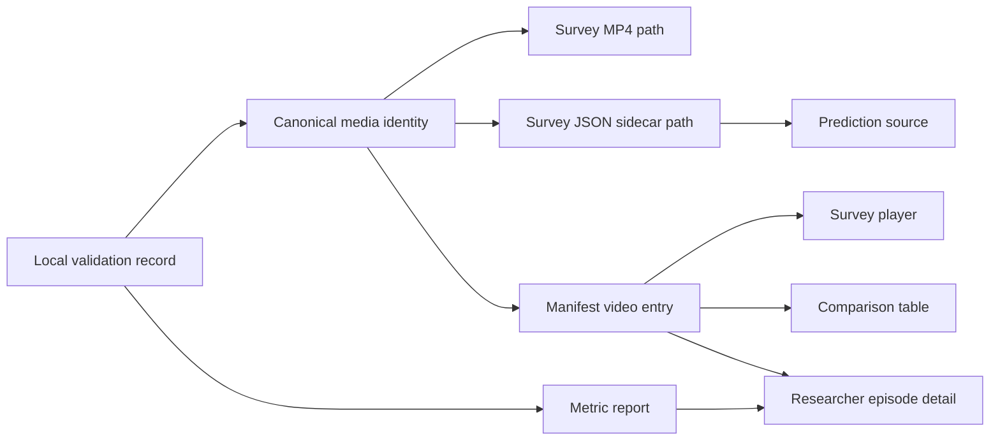

# fix: Align Survey Videos, Metrics, And Browser Playback

## Summary

Fix the survey media pipeline so generated videos, JSON sidecars, objective metrics, and browser views all resolve to the same canonical episode identity. The implementation should also make MP4 exports browser-playable and less blurry, then surface the matching video next to researcher-facing episode metrics and comparison rows.

---

## Problem Frame

The current survey/export path has drift between file names, sidecar metadata, metric episode names, and dashboard lookups. Videos can exist on disk but fail to match the website's discovered manifest, and the researcher dashboard currently shows metric cards without the matching video preview. The generated media is also low quality by default (`426x240`, `2 fps`, MPEG-4 encoding), which makes the episodes blurry and choppy even when playback works.

This plan carries forward the upstream requirement that recorded media must be tied to trace/metrics artifacts and be visually credible enough for paper/demo review (see origin: `docs/brainstorms/2026-05-13-unity-cinematic-capture-visual-qa-requirements.md`).

---

## Requirements

- R1. Generated MP4 paths, JSON sidecar paths, sidecar metadata, manifest `video_id`, manifest `episode_id`, and metric record identity must agree on one canonical episode key.
- R2. The survey video discovery path must reject or clearly diagnose mismatched video/JSON/statistics names instead of silently showing stale or missing videos.
- R3. Browser playback must work for discovered survey MP4s in normal survey mode and researcher review mode.
- R4. The researcher metrics dashboard must show the corresponding survey video when a user opens/clicks an episode's metric detail.
- R5. The comparison table must keep prediction/survey/video metadata aligned so a researcher can inspect the media behind a comparison row.
- R6. Generated videos must use less blurry, more fluid defaults and web-compatible MP4 encoding.
- R7. Exported sidecars and summaries must preserve the link back to source episode names and metric paths for debugging.
- R8. Documentation must explain the canonical naming contract and the recommended export/playback command path.
- R9. Browser QA must use `agent-browser` to render generated videos in the actual local website and verify that visible video content matches the advertised episode, view, robot, and scenario names.

**Origin actors:** A1 demo author, A2 agent/operator, A3 Unity capture pipeline, A4 benchmark pipeline.
**Origin flows:** F1 headless cinematic capture, F2 visual QA and iterative repair, F3 Unity-only scene enrichment.
**Origin acceptance examples:** AE1, AE2, AE3, AE4, AE5.

---

## Scope Boundaries

- This plan fixes the current Python/MuJoCo survey export plus the local web dashboard. It does not require a full migration to Unity Recorder before the survey can work.
- This plan improves objective technical video quality defaults, encoding, playback, and diagnostics. It does not attempt subjective beauty scoring.
- This plan keeps survey response collection anonymous and does not change the survey question set.
- This plan does not remove support for explicit manifest files, but the discovered folder contract should become the reliable default.
- This plan does not commit large generated video outputs as source code. Generated survey artifacts remain runtime data unless the team explicitly chooses otherwise.

### Deferred to Follow-Up Work

- Full Unity Recorder pipeline: use the upstream cinematic capture requirements to plan a separate migration from MuJoCo offscreen video to Unity Recorder once the current survey pipeline is stable.
- Automated visual QA scoring: add frame sampling, blur detection, robot visibility checks, and playback-fluidity analysis after the canonical naming and browser playback path is reliable.
- Public hosting or recruitment tooling: the server remains local-first for this pass.

---

## Context & Research

### Relevant Code and Patterns

- `src/asimovbm/local_runner/survey_export.py` already exports MP4/JSON pairs under `artifacts/survey/videos/<policy>/<view>/<episode>.mp4` and `artifacts/survey/json/<policy>/<view>/<episode>.json`, but its defaults are low-resolution and low-FPS.
- `g1_slam/src/g1_slam/mujoco_runner.py` renders frames with `mujoco.Renderer` and pipes raw RGB frames into FFmpeg, currently using MPEG-4 encoding.
- `src/asimovbm/survey/video_manifest.py` discovers MP4s exactly three levels under the video root and derives `video_id`, `group_id`, `episode_order`, and prediction sources from the matching sidecar.
- `src/asimovbm/web/server.py` serves `/videos/...` and survey/comparison APIs, but it does not expose a researcher-friendly episode-to-video join for run metric cards.
- `src/asimovbm/web/static/metrics.js` renders metric cards per episode without video previews or detail-state linkage.
- `src/asimovbm/web/static/survey.js` already embeds survey videos and gates questions on `ended`, so the survey-player implementation is the local pattern to reuse.
- `src/asimovbm/web/static/comparison.js` already receives video metadata in comparison payloads, but only renders table text.
- `docs/run-web-metrics-survey.md` and `Niccolò delle Piane, this is for you.md` describe the folder contract and should be updated after the implementation settles.
- `agent-browser` is the required browser automation tool for final QA because it can exercise the real local website, inspect rendered video elements, take screenshots, and run targeted DOM/video playback checks.

### Institutional Learnings

- No relevant `docs/solutions/` entries were present in this repository at planning time.

### External References

- Unity Recorder Movie Recorder supports configurable recorder output, resolution, and frame rate for movie capture: https://docs.unity3d.com/Packages/com.unity.recorder@5.1/manual/RecorderMovie.html
- MuJoCo Python rendering exposes renderer construction with explicit width/height and scene updates: https://mujoco.readthedocs.io/en/stable/python.html
- FFmpeg MOV/MP4 muxing documents `faststart`, useful for web playback startup once encoding is H.264-compatible: https://ffmpeg.org/ffmpeg-formats.html
- FFmpeg `libx264` is the practical H.264 encoder target for browser-compatible MP4 export: https://ffmpeg.org/ffmpeg-codecs.html#libx264
- Browser video playback compatibility is strongest with MP4/H.264 plus `yuv420p` pixel format for this local survey context: https://developer.mozilla.org/en-US/docs/Web/Media/Guides/Formats/Video_codecs

---

## Key Technical Decisions

- Use one canonical survey media identity shared by exporter and manifest discovery: this prevents exporter-side name normalization from drifting away from website-side name normalization.
- Keep source episode IDs as aliases, not primary browser identity: metric records may still use names like `g1_lateral_open`, while survey media should consistently use the point-to-point scenario names expected by the folder contract.
- Upgrade the existing MuJoCo FFmpeg path before planning a Unity Recorder migration: the immediate blur/playback failures are caused by current defaults and encoding, and can be fixed without replacing the renderer.
- Serve videos with byte-range support: HTML video elements often request ranges for MP4 metadata and seeking, so `/videos/...` should handle `Range` requests instead of only returning the full file.
- Attach video metadata to researcher-facing run records: the metrics dashboard should not have to independently guess which video belongs to a metric record.
- Treat missing/mismatched media as a visible diagnostic state: researcher UI should show "no matching video" or "sidecar mismatch" rather than silently rendering an empty player.
- Treat browser-rendered content as the final truth for media QA: filesystem names and JSON sidecars are not enough unless the corresponding video actually plays in the website and visibly depicts the named episode/view.

---

## Open Questions

### Resolved During Planning

- Should this fix wait for Unity Recorder? No. The current broken path is the Python/MuJoCo survey export and local webserver. Unity Recorder remains a follow-up for higher production quality.
- What is the main blur source? The current export defaults (`426x240`, `2 fps`) and MPEG-4 encoding are sufficient explanation for blurry/choppy output before deeper visual QA is needed.
- Should generated media live in git? No. The implementation should support local/generated artifacts and docs, not require committing MP4s.

### Deferred to Implementation

- Exact quality preset values: implementation should choose practical defaults after checking render/runtime cost, with a target around 720p or better and at least 12 fps for survey review.
- Exact fallback behavior when `libx264` is unavailable: implementation should detect encoder availability and either fail with a clear message or fall back to the best known browser-compatible option.
- Exact UI placement for video previews: implementation should fit the existing dashboard layout, keeping cards readable on desktop and mobile.
- Exact visual assertions for semantic video-name matching: implementation should start with pragmatic, evidence-backed checks using rendered frames, screenshots, and metadata, then document any cases that require human review.

---

## High-Level Technical Design

> *This illustrates the intended approach and is directional guidance for review, not implementation specification. The implementing agent should treat it as context, not code to reproduce.*

The exporter and web discovery should both call the same identity rules. The researcher dashboard should consume server-provided media metadata rather than reconstructing file paths in JavaScript.

---

## Implementation Units

### U1. Centralize Survey Media Identity

**Goal:** Make exporter, manifest discovery, tests, and docs share one canonical naming contract for policy, view, robot, episode, video ID, and sidecar paths.

**Requirements:** R1, R2, R7, R8

**Dependencies:** None

**Files:**
- Create: `src/asimovbm/survey/media_contract.py`
- Modify: `src/asimovbm/local_runner/survey_export.py`
- Modify: `src/asimovbm/survey/video_manifest.py`
- Modify: `docs/run-web-metrics-survey.md`
- Modify: `Niccolò delle Piane, this is for you.md`
- Test: `tests/survey/test_video_manifest.py`
- Test: `tests/local_runner/test_artifact_manifest.py`

**Approach:**
- Extract the current path and ID normalization rules into one shared module used by both exporter and discovery.
- Preserve source episode IDs in sidecars and summaries, but make the canonical survey episode ID the one used for MP4/JSON stems and website joins.
- Keep aliases for existing episode names so metric records can still match generated media.
- Make sidecar validation compare folder policy/view, filename stem, canonical metadata, and source metadata explicitly.

**Patterns to follow:**
- Existing `_survey_episode_id` and `_discover_sim_video` behavior in `src/asimovbm/local_runner/survey_export.py` and `src/asimovbm/survey/video_manifest.py`.
- Existing path escape checks in `src/asimovbm/survey/video_manifest.py`.

**Test scenarios:**
- Happy path: `g1_lateral_open` metrics export produces `g1_point_to_point_static_obstacles.mp4` and a sidecar with both canonical and source episode IDs.
- Happy path: manifest discovery returns the same `video_id`, `episode_id`, `group_id`, and `prediction_source.path` that the exporter summary reports.
- Edge case: sidecar `episode_id` differs from the MP4 stem, and discovery/export validation reports a clear mismatch.
- Edge case: unknown episode names remain discoverable but sort after the known three survey scenarios.
- Error path: MP4 and JSON relative stems differ, and the exporter fails before writing an incomplete success summary.
- Integration: run-level metric records can be joined to discovered survey media through source or canonical episode identity.

**Verification:**
- Exporter-generated files are discoverable by the webserver without an explicit manifest.
- Generated summary rows and discovered manifest entries agree on every video path and JSON sidecar path.

---

### U2. Upgrade MP4 Encoding And Render Quality Defaults

**Goal:** Produce survey videos that are fluid enough for human review and encoded in a browser-compatible MP4 profile.

**Requirements:** R3, R6, R7

**Dependencies:** U1

**Files:**
- Modify: `g1_slam/src/g1_slam/mujoco_runner.py`
- Modify: `src/asimovbm/local_runner/survey_export.py`
- Modify: `src/asimovbm/local_runner/runner.py`
- Modify: `src/asimovbm/local_runner/cli.py`
- Test: `tests/local_runner/test_artifact_manifest.py`
- Test: `g1_slam/tests/test_navigation.py`

**Approach:**
- Replace the low-quality survey defaults with a web review preset: higher resolution, higher FPS, and enough duration to read the scenario without forcing huge files.
- Prefer H.264 MP4 output through FFmpeg `libx264`, `yuv420p`, and web-startup-friendly muxing.
- Record encoding settings in sidecar metadata so researchers can diagnose whether a video was generated with old defaults.
- Keep CLI knobs for FPS, width, height, and duration, but make the default usable without flags.
- Detect missing video dependencies and unsupported encoders with clear exporter errors.

**Patterns to follow:**
- Current FFmpeg pipe writer in `g1_slam/src/g1_slam/mujoco_runner.py`.
- Current CLI option plumbing in `src/asimovbm/local_runner/cli.py`.

**Test scenarios:**
- Happy path: default survey export config reports the upgraded width, height, FPS, encoder, and pixel format in the sidecar.
- Happy path: FFmpeg command construction uses a browser-compatible H.264 path when `libx264` is available.
- Edge case: odd or too-small dimensions are rejected or normalized before FFmpeg receives them.
- Error path: missing FFmpeg or missing encoder returns an actionable `SurveyExportError`.
- Integration: exporter still writes valid MP4/JSON pairs under the canonical folder layout after default changes.

**Verification:**
- Newly generated videos are visibly sharper than the current `426x240` exports and play in a browser video element.
- Sidecars identify the render backend and quality settings used for each video.

---

### U3. Add Browser-Safe Video Serving And Media Diagnostics

**Goal:** Make `/videos/...` robust for HTML video playback and expose diagnostics when a video cannot be served or matched.

**Requirements:** R2, R3, R5

**Dependencies:** U1, U2

**Files:**
- Modify: `src/asimovbm/web/server.py`
- Modify: `src/asimovbm/survey/video_manifest.py`
- Test: `tests/web/test_web_server_routes.py`
- Test: `tests/survey/test_video_manifest.py`

**Approach:**
- Add HTTP byte-range support for `/videos/...` so browser players can load metadata and seek reliably.
- Preserve existing path safety checks for all video requests.
- Add manifest/discovery diagnostics for missing sidecars, mismatched stems, missing files, and unsupported layouts.
- Consider a group-optional survey videos endpoint so researcher views can request the full discovered media list without pretending to be a participant group.

**Patterns to follow:**
- Existing `_file_response` and `_safe_child` path handling in `src/asimovbm/web/server.py`.
- Existing JSON error response pattern in `WebApp.handle_request`.

**Test scenarios:**
- Happy path: `GET /videos/<path>` returns MP4 content with the correct content type.
- Happy path: range request returns partial content with `Content-Range` and only the requested bytes.
- Edge case: suffix or nested path attempts that escape `video_root` are rejected.
- Error path: missing video path returns a clear 404 response.
- Integration: discovered media diagnostics appear in the API payload used by researcher UI.

**Verification:**
- A browser `<video controls>` element can load and seek a generated survey video through the local server.

---

### U4. Join Survey Videos Into Researcher Episode Metrics

**Goal:** When a researcher clicks a metric episode, the matching video appears beside the metric axes and run details.

**Requirements:** R1, R4, R5, R7

**Dependencies:** U1, U3

**Files:**
- Modify: `src/asimovbm/web/artifact_index.py`
- Modify: `src/asimovbm/web/server.py`
- Modify: `src/asimovbm/web/static/metrics.js`
- Modify: `src/asimovbm/web/static/app.css`
- Test: `tests/web/test_artifact_index.py`
- Test: `tests/web/test_web_server_routes.py`

**Approach:**
- Extend run loading with optional survey media context derived from the discovered manifest.
- Match records to videos using canonical identity plus source episode aliases, policy ID, robot ID, and view where available.
- Render an episode detail state in the metrics dashboard: metrics remain visible, and the matching MP4 player appears in the same detail surface.
- Show a clear missing-video diagnostic when no media matches a metric record.
- Keep the participant survey flow separate from researcher browsing state so researchers do not accidentally create survey sessions.

**Patterns to follow:**
- Existing run loading in `src/asimovbm/web/artifact_index.py`.
- Existing survey video player pattern in `src/asimovbm/web/static/survey.js`.
- Existing card and score-row CSS in `src/asimovbm/web/static/app.css`.

**Test scenarios:**
- Happy path: run record with `g1_lateral_open` metrics links to the `g1_point_to_point_static_obstacles` survey video.
- Happy path: clicking an episode card displays the video path and axis metrics without creating a participant.
- Edge case: multiple videos match the same episode across views, and the UI exposes a deterministic default plus view selection.
- Error path: record has metrics but no matching video, and the UI/API reports a missing media state.
- Integration: `/api/runs/<run_id>` includes enough media metadata for `metrics.js` to render a player without reconstructing paths.

**Verification:**
- Researcher can open a run, click an episode, and watch the corresponding MP4 in the browser next to the metrics.

---

### U5. Add Video Preview To Comparison Rows

**Goal:** Let researchers inspect the media behind prediction-vs-survey rows without leaving the comparison view.

**Requirements:** R4, R5

**Dependencies:** U1, U3

**Files:**
- Modify: `src/asimovbm/web/static/comparison.js`
- Modify: `src/asimovbm/web/static/app.css`
- Test: `tests/web/test_web_server_routes.py`

**Approach:**
- Use the video metadata already present in comparison payloads to render a compact preview or expandable row detail.
- Keep the table scannable while providing a one-click way to inspect the exact video behind the row.
- Reuse the same `videoUrl` path encoding behavior as the survey player.
- Surface missing media status consistently with U4.

**Patterns to follow:**
- Existing comparison table rendering in `src/asimovbm/web/static/comparison.js`.
- Existing survey player path encoding in `src/asimovbm/web/static/survey.js`.

**Test scenarios:**
- Happy path: comparison row with a video path can expand to a browser video player.
- Edge case: missing video path renders a non-playable diagnostic rather than a broken player.
- Integration: changing the weight preset preserves row/video association after the table re-renders.

**Verification:**
- Researcher can inspect prediction/survey metrics and the corresponding episode video from the comparison tab.

---

### U6. Refresh Runbooks And Export Contract

**Goal:** Make the fixed workflow understandable for the next programmer and for the researcher operating the local server.

**Requirements:** R8

**Dependencies:** U1, U2, U3, U4, U5

**Files:**
- Modify: `docs/run-server.md`
- Modify: `docs/run-web-metrics-survey.md`
- Modify: `Niccolò delle Piane, this is for you.md`
- Test expectation: none - documentation-only change, but examples should match the implemented CLI/API behavior.

**Approach:**
- Update the run command to recommend the no-manifest discovery path for generated MP4/JSON pairs.
- Document the canonical identity fields and source-episode alias behavior.
- Document the recommended export quality settings and how to regenerate videos when old blurry files are present.
- Explain researcher workflow: open dashboard, click run, click episode, inspect video plus metrics.

**Patterns to follow:**
- Existing docs in `docs/run-web-metrics-survey.md` and the root export contract.

**Test scenarios:**
- Test expectation: none - documentation only.

**Verification:**
- A programmer can implement or run the exporter from the docs without guessing folder names or ID fields.

---

### U7. Add Agent-Browser End-To-End Media QA

**Goal:** Verify the fixed pipeline through the real browser so playback, naming, and visible episode content are tested together.

**Requirements:** R1, R3, R4, R5, R6, R9

**Dependencies:** U1, U2, U3, U4, U5

**Files:**
- Modify: `docs/run-web-metrics-survey.md`
- Modify: `docs/run-server.md`
- Modify: `Niccolò delle Piane, this is for you.md`
- Test expectation: browser QA procedure using `agent-browser`; add automated test files only if implementation introduces a reusable browser-smoke script.

**Approach:**
- Use `agent-browser` as the required final verification tool for the local webserver.
- Start the server against generated survey artifacts, open the dashboard, and verify the survey, researcher metrics, and comparison surfaces all render video players with playable media.
- For every discovered video, use browser playback checks to confirm `loadedmetadata`, `canplay`, nonzero duration, successful play/pause, and no media error.
- Capture rendered evidence from the browser, not just filesystem checks: representative screenshots or video-frame canvas samples should show nonblank frames and recognizable scene content.
- Check semantic name alignment in the browser: the displayed title/path for `point_to_point_open`, `point_to_point_static_obstacles`, and `point_to_point_dynamic_npcs` should match what is visible in the rendered video, including whether obstacles/NPCs and the requested viewpoint are actually present.
- Treat mismatches as failures even when the MP4 technically plays, because the survey and researcher views would be showing the wrong evidence.

**Patterns to follow:**
- Existing survey browser player in `src/asimovbm/web/static/survey.js`.
- Existing researcher metrics and comparison surfaces in `src/asimovbm/web/static/metrics.js` and `src/asimovbm/web/static/comparison.js`.
- `agent-browser` core workflow: open page, snapshot, interact with refs, wait for expected UI text/state, and use targeted evaluation for video element state.

**Test scenarios:**
- Happy path: `agent-browser` opens the local server, starts a survey, plays the assigned video in-browser, and confirms the questions unlock only after playback reaches `ended`.
- Happy path: `agent-browser` opens a run, clicks an episode, and confirms the matching video appears beside the metrics and reaches `canplay`.
- Happy path: `agent-browser` opens the comparison tab, expands a row, and confirms the row video path matches the comparison video's canonical metadata.
- Edge case: video file exists but browser playback reports a media error, and the QA procedure fails with the affected path/title.
- Edge case: displayed episode name says `dynamic_npcs` but sampled browser frames show no dynamic NPC/obstacle evidence, and the QA result marks the semantic match as failed or requiring human review.
- Edge case: displayed view says `bystander` but the rendered camera framing is first-person/arrival-like, and the QA result marks the semantic match as failed or requiring human review.
- Integration: every video discovered by the webserver is exercised through an actual `<video>` element, not only through API/file checks.

**Verification:**
- The final implementation handoff includes `agent-browser` evidence that videos render in-browser and that names match visible episode content.

---

## System-Wide Impact

- **Interaction graph:** Local validation creates metrics and optional survey media; survey manifest discovery feeds participant survey, comparison, and researcher metric browsing.
- **Error propagation:** Exporter errors should stop incomplete exports; web discovery errors should be visible diagnostics rather than broken UI state.
- **State lifecycle risks:** Regenerating videos can leave stale files under `artifacts/survey`; canonical identity checks and docs should make regeneration behavior explicit.
- **API surface parity:** Survey participant UI, researcher metrics UI, and comparison UI should all consume the same server-provided video metadata.
- **Integration coverage:** Unit tests need to prove exporter/discovery/server joins; `agent-browser` verification should prove actual `<video>` playback and semantic name/content alignment in the rendered website.
- **Unchanged invariants:** Survey responses, Likert scoring, quota balancing, and prediction-vs-survey math remain unchanged except for receiving better-aligned video metadata.

---

## Risks & Dependencies

| Risk | Mitigation |
|------|------------|
| H.264 encoder is unavailable in the local FFmpeg build | Detect `libx264` support and fail with a clear message or documented fallback before writing unusable MP4s |
| Higher resolution/FPS makes export too slow | Keep CLI overrides and document a lower-quality local-debug preset |
| Legacy artifacts use old names | Support source episode aliases during discovery and researcher joins |
| Multiple views match the same metric episode | Use deterministic default view and expose view selection in researcher UI |
| Browser playback still fails due to MP4 metadata or range handling | Add range request support and encode with web-compatible MP4 settings |
| File names match metadata but not visible video content | Require agent-browser rendered-frame evidence and semantic review for each generated scenario/view |
| Generated artifacts accidentally get committed | Keep docs clear that media outputs are runtime artifacts, not source files |

---

## Documentation / Operational Notes

- Update docs after implementation so `PYTHONPATH=src python -m asimovbm.web.server ...` remains the reliable in-repo server command.
- Document that old `426x240` files should be regenerated rather than repaired in place.
- Include an `agent-browser` verification checklist: start server, open metrics tab, click episode, confirm video plays and content matches the episode name; open survey tab, start test, confirm assigned video plays and unlocks questions after ending; open comparison tab, expand row, confirm same video path and rendered content.

---

## Plan Review Notes

Self-review before implementation:

- The plan keeps product scope tight: it fixes current media alignment, browser playback, and researcher inspection rather than broadening into full Unity cinematic capture.
- Each feature-bearing unit has a test path and concrete test scenarios.
- The plan preserves the upstream visual QA intent while deferring subjective/automated visual analysis until after the broken media contract is stable.
- The main implementation risk is the cross-join between source metric episode names and canonical survey media names; U1 and U4 isolate that risk before UI work.
- The added U7 closes the browser-reality gap: the plan now requires agent-browser evidence that each named video actually renders in the website and visually matches its advertised scenario/view.

---

## Sources & References

- **Origin document:** `docs/brainstorms/2026-05-13-unity-cinematic-capture-visual-qa-requirements.md`
- Related code: `src/asimovbm/local_runner/survey_export.py`
- Related code: `g1_slam/src/g1_slam/mujoco_runner.py`
- Related code: `src/asimovbm/survey/video_manifest.py`
- Related code: `src/asimovbm/web/server.py`
- Related code: `src/asimovbm/web/static/metrics.js`
- Related code: `src/asimovbm/web/static/survey.js`
- Related code: `src/asimovbm/web/static/comparison.js`
- Browser QA skill: `/home/anthor/.agents/skills/agent-browser/SKILL.md`
- Unity Recorder Movie Recorder: https://docs.unity3d.com/Packages/com.unity.recorder@5.1/manual/RecorderMovie.html
- MuJoCo Python rendering docs: https://mujoco.readthedocs.io/en/stable/python.html
- FFmpeg formats docs: https://ffmpeg.org/ffmpeg-formats.html
- FFmpeg libx264 docs: https://ffmpeg.org/ffmpeg-codecs.html#libx264
- MDN video codec guide: https://developer.mozilla.org/en-US/docs/Web/Media/Guides/Formats/Video_codecs
