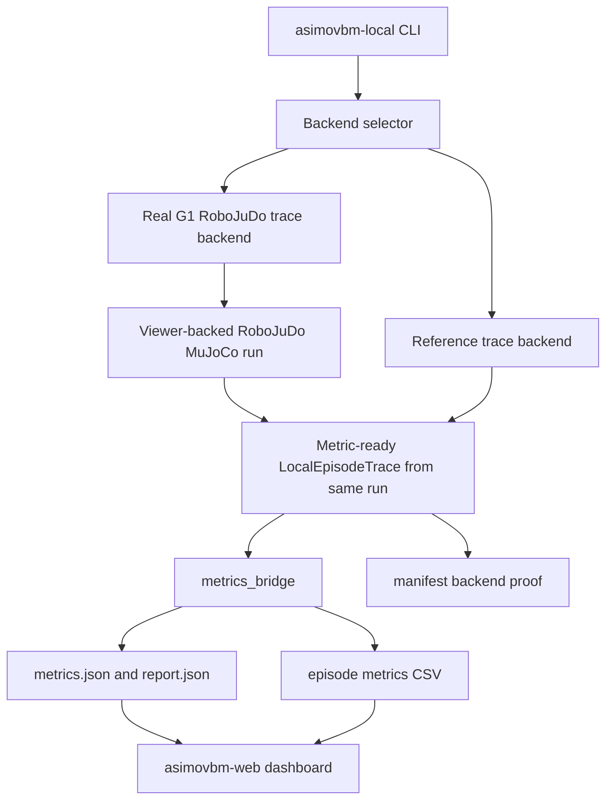
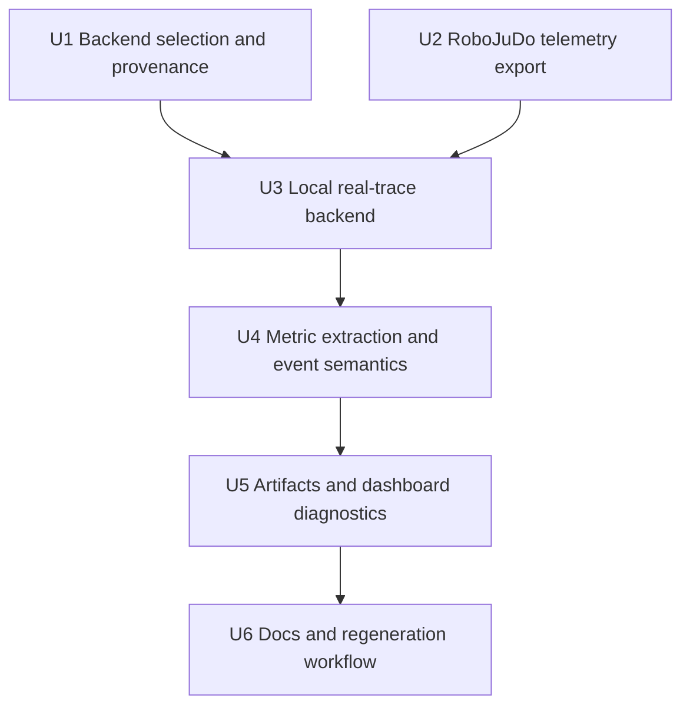

# fix: Compute Survey Metrics From Viewer-Sourced Real Backend Traces

## Summary

Fix the local survey validation path so objective metrics are computed from the exact MuJoCo/RoboJuDo execution the operator watches in the viewer, not from the portable `g1_slam_reference_trace_v1` approximation and not from any parallel replay. The implementation should preserve the reference backend for CI and fallback use, but any artifact intended to validate survey videos must carry real trace provenance, policy provenance, and collision/human telemetry from the actual viewer-backed run.

---

## Problem Frame

The current `asimovbm-local --visible` path launches a RoboJuDo/MuJoCo viewer as a side proof, then still computes metrics from the pure Python reference trace. That explains the policy mismatch: policy B can visibly walk in place, hit a human, or hit a wall, while hesitation, stability, and downstream axes remain identical or misleading because the metric bridge never saw the real backend behavior.

The q1-q4 artifacts confirm the issue: manifests record `execution_backend_id: g1_slam_reference_trace_v1` and `real_backend_verified: false` even for runs whose canonical backend is `g1_robojudo`.

## Non-Negotiable Data Invariant

Data for survey-replication metrics must come from the same MuJoCo/RoboJuDo control loop that renders the viewer. For `--visible` runs, the viewer process or in-process viewer loop must be the trace source. A separate reference trace, replay trace, or proof-only viewer subprocess is not acceptable for real survey validation, even if it uses the same episode config.

If the system cannot collect structured telemetry from the viewer-backed run, the run must fail or be marked technical. It must not silently compute objective metrics from `g1_slam_reference_trace_v1`.

Headless real runs are allowed only if they use the same RoboJuDo/MuJoCo execution loop with rendering disabled. They are not allowed to use the 2D reference backend while claiming real backend provenance.

---

## Assumptions

*This plan was authored without another synchronous confirmation step. The items below are implementation bets that should be reviewed before work begins.*

- "Real backend" for the urgent survey-replication workflow means the active G1 RoboJuDo/MuJoCo execution path used by the visible viewer. For `--visible`, the same process/loop that drives the viewer must write or return the trace. The archived `asimovbm_server` code remains useful context, but this plan does not resurrect the archived server package before fixing the active local path.
- Generated videos are out of scope for this pass. The deliverable is fresh metric data, trace JSON, CSV/report artifacts, and dashboard visibility while Nico validates videos by hand.
- Camera perspective should not change objective robot metrics. Arrival and bystander views should attach to the same trace when robot, policy, episode, and simulation parameters are the same.
- Metric formulas should not be tuned first. The first fix is to make their inputs true.

---

## Requirements

- R1. `asimovbm-local` must offer an explicit real-trace path for G1 RoboJuDo policies so metrics are computed from actual MuJoCo/RoboJuDo state captured from the viewer-backed execution loop.
- R2. The visible viewer, trace JSON, metric report, CSV row, manifest, and dashboard entry must all refer to the same execution source for a run.
- R3. Artifacts must distinguish `reference` traces from `real` traces with `execution_backend_id`, `real_backend_verified`, trace source metadata, policy profile, RoboJuDo config, and backend proof.
- R4. Policy A and policy B runs must actually invoke their distinct RoboJuDo configs: `g1_robojudo_unitree` -> `g1`; `g1_robojudo_asap` -> `g1_asap_loco`.
- R5. The real trace must include the minimum metric inputs from `final-rush-choices.md`: time, dt, robot pose, velocity, action, entities/human poses, collisions/contact summary, public observation, distance to goal, qpos/qvel when available, and status.
- R6. Dynamic NPCs must be exported as human/bystander-like entities for social metrics, not only as generic obstacles.
- R7. Wall contacts, human/NPC contacts, and invalid/unstable locomotion must affect stability raw inputs and safety caps; if a contact causes the robot to get stuck, task success and completion/path metrics must reflect the resulting timeout or failure.
- R8. Collision counting must be event-based enough for metrics to be interpretable, while preserving raw contact diagnostics for debugging.
- R9. Reference-backend artifacts must never be presented as real backend evidence. If real trace collection from the viewer-backed run fails, the run should fail or be clearly marked technical, not silently fall back to reference metrics.
- R10. Survey/perspective comparisons must reuse or duplicate the same objective metrics for arrival and bystander views unless simulation parameters truly changed.
- R11. Existing web and survey prediction code must continue to read metric reports and trace JSON without guessing whether the source was real or reference.
- R12. Documentation must give Nico a canonical command to run one episode/policy/view with real metrics and then inspect it in the web dashboard.

**Origin actors:** benchmark operator, policy participant, benchmark backend, reviewer.
**Origin flows:** step-synchronous policy execution, social-navigation episode execution, metric report generation.
**Origin acceptance examples:** derived from R11-R13 and R19-R30 in the origin document.

---

## Scope Boundaries

- This plan fixes active local G1/RoboJuDo metric provenance. It does not rebuild the full black-box remote policy server.
- This plan does not change the social-navigation metric definitions unless a trace extraction bug makes an input impossible or dishonest.
- This plan does not require FFmpeg, offscreen rendering, or new video export.
- This plan does not make Go2 real-backend parity a blocker. Go2 can keep the reference/fallback path unless a later plan targets it.
- This plan does not overwrite q1-q4 artifacts. They remain diagnostic evidence and can be regenerated under new run IDs after implementation.
- This plan does not guarantee that policy A and B metrics will differ in every episode. It guarantees that any real behavioral difference present in the watched run is present in the trace inputs.

### Deferred to Follow-Up Work

- Promote the active trace path into a current `asimovbm_server` package: the archived server-client architecture under `archive/server_client_architecture/` is a reference, but reviving it is a separate integration plan.
- Refit or recalibrate hesitation, stability, and aggregation weights against survey responses after real traces are available.
- Build automated video similarity checks against the survey recordings.

---

## Context & Research

### Relevant Code and Patterns

- `final-rush-choices.md` defines the active local validation path, the reference backend limitation, the G1 policy mapping, and the minimum trace sample expected by metrics.
- `README.md` currently tells users that visible local runs produce metrics, but the implementation still computes those metrics from the reference backend.
- `src/asimovbm/local_runner/runner.py` unconditionally uses `G1SlamReferenceBackend()` unless tests inject another backend, and `_build_manifest()` currently calls `backend_proof_for(spec)` rather than deriving proof from the actual trace/backend.
- `src/asimovbm/local_runner/backends.py` runs `_run_viewer_subprocess()` before computing a separate reference trace. This is the core split-brain bug.
- `src/asimovbm/local_runner/backends.py` currently treats the viewer as proof-only side work: the subprocess is launched, stdout is discarded, and no trace path is requested or read before metrics are computed from the reference trace.
- `src/asimovbm/local_runner/traces.py` already has the `LocalEpisodeTrace` and `LocalStepTrace` shape needed by the metric bridge, including `qpos`, `qvel`, collisions, entities, and metadata.
- `src/asimovbm/local_runner/metrics_bridge.py` computes hesitation from robot speeds/headings and stability from `trace.collision_count`; it can only reflect real hesitation/collisions if the trace reflects the real backend.
- `src/asimovbm/local_runner/metrics_bridge.py` only treats entities with type `human`, `target`, or `bystander` as human telemetry, while dynamic NPCs currently come through the reference backend as type `obstacle`.
- `g1_slam/src/g1_slam/robojudo_backend.py` already has `run_robojudo_navigation(..., trace_path=...)` and returns `asimovbm.sim_trace.v1`-like data. This is the nearest existing hook for viewer-sourced data, because it runs the RoboJuDo loop that can also render the viewer.
- `g1_slam/src/g1_slam/__main__.py` currently calls `run_robojudo_navigation(..., render=args.render)` without passing `trace_path`, so `python -m g1_slam --render` can show the viewer but cannot currently export the trace needed by `asimovbm-local`.
- `g1_slam/src/g1_slam/robojudo_backend.py` trace steps currently include pose, command, distance, entities, and path, but not enough metric-ready fields such as dt, robot velocity, qpos/qvel, contact/collision summaries, public observation, or status per step.
- `g1_slam/src/g1_slam/mujoco_runner.py` has a separate MuJoCo runner and video recorder that read freejoint pose for policy-backed movement; its pose/physics patterns are useful when enriching real telemetry.
- `src/asimovbm/survey/prediction.py` can already convert `LocalEpisodeTrace`-shaped JSON into metric reports, so preserving that shape keeps dashboard and prediction flows simpler.
- `archive/server_client_architecture/src/asimovbm_server/` contains the older server-authority architecture named by `AGENTS.md`, but the active `pyproject.toml` only packages `asimovbm-local` and `asimovbm-web`.

### Institutional Learnings

- No `docs/solutions/` directory was present at planning time.

### External References

- None. The relevant constraints are local repo contracts and project instructions.

---

## Key Technical Decisions

- Add a viewer-sourced real-trace backend instead of patching metric formulas first: hesitation and stability cannot be repaired while they receive reference trajectory inputs.
- Make the viewer-backed control loop the source of truth: in visible mode the run that opens the MuJoCo/RoboJuDo viewer must also emit the trace used by metrics.
- Keep the reference backend selectable and honest: it is useful for CI and portable smoke runs, but it must be labelled as non-real evidence.
- Use the existing `LocalEpisodeTrace` shape as the metric boundary: the metric bridge and survey prediction code already understand it.
- Extend RoboJuDo trace emission rather than parsing viewer output: `run_robojudo_navigation()` already owns the real MuJoCo/RoboJuDo control loop and can emit structured telemetry at the right step cadence.
- Make real-backend selection explicit in the CLI: a researcher should be able to request real metrics directly and see an error if dependencies/assets are missing.
- Treat camera perspective as metadata, not a source of objective metric variation: if only `camera_view` changes, objective metrics should be shared or clearly linked to the same trace.
- Count collision/contact events in a metric-friendly way: stability should see meaningful contact episodes, while raw MuJoCo contact frames remain available for audit.
- Preserve server-proof language carefully: a real local RoboJuDo trace can be verified for the survey workflow without pretending the archived black-box server path has been restored.

---

## Open Questions

### Resolved During Planning

- Why did policy differences not show up consistently? Because `asimovbm-local` computes metrics from `g1_slam_reference_trace_v1`, not from the visible RoboJuDo run.
- Should a wall hit influence metrics? Yes. It should affect stability raw inputs and safety caps, and if it prevents completion it should also affect task success/completion/path metrics.
- Is hesitation itself definitely wrong? Not proven. Its current inputs are wrong for this validation workflow; formula tuning should wait until real traces exist.
- Should arrival and bystander metric values differ? Not if the simulation parameters are identical. Perspective is a human-rating variable, not an objective behavior variable.

### Deferred to Implementation

- Exact CLI flag name: the plan assumes an explicit real/reference selector, but implementation can choose the least disruptive name.
- Exact trace plumbing shape: implementation must decide whether `asimovbm-local` calls `run_robojudo_navigation()` in-process or launches `python -m g1_slam --render --trace-path ...` as a subprocess. Either is acceptable only if the viewer-backed RoboJuDo loop writes the trace consumed by metrics.
- Exact MuJoCo contact filters: implementation should inspect available geom/body names and choose robust wall, obstacle, human/NPC, and self-contact classification.
- Exact event de-duplication window for collision epochs: implementation should preserve raw frames and choose a stable event-count extraction rule with tests.
- Whether visible real metrics should run in-process or via a subprocess: subprocess isolation may be safer for GUI/RoboJuDo viewer stability, provided the viewer subprocess writes structured trace JSON and the parent uses that file as the only metric source.

### Must Sort Out Before Implementation

- Add a trace-output argument to `g1_slam` RoboJuDo CLI mode, because the existing `trace_path` hook is not exposed through `__main__.py`.
- Decide the parent/child ownership contract for visible runs: either `asimovbm-local` directly owns the viewer loop and receives the returned trace, or it launches a child viewer process with a required trace path and then loads that file.
- Define what counts as a successful viewer-backed trace: complete JSON, expected schema, matching episode/policy/run metadata, non-empty steps, and terminal status.
- Prevent split-brain artifacts: a visible run must not write `viewer_proof: launched` alongside metrics from `g1_slam_reference_trace_v1`.
- Confirm whether the current RoboJuDo loop exposes MuJoCo contact, qpos, and qvel through `backend.pipeline.env`; if not, implement best-effort telemetry plus explicit missing-field diagnostics.

---

## High-Level Technical Design

> *This illustrates the intended approach and is directional guidance for review, not implementation specification. The implementing agent should treat it as context, not code to reproduce.*

The critical invariant is that the path into `metrics_bridge` is the same execution source that the manifest claims. In visible real mode, this means the MuJoCo/RoboJuDo viewer run itself emits the trace. Reference and real runs can both produce `LocalEpisodeTrace`, but their provenance must be visible and truthful.

---

## Implementation Units

### U1. Make Backend Selection And Provenance Explicit

**Goal:** Add a first-class local-run option for `reference` versus viewer-sourced `real` trace collection and make manifests derive proof from the actual backend used.

**Requirements:** R1, R2, R3, R9, R12

**Dependencies:** None

**Files:**
- Modify: `src/asimovbm/local_runner/cli.py`
- Modify: `src/asimovbm/local_runner/runner.py`
- Modify: `src/asimovbm/local_runner/backends.py`
- Modify: `src/asimovbm/local_runner/traces.py`
- Test: `tests/local_runner/test_cli_modes.py`
- Test: `tests/local_runner/test_artifact_manifest.py`
- Test: `tests/local_runner/test_trace_builder.py`

**Approach:**
- Add an explicit trace backend selector to local run configuration.
- Keep the current reference backend as the portable default for headless/CI smoke usage unless real metrics are explicitly requested.
- Make manual survey-validation commands request the real backend explicitly.
- Treat `--visible --trace-backend real` as a request for a viewer-backed trace source, not as "open viewer plus compute reference metrics."
- Move backend proof from a static `backend_proof_for(spec)` helper to data derived from the returned trace or backend result.
- Record `trace_source`, `real_backend_verified`, selected policy profile, RoboJuDo config, viewer mode, and fallback/failure status in trace metadata and manifest records.
- If a real trace was requested and cannot be produced, return a technical failure or command error instead of silently computing reference metrics.

**Execution note:** Characterization-first. Existing tests currently lock in reference-backend behavior; add tests proving the old path remains labelled reference before changing defaults.

**Patterns to follow:**
- `LocalRunConfig.resolved_visible()` for mode resolution.
- Existing CLI plumbing for `--visible`, `--headless`, `--policy`, and `--camera-view`.
- `LocalRunRecord.to_manifest_entry()` for per-record artifact metadata.

**Test scenarios:**
- Happy path: a run with the reference selector produces `execution_backend_id: g1_slam_reference_trace_v1` and `real_backend_verified: false`.
- Happy path: a run with an injected real backend produces manifest proof from the trace/backend, not from `backend_proof_for(spec)`.
- Error path: requesting real trace collection for an unsupported robot fails clearly.
- Error path: requesting real trace collection and receiving a backend failure does not append reference metrics under the same run.
- Error path: visible real mode cannot provide a viewer-sourced trace and therefore fails instead of producing `viewer_proof` with reference metrics.
- Integration: `camera_view` appears in metadata but does not imply a separate metric source when all simulation inputs are unchanged.

**Verification:**
- Backend provenance in `manifest.json`, `trace.json`, and per-record manifest entries agrees with the backend that actually produced the trace.

---

### U2. Enrich RoboJuDo Trace Emission

**Goal:** Make the real RoboJuDo/MuJoCo loop that powers the viewer emit enough structured telemetry to become the metric source.

**Requirements:** R4, R5, R6, R7, R8

**Dependencies:** None

**Files:**
- Modify: `g1_slam/src/g1_slam/robojudo_backend.py`
- Modify: `g1_slam/src/g1_slam/__main__.py`
- Test: `g1_slam/tests/test_navigation.py`

**Approach:**
- Expose trace-output control through the `g1_slam` CLI so the local runner can launch a visible or headless real run and receive structured JSON from that same invocation.
- Ensure `render=True` and `trace_path=...` work together: opening the viewer must not disable trace writing, and trace writing must not require a second non-rendered replay.
- Extend `run_robojudo_navigation()` trace steps with metric-ready fields: dt, robot pose, robot velocity derived from actual backend poses, action, distance, dynamic/static entities, per-step status, qpos/qvel when accessible, public observation, and contact/collision summaries.
- Classify dynamic NPCs as social entities for metric extraction while preserving their obstacle/collision role in metadata.
- Include policy provenance in the trace result: policy profile, RoboJuDo config name, robot id, config checksum/path when supplied, render/view mode, and backend status.
- Preserve the current lightweight tests with fake pipeline objects, then add focused tests for trace shape and policy config propagation without requiring real RoboJuDo assets.

**Patterns to follow:**
- Existing `run_robojudo_navigation(..., trace_path=...)` JSON writer.
- Existing `_trace_entities()` dynamic obstacle serialization.
- Existing `RoboJuDoBackend.pose()` and `RoboJuDoBackend.step()` as actual pose sources.
- MuJoCo pose/qpos helpers in `g1_slam/src/g1_slam/mujoco_runner.py`.

**Test scenarios:**
- Happy path: fake RoboJuDo run writes a trace file with aligned `time_s`, `dt_s`, `robot_pose`, `robot_velocity`, `action`, `distance_to_goal`, and `status`.
- Happy path: CLI accepts a trace output path for RoboJuDo mode and passes it into `run_robojudo_navigation()`.
- Happy path: CLI accepts both `--render` and trace output, and the same RoboJuDo invocation returns/writes the trace.
- Happy path: selected config `g1` or `g1_asap_loco` is recorded in the trace metadata/result.
- Edge case: qpos/qvel are unavailable from the fake pipeline and the trace still emits empty arrays rather than failing.
- Edge case: NPC entities include pose, velocity, radius, social type/role, and collision identity.
- Error path: trace output cannot be written and the run reports a technical failure.

**Verification:**
- A real RoboJuDo run can produce a standalone trace JSON that is rich enough to compute the current social-navigation metrics.

---

### U3. Add A Local Real G1 RoboJuDo Trace Backend

**Goal:** Add an `asimovbm-local` backend that runs the actual G1 RoboJuDo/MuJoCo viewer-capable path and returns `LocalEpisodeTrace` from that same run.

**Requirements:** R1, R2, R3, R4, R5, R9, R10

**Dependencies:** U1, U2

**Files:**
- Create: `src/asimovbm/local_runner/real_backends.py`
- Modify: `src/asimovbm/local_runner/backends.py`
- Modify: `src/asimovbm/local_runner/runner.py`
- Modify: `src/asimovbm/local_runner/catalog.py`
- Test: `tests/local_runner/test_trace_builder.py`
- Test: `tests/local_runner/test_artifact_manifest.py`
- Test: `tests/local_runner/test_catalog.py`

**Approach:**
- Implement a G1-only real trace backend with a stable execution id such as `g1_robojudo_mujoco_trace_v1`.
- Launch the RoboJuDo run in the safest mode for viewer stability. If implementation keeps subprocess isolation, the viewer subprocess must write a structured trace file that the parent converts into `LocalEpisodeTrace`.
- Reject any implementation that launches the viewer only for human inspection and then separately computes a reference trace for metrics.
- Map episode config fields into the real runner: start, goal, steps, controller start delay, dynamic NPC settings, visualization camera, policy profile, and RoboJuDo config.
- Convert the real runner's JSON into `LocalEpisodeTrace` without passing through the reference controller.
- Ensure the backend respects selected episode overrides from `runner.py`, including policy-B dynamic NPC start delay and x-offset.
- Keep any reference-only helpers clearly separated so real traces cannot accidentally reuse reference pose/collision generation.

**Patterns to follow:**
- `G1SlamReferenceBackend.run_episode()` for the `LocalTraceBackend` protocol and `LocalEpisodeTrace` construction.
- `_run_viewer_subprocess()` for subprocess timeout/error reporting if subprocess isolation is retained.
- `_with_episode_metadata()` in `src/asimovbm/local_runner/runner.py` for adding common run metadata after backend execution.

**Test scenarios:**
- Happy path: fake RoboJuDo trace JSON converts into `LocalEpisodeTrace` with `execution_backend_id: g1_robojudo_mujoco_trace_v1`.
- Happy path: visible real mode invokes the viewer-capable RoboJuDo path with a trace output and consumes that output for metrics.
- Happy path: policy A uses RoboJuDo config `g1`; policy B uses `g1_asap_loco`.
- Happy path: policy-B dynamic NPC overrides still reach the real backend.
- Edge case: visible mode requests rendering while still returning a real trace to the parent runner.
- Error path: RoboJuDo subprocess times out and produces a technical failure without reference fallback.
- Error path: malformed real trace JSON is rejected with diagnostic metadata.

**Verification:**
- Running one G1 episode through the real selector writes `trace.json`, `metrics.json`, `report.json`, and CSV from the same RoboJuDo/MuJoCo run that opened the viewer.

---

### U4. Correct Metric Extraction Inputs For Real Social Episodes

**Goal:** Ensure the metric bridge interprets real traces correctly, especially hesitation, human proximity, and stability.

**Requirements:** R5, R6, R7, R8, R10, R11

**Dependencies:** U2, U3

**Files:**
- Modify: `src/asimovbm/local_runner/metrics_bridge.py`
- Modify: `src/asimovbm/local_runner/traces.py`
- Modify: `src/asimovbm/metrics/stability.py` only if the trace-to-event model exposes a formula bug
- Test: `tests/local_runner/test_metric_extraction.py`
- Test: `tests/metrics/test_impression_metrics.py`
- Test: `tests/metrics/test_metric_aggregation.py`
- Test: `tests/survey/test_prediction.py`

**Approach:**
- Derive robot speed from actual pose deltas when the real trace provides pose but not an explicit velocity, and prefer backend-provided actual velocity when available.
- Keep command/action separate from actual base velocity so "commanded movement but walking in place" can appear as low actual speed plus nonzero action in raw inputs.
- Treat dynamic NPC/person entities as human telemetry for minimum distance, proxemic dose, speed near humans, and human-aware approach.
- Convert raw contact frames into collision events/epochs before feeding stability, while preserving raw counts and categories in `raw_inputs_summary` or trace metadata.
- Classify wall/obstacle/human contacts separately enough for debugging and future analysis.
- Keep safety caps working through the existing aggregation model when stability reports a contact/collision.
- Ensure perspective duplication does not recompute different objective metrics unless the run parameters changed.

**Patterns to follow:**
- `_human_positions_by_step()` and `_has_bystanders()` in `src/asimovbm/local_runner/metrics_bridge.py`.
- `compute_hesitation()` in `src/asimovbm/metrics/hesitation.py`, which already counts zero-speed epochs from extracted speed.
- `compute_stability()` in `src/asimovbm/metrics/stability.py`, which intentionally double-counts collisions with task failure.
- `aggregate_axes()` safety cap behavior tested in `tests/metrics/test_metric_aggregation.py`.

**Test scenarios:**
- Happy path: trace with an NPC entity typed/role-marked as human computes human-distance metrics instead of `insufficient_evidence`.
- Happy path: trace with nonzero action and near-zero actual velocity over the hesitation threshold produces hesitation epochs.
- Happy path: trace with one wall collision event produces non-perfect stability and a safety cap in aggregation.
- Edge case: many consecutive raw contact frames from the same wall contact count as one collision event if the de-duplication window says they belong to one contact episode.
- Edge case: no human telemetry in open/static-obstacle episodes remains honestly insufficient for human-specific metrics.
- Integration: survey prediction can load a real trace JSON and build a metric report with the same values as `metrics.json`.

**Verification:**
- The policy-B ep3 behavior Nico sees in the viewer is visible in trace-derived speed, contact, and human-distance inputs.

---

### U5. Surface Trace Provenance And Diagnostics In Artifacts And Web Views

**Goal:** Make it impossible to confuse reference metrics with real-backend metrics in generated artifacts or the local dashboard.

**Requirements:** R2, R3, R9, R10, R11

**Dependencies:** U1, U3, U4

**Files:**
- Modify: `src/asimovbm/reports/csv_report.py`
- Modify: `src/asimovbm/web/artifact_index.py`
- Modify: `src/asimovbm/web/static/metrics.js`
- Modify: `src/asimovbm/web/static/comparison.js`
- Modify: `src/asimovbm/survey/prediction.py`
- Test: `tests/reports/test_csv_report.py`
- Test: `tests/web/test_artifact_index.py`
- Test: `tests/web/test_web_server_routes.py`
- Test: `tests/survey/test_prediction.py`

**Approach:**
- Add backend/provenance columns or payload fields to run and episode records shown in the dashboard.
- Surface `real_backend_verified`, `execution_backend_id`, policy profile, RoboJuDo config, trace source, collision count, and technical status in researcher-facing detail views.
- Make reference runs visually/structurally distinguishable from real runs in the dashboard data payload.
- Preserve existing CSV consumers by appending metadata columns rather than changing metric column names.
- Add diagnostics when comparison data combines survey videos with reference metrics so the mismatch is obvious.

**Patterns to follow:**
- Existing artifact discovery in `src/asimovbm/web/artifact_index.py`.
- Existing CSV projection in `src/asimovbm/reports/csv_report.py`.
- Existing prediction diagnostics payloads in `src/asimovbm/survey/prediction.py`.

**Test scenarios:**
- Happy path: artifact index includes trace backend and real-backend verification status for each record.
- Happy path: CSV includes backend/provenance metadata while preserving all existing axis and metric columns.
- Edge case: old q1-q4 reference artifacts still load and are labelled reference/not verified.
- Edge case: missing provenance in legacy artifacts produces an "unknown/reference" diagnostic instead of crashing.
- Integration: web API exposes enough metadata for a researcher to filter real versus reference runs.

**Verification:**
- Nico can open the dashboard and immediately see whether a run's metrics came from the real G1 RoboJuDo trace or the reference trace.

---

### U6. Update Documentation And Regeneration Workflow

**Goal:** Document the canonical command path for real metric collection and the correct interpretation of policy/perspective comparisons.

**Requirements:** R10, R12

**Dependencies:** U1, U3, U5

**Files:**
- Modify: `README.md`
- Modify: `final-rush-choices.md`
- Modify: `docs/simulations/g1-slam-episode-configurations.md`
- Modify: `docs/run-server.md`
- Test: `tests/local_runner/test_cli_modes.py`

**Approach:**
- Replace the current manual-validation README language that implies visible reference runs produce real metrics.
- Add commands for one real G1 episode, all three real G1 episodes, both policy profiles, and dashboard launch.
- Explain that arrival/bystander objective metrics should be shared for the same execution and that perspective differences belong to human survey responses.
- Explain how to regenerate q-style artifacts under new run IDs and verify `real_backend_verified: true`.
- Update `final-rush-choices.md` with the new canonical trace backend selector and provenance rules.

**Patterns to follow:**
- Current README "Manual MuJoCo Validation Shortcut" section.
- Existing final-rush notes for G1 policy mapping and dynamic NPC offsets.

**Test scenarios:**
- Happy path: CLI parser tests cover the documented real/reference selector and example policy names.
- Documentation review: every documented command uses `.venv/bin/...` and a real backend selector where real metrics are claimed.
- Documentation review: docs do not suggest `--survey-export` or FFmpeg for this manual validation workflow.

**Verification:**
- A researcher following README commands can produce a real-backed run, launch the dashboard, and identify backend provenance without reading source code.

---

## System-Wide Impact

- **Interaction graph:** `asimovbm-local` will select between reference and real trace backends; both produce `LocalEpisodeTrace`; metrics/report/web code consume the trace through the same bridge.
- **Error propagation:** real-backend dependency failures must surface as command errors or technical failures. They must not produce reference metrics under a real run ID.
- **State lifecycle risks:** visible RoboJuDo runs may need subprocess isolation to avoid viewer crashes affecting the parent process. If subprocesses are used, trace files should be written atomically or with clear partial-run diagnostics.
- **API surface parity:** CLI docs, manifest schema, CSV exports, web artifact payloads, and survey prediction loaders all need provenance fields.
- **Integration coverage:** unit tests can use fake real traces, but at least one manual or machine-local smoke run should exercise real RoboJuDo assets before trusting generated survey metrics.
- **Unchanged invariants:** pure metric functions remain pure; `metrics_bridge` remains the extraction layer; generated artifacts stay under `artifacts/local-validation/<run-id>/`.

---

## Risks & Dependencies

| Risk | Mitigation |
|------|------------|
| RoboJuDo/MuJoCo GUI instability breaks parent local runs | Prefer subprocess trace generation for visible real runs, and treat subprocess failure as technical failure with stderr tail diagnostics. |
| The implementation accidentally preserves the current split-brain path | Add tests that fail whenever visible real mode produces reference-backed metrics or `execution_backend_id: g1_slam_reference_trace_v1`. |
| Real contact data is noisy and overwhelms stability | Preserve raw contact frames, but feed stability de-duplicated contact events/epochs with tested rules. |
| Policy A/B still look similar in some metrics | Accept if the real traces are similar. The fix is truthful inputs, not forced separation. |
| Legacy q1-q4 artifacts pollute comparisons | Label reference artifacts clearly and add dashboard diagnostics for non-real metrics. |
| Arrival/bystander runs accidentally change sim parameters | Record run parameter hashes and teach docs that objective metrics should be shared when only camera view changes. |
| Archived server guidance conflicts with active package layout | Keep this fix scoped to active `asimovbm-local`; document that full server-authority revival is follow-up work. |

---

## Success Metrics

- A visible real G1 policy run writes `manifest.json` with a real execution backend id and `real_backend_verified: true`.
- `trace.json` contains actual RoboJuDo/MuJoCo pose-derived velocity, action, entity, and collision/contact inputs for every step.
- The `trace.json` used for metrics is produced by the same viewer-backed RoboJuDo/MuJoCo invocation, not by a separate reference replay.
- A visible policy-B dynamic NPC run that walks in place or contacts a human/wall exposes those facts in hesitation inputs, contact inputs, and dashboard diagnostics.
- Reference runs still work and are clearly labelled as reference/not verified.
- The dashboard can distinguish and filter real versus reference metric runs.
- Re-running policy A and policy B with the same episode produces traces whose policy/RoboJuDo config provenance differs even if some metric values happen to match.

---

## Verification Plan

- Run focused unit tests for local runner, metric extraction, reports, survey prediction, and web artifact index.
- Run `g1_slam/tests/test_navigation.py` separately because it is outside the default pytest test path.
- Perform one real manual smoke run for `g1_point_to_point_dynamic_npcs` with `g1_robojudo_asap`, visible viewer, real trace selector, and a fresh run id.
- During that smoke run, confirm the generated trace timestamp/provenance matches the same invocation that opened the viewer and that no reference trace is produced under the real run.
- Inspect `manifest.json`, `trace.json`, `metrics.json`, and the dashboard for matching backend provenance and collision/hesitation diagnostics.
- Repeat the same episode with `g1_robojudo_unitree` and confirm the two traces record different RoboJuDo configs and actual trajectories.

---

## Alternative Approaches Considered

- Tune hesitation thresholds immediately: rejected because the input trace is currently the wrong execution source.
- Parse viewer stdout/stderr for behavior: rejected because it is brittle and cannot supply metric-grade pose/contact/human telemetry.
- Replace the local runner with archived `asimovbm_server` now: rejected for this urgent pass because the active package and README are built around `asimovbm-local`; server-authority restoration is larger and should follow once local trace provenance is fixed.
- Keep `--visible` as a proof-only side path: rejected for survey replication because the user needs the watched run and computed metrics to describe the same behavior.

---

## Documentation / Operational Notes

- After implementation, `README.md` should state plainly that old q1-q4 artifacts were reference-backed unless regenerated with the real trace selector.
- The dashboard should show backend provenance near metric values so screenshots used for paper work are auditable.
- `final-rush-choices.md` must be updated because this changes the canonical local validation boundary from "reference trace plus optional viewer proof" to "explicit reference or real trace mode."
- Any new docs should preserve the policy naming contract: `policy_a` = RoboJuDo `g1`; `policy_b` = RoboJuDo `g1_asap_loco`.

---

## Sources & References

- Origin document: `docs/brainstorms/2026-04-29-black-box-robotic-policy-benchmark-requirements.md`
- Current final-rush contract: `final-rush-choices.md`
- Current local runner entry point: `src/asimovbm/local_runner/runner.py`
- Current backend split: `src/asimovbm/local_runner/backends.py`
- Trace dataclasses: `src/asimovbm/local_runner/traces.py`
- Metric extraction layer: `src/asimovbm/local_runner/metrics_bridge.py`
- RoboJuDo execution loop: `g1_slam/src/g1_slam/robojudo_backend.py`
- MuJoCo runner reference patterns: `g1_slam/src/g1_slam/mujoco_runner.py`
- Survey prediction trace loader: `src/asimovbm/survey/prediction.py`
- Current README instructions to update: `README.md`
- Archived server-authority reference: `archive/server_client_architecture/src/asimovbm_server/`
